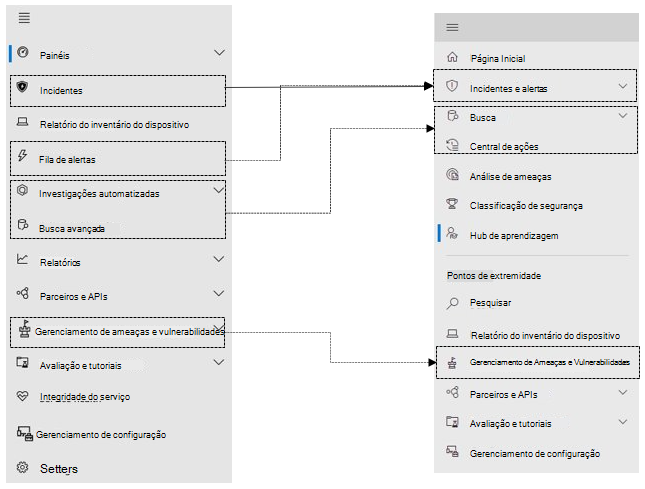

# Microsoft Defender para Ponto de Extremidade no centro de Microsoft 365 de segurança

[!INCLUDE [Microsoft 365 Defender rebranding](../includes/microsoft-defender.md)]

**Aplica-se a:**

- [Microsoft 365 Defender](microsoft-365-defender.md)
- [Microsoft Defender para Ponto de Extremidade](https://go.microsoft.com/fwlink/p/?linkid=2154037)
- [Microsoft Defender para Office 365](/microsoft-365/security/office-365-security/defender-for-office-365)

## Referência rápida

A imagem e a tabela abaixo lista as alterações na navegação entre o Central de Segurança do Microsoft Defender e o Microsoft 365 de segurança.

> [!div class="mx-imgBorder"]
> 

| Central de Segurança do Microsoft Defender | Centro de segurança do Microsoft 365 |
|---------|---------|
| Painéis <ul><li>Operações de proteção</li><li>Análise de Ameaças</li></ul>  |Página Inicial <ul><li>Análise de ameaças</li></ul>   |
| Incidentes | Incidentes & alertas |
| Inventário de dispositivos | Inventário de dispositivos |
| Fila de alertas | Incidentes & alertas |
| Investigações automatizadas | Central de ações |
| Busca avançada | Busca |
| Relatórios | Relatórios |
| Parceiros & APIs | Parceiros & APIs |
| Gerenciamento & de vulnerabilidades | Gerenciamento de Ameaças e Vulnerabilidades |
| Avaliação e tutoriais | Tutoriais & avaliações |
| Gerenciamento de configuração | Gerenciamento de configuração |
| Configurações | Configurações | 

O centro de [segurança Microsoft 365](overview-security-center.md) aprimorado combina recursos de segurança que protegem, detectam, investigam e respondem a ameaças de email, colaboração, identidade e [https://security.microsoft.com](https://security.microsoft.com) dispositivos. Esse centro de segurança reúne funcionalidades de portais de segurança da Microsoft existentes, incluindo o Central de Segurança do Microsoft Defender e o centro de conformidade Office 365 segurança & segurança.

Se você estiver familiarizado com o Central de Segurança do Microsoft Defender, este artigo ajuda a descrever algumas das alterações e melhorias no centro de segurança Microsoft 365 segurança aprimorado. No entanto, há alguns elementos novos e atualizados a serem conhecidos.

Historicamente, o [Central de Segurança do Microsoft Defender](/windows/security/threat-protection/microsoft-defender-atp/portal-overview) tem sido a casa do Microsoft Defender para o Ponto de Extremidade. Enterprise equipes de segurança o usaram para monitorar e ajudar a responder a alertas de possíveis atividades avançadas de ameaças persistentes ou violações de dados. Para ajudar a reduzir o número de portais, o centro de segurança Microsoft 365 será a casa para monitorar e gerenciar a segurança em suas identidades, dados, dispositivos, aplicativos e infraestrutura da Microsoft.

O Microsoft Defender for Endpoint no centro de segurança Microsoft 365 dá suporte à concessão de acesso a [MSSPs (provedores](/windows/security/threat-protection/microsoft-defender-atp/grant-mssp-access) de serviços de segurança gerenciados) da mesma forma que o acesso é concedido no Centro de segurança do [Microsoft Defender.](mssp-access.md)

> [!IMPORTANT]
> O que você vê no Microsoft 365 de segurança depende das assinaturas atuais. Por exemplo, se você não tiver uma licença do Microsoft Defender para Office 365, a seção Email & Colaboração não será mostrada.

>[!Note]
>O novo portal unificado não está disponível para:
>- US Nuvem da Comunidade Governamental (GCC)
>- Us Nuvem da Comunidade Governamental Alta (GCC Alta)
>- Departamento de Defesa dos EUA
>- Todas as instituições governamentais dos EUA com licenças comerciais

Dê uma olhada no centro de segurança Microsoft 365 aprimorado: [https://security.microsoft.com](https://security.microsoft.com) .

Saiba mais sobre os benefícios: [Visão geral do Centro de segurança do Microsoft 365](overview-security-center.md)

## O que mudou

Esta tabela é uma referência rápida das alterações entre o Central de Segurança do Microsoft Defender e o Microsoft 365 de segurança.

### Alertas e ações

| Área | Descrição da alteração |
|---------|---------|
| [Incidentes & alertas](incidents-overview.md)  | No centro Microsoft 365 segurança, você pode gerenciar incidentes e alertas em todos os pontos de extremidade, email e identidades. Convergimos a experiência para ajudá-lo a encontrar eventos relacionados com mais facilidade. Para obter mais informações, consulte [Visão geral de incidentes.](incidents-overview.md)   |
| [Busca](advanced-hunting-overview.md)  |  Modificar regras de detecção personalizadas criadas no Microsoft Defender para Endpoint para incluir identidades e tabelas de email as move automaticamente para Microsoft 365 Defender. Os alertas correspondentes também serão exibidos no Microsoft 365 Defender. Para obter mais detalhes sobre essas alterações, leia [Migrar regras de detecção personalizadas.](advanced-hunting-migrate-from-mde.md#migrate-custom-detection-rules)   A `DeviceAlertEvents` tabela para busca avançada não está disponível no Microsoft 365 Defender. Para consultar informações de alerta específicas do dispositivo no Microsoft 365 Defender, você pode usar as tabelas e para acomodar ainda mais informações de um `AlertInfo` `AlertEvidence` conjunto diversificado de fontes. Crie sua próxima consulta relacionada ao dispositivo seguindo [as consultas Gravar sem DeviceAlertEvents](advanced-hunting-migrate-from-mde.md#write-queries-without-devicealertevents).|
|[Central de ações](m365d-action-center.md)    | Lista ações pendentes e concluídas que foram realizadas após investigações automatizadas e ações de correção. Anteriormente, o Centro de Ações no Central de Segurança do Microsoft Defender ações pendentes e concluídas para ações de correção realizadas apenas em dispositivos, enquanto investigações automatizadas listaram alertas e status. No centro de Microsoft 365 de segurança aprimorado, o Centro de Ações reúne ações e investigações de correção em emails, dispositivos e usuários— tudo em um único local.  |
| [Análise de ameaças](threat-analytics.md) |  Movido para a parte superior da barra de navegação para facilitar a descoberta e o uso. Agora inclui informações de ameaça para pontos de extremidade e email e colaboração.    |

### Pontos de extremidade

| Área | Descrição da alteração |
|---------|---------|
|Pesquisar   |  Em vez de estar no título, a barra de pesquisa do Microsoft Defender for Endpoint está se movendo sob a seção Pontos de Extremidade. Você pode continuar procurando dispositivos, arquivos, usuários, URLs, IPs, vulnerabilidades, software e recomendações.  |
|[Painel](/windows/security/threat-protection/microsoft-defender-atp/security-operations-dashboard)   |  Este é o painel de operações de segurança. Consulte uma visão geral de quantos alertas ativos foram disparados, quais dispositivos estão em risco, quais usuários estão em risco e nível de gravidade para alertas, dispositivos e usuários. Você também pode ver se algum dispositivo tem problemas de sensor, sua saúde geral do serviço e como quaisquer alertas não resolvidos foram detectados. |
|Inventário de dispositivos | Sem alterações. |
|[Gerenciamento de Ameaças e Vulnerabilidades](/windows/security/threat-protection/microsoft-defender-atp/next-gen-threat-and-vuln-mgt)    |    O nome foi reduzido para caber no painel de navegação. É o mesmo que a seção Gerenciamento de Ameaças e Vulnerabilidades, com todas as páginas abaixo.     |
| Parceiros e APIs | Sem alterações. |
| Avaliações & tutoriais    |     Novos recursos de teste e aprendizado.     |
| Gerenciamento de configuração   |  Sem alterações.  |

> [!NOTE]
> **A investigação automática e a correção** agora fazem parte de incidentes. Você pode ver Eventos automatizados de investigação e correção na guia **Investigação > Incidentes.**

> [!TIP]
> A pesquisa de dispositivo é feita a partir dos pontos de extremidade > Pesquisa.

### Acesso e relatórios

| Área | Descrição da alteração |
|---------|---------|
| Relatórios  | Consulte relatórios sobre pontos de extremidade e & de email, incluindo proteção contra ameaças, conformidade e conformidade de dispositivos e dispositivos vulneráveis. |
| Integridade  |  Atualmente, links para a página "Saúde do serviço" no centro [de administração Microsoft 365 .](https://admin.microsoft.com/) |
| Configurações |  Gerencie suas configurações para o Microsoft 365 de segurança, Microsoft 365 Defender, Pontos de Extremidade, Colaboração & Email, Identidades e Descoberta de Dispositivo.   |

## Microsoft 365 e recursos de segurança

O painel de navegação esquerdo ou barra de início rápido parecerá familiar a você. No entanto, existem alguns elementos novos e atualizados neste centro de segurança.

### Incidentes e alertas

Reúne o gerenciamento de alertas e incidentes em seu email, dispositivos e identidades. A página de alerta fornece contexto completo ao alerta combinando sinais de ataque para construir um artigo detalhado. Agora, uma experiência nova e unificada reúne uma exibição consistente de alertas em todas as cargas de trabalho. Você pode rapidamente fazer a triagem, investigar e tomar medidas eficazes.

- [Saiba mais sobre incidentes](incidents-overview.md)
- [Saiba mais sobre gerenciar alertas](investigate-alerts.md)

### Busca

Procure proativamente por ameaças e atividades mal-intencionadas em seus pontos de extremidade, caixas de correio do Office 365 e muito mais usando as [consultas de busca avançada](advanced-hunting-overview.md). Essas consultas poderosas podem ser usadas para localizar e revisar indicadores de ameaça e entidades para ameaças conhecidas e possíveis.

[As regras de detecção personalizadas](custom-detection-rules.md) podem ser criadas a partir de consultas avançadas de busca para ajudá-lo a observar proativamente eventos que podem indicar a atividade de violação e dispositivos configurados incorretamente.

### Central de ações

A Central de ações mostra a você as investigações criadas pelos recursos de investigação e resposta automatizadas. Esta autorrecuperação automatizada no Microsoft 365 Defender podem ajudar as equipes de segurança respondendo automaticamente a eventos específicos.

[Saiba mais sobre a Central de Ações](m365d-action-center.md).

### Análise de Ameaças

Obtenha inteligência contra ameaças de pesquisadores especialistas em Segurança da Microsoft. A Análise de Ameaças ajuda as equipes de segurança a serem mais eficientes ao enfrentar ameaças emergentes. A Análise de Ameaças inclui:

- Detecções e mitigações relacionadas ao email do Microsoft Defender para Office 365. Isso é uma adição aos dados de ponto de extremidade já disponíveis no Microsoft Defender para Ponto de Extremidade.
- Exibição de incidentes relacionada às ameaças.
- Experiência avançada para rapidamente identificar e usar informações acionáveis nos relatórios.

Você pode acessar a análise de ameaças da barra de navegação superior esquerda no centro de segurança do Microsoft 365 ou de um cartão de painel dedicado que mostra as principais ameaças para sua organização.

Saiba mais sobre como rastrear e responder a ameaças [emergentes com análise de ameaças.](./threat-analytics.md)

### Seção Pontos de Extremidade

Exibir e gerenciar a segurança dos pontos de extremidade em sua organização. Se você tiver usado o Central de Segurança do Microsoft Defender, ele ficará familiar.

### Acesso e relatórios

Exibir relatórios, alterar suas configurações e modificar as funções de usuário.

### Conexões de API SIEM

Se você usar a [API SIEM](../defender-endpoint/enable-siem-integration.md)do Defender para Ponto de Extremidade, poderá continuar a fazê-lo. Adicionamos novos links à carga da API que apontam para a página de alerta ou para a página de incidentes no portal Microsoft 365 segurança. Os novos campos de API incluem LinkToMTP e IncidentLinkToMTP. Para obter mais informações, consulte [Redirecionando contas do Microsoft Defender para o Ponto](./microsoft-365-security-mde-redirection.md)de Extremidade para o Microsoft 365 de segurança .

### Alertas de email

Você pode continuar a usar alertas de email para o Defender para Ponto de Extremidade. Adicionamos novos links nos emails que apontam para a página de alerta ou a página de incidentes no centro Microsoft 365 segurança. Para obter mais informações, consulte [Redirecionando contas do Microsoft Defender para o Ponto](./microsoft-365-security-mde-redirection.md)de Extremidade para o Microsoft 365 de segurança .

## Informações relacionadas

- [Centro de segurança do Microsoft 365](overview-security-center.md)
- [Microsoft Defender para Ponto de Extremidade no centro de Microsoft 365 de segurança](microsoft-365-security-center-mde.md)
- [Redirecionando contas do Microsoft Defender para o Ponto de Extremidade para o Microsoft 365 de segurança](microsoft-365-security-mde-redirection.md)
