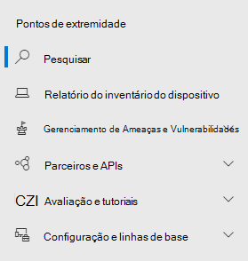

# Microsoft Defender para Ponto de Extremidade no centro de segurança do Microsoft 365Microsoft Defender for Endpoint in the Microsoft 365 security center

[!INCLUDE [Microsoft 365 Defender rebranding](../includes/microsoft-defender.md)]

[!INCLUDE [Prerelease](../includes/prerelease.md)]

**Aplica-se a:****Applies to:**

- [Microsoft 365 DefenderMicrosoft 365 Defender](microsoft-365-defender.md)
- [Microsoft Defender para Ponto de ExtremidadeMicrosoft Defender for Endpoint](https://go.microsoft.com/fwlink/p/?linkid=2154037)
- [Microsoft Defender para Office 365Microsoft Defender for Office 365](/microsoft-365/security/office-365-security/defender-for-office-365)

O centro de segurança aprimorado do [Microsoft 365](overview-security-center.md) combina recursos de segurança que protegem, detectam, investigam e respondem a ameaças de [https://security.microsoft.com](https://security.microsoft.com) email, colaboração, identidade e dispositivos.The improved [Microsoft 365 security center](overview-security-center.md) at [https://security.microsoft.com](https://security.microsoft.com) combines security capabilities that protect, detect, investigate, and respond to email, collaboration, identity, and device threats. Esse centro de segurança reúne funcionalidades de portais de segurança da Microsoft existentes, incluindo o Centro de Segurança do Microsoft Defender e o Centro de Conformidade e Segurança & do Office 365.This security center brings together functionality from existing Microsoft security portals, including Microsoft Defender Security Center and the Office 365 Security & Compliance center.

Se você estiver familiarizado com o Centro de Segurança do Microsoft Defender, este artigo ajuda a descrever algumas das alterações e melhorias no centro de segurança aprimorado do Microsoft 365.If you're familiar with the Microsoft Defender Security Center, this article helps describe some of the changes and improvements in the improved Microsoft 365 security center. No entanto, há alguns elementos novos e atualizados a serem conhecidos.However there are some new and updated elements to be aware of.

Historicamente, o [Centro de Segurança](/windows/security/threat-protection/microsoft-defender-atp/portal-overview) do Microsoft Defender tem sido a casa do Microsoft Defender para o Ponto de Extremidade.Historically, the [Microsoft Defender Security Center](/windows/security/threat-protection/microsoft-defender-atp/portal-overview) has been the home for Microsoft Defender for Endpoint. As equipes de segurança corporativas o usaram para monitorar e ajudar a responder a alertas de possíveis atividades avançadas de ameaças persistentes ou violações de dados.Enterprise security teams have used it to monitor and help responding to alerts of potential advanced persistent threat activity or data breaches. Para ajudar a reduzir o número de portais, o Centro de segurança do Microsoft 365 será a casa para monitorar e gerenciar a segurança em suas identidades, dados, dispositivos, aplicativos e infraestrutura da Microsoft.To help reduce the number of portals, the Microsoft 365 security center will be the home for monitoring and managing security across your Microsoft identities, data, devices, apps, and infrastructure.

O Microsoft Defender for Endpoint no centro de segurança do Microsoft 365 dá suporte à concessão de acesso a [MSSPs (provedores](/windows/security/threat-protection/microsoft-defender-atp/grant-mssp-access) de serviços de segurança gerenciados) da mesma forma que o acesso é concedido no centro de segurança do [Microsoft Defender.](mssp-access.md)Microsoft Defender for Endpoint in the Microsoft 365 security center supports [granting access to managed security service providers (MSSPs)](/windows/security/threat-protection/microsoft-defender-atp/grant-mssp-access) in the same way [access is granted in the Microsoft Defender security center](mssp-access.md).

> [!IMPORTANT]
> O que você vê no centro de segurança do Microsoft 365 depende das assinaturas atuais.What you see in the Microsoft 365 security center depends on your current subscriptions. Por exemplo, se você não tiver uma licença para o Microsoft Defender para Office 365, a seção Email & Colaboração não será mostrada.For example, if you don't have a license for Microsoft Defender for Office 365, then the Email & Collaboration section will not be shown.

>[!Note]
>O novo portal unificado não está disponível para:The new unified portal is not available for:
>- Nuvem da Comunidade governamental dos EUA (GCC)US Government Community Cloud (GCC)
>- Nuvem da comunidade governamental dos EUA alta (GCC High)US Government Community Cloud High (GCC High)
>- Departamento de Defesa dos EUAUS Department of Defense
>- Todas as instituições governamentais dos EUA com licenças comerciaisAll US government institutions with commercial licenses

Confira o centro de segurança do Microsoft 365 aprimorado: [https://security.microsoft.com](https://security.microsoft.com) .Take a look at the improved Microsoft 365 security center: [https://security.microsoft.com](https://security.microsoft.com).

Saiba mais sobre os benefícios: [Visão geral do Centro de segurança do Microsoft 365](overview-security-center.md)Learn more about the benefits: [Overview of the Microsoft 365 security center](overview-security-center.md)

## O que mudouWhat's changed

Esta tabela é uma referência rápida das alterações entre o Centro de Segurança do Microsoft Defender e o Centro de segurança do Microsoft 365.This table is a quick reference of the changes between the Microsoft Defender Security Center and the Microsoft 365 security center.

### Alertas e açõesAlerts and actions

|**Área****Area**  |**Descrição da alteração****Description of change** |
|---------|---------|
| [Incidentes & alertasIncidents & alerts](incidents-overview.md)  | No Centro de segurança do Microsoft 365, você pode gerenciar incidentes e alertas em todos os pontos de extremidade, email e identidades.In the Microsoft 365 security center, you can manage incidents and alerts across all of your endpoints, email, and identities. Convergimos a experiência para ajudá-lo a encontrar eventos relacionados com mais facilidade.We've converged the experience to help you find related events more easily. Para obter mais informações, consulte [Visão geral de incidentes.](incidents-overview.md)For more information, see [Incidents Overview](incidents-overview.md).   |
| [BuscaHunting](advanced-hunting-overview.md)  |  Modificar regras de detecção personalizadas criadas no Microsoft Defender para Endpoint para incluir tabelas de identidade e email as move automaticamente para o Microsoft 365 Defender.Modifying custom detection rules created in Microsoft Defender for Endpoint to include identity and email tables automatically moves them to Microsoft 365 Defender. Seus alertas correspondentes também aparecerão no Microsoft 365 Defender.Their corresponding alerts will also appear in Microsoft 365 Defender. Para obter mais detalhes sobre essas alterações, leia [Migrar regras de detecção personalizadas.](advanced-hunting-migrate-from-mde.md#migrate-custom-detection-rules)For more details about these changes, read [Migrate custom detection rules](advanced-hunting-migrate-from-mde.md#migrate-custom-detection-rules).   A `DeviceAlertEvents` tabela para busca avançada não está disponível no Microsoft 365 Defender.The `DeviceAlertEvents` table for advanced hunting isn't available in Microsoft 365 Defender. Para consultar informações de alerta específicas do dispositivo no Microsoft 365 Defender, você pode usar as tabelas e para acomodar ainda mais informações de um `AlertInfo` `AlertEvidence` conjunto diversificado de fontes.To query device-specific alert information in Microsoft 365 Defender, you can use the `AlertInfo` and `AlertEvidence` tables to accommodate even more information from a diverse set of sources. Crie sua próxima consulta relacionada ao dispositivo seguindo [as consultas Gravar sem DeviceAlertEvents](advanced-hunting-migrate-from-mde.md#write-queries-without-devicealertevents).Craft your next device-related query by following [Write queries without DeviceAlertEvents](advanced-hunting-migrate-from-mde.md#write-queries-without-devicealertevents).|
|[Central de açõesAction center](m365d-action-center.md)    | Lista ações pendentes e concluídas que foram realizadas após investigações automatizadas e ações de correção.Lists pending and completed actions that were taken following automated investigations and remediation actions. Anteriormente, o Centro de Ações no Centro de Segurança do Microsoft Defender listava ações pendentes e concluídas para ações de correção realizadas apenas em dispositivos, enquanto investigações automatizadas listaram alertas e status.Formerly, the Action center in the Microsoft Defender Security Center listed pending and completed actions for remediation actions taken on devices only, while Automated investigations listed alerts and status. No centro de segurança do Microsoft 365 aprimorado, o Centro de Ações reúne ações de correção e investigações em emails, dispositivos e usuários— tudo em um único local.In the  improved Microsoft 365 security center, the Action center brings together remediation actions and investigations across email, devices, and users—all in one location.  |
| [Análise de ameaçasThreat analytics](threat-analytics.md) |  Movido para a parte superior da barra de navegação para facilitar a descoberta e o uso.Moved to the top of the navigation bar for easier discovery and use. Agora inclui informações de ameaça para pontos de extremidade e email e colaboração.Now includes threat information for both endpoints and email and collaboration.    |

### Pontos de extremidadeEndpoints

|**Área****Area**  |**Descrição da alteração****Description of change**  |
|---------|---------|
|PesquisaSearch   |  Em vez de estar no título, a barra de pesquisa do Microsoft Defender for Endpoint está se movendo sob a seção Pontos de Extremidade.Instead of being in the heading, Microsoft Defender for Endpoint search bar is moving under the Endpoints section. Você pode continuar procurando dispositivos, arquivos, usuários, URLs, IPs, vulnerabilidades, software e recomendações.You can continue to search for devices, files, users, URLs, IPs, vulnerabilities, software, and recommendations.  |
|[PainelDashboard](/windows/security/threat-protection/microsoft-defender-atp/security-operations-dashboard)   |  Este é o painel de operações de segurança.This is your security operations dashboard. Consulte uma visão geral de quantos alertas ativos foram disparados, quais dispositivos estão em risco, quais usuários estão em risco e nível de gravidade para alertas, dispositivos e usuários.See an overview of how many active alerts were triggered, which devices are at risk, which users are at risk, and severity level for alerts, devices, and users. Você também pode ver se algum dispositivo tem problemas de sensor, sua saúde geral do serviço e como quaisquer alertas não resolvidos foram detectados.You can also see if any devices have sensor issues, your overall service health, and how any unresolved alerts were detected. |
|Inventário de dispositivosDevice inventory | Sem alterações.No changes. |
|[Gerenciamento de Ameaças e VulnerabilidadesVulnerability management](/windows/security/threat-protection/microsoft-defender-atp/next-gen-threat-and-vuln-mgt)    |    O nome foi reduzido para caber no painel de navegação.Name was shortened to fit in the navigation pane. É o mesmo que a seção gerenciamento de ameaças e vulnerabilidades, com todas as páginas abaixo.It's the same as the threat and vulnerability management section, with all the pages underneath.     |
| Parceiros e APIsPartners and APIs | Sem alterações.No changes. |
| Avaliações & tutoriaisEvaluations & tutorials    |     Novos recursos de teste e aprendizado.New testing and learning capabilities.     |
| Gerenciamento de configuraçãoConfiguration management   |  Sem alterações.No changes.  |

> [!NOTE]
> **A investigação automática e a correção** agora fazem parte de incidentes.**Automatic investigation and remediation** is now a part of  incidents. Você pode ver Eventos automatizados de investigação e correção na guia **Investigação > Incidentes.**You can see Automated  investigation and remediation events in the **Incident > Investigation** tab.

### Acesso e relatóriosAccess and reporting

|**Área****Area**  |**Descrição da alteração****Description of change**  |
|---------|---------|
| RelatóriosReports  | Consulte relatórios sobre pontos de extremidade e & de email, incluindo proteção contra ameaças, conformidade e conformidade de dispositivos e dispositivos vulneráveis.See reports for endpoints and email & collaboration, including Threat protection, Device health and compliance, and Vulnerable devices. |
| IntegridadeHealth  |  Atualmente, links para a página "Saúde do serviço" no Centro de administração [do Microsoft 365](https://admin.microsoft.com/).Currently links out to the "Service health" page in the [Microsoft 365 admin center](https://admin.microsoft.com/). |
| ConfiguraçõesSettings |  Gerencie suas configurações para o Centro de segurança do Microsoft 365, Microsoft 365 Defender, Pontos de Extremidade, Colaboração de email &, Identidades e Descoberta de Dispositivo.Manage your settings for the Microsoft 365 security center, Microsoft 365 Defender, Endpoints, Email & collaboration, Identities, and Device discovery.   |

## Recursos e navegação de segurança do Microsoft 365Microsoft 365 security navigation and capabilities

O painel de navegação esquerdo ou barra de início rápido parecerá familiar a você.The left navigation, or quick launch bar, will look familiar. No entanto, existem alguns elementos novos e atualizados neste centro de segurança.However, there are some new and updated elements in this security center.

### Incidentes e alertasIncidents and alerts

Reúne o gerenciamento de alertas e incidentes em seu email, dispositivos e identidades.Brings together incident and alert management across your email, devices, and identities. A página de alerta fornece contexto completo ao alerta combinando sinais de ataque para construir um artigo detalhado.The alert page provides full context to the alert by combining attack signals to construct a detailed story. Agora, uma experiência nova e unificada reúne uma exibição consistente de alertas em todas as cargas de trabalho.A new, unified experience now brings together a consistent view of alerts across workloads. Você pode rapidamente fazer a triagem, investigar e tomar medidas eficazes.You can quickly triage, investigate, and take effective action.

- [Saiba mais sobre incidentesLearn more about incidents](incidents-overview.md)
- [Saiba mais sobre gerenciar alertasLearn more about managing alerts](investigate-alerts.md)

### BuscaHunting

Procure proativamente por ameaças e atividades mal-intencionadas em seus pontos de extremidade, caixas de correio do Office 365 e muito mais usando as [consultas de busca avançada](advanced-hunting-overview.md).Proactively search for threats, malware, and malicious activity across your endpoints, Office 365 mailboxes, and more by using [advanced hunting queries](advanced-hunting-overview.md). Essas consultas poderosas podem ser usadas para localizar e revisar indicadores de ameaça e entidades para ameaças conhecidas e possíveis.These powerful queries can be used to locate and review threat indicators and entities for both known and potential threats.

[As regras de detecção personalizadas](custom-detection-rules.md) podem ser criadas a partir de consultas avançadas de busca para ajudá-lo a observar proativamente eventos que podem indicar a atividade de violação e dispositivos configurados incorretamente.[Custom detection rules](custom-detection-rules.md) can be built from advanced hunting queries to help you proactively watch for events that might be indicative of breach activity and misconfigured devices.

### Central de açõesAction center

A Central de ações mostra a você as investigações criadas pelos recursos de investigação e resposta automatizadas.Action center shows you the investigations created by automated investigation and response capabilities. Esta autorrecuperação automatizada no Microsoft 365 Defender podem ajudar as equipes de segurança respondendo automaticamente a eventos específicos.This automated, self-healing in Microsoft 365 Defender can help security teams by automatically responding to specific events.

[Saiba mais sobre a Central de AçõesLearn more about the Action center](m365d-action-center.md)

### Análise de AmeaçasThreat Analytics

Obtenha inteligência contra ameaças de pesquisadores especialistas em Segurança da Microsoft.Get threat intelligence from expert Microsoft security researchers. A Análise de Ameaças ajuda as equipes de segurança a serem mais eficientes ao enfrentar ameaças emergentes.Threat Analytics helps security teams be more efficient when facing emerging threats. A Análise de Ameaças inclui:Threat Analytics includes:

- Detecções e mitigações relacionadas ao email do Microsoft Defender para Office 365.Email-related detections and mitigations from Microsoft Defender for Office 365. Isso é uma adição aos dados de ponto de extremidade já disponíveis no Microsoft Defender para Ponto de Extremidade.This is in addition to the endpoint data already available from Microsoft Defender for Endpoint.
- Exibição de incidentes relacionada às ameaças.Incidents view related to the threats.
- Experiência avançada para rapidamente identificar e usar informações acionáveis nos relatórios.Enhanced experience for quickly identifying and using actionable information in the reports.

Você pode acessar a análise de ameaças da barra de navegação superior esquerda no centro de segurança do Microsoft 365 ou de um cartão de painel dedicado que mostra as principais ameaças para sua organização.You can access threat analytics either from the upper left navigation bar in the Microsoft 365 security center, or from a dedicated dashboard card that shows the top threats for your organization.

Saiba mais sobre como [acompanhar e responder a ameaças emergentes com a análise de ameaças](./threat-analytics.md)Learn more about how to [track and respond to emerging threats with threat analytics](./threat-analytics.md)

### Seção Pontos de ExtremidadeEndpoints section

Exibir e gerenciar a segurança dos pontos de extremidade em sua organização.View and manage the security of endpoints in your organization. Se você tiver usado o Centro de Segurança do Microsoft Defender, ele será familiar.If you've used the Microsoft Defender Security Center, it will look familiar.

### Acesso e relatóriosAccess and reports

Exibir relatórios, alterar suas configurações e modificar as funções de usuário.View reports, change your settings, and modify user roles.

### Conexões de API SIEMSIEM API connections

Se você usar a [API SIEM](../defender-endpoint/enable-siem-integration.md)do Defender para Ponto de Extremidade, poderá continuar a fazê-lo.If you use the [Defender for Endpoint SIEM API](../defender-endpoint/enable-siem-integration.md), you can continue to do so. Adicionamos novos links à carga da API que apontam para a página de alerta ou para a página de incidentes no portal de segurança do Microsoft 365.We’ve added new links on the API payload that point to the alert page or the incident page in the Microsoft 365 security portal. Os novos campos de API incluem LinkToMTP e IncidentLinkToMTP.New API fields include LinkToMTP and IncidentLinkToMTP. Para obter mais informações, consulte Redirecionando contas do Microsoft Defender para o Ponto de Extremidade para o centro de segurança [do Microsoft 365.](./microsoft-365-security-mde-redirection.md)For more information, see [Redirecting accounts from Microsoft Defender for Endpoint to the Microsoft 365 security center](./microsoft-365-security-mde-redirection.md).

### Alertas de emailEmail alerts

Você pode continuar a usar alertas de email para o Defender para Ponto de Extremidade.You can continue to use email alerts for Defender for Endpoint. Adicionamos novos links nos emails que apontam para a página de alerta ou a página de incidentes no Centro de segurança do Microsoft 365.We've added new links in the emails that point to the alert page or the incident page in the Microsoft 365 security center. Para obter mais informações, consulte Redirecionando contas do Microsoft Defender para o Ponto de Extremidade para o centro de segurança [do Microsoft 365.](./microsoft-365-security-mde-redirection.md)For more information, see [Redirecting accounts from Microsoft Defender for Endpoint to the Microsoft 365 security center](./microsoft-365-security-mde-redirection.md).

## Informações relacionadasRelated information

- [Centro de segurança do Microsoft 365Microsoft 365 security center](overview-security-center.md)
- [Microsoft Defender para Ponto de Extremidade no centro de segurança do Microsoft 365Microsoft Defender for Endpoint in the Microsoft 365 security center](microsoft-365-security-center-mde.md)
- [Redirecionando contas do Microsoft Defender para o Ponto de Extremidade para o centro de segurança do Microsoft 365Redirecting accounts from Microsoft Defender for Endpoint to the Microsoft 365 security center](microsoft-365-security-mde-redirection.md)