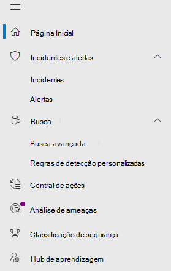

# <a name="microsoft-defender-for-office-365-in-the-microsoft-365-security-center"></a><span data-ttu-id="cfc1d-104">Microsoft Defender para Office 365 no Centro de segurança do Microsoft 365</span><span class="sxs-lookup"><span data-stu-id="cfc1d-104">Microsoft Defender for Office 365 in the Microsoft 365 security center</span></span>

[!INCLUDE [Microsoft 365 Defender rebranding](../includes/microsoft-defender.md)]

<span data-ttu-id="cfc1d-105">**Aplica-se a:**</span><span class="sxs-lookup"><span data-stu-id="cfc1d-105">**Applies to:**</span></span>
- [<span data-ttu-id="cfc1d-106">Microsoft 365 Defender</span><span class="sxs-lookup"><span data-stu-id="cfc1d-106">Microsoft 365 Defender</span></span>](microsoft-365-defender.md)
- [<span data-ttu-id="cfc1d-107">Microsoft Defender para Ponto de Extremidade</span><span class="sxs-lookup"><span data-stu-id="cfc1d-107">Microsoft Defender for Endpoint</span></span>](https://go.microsoft.com/fwlink/p/?linkid=2154037)
- [<span data-ttu-id="cfc1d-108">Microsoft Defender para Office 365</span><span class="sxs-lookup"><span data-stu-id="cfc1d-108">Microsoft Defender for Office 365</span></span>](/microsoft-365/security/office-365-security/defender-for-office-365)

## <a name="quick-reference"></a><span data-ttu-id="cfc1d-109">Referência rápida</span><span class="sxs-lookup"><span data-stu-id="cfc1d-109">Quick reference</span></span>

<span data-ttu-id="cfc1d-110">A imagem e a tabela a seguir lista as alterações na navegação entre o Centro de Conformidade Office 365 Segurança & e o centro de Microsoft 365 segurança.</span><span class="sxs-lookup"><span data-stu-id="cfc1d-110">The image and the table below lists the changes in navigation between the Office 365 Security & Compliance Center and the Microsoft 365 security center.</span></span>

> [!div class="mx-imgBorder"]
> <span data-ttu-id="cfc1d-111"></span><span class="sxs-lookup"><span data-stu-id="cfc1d-111"></span></span>

<br>

****

|<span data-ttu-id="cfc1d-112">Conformidade e Segurança do Office 365</span><span class="sxs-lookup"><span data-stu-id="cfc1d-112">Office 365 Security & Compliance</span></span>|<span data-ttu-id="cfc1d-113">Centro de segurança do Microsoft 365</span><span class="sxs-lookup"><span data-stu-id="cfc1d-113">Microsoft 365 security center</span></span>|<span data-ttu-id="cfc1d-114">Centro de conformidade do Microsoft 365</span><span class="sxs-lookup"><span data-stu-id="cfc1d-114">Microsoft 365 compliance center</span></span>|<span data-ttu-id="cfc1d-115">Centro de administração do Exchange</span><span class="sxs-lookup"><span data-stu-id="cfc1d-115">Exchange admin center</span></span>|
|---|---|---|---|
|<span data-ttu-id="cfc1d-116">Alertas</span><span class="sxs-lookup"><span data-stu-id="cfc1d-116">Alerts</span></span>|<span data-ttu-id="cfc1d-117">Email e colaboração</span><span class="sxs-lookup"><span data-stu-id="cfc1d-117">Email & collaboration</span></span>|||
|<span data-ttu-id="cfc1d-118">Classificação</span><span class="sxs-lookup"><span data-stu-id="cfc1d-118">Classification</span></span>||<span data-ttu-id="cfc1d-119">Consulte [Microsoft 365 de conformidade](https://compliance.microsoft.com/homepage)</span><span class="sxs-lookup"><span data-stu-id="cfc1d-119">See [Microsoft 365 compliance center](https://compliance.microsoft.com/homepage)</span></span>||
|<span data-ttu-id="cfc1d-120">Prevenção contra perda de dados</span><span class="sxs-lookup"><span data-stu-id="cfc1d-120">Data loss prevention</span></span>||<span data-ttu-id="cfc1d-121">Consulte [Microsoft 365 de conformidade](https://compliance.microsoft.com/homepage)</span><span class="sxs-lookup"><span data-stu-id="cfc1d-121">See [Microsoft 365 compliance center](https://compliance.microsoft.com/homepage)</span></span>||
|<span data-ttu-id="cfc1d-122">Gerenciamento de registros</span><span class="sxs-lookup"><span data-stu-id="cfc1d-122">Records management</span></span>||<span data-ttu-id="cfc1d-123">Consulte [Microsoft 365 de conformidade](https://compliance.microsoft.com/homepage)</span><span class="sxs-lookup"><span data-stu-id="cfc1d-123">See [Microsoft 365 compliance center](https://compliance.microsoft.com/homepage)</span></span> ||
|<span data-ttu-id="cfc1d-124">Governança de informações</span><span class="sxs-lookup"><span data-stu-id="cfc1d-124">Information governance</span></span>||<span data-ttu-id="cfc1d-125">Consulte [Microsoft 365 de conformidade](https://compliance.microsoft.com/homepage)</span><span class="sxs-lookup"><span data-stu-id="cfc1d-125">See [Microsoft 365 compliance center](https://compliance.microsoft.com/homepage)</span></span>||
|<span data-ttu-id="cfc1d-126">Gerenciamento de ameaças</span><span class="sxs-lookup"><span data-stu-id="cfc1d-126">Threat management</span></span>|<span data-ttu-id="cfc1d-127">Email e colaboração</span><span class="sxs-lookup"><span data-stu-id="cfc1d-127">Email & collaboration</span></span>|||
|<span data-ttu-id="cfc1d-128">Fluxo de mensagens</span><span class="sxs-lookup"><span data-stu-id="cfc1d-128">Mail flow</span></span>|||<span data-ttu-id="cfc1d-129">Consulte [Exchange centro de administração](https://admin.exchange.microsoft.com/#/)</span><span class="sxs-lookup"><span data-stu-id="cfc1d-129">See [Exchange admin center](https://admin.exchange.microsoft.com/#/)</span></span>|
|<span data-ttu-id="cfc1d-130">Privacidade de dados</span><span class="sxs-lookup"><span data-stu-id="cfc1d-130">Data privacy</span></span>||<span data-ttu-id="cfc1d-131">Consulte [Microsoft 365 de conformidade](https://compliance.microsoft.com/homepage)</span><span class="sxs-lookup"><span data-stu-id="cfc1d-131">See [Microsoft 365 compliance center](https://compliance.microsoft.com/homepage)</span></span>||
|<span data-ttu-id="cfc1d-132">Pesquisar</span><span class="sxs-lookup"><span data-stu-id="cfc1d-132">Search</span></span>|<span data-ttu-id="cfc1d-133">Pesquisar</span><span class="sxs-lookup"><span data-stu-id="cfc1d-133">Search</span></span>|||
|<span data-ttu-id="cfc1d-134">Relatórios</span><span class="sxs-lookup"><span data-stu-id="cfc1d-134">Reports</span></span>|<span data-ttu-id="cfc1d-135">Relatório</span><span class="sxs-lookup"><span data-stu-id="cfc1d-135">Report</span></span>|||
|<span data-ttu-id="cfc1d-136">Garantia do serviço</span><span class="sxs-lookup"><span data-stu-id="cfc1d-136">Service assurance</span></span>|<span data-ttu-id="cfc1d-137">Settings</span><span class="sxs-lookup"><span data-stu-id="cfc1d-137">Settings</span></span>|||
|

<span data-ttu-id="cfc1d-138">O [Centro de segurança do Microsoft 365](./overview-security-center.md) em <https://security.microsoft.com> combina os recursos de segurança de portais de segurança existentes da Microsoft, incluindo a Central de Segurança do Microsoft Defender e o Centro de Segurança e Conformidade do Office 365.</span><span class="sxs-lookup"><span data-stu-id="cfc1d-138">The improved [Microsoft 365 security center](./overview-security-center.md) at <https://security.microsoft.com> combines security capabilities from existing Microsoft security portals, including Microsoft Defender Security Center and the Office 365 Security & Compliance Center.</span></span> <span data-ttu-id="cfc1d-139">Este centro aprimorado ajuda as equipes de segurança a proteger suas organizações de ameaças de maneira mais eficaz e eficiente.</span><span class="sxs-lookup"><span data-stu-id="cfc1d-139">This improved center helps security teams protect their organization from threats more effectively and efficiently.</span></span>

<span data-ttu-id="cfc1d-140">Se você estiver familiarizado com o portal de Conformidade e Segurança do Office 365 (protection.office.com), este artigo descreve algumas das alterações e melhorias no Centro de segurança do Microsoft 365.</span><span class="sxs-lookup"><span data-stu-id="cfc1d-140">If you are familiar with the Office 365 Security and Compliance portal (protection.office.com), this article describes some of the changes and improvements in the Microsoft 365 security center.</span></span>

<span data-ttu-id="cfc1d-141">Saiba mais sobre os benefícios: [Visão geral do Centro de segurança do Microsoft 365](overview-security-center.md)</span><span class="sxs-lookup"><span data-stu-id="cfc1d-141">Learn more about the benefits: [Overview of the Microsoft 365 security center](overview-security-center.md)</span></span>

<span data-ttu-id="cfc1d-142">Se você estiver procurando itens relacionados à conformidade, visite o [Centro de conformidade do Microsoft 365](https://compliance.microsoft.com/homepage).</span><span class="sxs-lookup"><span data-stu-id="cfc1d-142">If you are looking for compliance-related items, visit the [Microsoft 365 compliance center](https://compliance.microsoft.com/homepage).</span></span>

## <a name="whats-changed"></a><span data-ttu-id="cfc1d-143">O que mudou</span><span class="sxs-lookup"><span data-stu-id="cfc1d-143">What's changed</span></span>

<span data-ttu-id="cfc1d-144">Esta tabela é uma referência rápida de áreas de Email e Colaboração onde a alteração ocorreu entre o **Centro de Segurança e Conformidade** e o portal de **Segurança do Microsoft 365**.</span><span class="sxs-lookup"><span data-stu-id="cfc1d-144">This table is a quick reference of Email & Collaboration areas where change has occurred between the **Security & Compliance center** and the **Microsoft 365 Security** portal.</span></span> <span data-ttu-id="cfc1d-145">Clique nos links para ler mais sobre essas áreas.</span><span class="sxs-lookup"><span data-stu-id="cfc1d-145">Click the links to read more about these areas.</span></span>

<br>

****

|<span data-ttu-id="cfc1d-146">Área</span><span class="sxs-lookup"><span data-stu-id="cfc1d-146">Area</span></span>|<span data-ttu-id="cfc1d-147">Descrição da alteração</span><span class="sxs-lookup"><span data-stu-id="cfc1d-147">Description of change</span></span>|
|---|---|
|[<span data-ttu-id="cfc1d-148">Página de entidade de email</span><span class="sxs-lookup"><span data-stu-id="cfc1d-148">Email entity page</span></span>](../office-365-security/mdo-email-entity-page.md)|<span data-ttu-id="cfc1d-149">Esta página **unifica** as informações de email que foram espalhadas por diferentes páginas ou exibições no passado.</span><span class="sxs-lookup"><span data-stu-id="cfc1d-149">This page **unifies** email information that had been scattered across different pages or views in the past.</span></span> <span data-ttu-id="cfc1d-150">A investigação de email para ameaças e tendências é *centralizada*.</span><span class="sxs-lookup"><span data-stu-id="cfc1d-150">Investigating email for threats and trends is *centralized*.</span></span> <span data-ttu-id="cfc1d-151">As informações do cabeçalho e a visualização do email são acessíveis através da mesma página de email, juntamente com outras informações úteis relacionadas ao email.</span><span class="sxs-lookup"><span data-stu-id="cfc1d-151">Header information and email preview are accessible through the same email page, along with other useful email-related information.</span></span> <span data-ttu-id="cfc1d-152">Da mesma forma, o status de detonação para anexos de arquivos ou URLs mal-intencionados pode ser encontrado em uma guia da mesma página.</span><span class="sxs-lookup"><span data-stu-id="cfc1d-152">Likewise, the detonation status for malicious file attachments or URLs can be found on a tab of the same page.</span></span> <span data-ttu-id="cfc1d-153">A página de entidade de email empodera os administradores e as equipes de operações de segurança para entender uma ameaça de email e seu status e age rapidamente para determinar o tratamento.</span><span class="sxs-lookup"><span data-stu-id="cfc1d-153">The Email entity page empowers admins and security operations teams to understand an email threat and its status, fast, and then act quickly determine handling.</span></span>|
|[<span data-ttu-id="cfc1d-154">Investigação</span><span class="sxs-lookup"><span data-stu-id="cfc1d-154">Investigation</span></span>](../office-365-security/office-365-air.md#changes-are-coming-soon-in-your-security-center)|<span data-ttu-id="cfc1d-155">Reúne os recursos de AIR em [Defender para Office 365](/microsoft-365/security/office-365-security/defender-for-office-365) e [Defender para Ponto de Extremidade](../defender-endpoint/automated-investigations.md).</span><span class="sxs-lookup"><span data-stu-id="cfc1d-155">Brings together AIR capabilities in [Defender for Office 365](/microsoft-365/security/office-365-security/defender-for-office-365) and [Defender for Endpoint](../defender-endpoint/automated-investigations.md).</span></span> <span data-ttu-id="cfc1d-156">Com essas atualizações e melhorias, sua equipe de operações de segurança poderá exibir detalhes sobre investigações automatizadas e ações de remediação em todo o seu email, conteúdo de colaboração, contas de usuário e dispositivos, tudo em um só lugar.</span><span class="sxs-lookup"><span data-stu-id="cfc1d-156">With these updates and improvements, your security operations team will be able to view details about automated investigations and remediation actions across your email, collaboration content, user accounts, and devices, all in one place.</span></span>|
|[<span data-ttu-id="cfc1d-157">Exibição de alerta</span><span class="sxs-lookup"><span data-stu-id="cfc1d-157">Alert view</span></span>](../../compliance/alert-policies.md)|<span data-ttu-id="cfc1d-158">O painel do submenu **Exibir alertas** no Centro de Conformidade e Segurança do Office agora inclui links para o Centro de segurança do Microsoft 365.</span><span class="sxs-lookup"><span data-stu-id="cfc1d-158">The **View alerts** flyout pane in the Office Security and Compliance center now includes links to the Microsoft 365 security center.</span></span> <span data-ttu-id="cfc1d-159">Clique no link **Abrir Página de Alerta** e o Centro de segurança do Microsoft 365 será aberto.</span><span class="sxs-lookup"><span data-stu-id="cfc1d-159">Click on the **Open Alert Page** link and the Microsoft 365 security center opens.</span></span> <span data-ttu-id="cfc1d-160">Você pode acessar a página **Exibir alertas** clicando em qualquer alerta do Office 365 na fila de Alertas.</span><span class="sxs-lookup"><span data-stu-id="cfc1d-160">You can access the **View alerts** page by clicking on any Office 365 alert in the Alerts queue.</span></span>|
|[<span data-ttu-id="cfc1d-161">Treinamento de Simulação de Ataque</span><span class="sxs-lookup"><span data-stu-id="cfc1d-161">Attack Simulation training</span></span>](../office-365-security/attack-simulation-training-insights.md)|<span data-ttu-id="cfc1d-162">Use o treinamento de Simulação de Ataque para executar cenários de ataque realistas em sua organização.</span><span class="sxs-lookup"><span data-stu-id="cfc1d-162">Use Attack Simulation training to run realistic attack scenarios in your organization.</span></span> <span data-ttu-id="cfc1d-163">Esses ataques simulados podem ajudar a treinar a sua força de trabalho antes que um ataque real afete a sua organização.</span><span class="sxs-lookup"><span data-stu-id="cfc1d-163">These simulated attacks can help train your workforce before a real attack impacts your organization.</span></span> <span data-ttu-id="cfc1d-164">O treinamento de simulação de ataque inclui mais opções, relatórios avançados e fluxos de treinamento aprimorados que ajudam a tornar a simulação de ataque e os cenários de treinamento fáceis de realizar e gerenciar.</span><span class="sxs-lookup"><span data-stu-id="cfc1d-164">Attack simulation training includes, more options, enhanced reports, and improved training flows help make your attack simulation and training scenarios easier to deliver and manage.</span></span>|
|

<span data-ttu-id="cfc1d-165">Não há mudanças nessas áreas:</span><span class="sxs-lookup"><span data-stu-id="cfc1d-165">No changes to these areas:</span></span>

- [<span data-ttu-id="cfc1d-166">Explorador</span><span class="sxs-lookup"><span data-stu-id="cfc1d-166">Explorer</span></span>](../office-365-security/threat-explorer.md)
- [<span data-ttu-id="cfc1d-167">Políticas e Regras</span><span class="sxs-lookup"><span data-stu-id="cfc1d-167">Policies & Rules</span></span>](../../compliance/alert-policies.md)
- [<span data-ttu-id="cfc1d-168">Campanha</span><span class="sxs-lookup"><span data-stu-id="cfc1d-168">Campaign</span></span>](../office-365-security/campaigns.md)
- [<span data-ttu-id="cfc1d-169">Envios</span><span class="sxs-lookup"><span data-stu-id="cfc1d-169">Submissions</span></span>](../office-365-security/admin-submission.md)
- [<span data-ttu-id="cfc1d-170">Análise</span><span class="sxs-lookup"><span data-stu-id="cfc1d-170">Review</span></span>](./m365d-action-center.md)
- [<span data-ttu-id="cfc1d-171">Controlador de Ameaças</span><span class="sxs-lookup"><span data-stu-id="cfc1d-171">Threat Tracker</span></span>](../office-365-security/threat-trackers.md)

<span data-ttu-id="cfc1d-172">Verifique também a seção **Informações Relacionadas** na parte inferior deste artigo.</span><span class="sxs-lookup"><span data-stu-id="cfc1d-172">Also, check the **Related Information** section at the bottom of this article.</span></span>

> [!IMPORTANT]
> <span data-ttu-id="cfc1d-173">O Microsoft 365 de segurança ( <https://security.microsoft.com> ) combina recursos de segurança em e <https://securitycenter.windows.com> <https://protection.office.com> .</span><span class="sxs-lookup"><span data-stu-id="cfc1d-173">The Microsoft 365 Security portal (<https://security.microsoft.com>) combines security features in <https://securitycenter.windows.com>, and <https://protection.office.com>.</span></span> <span data-ttu-id="cfc1d-174">No entanto, o que você verá vai depender da sua assinatura.</span><span class="sxs-lookup"><span data-stu-id="cfc1d-174">However, what you see will depend on your subscription.</span></span> <span data-ttu-id="cfc1d-175">Se você tem apenas o Plano 1 ou 2 do Microsoft Defender para Office 365, como assinaturas autônomas, por exemplo, não verá os recursos de Segurança para Pontos de Extremidade e Defender para Office. Os clientes do plano 1 não verão itens como Análise de Ameaças.</span><span class="sxs-lookup"><span data-stu-id="cfc1d-175">If you only have Microsoft Defender for Office 365 Plan 1 or 2, as standalone subscriptions, for example, you won't see capabilities around Security for Endpoints and Defender for Office Plan 1 customers won't see items such as Threat Analytics.</span></span>

> [!TIP]
> <span data-ttu-id="cfc1d-176">Todas as Proteção do Exchange Online (EOP) serão incluídas no centro de segurança Microsoft 365, pois o EOP é um elemento principal do Defender para Office 365.</span><span class="sxs-lookup"><span data-stu-id="cfc1d-176">All Exchange Online Protection (EOP) functions will be included in the Microsoft 365 security center, as EOP is a core element of Defender for Office 365.</span></span>

## <a name="microsoft-365-security-center-home-page"></a><span data-ttu-id="cfc1d-177">Página inicial do Centro de segurança do Microsoft 365</span><span class="sxs-lookup"><span data-stu-id="cfc1d-177">Microsoft 365 security center Home page</span></span>

<span data-ttu-id="cfc1d-178">A página inicial do portal mostra:</span><span class="sxs-lookup"><span data-stu-id="cfc1d-178">The Home page of the portal surfaces:</span></span>

- <span data-ttu-id="cfc1d-179">Classificação de segurança </span><span class="sxs-lookup"><span data-stu-id="cfc1d-179">Secure Score ratings</span></span>
- <span data-ttu-id="cfc1d-180">o número de usuários e dispositivos em risco</span><span class="sxs-lookup"><span data-stu-id="cfc1d-180">the number of users and devices at risk</span></span>
- <span data-ttu-id="cfc1d-181">fila de incidentes ativos</span><span class="sxs-lookup"><span data-stu-id="cfc1d-181">active incident queue</span></span>
- <span data-ttu-id="cfc1d-182">lista de aplicativos OAuth privilegiados</span><span class="sxs-lookup"><span data-stu-id="cfc1d-182">lists of privileged OAuth apps</span></span>
- <span data-ttu-id="cfc1d-183">dados de integridade do dispositivo</span><span class="sxs-lookup"><span data-stu-id="cfc1d-183">device health data</span></span>
- <span data-ttu-id="cfc1d-184">tuítes do feed do twitter da inteligência de segurança da Microsoft</span><span class="sxs-lookup"><span data-stu-id="cfc1d-184">tweets from Microsoft’s security intelligence twitter feed</span></span>
- <span data-ttu-id="cfc1d-185">e mais informações de resumo</span><span class="sxs-lookup"><span data-stu-id="cfc1d-185">and more summary information</span></span>

<span data-ttu-id="cfc1d-186">Usando o **Tour guiado**, você pode fazer um rápido tour pelo Ponto de Extremidade ou pelas páginas de Email e colaboração.</span><span class="sxs-lookup"><span data-stu-id="cfc1d-186">Using the **Guided tour** you can take a quick tour of Endpoint or Email & collaboration pages.</span></span> <span data-ttu-id="cfc1d-187">Observe que o que você verá aqui vai depender de você ter a licença para o Defender para Office 365 e/ou Defender para Ponto de Extremidade.</span><span class="sxs-lookup"><span data-stu-id="cfc1d-187">Note that what you see here will depend on if you have license for Defender for Office 365 and/or Defender for Endpoint.</span></span>

<span data-ttu-id="cfc1d-188">Também há um link para o **centro de Conformidade e Segurança do Office 365** para comparação.</span><span class="sxs-lookup"><span data-stu-id="cfc1d-188">Also included is a link to the **Office 365 Security and Compliance center** for comparison.</span></span> <span data-ttu-id="cfc1d-189">O último link é para a página **Novidades** que descreve as atualizações recentes.</span><span class="sxs-lookup"><span data-stu-id="cfc1d-189">The last link is to the **What's New** page that describes recent updates.</span></span>

## <a name="improved-capabilities"></a><span data-ttu-id="cfc1d-190">Recursos aprimorados</span><span class="sxs-lookup"><span data-stu-id="cfc1d-190">Improved capabilities</span></span>

<span data-ttu-id="cfc1d-191">O painel de navegação esquerdo ou barra de início rápido parecerá familiar a você.</span><span class="sxs-lookup"><span data-stu-id="cfc1d-191">The left navigation, or quick launch bar, will look familiar.</span></span> <span data-ttu-id="cfc1d-192">No entanto, existem alguns elementos novos e atualizados neste centro de segurança.</span><span class="sxs-lookup"><span data-stu-id="cfc1d-192">However, there are some new and updated elements in this security center.</span></span>

### <a name="incidents-and-alerts"></a><span data-ttu-id="cfc1d-193">Incidentes e alertas</span><span class="sxs-lookup"><span data-stu-id="cfc1d-193">Incidents and alerts</span></span>

<span data-ttu-id="cfc1d-194">Reúne o gerenciamento de alertas e incidentes em seu email, dispositivos e identidades.</span><span class="sxs-lookup"><span data-stu-id="cfc1d-194">Brings together incident and alert management across your email, devices, and identities.</span></span> <span data-ttu-id="cfc1d-195">Agora, os alertas estão disponíveis no nó de Investigação e ajudam a dar uma visão mais ampla de um ataque.</span><span class="sxs-lookup"><span data-stu-id="cfc1d-195">Alerts are now available under the Investigation node, and help provide a broader view of an attack.</span></span> <span data-ttu-id="cfc1d-196">A página de alerta fornece contexto total ao alerta, combinando os sinais de ataque para criar uma história detalhada.</span><span class="sxs-lookup"><span data-stu-id="cfc1d-196">The alert page provides full context to the alert, by combining attack signals to construct a detailed story.</span></span> <span data-ttu-id="cfc1d-197">Anteriormente, os alertas eram específicos para cargas de trabalho diferentes.</span><span class="sxs-lookup"><span data-stu-id="cfc1d-197">Previously, alerts were specific to different workloads.</span></span> <span data-ttu-id="cfc1d-198">Agora, uma experiência nova e unificada reúne uma exibição consistente de alertas em todas as cargas de trabalho.</span><span class="sxs-lookup"><span data-stu-id="cfc1d-198">A new, unified experience now brings together a consistent view of alerts across workloads.</span></span> <span data-ttu-id="cfc1d-199">Você pode rapidamente fazer a triagem, investigar e tomar medidas eficazes.</span><span class="sxs-lookup"><span data-stu-id="cfc1d-199">You can quickly triage, investigate, and take effective action.</span></span>

- [<span data-ttu-id="cfc1d-200">Saiba mais sobre Investigações</span><span class="sxs-lookup"><span data-stu-id="cfc1d-200">Learn more about Investigations</span></span>](incidents-overview.md)
- [<span data-ttu-id="cfc1d-201">Saiba mais sobre gerenciar alertas</span><span class="sxs-lookup"><span data-stu-id="cfc1d-201">Learn more about managing alerts</span></span>](/windows/security/threat-protection/microsoft-defender-atp/review-alerts)



### <a name="hunting"></a><span data-ttu-id="cfc1d-203">Busca</span><span class="sxs-lookup"><span data-stu-id="cfc1d-203">Hunting</span></span>

<span data-ttu-id="cfc1d-204">Procure proativamente por ameaças e atividades mal-intencionadas em seus pontos de extremidade, caixas de correio do Office 365 e muito mais usando as [consultas de busca avançada](advanced-hunting-overview.md).</span><span class="sxs-lookup"><span data-stu-id="cfc1d-204">Proactively search for threats, malware, and malicious activity across your endpoints, Office 365 mailboxes, and more by using [advanced hunting queries](advanced-hunting-overview.md).</span></span> <span data-ttu-id="cfc1d-205">Essas consultas poderosas podem ser usadas para localizar e analisar os indicadores de ameaça e entidades para possíveis ameaças e ameaças conhecidas.</span><span class="sxs-lookup"><span data-stu-id="cfc1d-205">These powerful queries can be used to  locate and review threat indicators and entities for both known and potential threats.</span></span>

<span data-ttu-id="cfc1d-206">[Regras de detecção personalizadas](/windows/security/threat-protection/microsoft-defender-atp/custom-detection-rules) podem ser criadas a partir de consultas de busca avançada para ajudá-lo a proativamente observar eventos que possam indicar atividade de violação e dispositivos configurados incorretamente.</span><span class="sxs-lookup"><span data-stu-id="cfc1d-206">[Custom detection rules](/windows/security/threat-protection/microsoft-defender-atp/custom-detection-rules)  can be built from advanced hunting queries to help you proactively watch for events that might be indicative of breach activity and misconfigured devices.</span></span>

### <a name="action-center"></a><span data-ttu-id="cfc1d-207">Central de ações</span><span class="sxs-lookup"><span data-stu-id="cfc1d-207">Action center</span></span>

<span data-ttu-id="cfc1d-208">A Central de ações mostra a você as investigações criadas pelos recursos de investigação e resposta automatizadas.</span><span class="sxs-lookup"><span data-stu-id="cfc1d-208">Action center shows you the investigations created by automated investigation and response capabilities.</span></span> <span data-ttu-id="cfc1d-209">Esta autorrecuperação automatizada no Microsoft 365 Defender podem ajudar as equipes de segurança respondendo automaticamente a eventos específicos.</span><span class="sxs-lookup"><span data-stu-id="cfc1d-209">This automated, self-healing in Microsoft 365 Defender can help security teams by automatically responding to specific events.</span></span>

[<span data-ttu-id="cfc1d-210">Saiba mais sobre a Central de Ações</span><span class="sxs-lookup"><span data-stu-id="cfc1d-210">Learn more about Action Center</span></span>](m365d-action-center.md)

#### <a name="threat-analytics"></a><span data-ttu-id="cfc1d-211">Análise de Ameaças</span><span class="sxs-lookup"><span data-stu-id="cfc1d-211">Threat Analytics</span></span>

<span data-ttu-id="cfc1d-212">Obtenha inteligência contra ameaças de pesquisadores especialistas em Segurança da Microsoft.</span><span class="sxs-lookup"><span data-stu-id="cfc1d-212">Get threat intelligence from expert Microsoft security researchers.</span></span> <span data-ttu-id="cfc1d-213">A Análise de Ameaças ajuda as equipes de segurança a serem mais eficientes ao enfrentar ameaças emergentes.</span><span class="sxs-lookup"><span data-stu-id="cfc1d-213">Threat Analytics helps security teams be more efficient when facing emerging threats.</span></span> <span data-ttu-id="cfc1d-214">A Análise de Ameaças inclui:</span><span class="sxs-lookup"><span data-stu-id="cfc1d-214">Threat Analytics includes:</span></span>

- <span data-ttu-id="cfc1d-215">Detecções e mitigações relacionadas ao email do Microsoft Defender para Office 365.</span><span class="sxs-lookup"><span data-stu-id="cfc1d-215">Email-related detections and mitigations from Microsoft Defender for Office 365.</span></span> <span data-ttu-id="cfc1d-216">Isso é uma adição aos dados de ponto de extremidade já disponíveis no Microsoft Defender para Ponto de Extremidade.</span><span class="sxs-lookup"><span data-stu-id="cfc1d-216">This is in addition to the endpoint data already available from Microsoft Defender for Endpoint.</span></span>
- <span data-ttu-id="cfc1d-217">Exibição de incidentes relacionada às ameaças.</span><span class="sxs-lookup"><span data-stu-id="cfc1d-217">Incidents view related to the threats.</span></span>
- <span data-ttu-id="cfc1d-218">Experiência avançada para rapidamente identificar e usar informações acionáveis nos relatórios.</span><span class="sxs-lookup"><span data-stu-id="cfc1d-218">Enhanced experience for quickly identifying and using actionable information in the reports.</span></span>
<span data-ttu-id="cfc1d-219">Você pode acessar a análise de Ameaças na barra de navegação no canto superior esquerdo no Centro de segurança do Microsoft 365 ou no cartão de painel dedicado que mostra as principais ameaças para a sua organização.</span><span class="sxs-lookup"><span data-stu-id="cfc1d-219">You can access Threat analytics either from the upper left navigation bar in the Microsoft 365 security center, or from a dedicated dashboard card that shows the top threats for your organization.</span></span>

<span data-ttu-id="cfc1d-220">Saiba mais sobre como [acompanhar e responder a ameaças emergentes com a análise de ameaças](./threat-analytics.md)</span><span class="sxs-lookup"><span data-stu-id="cfc1d-220">Learn more about how to [track and respond to emerging threats with threat analytics](./threat-analytics.md)</span></span>

### <a name="email--collaboration"></a><span data-ttu-id="cfc1d-221">Email e colaboração</span><span class="sxs-lookup"><span data-stu-id="cfc1d-221">Email & collaboration</span></span>

<span data-ttu-id="cfc1d-222">Acompanhe e investigue ameaças ao email de seus usuários, acompanhe campanhas e muito mais.</span><span class="sxs-lookup"><span data-stu-id="cfc1d-222">Track and investigate threats to your users' email, track campaigns, and more.</span></span> <span data-ttu-id="cfc1d-223">Se você já usou o centro de Conformidade e Segurança do Office 365, isto será familiar para você.</span><span class="sxs-lookup"><span data-stu-id="cfc1d-223">If you've used the Office 365 Security and Compliance center, this will be familiar.</span></span>

:::image type="content" source="../../media/converge-3-email-and-collab-new.png" alt-text="O menu de início rápido para Email e Colaboração (ou MSDO) no lado direito do Centro de segurança do Microsoft 365.":::

### <a name="access-and-reports"></a><span data-ttu-id="cfc1d-225">Acesso e Relatórios</span><span class="sxs-lookup"><span data-stu-id="cfc1d-225">Access and Reports</span></span>

<span data-ttu-id="cfc1d-226">Exibir relatórios, alterar suas configurações e modificar as funções de usuário.</span><span class="sxs-lookup"><span data-stu-id="cfc1d-226">View reports, change your settings, and modify user roles.</span></span>

:::image type="content" source="../../media/converge-4-access-and-reporting-new.png" alt-text="O menu de início rápido para permissões e relatório do Centro de segurança do Microsoft 365, no lado esquerdo do centro de segurança.":::

> [!NOTE]
> <span data-ttu-id="cfc1d-228">Para usuários do Defender Office 365, agora  você pode gerenciar e girar chaves DKIM (DomainKeys Identified Mail) por meio do centro de segurança do Microsoft 365: ou navegar até Políticas de & Regras de ameaça <https://security.microsoft.com/threatpolicy>  \>  \> **DKIM**.</span><span class="sxs-lookup"><span data-stu-id="cfc1d-228">For Defender for Office 365 users, you can now *manage and rotate* DomainKeys Identified Mail (DKIM) keys through the Microsoft 365 security center: <https://security.microsoft.com/threatpolicy>, or navigate to **Policy & rules** \> **Threat policies** \> **DKIM**.</span></span>

## <a name="advanced-hunting-example-for-microsoft-defender-for-office-365"></a><span data-ttu-id="cfc1d-229">Exemplo de Busca Avançada do Microsoft Defender para Office 365</span><span class="sxs-lookup"><span data-stu-id="cfc1d-229">Advanced Hunting example for Microsoft Defender for Office 365</span></span>

<span data-ttu-id="cfc1d-230">Deseja começar a procurar ameaças de email usando a busca avançada?</span><span class="sxs-lookup"><span data-stu-id="cfc1d-230">Want to get started searching for email threats using advanced hunting?</span></span> <span data-ttu-id="cfc1d-231">Tente o seguinte:</span><span class="sxs-lookup"><span data-stu-id="cfc1d-231">Try this:</span></span>

<span data-ttu-id="cfc1d-232">A seção [Introdução](/microsoft-365/security/office-365-security/defender-for-office-365.md#getting-started) do [artigo do Microsoft Defender para Office 365](/microsoft-365/security/office-365-security/defender-for-office-365) tem blocos de configuração iniciais lógicos com a seguinte aparência:</span><span class="sxs-lookup"><span data-stu-id="cfc1d-232">The [Getting Started](/microsoft-365/security/office-365-security/defender-for-office-365.md#getting-started) section of the [Microsoft Defender for Office 365 article](/microsoft-365/security/office-365-security/defender-for-office-365) has logical early configuration chunks that look like this:</span></span>

1. <span data-ttu-id="cfc1d-233">Configure tudo com 'Anti' no nome.</span><span class="sxs-lookup"><span data-stu-id="cfc1d-233">Configure everything with 'Anti' in the name.</span></span>
   - <span data-ttu-id="cfc1d-234">Antimalware</span><span class="sxs-lookup"><span data-stu-id="cfc1d-234">Anti-malware</span></span>
   - <span data-ttu-id="cfc1d-235">Anti-phishing</span><span class="sxs-lookup"><span data-stu-id="cfc1d-235">Anti-phishing</span></span>
   - <span data-ttu-id="cfc1d-236">Antispam</span><span class="sxs-lookup"><span data-stu-id="cfc1d-236">Anti-spam</span></span>
2. <span data-ttu-id="cfc1d-237">Configurar tudo com "Cofre" no nome.</span><span class="sxs-lookup"><span data-stu-id="cfc1d-237">Set up everything with 'Safe' in the name.</span></span>
   - <span data-ttu-id="cfc1d-238">Links seguros</span><span class="sxs-lookup"><span data-stu-id="cfc1d-238">Safe Links</span></span>
   - <span data-ttu-id="cfc1d-239">Anexos seguros</span><span class="sxs-lookup"><span data-stu-id="cfc1d-239">Safe Attachments</span></span>
3. <span data-ttu-id="cfc1d-240">Defenda as cargas de trabalho (por exemplo,</span><span class="sxs-lookup"><span data-stu-id="cfc1d-240">Defend the workloads (ex.</span></span> <span data-ttu-id="cfc1d-241">SharePoint Online, OneDrive e Teams).</span><span class="sxs-lookup"><span data-stu-id="cfc1d-241">SharePoint Online, OneDrive, and Teams).</span></span>
4. <span data-ttu-id="cfc1d-242">Proteja com limpeza automática zero hora.</span><span class="sxs-lookup"><span data-stu-id="cfc1d-242">Protect with zero-Hour auto purge.</span></span>

<span data-ttu-id="cfc1d-243">Junto com um [link](../office-365-security/protect-against-threats.md) para começar imediatamente a configuração no 1º Dia.</span><span class="sxs-lookup"><span data-stu-id="cfc1d-243">Along with a [link](../office-365-security/protect-against-threats.md) to jump right in and get configuration going on Day 1.</span></span>

<span data-ttu-id="cfc1d-244">A última etapa na **Introdução** é proteger os usuários com a **Limpeza Automática Zero Hora**, também conhecida como ZAP.</span><span class="sxs-lookup"><span data-stu-id="cfc1d-244">The last step in **Getting Started** is protecting users with **Zero-Hour auto purge**, also known as ZAP.</span></span> <span data-ttu-id="cfc1d-245">Saber se seus esforços para limpar um email suspeito ou mal-intencionado após a entrega foram bem-sucedidos pode ser muito importantes.</span><span class="sxs-lookup"><span data-stu-id="cfc1d-245">Knowing if your efforts to ZAP a suspicious or malicious mail, post-delivery, were successful can be very important.</span></span>

<span data-ttu-id="cfc1d-246">Navegar rapidamente para a linguagem de consulta Kusto para buscar problemas é uma das vantagens de converter esses dois centros de segurança.</span><span class="sxs-lookup"><span data-stu-id="cfc1d-246">Quickly navigating to Kusto query language to hunt for issues is an advantage of converging these two security centers.</span></span> <span data-ttu-id="cfc1d-247">As equipes de segurança podem monitorar as faltas do ZAP, dando suas próximas etapas [aqui](https://security.microsoft.com/advanced-hunting), em **Hunting** \> **Advanced Hunting**.</span><span class="sxs-lookup"><span data-stu-id="cfc1d-247">Security teams can monitor ZAP misses by taking their next steps [here](https://security.microsoft.com/advanced-hunting), under **Hunting** \> **Advanced Hunting**.</span></span>

1. <span data-ttu-id="cfc1d-248">Na página Busca Avançada, clique em Consulta.</span><span class="sxs-lookup"><span data-stu-id="cfc1d-248">On the Advanced Hunting page, click Query.</span></span>
1. <span data-ttu-id="cfc1d-249">Copie a consulta a seguir na janela de consultas.</span><span class="sxs-lookup"><span data-stu-id="cfc1d-249">Copy the query below into the query window.</span></span>
1. <span data-ttu-id="cfc1d-250">Selecione Executar consulta.</span><span class="sxs-lookup"><span data-stu-id="cfc1d-250">Select Run query.</span></span>

```kusto
EmailPostDeliveryEvents 
| where Timestamp > ago(7d)
//List malicious emails that were not zapped successfullyconverge-2-endpoints-new.png
| where ActionType has "ZAP" and ActionResult == "Error"
| project ZapTime = Timestamp, ActionType, NetworkMessageId , RecipientEmailAddress 
//Get logon activity of recipients using RecipientEmailAddress and AccountUpn
| join kind=inner IdentityLogonEvents on $left.RecipientEmailAddress == $right.AccountUpn
| where Timestamp between ((ZapTime-24h) .. (ZapTime+24h))
//Show only pertinent info, such as account name, the app or service, protocol, the target device, and type of logon
| project ZapTime, ActionType, NetworkMessageId , RecipientEmailAddress, AccountUpn, 
LogonTime = Timestamp, AccountDisplayName, Application, Protocol, DeviceName, LogonType
```

:::image type="content" source="../../media/converge-13-advanced-hunt-an-email-zap-new.png" alt-text="A página de busca avançada (em Busca) com Consulta selecionada na parte superior do painel de consulta e a execução de uma consulta Kusto para capturar ações zap nos últimos 7 dias.":::

<span data-ttu-id="cfc1d-252">Os dados desta consulta aparecerão no painel de resultados, abaixo da própria consulta.</span><span class="sxs-lookup"><span data-stu-id="cfc1d-252">The data from this query will appear in the results panel below the query itself.</span></span> <span data-ttu-id="cfc1d-253">Os resultados incluem informações como 'DeviceName', 'AccountDisplayName' e 'ZapTime' em um conjunto de resultados personalizável.</span><span class="sxs-lookup"><span data-stu-id="cfc1d-253">Results include information like 'DeviceName', 'AccountDisplayName', and 'ZapTime' in a customizable result set.</span></span> <span data-ttu-id="cfc1d-254">Os resultados também podem ser exportados para os seus registros.</span><span class="sxs-lookup"><span data-stu-id="cfc1d-254">Results can also be exported for your records.</span></span> <span data-ttu-id="cfc1d-255">Se você precisar dessa consulta novamente, selecione **Salvar** > **Salvar Como** e adicione a consulta à sua lista de consultas compartilhadas ou consultas da comunidade.</span><span class="sxs-lookup"><span data-stu-id="cfc1d-255">If the query is one you'll need again, select **Save** > **Save As** and add the query to your list of queries, shared, or community queries.</span></span>

## <a name="related-information"></a><span data-ttu-id="cfc1d-256">Informações relacionadas</span><span class="sxs-lookup"><span data-stu-id="cfc1d-256">Related information</span></span>

- [<span data-ttu-id="cfc1d-257">Microsoft Defender para Office 365 no Centro de segurança do Microsoft 365</span><span class="sxs-lookup"><span data-stu-id="cfc1d-257">Microsoft Defender for Office 365 in the Microsoft 365 security center</span></span>](microsoft-365-security-center-mdo.md)
- [<span data-ttu-id="cfc1d-258">A Central de Ações</span><span class="sxs-lookup"><span data-stu-id="cfc1d-258">The Action center</span></span>](./m365d-action-center.md)
- [<span data-ttu-id="cfc1d-259">Alertas de email e colaboração</span><span class="sxs-lookup"><span data-stu-id="cfc1d-259">Email & collaboration alerts</span></span>](../../compliance/alert-policies.md#default-alert-policies)
- [<span data-ttu-id="cfc1d-260">Buscar ameaças em dispositivos, e-mails, aplicativos e identidades</span><span class="sxs-lookup"><span data-stu-id="cfc1d-260">Hunt for threats across devices, emails, apps, and identities</span></span>](./advanced-hunting-query-emails-devices.md)
- [<span data-ttu-id="cfc1d-261">Regras de detecção personalizadas</span><span class="sxs-lookup"><span data-stu-id="cfc1d-261">Custom detection rules</span></span>](/microsoft-365/security/defender-endpoint/custom-detection-rules)
- <span data-ttu-id="cfc1d-262">[Criar uma simulação de ataque de phishing](../office-365-security/attack-simulation-training.md) e [criar um conteúdo para treinar sua equipe](../office-365-security/attack-simulation-training-payloads.md)</span><span class="sxs-lookup"><span data-stu-id="cfc1d-262">[Create a phishing attack simulation](../office-365-security/attack-simulation-training.md) and [create a payload for training your people](../office-365-security/attack-simulation-training-payloads.md)</span></span>
