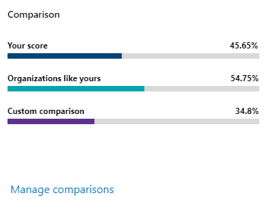

# Rastrear seu histórico de Pontuação Segura da Microsoft e cumprir metasTrack your Microsoft Secure Score history and meet goals

[!INCLUDE [Microsoft 365 Defender rebranding](../includes/microsoft-defender.md)]

[A Pontuação Segura](microsoft-secure-score.md) da Microsoft é uma medida da postura de segurança de uma organização, com um número maior indicando mais ações de melhoria tomadas.[Microsoft Secure Score](microsoft-secure-score.md) is a measurement of an organization's security posture, with a higher number indicating more improvement actions taken. Ele pode ser encontrado no https://security.microsoft.com/securescore centro de Microsoft 365 [segurança](overview-security-center.md).It can be found at https://security.microsoft.com/securescore in the [Microsoft 365 security center](overview-security-center.md).

## Obtenha informações sobre atividades que afetaram sua pontuaçãoGain insights into activity that has affected your score

Exibir um gráfico da pontuação da sua organização ao longo do tempo na **guia Histórico.**View a graph of your organization's score over time in the **History** tab.

Abaixo do gráfico está uma lista de todas as ações realizadas no intervalo de tempo selecionado e seus atributos, como pontos resultantes e categoria.Below the graph is a list of all the actions taken in the selected time range and their attributes, such as resulting points and category. Você pode personalizar um intervalo de datas e filtrar por categoria.You can customize a date range and filter by category.

Se você selecionar a ação de melhoria associada a uma atividade, o flyout de ação de melhoria total aparecerá.If you select the improvement action associated with an activity, the full improvement action flyout will appear.

Para exibir todo o histórico dessa ação de melhoria específica, selecione o link histórico no flyout.To view all history for that specific improvement action, select the history link in the flyout.

## Descobrir tendências e definir metasDiscover trends and set goals

Na guia **Métricas & tendências,** há vários gráficos e gráficos para dar mais visibilidade às tendências e definir metas.In the **Metrics & trends** tab, there are several graphs and charts to give you more visibility into trends and set goals. Você pode definir o intervalo de datas para toda a página de visualizações.You can set the date range for the whole page of visualizations. As visualizações incluem:The visualizations include:

* **Sua zona de Pontuação** Segura – Personalizada com base nas metas e definições de intervalos de pontuação boas, ok e ruins da sua organização.**Your Secure Score zone** - Customized based on your organization's goals and definitions of good, okay, and bad score ranges.
* **Tendência de regressão** - Uma linha do tempo de pontos que foram regredidas devido às alterações de configuração, usuário ou dispositivo.**Regression trend** - A timeline of points that have regressed because of configuration, user, or device changes.  
* **Tendência de comparação** - Como a Pontuação Segura da sua organização se compara à dos outros ao longo do tempo.**Comparison trend** - How your organization's Secure Score compares to others' over time. Esse modo de exibição pode incluir linhas que representam a média de pontuação das organizações com contagem de assentos semelhante e uma exibição de comparação personalizada que você pode definir.This view can include lines representing the score average of organizations with similar seat count and a custom comparison view that you can set.
* **Tendência de aceitação de risco** - Linha do tempo das ações de melhoria marcadas como "risco aceito".**Risk acceptance trend** - Timeline of improvement actions marked as "risk accepted."
* **Alterações na** pontuação - O número de pontos atingidos, pontos regredidos e alterações na pontuação no intervalo de datas especificado.**Score changes** - The number of points achieved, points regressed, and changes to your score in the specified date range.

### Comparar sua pontuação com organizações como a suaCompare your score to organizations like yours

Há dois lugares para ver como sua pontuação se compara a organizações semelhantes a você.There are two places to see how your score compares to organizations that are similar to you. Em ambos os **gráficos,** você pode selecionar Gerenciar comparações para exibir e editar as informações da sua organização.In both charts, you can select **Manage comparisons** to view and edit your organization's information. Você também pode criar uma comparação personalizada com base no setor, tamanho da organização, licenças e regiões.You can also create a custom comparison based on industry, organization size, licenses, and regions.

#### Gráfico de barras de comparaçãoComparison bar chart

O gráfico da barra de comparação é a guia **Visão** geral. Passe o mouse sobre o gráfico para exibir a oportunidade de pontuação e pontuação.The comparison bar chart is the **Overview** tab. Hover over the chart to view the score and score opportunity. Os dados de comparação são anonimizados, portanto, não sabemos exatamente quais outros locatários estão na mistura.The comparison data is anonymized so we don’t know exactly which others tenants are in the mix.

- **Organizações como** a sua : uma pontuação média de outros locatários (desde que temos pelo menos cinco ou mais locatários para comparar) que se qualificam com os seguintes critérios:**Organizations like yours**: an average score of other tenants (provided we have at least five or more tenants to compare) that qualify with the following criteria:
    1. Mesmo setorSame industry
    2. Mesmo tamanho da organizaçãoSame organization size
    3. Todas as regiõesAll regions
    4. Os produtos da Microsoft usados são 80% semelhantesMicrosoft products used are 80% similar
    5. Oportunidade (pontuação máxima que pode ser atingida pela licença atual) em um intervalo de 20% do seu locatárioOpportunity (max score that can be achieved by current license) within a 20% range from your tenant

- **Comparação Personalizada**: precisa ser configurada selecionando **Gerenciar Comparação** com base nos seguintes critérios:**Custom Comparison**: needs to be set up by selecting **Manage Comparison** based on the following criteria:
    1. Setor selecionadoSelected industry(s)
    2. Tamanhos da organização selecionadosSelected organization size(s)
    3. Região selecionadaSelected region(s)
    4. Licenças selecionadasSelected license(s)
    5. Os produtos da Microsoft usados são 80% semelhantesMicrosoft products used are 80% similar
    6. Oportunidade (pontuação máxima que pode ser atingida pela licença atual) em um intervalo de 20% do seu locatárioOpportunity (max score that can be achieved by current license) within a 20% range from your tenant

Se você tiver feito uma seleção personalizada, mas os resultados têm menos de cinco outros locatários que podemos comparar, você verá "Não disponível devido a dados limitados".If you've made a custom selection but the results have less than five other tenants that we can compare against, you'll see “Not available due to limited data”.

#### Tendência de comparaçãoComparison trend

Na guia **Métricas & tendências,** veja como a Pontuação Segura da sua organização se compara com a dos outros ao longo do tempo.In the **Metrics & trends** tab, view how your organization's Secure Score compares to others' over time.

## Queremos ouvir de vocêWe want to hear from you

Se você tiver algum problema, nos avise postando na comunidade [Segurança, Privacidade & Conformidade.](https://techcommunity.microsoft.com/t5/Security-Privacy-Compliance/bd-p/security_privacy)If you have any issues, let us know by posting in the [Security, Privacy & Compliance](https://techcommunity.microsoft.com/t5/Security-Privacy-Compliance/bd-p/security_privacy) community. Estamos monitorando a comunidade e forneceremos ajuda.We're monitoring the community and will provide help.

## Recursos relacionadosRelated resources

- [Visão geral da Pontuação Segura da MicrosoftMicrosoft Secure Score overview](microsoft-secure-score.md)
- [Avaliar postura de segurançaAssess your security posture](microsoft-secure-score-improvement-actions.md)
- [O que estar por vir.What's coming](microsoft-secure-score-whats-coming.md)
- [NovidadesWhat's new](microsoft-secure-score-whats-new.md)
