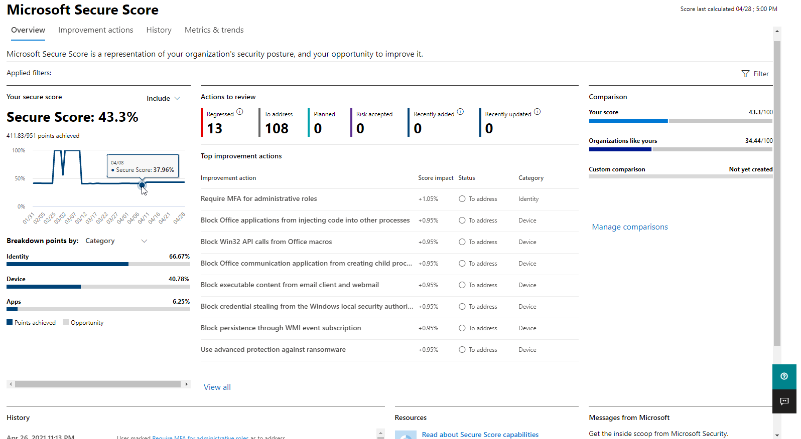

# Avaliar sua postura de segurança com a Pontuação Segura da Microsoft

[!INCLUDE [Microsoft 365 Defender rebranding](../includes/microsoft-defender.md)]

O Microsoft Secure Score é uma medição da postura de segurança de uma organização, com um número maior indicando mais ações de melhoria adotadas. Ele pode ser encontrado no https://security.microsoft.com/securescore centro de Microsoft 365 [segurança](overview-security-center.md).

Para ajudá-lo a encontrar as informações necessárias mais rapidamente, as ações de melhoria da Microsoft são organizadas em grupos:

* Identidade (Azure Active Directory contas & funções)
* Dispositivo (Microsoft Defender para Ponto de Extremidade, conhecido como [Pontuação Segura da Microsoft para Dispositivos](/windows/security/threat-protection/microsoft-defender-atp/tvm-microsoft-secure-score-devices))
* Aplicativos (aplicativos de email e nuvem, incluindo Office 365 e Microsoft Cloud App Security)

>[!NOTE]
>Na versão recente do Microsoft Secure Score, um modelo de pontuação aprimorado foi lançado, o que tornou a Pontuação Segura da Microsoft temporariamente incompatível com a Pontuação Segura de Identidade e a API Graph. [Exibir detalhes](microsoft-secure-score-whats-new.md)

Na página Visão geral da Pontuação Segura da Microsoft, veja como os pontos são divididos entre esses grupos e quais pontos estão disponíveis. Você também pode obter uma visão completa da pontuação total, tendência histórica de sua pontuação segura com comparações de benchmark e ações de melhoria priorizadas que podem ser tomadas para melhorar sua pontuação.

## Verificar sua pontuação atual

Para verificar sua pontuação atual, vá para a página Visão geral da Pontuação Segura da Microsoft e procure o pacote que diz **Sua pontuação segura**. Sua pontuação será mostrada como uma porcentagem, juntamente com o número de pontos que você atingiu fora do total de pontos possíveis.

Além disso, se você selecionar o botão **Incluir** ao lado de sua pontuação, poderá escolher diferentes exibições de sua pontuação. Esses diferentes pontos de exibição de pontuação serão exibidos no gráfico no tile de pontuação e no gráfico de divisão de pontos.

Veja a seguir as pontuações que você pode adicionar ao modo de exibição de sua pontuação geral para lhe dar uma visão mais completa da sua pontuação geral:

- **Pontuação planejada**: Mostrar pontuação projetada quando as ações planejadas são concluídas
- **Pontuação atual da licença**: Mostrar a pontuação que pode ser atingida com a licença atual da Microsoft
- **Pontuação alcançável**: Mostrar pontuação que pode ser atingida com suas licenças da Microsoft e aceitação de risco atual

Esta exibição será a aparência se você tiver incluído todos os exibições de pontuação possíveis:

## Tomar medidas para melhorar sua pontuação

A **guia Ações de aperfeiçoamento** lista as recomendações de segurança que abordam possíveis superfícies de ataque. Ele também inclui seu status (para resolver, planejado, aceitar riscos, resolvido por terceiros, resolvido por meio de mitigação alternativa e concluído). Você pode pesquisar, filtrar e agrupar todas as ações de melhoria.  

### Classificação

A classificação baseia-se no número de pontos a alcançar, na dificuldade de implementação, no impacto do usuário e na complexidade. As ações de melhoria mais altas classificadas têm um grande número de pontos restantes com baixa dificuldade, impacto do usuário e complexidade.

### Exibir detalhes da ação de melhoria

Quando você seleciona uma ação de melhoria específica, um flyout de página inteira é exibido.  

Para concluir a ação, você tem algumas opções:

- Selecione **Gerenciar** para ir para a tela de configuração e fazer a alteração. Em seguida, você obterá os pontos que a ação vale, visíveis na saída de voo. Os pontos geralmente levam cerca de 24 horas para ser atualizados.

- Selecione **Compartilhar** para copiar o link direto para a ação de melhoria. Você também pode escolher a plataforma para compartilhar o link, como email, Microsoft Teams ou Microsoft Planner.

Adicione **Anotações** para acompanhar o andamento ou qualquer outra coisa em que você queira comentar. Se você adicionar suas próprias **marcas** à ação de melhoria, poderá filtrar por essas marcas.

### Escolher um status de ação de melhoria

Escolha quaisquer status e anotações de registro específicas da ação de melhoria.

- **Para resolver** – você reconhece que a ação de melhoria é necessária e planeja a resolver em algum momento no futuro. Esse estado também se aplica a ações detectadas parcialmente, mas não totalmente concluídas.
- **Planejado** - Há planos concretos para concluir a ação de melhoria.
- **Risco aceito** - A segurança sempre deve ser equilibrada com usabilidade, e nem todas as recomendações funcionarão para seu ambiente. Quando esse for o caso, você pode optar por aceitar o risco ou o risco restante e não aprovar a ação de melhoria. Você não receberá pontos, mas a ação não ficará mais visível na lista de ações de melhoria. Você pode exibir essa ação no histórico ou desfazê-la a qualquer momento.
- **Resolvido por meio de terceiros** e Resolvido por meio de **mitigação** alternativa - A ação de melhoria já foi abordada por um aplicativo ou software de terceiros ou por uma ferramenta interna. Você obterá os pontos que a ação vale, para que sua pontuação reflita melhor sua postura de segurança geral. Se uma ferramenta interna ou de terceiros não abranger mais o controle, você pode escolher outro status. Lembre-se de que a Microsoft não terá visibilidade sobre a conclusão da implementação se a ação de melhoria estiver marcada como um desses status.

#### Ações & Gerenciamento de Vulnerabilidades melhoria de ameaças

Para ações de melhoria na categoria "Dispositivo", não é possível escolher status. Em vez disso, você será direcionado para a recomendação de Gerenciamento de Ameaças e Vulnerabilidades [de](/windows/security/threat-protection/microsoft-defender-atp/tvm-security-recommendation) segurança associada no Central de Segurança do Microsoft Defender [para](/windows/security/threat-protection/microsoft-defender-atp/use) tomar medidas. A exceção escolhida e a justificativa que você escreve serão específicas para esse portal. Ele não estará presente no portal de Pontuação Segura da Microsoft.

#### Ações de aperfeiçoamento concluídas

As ações de melhoria têm um status "concluído" depois que todos os pontos possíveis para a ação de melhoria foram atingidos. As ações de melhoria concluídas são confirmadas embora os dados da Microsoft e você não possa alterar o status.

### Avaliar informações e analisar o impacto do usuário

A seção chamada **At a glance** dirá a categoria, os ataques que ela pode proteger e o produto.

**O impacto do** usuário é o que os usuários  experimentarão se a ação de melhoria for aprovada, e os usuários afetados serão as pessoas que serão afetadas.

### Implementar a ação de melhoria

A **seção** Implementação mostra os pré-requisitos, etapas passo a passo para concluir a ação de melhoria, o status de implementação atual da ação de melhoria e qualquer outra informação sobre mais links.

Os pré-requisitos incluem quaisquer licenças necessárias ou ações a serem concluídas antes que a ação de melhoria seja abordada. Certifique-se de ter assentos suficientes em sua licença para concluir a ação de melhoria e se essas licenças são aplicadas aos usuários necessários.  

## Queremos ouvir de você

Se você tiver algum problema, nos avise postando na comunidade [Segurança, Privacidade & Conformidade.](https://techcommunity.microsoft.com/t5/Security-Privacy-Compliance/bd-p/security_privacy) Estamos monitorando a comunidade e forneceremos ajuda.

## Recursos relacionados

- [Visão geral da Pontuação Segura da Microsoft](microsoft-secure-score.md)
- [Rastrear seu histórico de Pontuação Segura da Microsoft e cumprir metas](microsoft-secure-score-history-metrics-trends.md)
- [O que estar por vir.](microsoft-secure-score-whats-coming.md)
- [Novidades](microsoft-secure-score-whats-new.md)