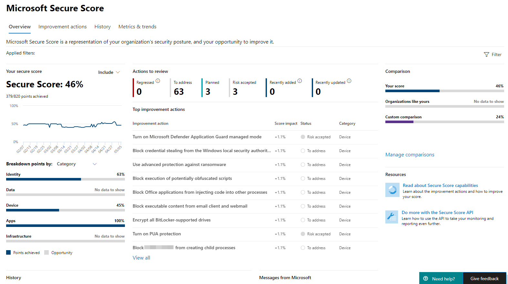

# Microsoft Secure ScoreMicrosoft Secure Score

[!INCLUDE [Microsoft 365 Defender rebranding](../includes/microsoft-defender.md)]

O Microsoft Secure Score é uma medição da postura de segurança de uma organização, com um número maior indicando mais ações de melhoria adotadas.Microsoft Secure Score is a measurement of an organization's security posture, with a higher number indicating more improvement actions taken. Ele pode ser encontrado no centro de segurança do https://security.microsoft.com/securescore [Microsoft 365.](overview-security-center.md)It can be found at https://security.microsoft.com/securescore in the [Microsoft 365 security center](overview-security-center.md).

Seguir as recomendações do Secure Score pode proteger sua organização contra ameaças.Following the Secure Score recommendations can protect your organization from threats. Em um painel centralizado no centro de segurança do Microsoft 365, as organizações podem monitorar e trabalhar na segurança de suas identidades, aplicativos e dispositivos do Microsoft 365.From a centralized dashboard in the Microsoft 365 security center, organizations can monitor and work on the security of their Microsoft 365 identities, apps, and devices.

O Secure Core ajuda as organizações a:Secure Score helps organizations:  

* Relatar o estado atual da situação de segurança da organização.Report on the current state of the organization's security posture.
* Melhorar sua situação de segurança fornecendo capacidade de descoberta, visibilidade, orientação e controle.Improve their security posture by providing discoverability, visibility, guidance, and control.  
* Comparar com os benchmarks e estabelecer KPIs (indicadores chave de desempenho).Compare with benchmarks and establish key performance indicators (KPIs).

As organizações têm acesso a visualizações robustas de métricas e tendências, integração com outros produtos da Microsoft, comparação de pontuação com organizações semelhantes e muito mais.Organizations gain access to robust visualizations of metrics and trends, integration with other Microsoft products, score comparison with similar organizations, and much more. A pontuação também pode refletir quando soluções de terceiros abordaram ações recomendadas.The score can also reflect when third-party solutions have addressed recommended actions.

## Como funcionaHow it works

Você recebe pontos para as seguintes ações:You're given points for the following actions:

- Configurando recursos de segurança recomendadosConfiguring recommended security features
- Fazendo tarefas relacionadas à segurançaDoing security-related tasks
- Endereçamento da ação de aperfeiçoamento com um aplicativo ou software de terceiros ou uma mitigação alternativaAddressing the improvement action with a third-party application or software, or an alternate mitigation

Algumas ações de melhoria só dão pontos quando concluídas totalmente.Some improvement actions only give points when fully completed. Alguns dão pontos parciais se eles são concluídos para alguns dispositivos ou usuários.Some give partial points if they're completed for some devices or users. Se você não puder ou não quiser aprovar uma das ações de melhoria, poderá optar por aceitar o risco ou o risco restante.If you can't or don't want to enact one of the improvement actions, you can choose to accept the risk or remaining risk.

Se você tiver uma licença para um dos produtos da Microsoft com suporte, verá recomendações para esses produtos.If you have a license for one of the supported Microsoft products, then you'll see recommendations for those products. Mostramos o conjunto completo de possíveis melhorias para um produto, independentemente da edição de licença, assinatura ou plano.We show you the full set of possible improvements for a product, regardless of license edition, subscription, or plan. Dessa forma, você pode entender as práticas recomendadas de segurança e melhorar sua pontuação.This way, you can understand security best practices and improve your score. Sua postura de segurança absoluta, representada pela Pontuação Segura, permanece a mesma, independentemente das licenças que sua organização possui para um produto específico.Your absolute security posture, represented by Secure Score, stays the same no matter what licenses your organization owns for a specific product. Tenha em mente que a segurança deve ser equilibrada com a usabilidade e nem todas as recomendações podem funcionar para o seu ambiente.Keep in mind that security should be balanced with usability, and not every recommendation can work for your environment.

Sua pontuação é atualizada em tempo real para refletir as informações apresentadas nas páginas de visualizações e ações de aperfeiçoamento.Your score is updated in real time to reflect the information presented in the visualizations and improvement action pages. A Pontuação Segura também sincroniza diariamente para receber dados do sistema sobre seus pontos alcançados para cada ação.Secure Score also syncs daily to receive system data about your achieved points for each action.

### Cenários principaisKey scenarios

- [Verificar sua pontuação atualCheck your current score](microsoft-secure-score-improvement-actions.md#check-your-current-score)
- [Comparar sua pontuação com organizações como a suaCompare your score to organizations like yours](microsoft-secure-score-history-metrics-trends.md#compare-your-score-to-organizations-like-yours)
- [Exibir ações de melhoria e decidir um plano de açãoView improvement actions and decide an action plan](microsoft-secure-score-improvement-actions.md#take-action-to-improve-your-score)
- [Iniciar fluxos de trabalho para investigar ou implementarInitiate work flows to investigate or implement](microsoft-secure-score-improvement-actions.md#view-improvement-action-details)

### Como as ações de melhoria são pontuadasHow improvement actions are scored

Cada ação de melhoria vale 10 pontos ou menos e a maioria é pontuada de forma binária.Each improvement action is worth 10 points or less, and most are scored in a binary fashion. Se você implementar a ação de melhoria, como criar uma nova política ou ativar uma configuração específica, você obterá 100% dos pontos.If you implement the improvement action, like create a new policy or turn on a specific setting, you get 100% of the points. Para outras ações de melhoria, os pontos são dados como um percentual da configuração total.For other improvement actions, points are given as a percentage of the total configuration.

Por exemplo, uma ação de melhoria afirma que você tem 10 pontos protegendo todos os usuários com autenticação multifatória.For example, an improvement action states you get 10 points by protecting all your users with multi-factor authentication. Você só tem 50 dos 100 usuários totais protegidos, para obter uma pontuação parcial de 5 pontos (50 protegidos / 100 total \* 10 pts máximos = 5 pts).You only have 50 of 100 total users protected, so you'd get a partial score of 5 points (50 protected / 100 total \* 10 max pts = 5 pts).

### Produtos incluídos na Pontuação SeguraProducts included in Secure Score

Atualmente, há recomendações para os seguintes produtos:Currently there are recommendations for the following products:

- Microsoft 365 (incluindo o Exchange Online)Microsoft 365 (including Exchange Online)
- Azure Active DirectoryAzure Active Directory
- Microsoft Defender para Ponto de ExtremidadeMicrosoft Defender for Endpoint
- Microsoft Defender para Identidade?Microsoft Defender for Identity
- Segurança no Aplicativo na NuvemCloud App Security
- Microsoft TeamsMicrosoft Teams

As recomendações para outros produtos de segurança estão chegando em breve.Recommendations for other security products are coming soon. As recomendações não abrangem todas as superfícies de ataque associadas a cada produto, mas são uma boa linha de base.The recommendations won't cover all the attack surfaces associated with each product, but they're a good baseline. Você também pode marcar as ações de melhoria como cobertas por terceiros ou mitigação alternativa.You can also mark the improvement actions as covered by a third party or alternate mitigation.

### Padrões de segurançaSecurity defaults

O Microsoft Secure Score atualizou as ações de melhoria para dar suporte aos padrões de segurança no [Azure Active Directory](/azure/active-directory/fundamentals/concept-fundamentals-security-defaults), o que facilita a proteção da sua organização com configurações de segurança pré-configuradas para ataques comuns.Microsoft Secure Score has updated improvement actions to support [security defaults in Azure Active Directory](/azure/active-directory/fundamentals/concept-fundamentals-security-defaults), which make it easier to help protect your organization with pre-configured security settings for common attacks.

Se você ativar os padrões de segurança, você receberá pontos completos pelas seguintes ações de melhoria:If you turn on security defaults, you'll be awarded full points for the following improvement actions:

- Certifique-se de que todos os usuários possam concluir a autenticação multifa factor para acesso seguro (9 pontos)Ensure all users can complete multi-factor authentication for secure access (9 points)
- Exigir MFA para funções administrativas (10 pontos)Require MFA for administrative roles (10 points)
- Habilitar a política para bloquear a autenticação herdado (7 pontos)Enable policy to block legacy authentication (7 points)

>[!IMPORTANT]
>Os padrões de segurança incluem recursos de segurança que fornecem segurança semelhante às ações de melhoria "política de risco de entrar" e "política de risco do usuário".Security defaults include security features that provide similar security to the "sign-in risk policy" and "user risk policy" improvement actions. Em vez de configurar essas políticas em cima dos padrões de segurança, recomendamos atualizar seus status para "Resolvido por meio de mitigação alternativa".Instead of setting up these policies on top of the security defaults, we recommend updating their statuses to "Resolved through alternative mitigation."

## Permissões obrigatóriasRequired permissions

Para ter permissão para acessar a Pontuação Segura da Microsoft, você deve ter uma das seguintes funções no Azure Active Directory.To have permission to access Microsoft Secure Score, you must be assigned one of the following roles in Azure Active Directory.

### Funções de leitura e gravaçãoRead and write roles

Com o acesso de leitura e gravação, você pode fazer alterações e interagir diretamente com a Pontuação Segura.With read and write access, you can make changes and directly interact with Secure Score. Você também pode atribuir acesso somente leitura a outros usuários.You can also assign read-only access to other users.

* Administrador globalGlobal administrator
* Administrador de segurançaSecurity administrator
* Administrador do ExchangeExchange administrator
* Administrador do SharePointSharePoint administrator
* Administrador de contasAccount administrator

### Funções somente leituraRead-only roles

Com o acesso somente leitura, você não é capaz de editar status ou anotações para uma ação de melhoria, editar zonas de pontuação ou editar comparações personalizadas.With read-only access, you aren't able to edit status or notes for an improvement action, edit score zones, or edit custom comparisons.

* Administrador da assistência técnicaHelpdesk administrator
* Administrador de usuáriosUser administrator
* Administrador de serviçoService administrator
* Leitor de segurançaSecurity reader
* Operador de segurançaSecurity operator
* Leitor globalGlobal reader

## Conscientização de riscosRisk awareness

A Pontuação Segura da Microsoft é um resumo numérico da postura de segurança com base nas configurações do sistema, no comportamento do usuário e em outras medidas relacionadas à segurança.Microsoft Secure Score is a numerical summary of your security posture based on system configurations, user behavior, and other security-related measurements. Não é uma medida absoluta de como o sistema ou os dados serão violados.It isn't an absolute measurement of how likely your system or data will be breached. Em vez disso, ele representa a extensão em que você adotou controles de segurança em seu ambiente da Microsoft que podem ajudar a evitar o risco de violação.Rather, it represents the extent to which you have adopted security controls in your Microsoft environment that can help offset the risk of being breached. Nenhum serviço online é imune a violações de segurança e a pontuação segura não deve ser interpretada como uma garantia contra violações de segurança de qualquer maneira.No online service is immune from security breaches, and secure score shouldn't be interpreted as a guarantee against security breach in any manner.

## Queremos ouvir de vocêWe want to hear from you

Se você tiver algum problema, nos avise postando na comunidade [Segurança, Privacidade & Conformidade.](https://techcommunity.microsoft.com/t5/Security-Privacy-Compliance/bd-p/security_privacy)If you have any issues, let us know by posting in the [Security, Privacy & Compliance](https://techcommunity.microsoft.com/t5/Security-Privacy-Compliance/bd-p/security_privacy) community. Estamos monitorando a comunidade e forneceremos ajuda.We're monitoring the community and will provide help.

## Recursos relacionadosRelated resources

- [Avaliar sua postura de segurançaAssess your security posture](microsoft-secure-score-improvement-actions.md)
- [Rastrear seu histórico de Pontuação Segura da Microsoft e cumprir metasTrack your Microsoft Secure Score history and meet goals](microsoft-secure-score-history-metrics-trends.md)
- [O que estar por vir.What's coming](microsoft-secure-score-whats-coming.md)
- [NovidadesWhat's new](microsoft-secure-score-whats-new.md)