# Configurar seu ambiente de laboratório de avaliação do Microsoft 365 Defender 

[!INCLUDE [Microsoft 365 Defender rebranding](../includes/microsoft-defender.md)]

**Aplica-se a:**
- Microsoft 365 Defender 

Criar um laboratório de avaliação do Microsoft 365 Defender ou um ambiente piloto e implantá-lo é um processo de três fases:

|[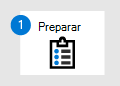](prepare-m365d-eval.md) [Fase 1: Preparar](prepare-m365d-eval.md) |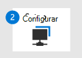 Fase 2: Configurar | [Fase 3: Onboard](config-m365d-eval.md) | [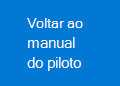](m365d-pilot.md) [Voltar ao playbook piloto](m365d-pilot.md) |
|--|--|--|--|
||*Você está aqui!*  | | |

No momento, você está na fase de configuração. Tome as etapas iniciais para acessar o Centro de Segurança do Microsoft 365 e, em seguida, configurar seu laboratório de avaliação ou ambiente piloto.

Inscreva-se em uma assinatura do Office 365 ou do Azure Active Directory para gerar um *locatário .onmicrosoft.com* que você pode usar para se inscrever na licença do Microsoft 365 E5. 

>[!NOTE]
>Se você já tiver uma assinatura existente do Office 365 ou do Azure Active Directory, poderá ignorar as etapas de avaliação do Office 365 E5 ou criação de locatário piloto.

Nesta fase, você será guiado para:
- Criar um locatário de avaliação do Office 365 E5
- Habilitar a assinatura de avaliação do Microsoft 365

## Criar um locatário de avaliação do Office 365 E5
>[!NOTE]
>Se você já tiver uma assinatura existente do Office 365 ou do Azure Active Directory, poderá ignorar as etapas de criação de locatários de avaliação do Office 365 E5.

1. Vá para o portal de produtos do [Office 365 E5](https://www.microsoft.com/microsoft-365/business/office-365-enterprise-e5-business-software?activetab=pivot%3aoverviewtab) e selecione **avaliação gratuita.**

   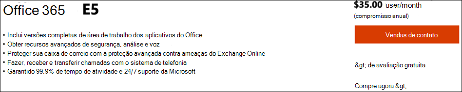
  
2. Conclua o registro de avaliação inserindo seu endereço de email (pessoal ou corporativo). Clique **em Configurar conta**.

   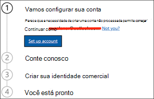

3. Preencha seu nome, sobrenome, número de telefone comercial, nome da empresa, tamanho da empresa e país ou região.  

   
   
   > [!NOTE]
   > O país ou região que você definir aqui determina a região do data center onde o Office 365 será hospedado.
  
4. Escolha sua preferência de verificação: por meio de uma mensagem de texto ou chamada. Clique **em Enviar Código de Verificação**. 

   

5. De definir o nome de domínio personalizado para seu locatário e clique em **Próximo**.

   
 
6. Configurar a primeira identidade, que será um Administrador Global para o locatário. Preencha Nome **e** **Senha**. Clique **em Inscrever-se**.

   

7. Clique **em Ir para a Instalação** para concluir o provisionamento do locatário de avaliação do Office 365 E5.

   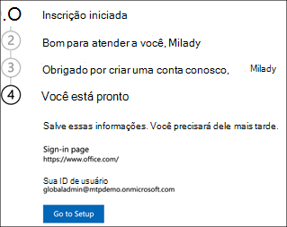

8. Conecte seu domínio corporativo ao locatário do Office 365. [Opcional] Escolha **Conectar um domínio que você já possui** e digite seu nome de domínio. Clique em **Avançar**.

   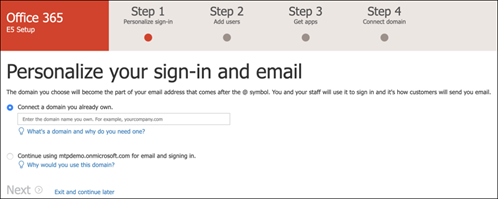
 
9. Adicione um registro TXT ou MX para validar a propriedade do domínio. Depois de adicionar o registro TXT ou MX ao seu domínio, selecione **Verificar**.

   
 
10. [Opcional] Crie mais contas de usuário para seu locatário. Você pode ignorar esta etapa clicando em **Next**.

    
 
11. [Opcional] Baixe aplicativos do Office. Clique **em Próximo** para ignorar esta etapa. 

    

12. [Opcional] Migrar mensagens de email. Novamente, você pode ignorar esta etapa.

    
 
13. Escolha serviços online. Selecione **Exchange** e clique em **Próximo.** 

    

14. Adicione registros MX, CNAME e TXT ao seu domínio. Quando concluído, selecione **Verificar**.

    
 
15. Parabéns, você concluiu o provisionamento do locatário do Office 365.

    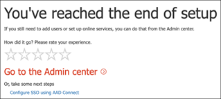

## Habilitar a assinatura de avaliação do Microsoft 365

>[!NOTE]
>Inscrever-se em uma avaliação oferece 25 licenças de usuário para usar por um mês. Consulte [Try or Buy an M365 subscription para](../../commerce/try-or-buy-microsoft-365.md) obter detalhes.

1. No Centro de Administração do [Microsoft 365,](https://admin.microsoft.com/)clique em **Cobrança** e navegue até **Serviços de Compra.**

2. Selecione **Microsoft 365 E5 e** clique em Iniciar **avaliação gratuita**. 

   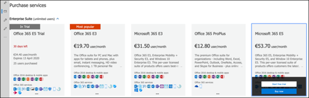

3. Escolha sua preferência de verificação: por meio de uma mensagem de texto ou chamada. Depois de decidir, digite o número de telefone, selecione **Texto-me** ou **Chame-me** dependendo de sua seleção.

   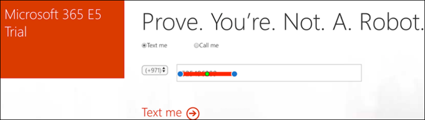
 
4. Insira o código de verificação e clique em **Iniciar sua avaliação gratuita.**

   

5. Clique **em Tentar agora** para confirmar sua avaliação do Microsoft 365 E5.

   
 
6. Vá para o Centro de Administração do **Microsoft 365**  >  **Usuários**  >  **ativos.** Selecione sua conta de usuário, selecione **Gerenciar licenças** de produto e, em seguida, troque a licença do Office 365 E5 para **o Microsoft 365 E5**. Clique em **Salvar**.

   
 
7. Selecione a conta de administrador global novamente e clique em Gerenciar nome **de usuário**.

   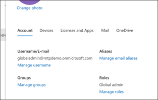

8. [Opcional] Altere o domínio *de onmicrosoft.com* para seu próprio domínio, dependendo do que você escolheu nas etapas anteriores. Clique em **Salvar alterações**.

   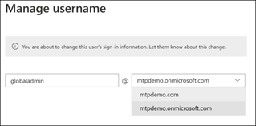

## Próxima etapa
|[Fase 3: Configurar o & Onboard](config-m365d-eval.md) | Configure cada pilar do Microsoft 365 Defender para seu laboratório de avaliação do Microsoft 365 Defender ou ambiente piloto e aborde seus pontos de extremidade.
|:-------|:-----|
