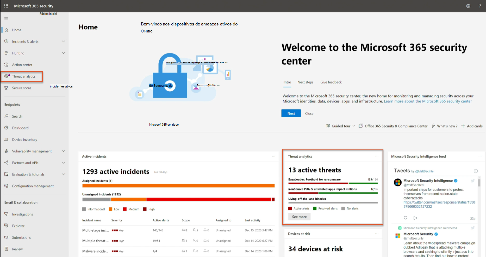
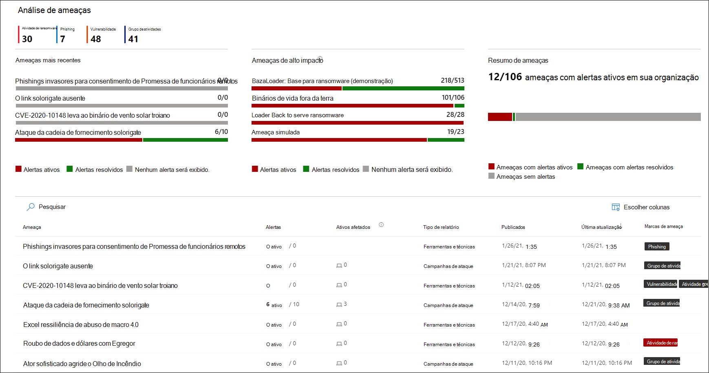
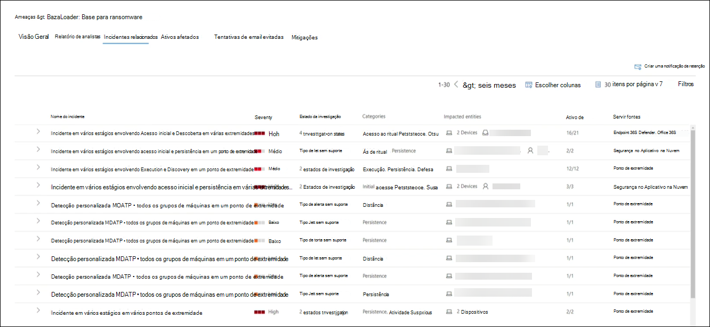
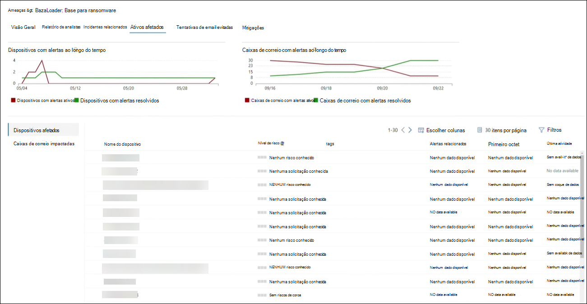
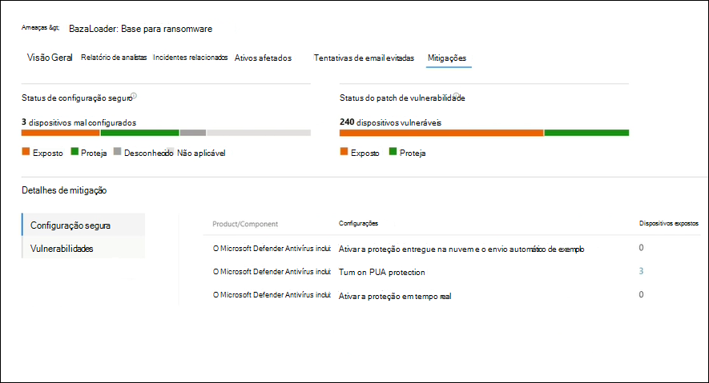
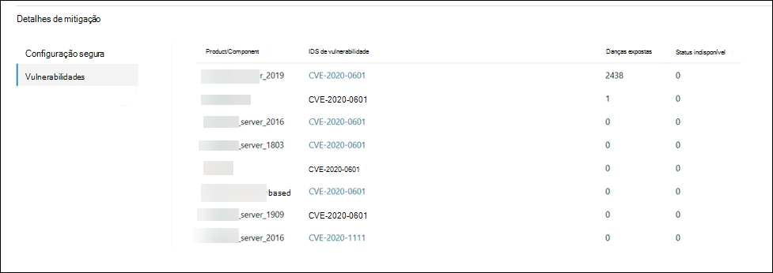

# Rastrear e responder a ameaças emergentes com análise de ameaçasTrack and respond to emerging threats with threat analytics 

[!INCLUDE [Microsoft 365 Defender rebranding](../includes/microsoft-defender.md)]

**Aplica-se a:****Applies to:**
- Microsoft 365 DefenderMicrosoft 365 Defender

> Quer experimentar o Microsoft 365 Defender?Want to experience Microsoft 365 Defender? Você pode [avaliá-lo em um ambiente de laboratório](m365d-evaluation.md?ocid=cx-docs-MTPtriallab) ou [executar seu projeto piloto em produção](m365d-pilot.md?ocid=cx-evalpilot).You can [evaluate it in a lab environment](m365d-evaluation.md?ocid=cx-docs-MTPtriallab) or [run your pilot project in production](m365d-pilot.md?ocid=cx-evalpilot).
>

[!INCLUDE [Prerelease](../includes/prerelease.md)]

A análise de ameaças é a nossa solução de inteligência contra ameaças no produto de pesquisadores de segurança especialistas da Microsoft, projetado para ajudar as equipes de segurança a serem o mais eficientes possíveis, enfrentando ameaças emergentes, incluindo:Threat analytics is our in-product threat intelligence solution from expert Microsoft security researchers, designed to assist security teams to be as efficient as possible while facing emerging threats, including:

- Atores de ameaças ativos e suas campanhasActive threat actors and their campaigns
- Técnicas de ataque populares e novasPopular and new attack techniques
- Vulnerabilidades críticasCritical vulnerabilities
- Superfícies de ataque comunsCommon attack surfaces
- Malware predominantePrevalent malware

Assista a este breve vídeo para saber mais sobre como a análise de ameaças pode ajudá-lo a rastrear as ameaças mais recentes e impedi-las.Watch this short video to learn more about how threat analytics can help you track the latest threats and stop them.

>[!VIDEO https://www.microsoft.com/en-us/videoplayer/embed/RWwJfU]

Você pode acessar a análise de ameaças do lado superior esquerdo da barra de navegação do portal de segurança do Microsoft 365 ou de um cartão de painel dedicado que mostra as principais ameaças em sua organização. Obter visibilidade sobre campanhas ativas ou em andamento e saber o que fazer por meio da análise de ameaças pode ajudar a equipar sua equipe de operações de segurança com decisões informadas.You can access threat analytics either from the upper left-hand side of Microsoft 365 security portal’s navigation bar, or from a dedicated dashboard card which shows the top threats in your org. Getting visibility on active or ongoing campaigns and knowing what to do through threat analytics can help equip your security operations team with informed decisions. 

_Onde acessar a análise de ameaças__Where to access threat analytics_

Com adversários mais sofisticados e novas ameaças surgindo com frequência e predominantemente, é fundamental poder fazer isso rapidamente:With more sophisticated adversaries and new threats emerging frequently and prevalently, it's critical to be able to quickly:

- Identificar e reagir a ameaças emergentesIdentify and react to emerging threats 
- Saiba se você está sob ataque no momentoLearn if you are currently under attack
- Avaliar o impacto da ameaça para seus ativosAssess the impact of the threat to your assets
- Revise sua resiliência contra ou exposição às ameaçasReview your resilience against or exposure to the threats
- Identificar as ações de mitigação, recuperação ou prevenção que você pode tomar para parar ou conter as ameaçasIdentify the mitigation, recovery, or prevention actions you can take to stop or contain the threats

Cada relatório fornece uma análise de uma ameaça controlada e orientações abrangentes sobre como se defender contra essa ameaça.Each report provides an analysis of a tracked threat and extensive guidance on how to defend against that threat. Ele também incorpora dados de sua rede, indicando se a ameaça está ativa e se você tem proteções aplicáveis no local.It also incorporates data from your network, indicating whether the threat is active and if you have applicable protections in place.

## Exibir o painel de análise de ameaçasView the threat analytics dashboard

O painel de análise de ameaças ([security.microsoft.com/threatanalytics3](https://security.microsoft.com/threatanalytics3)) realça os relatórios que são mais relevantes para sua organização.The threat analytics dashboard ([security.microsoft.com/threatanalytics3](https://security.microsoft.com/threatanalytics3)) highlights the reports that are most relevant to your organization. Ele resume as ameaças nas seções a seguir:It summarizes the threats in the following sections:

- **Ameaças mais** recentes lista os relatórios de ameaças publicados ou atualizados mais recentemente, juntamente com o número de alertas ativos e resolvidos.**Latest threats**—lists the most recently published or updated threat reports, along with the number of active and resolved alerts.
- **Ameaças de alto impacto** lista as ameaças que têm o maior impacto para sua organização.**High-impact threats**—lists the threats that have the highest impact to your organization. Esta seção lista as ameaças com o maior número de alertas ativos e resolvidos primeiro.This section lists threats with the highest number of active and resolved alerts first.
- **Resumo de** ameaças — fornece o impacto geral de todas as ameaças controladas mostrando o número de ameaças com alertas ativos e resolvidos.**Threat summary**—provides the overall impact of all tracked threats by showing the number of threats with active and resolved alerts.

Selecione uma ameaça no painel para exibir o relatório dessa ameaça.Select a threat from the dashboard to view the report for that threat.

_Painel de análise de ameaças. Você também pode clicar no ícone Pesquisar para teclar em uma palavra-chave relacionada ao relatório de análise de ameaças que você gostaria de ler.__Threat analytics dashboard. You can also click the Search icon to key in a keyword related to the threat analytics report that you'd like to read._ 

## Exibir um relatório de análise de ameaçasView a threat analytics report

Cada relatório de análise de ameaças fornece informações em várias seções:Each threat analytics report provides information in several sections: 

- [**Visão Geral****Overview**](#overview-quickly-understand-the-threat-assess-its-impact-and-review-defenses) 
- [**Relatório de analistas****Analyst report**](#analyst-report-get-expert-insight-from-microsoft-security-researchers)
- [**Incidentes relacionados****Related incidents**](#related-incidents-view-and-manage-related-incidents)
- [**Ativos afetados****Impacted assets**](#impacted-assets-get-list-of-impacted-devices-and-mailboxes)
- [**Tentativas de email evitadas****Prevented email attempts**](#prevented-email-attempts-view-blocked-or-junked-threat-emails)
- [**Mitigações****Mitigations**](#mitigations-review-list-of-mitigations-and-the-status-of-your-devices)

### Visão geral: entenda rapidamente a ameaça, avalie seu impacto e revise as defesasOverview: Quickly understand the threat, assess its impact, and review defenses

A **seção Visão** Geral fornece uma visualização do relatório detalhado do analista.The **Overview** section provides a preview of the detailed analyst report. Ele também fornece gráficos que realçam o impacto da ameaça à sua organização e sua exposição por meio de dispositivos não configurados e não configurados.It also provides charts that highlight the impact of the threat to your organization and your exposure through misconfigured and unpatched devices.

_Seção Visão geral de um relatório de análise de ameaças__Overview section of a threat analytics report_

#### Avaliar o impacto em sua organizaçãoAssess impact on your organization
Cada relatório inclui gráficos projetados para fornecer informações sobre o impacto organizacional de uma ameaça:Each report includes charts designed to provide information about the organizational impact of a threat:
- **Incidentes relacionados**— fornece uma visão geral do impacto da ameaça controlada à sua organização com os seguintes dados:**Related incidents**—provides an overview of the impact of the tracked threat to your organization with the following data:
  - Número de alertas ativos e o número de incidentes ativos aos que estão associadosNumber of active alerts and the number of active incidents they are associated with
  - Gravidade de incidentes ativosSeverity of active incidents
- **Alertas ao longo do tempo** mostram o número de alertas **ativos** e **resolvidos** relacionados ao longo do tempo.**Alerts over time**—shows the number of related **Active** and **Resolved** alerts over time. O número de alertas resolvidos indica a rapidez com que sua organização responde a alertas associados a uma ameaça.The number of resolved alerts indicates how quickly your organization responds to alerts associated with a threat. Idealmente, o gráfico deve mostrar alertas resolvidos em alguns dias.Ideally, the chart should be showing alerts resolved within a few days.
- **Ativos afetados** mostra o número de dispositivos distintos e contas de email (caixas de correio) que atualmente têm pelo menos um alerta ativo associado à ameaça controlada.**Impacted assets**—shows the number of distinct devices and email accounts (mailboxes) that currently have at least one active alert associated with the tracked threat. Alertas são disparados para caixas de correio que receberam emails de ameaça.Alerts are triggered for mailboxes that received threat emails. Revise as políticas no nível da organização e do usuário para ver se há substituições que causam a entrega de emails de ameaça.Review both org- and user-level policies for overrides that cause the delivery of threat emails.
- **Tentativas de email evitadas**— mostra o número de emails dos últimos sete dias que foram bloqueados antes da entrega ou entregues à pasta lixo eletrônico.**Prevented email attempts**—shows the number of emails from the past seven days that were either blocked before delivery or delivered to the junk mail folder.

#### Revisar a resiliência e a postura de segurançaReview security resilience and posture
Cada relatório inclui gráficos que fornecem uma visão geral de como sua organização é resiliente contra uma determinada ameaça:Each report includes charts that provide an overview of how resilient your organization is against a given threat:
- **Status de configuração** seguro mostra o número de dispositivos com configurações de segurança mal configuradas.**Secure configuration status**—shows the number of devices with misconfigured security settings. Aplique as configurações de segurança recomendadas para ajudar a reduzir a ameaça.Apply the recommended security settings to help mitigate the threat. Os dispositivos são **considerados Seguros** se eles aplicaram _todas as_ configurações controladas.Devices are considered **Secure** if they have applied _all_ the tracked settings.
- **Status de patch de vulnerabilidade** mostra o número de dispositivos vulneráveis.**Vulnerability patching status**—shows the number of vulnerable devices. Aplique atualizações de segurança ou patches para resolver vulnerabilidades exploradas pela ameaça.Apply security updates or patches to address vulnerabilities exploited by the threat.

### Relatório de analistas: obter informações de especialistas de pesquisadores de segurança da MicrosoftAnalyst report: Get expert insight from Microsoft security researchers
Na seção **Relatório de** Analistas, leia o relatório detalhado do especialista.In the **Analyst report** section, read through the detailed expert write-up. A maioria dos relatórios fornece descrições detalhadas de cadeias de ataque, incluindo táticas e técnicas mapeadas para  a estrutura de CK do MITRE ATT&, listas exaustivas de recomendações e orientações avançadas sobre a busca de ameaças.Most reports provide detailed descriptions of attack chains, including tactics and techniques mapped to the MITRE ATT&CK framework, exhaustive lists of recommendations, and powerful [threat hunting](advanced-hunting-overview.md) guidance.

[Saiba mais sobre o relatório do analistaLearn more about the analyst report](threat-analytics-analyst-reports.md)

### Incidentes relacionados: exibir e gerenciar incidentes relacionadosRelated incidents: View and manage related incidents
A **guia Incidentes Relacionados** fornece a lista de todos os incidentes relacionados à ameaça controlada.The **Related incidents** tab provides the list of all incidents related to the tracked threat. Você pode atribuir incidentes ou gerenciar alertas vinculados a cada incidente.You can assign incidents or manage alerts linked to each incident. 

_Seção Incidentes relacionados de um relatório de análise de ameaças__Related incidents section of a threat analytics report_

### Ativos afetados: Obter lista de dispositivos e caixas de correio afetadosImpacted assets: Get list of impacted devices and mailboxes
Um ativo será considerado afetado se for afetado por um alerta ativo não resolvido.An asset is considered impacted if it is affected by an active, unresolved alert. A **guia Ativos afetados** lista os seguintes tipos de ativos afetados:The **Impacted assets** tab lists the following types of impacted assets:
- **Dispositivos afetados**— pontos de extremidade que não resolveram os alertas do Microsoft Defender para o Ponto de Extremidade.**Impacted devices**—endpoints that have unresolved Microsoft Defender for Endpoint alerts. Esses alertas normalmente disparam em avistamentos de indicadores e atividades de ameaças conhecidos.These alerts typically fire on sightings of known threat indicators and activities.
- **Caixas de correio impactadas**— caixas de correio que receberam mensagens de email que dispararam alertas do Microsoft Defender para o Office 365.**Impacted mailboxes**—mailboxes that have received email messages that have triggered Microsoft Defender for Office 365 alerts. Embora a maioria das mensagens que disparam alertas geralmente sejam bloqueadas, as políticas no nível do usuário ou da organização podem substituir filtros.While most messages that trigger alerts are typically blocked, user- or org-level policies can override filters.

_Seção ativos afetados de um relatório de análise de ameaças__Impacted assets section of a threat analytics report_

### Tentativas de email evitadas: Exibir emails de ameaça bloqueados ou lixo eletrônicoPrevented email attempts: View blocked or junked threat emails
O Microsoft Defender para Office 365 normalmente bloqueia emails com indicadores de ameaça conhecidos, incluindo links mal-intencionados ou anexos.Microsoft Defender for Office 365 typically blocks emails with known threat indicators, including malicious links or attachments. Em alguns casos, mecanismos de filtragem proativos que verificam se há conteúdo suspeito enviarão emails de ameaça para a pasta lixo eletrônico.In some cases, proactive filtering mechanisms that check for suspicious content will instead send threat emails to the junk mail folder. Em ambos os casos, as chances de a ameaça iniciar código de malware no dispositivo é reduzida.In either case, the chances of the threat launching malware code on the device is reduced.

A **guia Tentativas de Email Impedido** lista todos os emails que foram bloqueados antes da entrega ou enviados para a pasta lixo eletrônico pelo Microsoft Defender para Office 365.The **Prevented email attempts** tab lists all the emails that have either been blocked before delivery or sent to the junk mail folder by Microsoft Defender for Office 365. 

_Seção Tentativas de email impedidas de um relatório de análise de ameaças__Prevented email attempts section of a threat analytics report_

### Mitigações: revise a lista de mitigações e o status de seus dispositivosMitigations: Review list of mitigations and the status of your devices
Na seção **Mitigações,** revise a lista de recomendações ativas específicas que podem ajudá-lo a aumentar sua resiliência organizacional em relação à ameaça.In the **Mitigations** section, review the list of specific actionable recommendations that can help you increase your organizational resilience against the threat. A lista de mitigações controladas inclui:The list of tracked mitigations includes:

- **Atualizações de segurança**— implantação de atualizações de segurança de software com suporte para vulnerabilidades encontradas em dispositivos conectados**Security updates**—deployment of supported software security updates for vulnerabilities found on onboarded devices
- **Configurações de segurança com suporte****Supported security configurations**
  - Proteção entregue na nuvemCloud-delivered protection  
  - Proteção de aplicativo potencialmente indesejado (PUA)Potentially unwanted application (PUA) protection
  - Proteção em tempo realReal-time protection
 
As informações de mitigação nesta seção incorporam dados do gerenciamento de ameaças e vulnerabilidades [,](/windows/security/threat-protection/microsoft-defender-atp/next-gen-threat-and-vuln-mgt)que também fornece informações detalhadas de detalhamento de vários links no relatório.Mitigation information in this section incorporates data from [threat and vulnerability management](/windows/security/threat-protection/microsoft-defender-atp/next-gen-threat-and-vuln-mgt), which also provides detailed drill-down information from various links in the report.

 

_Seção Mitigações de um relatório de análise de ameaças__Mitigations section of a threat analytics report_

## Detalhes e limitações adicionais do relatórioAdditional report details and limitations
>[!NOTE]
>Como parte da experiência de segurança unificada, a análise de ameaças agora está disponível não apenas para o Microsoft Defender para Ponto de Extremidade, mas também para os proprietários de licença do Microsoft Defender para Office E5.As part of the unified security experience, threat analytics is now available not just for Microsoft Defender for Endpoint, but also for Microsoft Defender for Office E5 license holders.
>Se você não estiver usando o portal de segurança do Microsoft 365 (Microsoft 365 Defender), também poderá ver os detalhes do relatório (sem os dados do Microsoft Defender para Office) no portal do Centro de Segurança do Microsoft Defender (Microsoft Defender para Ponto de Extremidade).If you are not using the Microsoft 365 security portal (Microsoft 365 Defender), you can also see the report details (without the Microsoft Defender for Office data) in the Microsoft Defender Security Center portal (Microsoft Defender for Endpoint). 

Para acessar o relatório de análise de ameaças, você precisa de determinadas funções e permissões.To access threat analytics report you need certain roles and permissions. Consulte Funções personalizadas no controle de acesso [baseado em função para o Microsoft 365 Defender](custom-roles.md) para obter detalhes.See [Custom roles in role-based access control for Microsoft 365 Defender](custom-roles.md) for details.
  - Para exibir alertas, incidentes ou dados de ativos afetados, você precisa ter permissões para o Microsoft Defender para Office ou o Microsoft Defender para dados de alertas de ponto de extremidade ou ambos.To view alerts, incidents, or impacted assets data, you need to have permissions to Microsoft Defender for Office or Microsoft Defender for Endpoint alerts data, or both.
  - Para exibir tentativas de email impedidas, você precisa ter permissões para os dados de busca do Microsoft Defender para Office.To view prevented email attempts, you need to have permissions to Microsoft Defender for Office hunting data. 
  - Para exibir mitigações, você precisa ter permissões para dados de gerenciamento de ameaças e vulnerabilidades no Microsoft Defender para Ponto de Extremidade.To view mitigations, you need to have permissions to threat and vulnerability management data in Microsoft Defender for Endpoint.

Ao ver os dados de análise de ameaças, lembre-se dos seguintes fatores:When looking at the threat analytics data, remember the following factors:
- Os gráficos refletem apenas mitigações controladas.Charts reflect only mitigations that are tracked. Verifique a visão geral do relatório para obter mitigações adicionais que não são mostradas nos gráficos.Check the report overview for additional mitigations that are not shown in the charts.
- Mitigações não garantem resiliência completa.Mitigations don't guarantee complete resilience. As mitigações fornecidas refletem as melhores ações possíveis necessárias para melhorar a resiliência.The provided mitigations reflect the best possible actions needed to improve resiliency.
- Os dispositivos serão contados como "indisponíveis" se não transmitirem dados para o serviço.Devices are counted as "unavailable" if they have not transmitted data to the service.
- As estatísticas relacionadas ao antivírus são baseadas nas configurações do Microsoft Defender Antivírus.Antivirus-related statistics are based on Microsoft Defender Antivirus settings. Dispositivos com soluções antivírus de terceiros podem aparecer como "expostos".Devices with third-party antivirus solutions can appear as "exposed".

## Tópicos relacionadosRelated topics
- [Encontrar proativamente ameaças com busca avançadaProactively find threats with advanced hunting](advanced-hunting-overview.md) 
- [Compreender a seção relatório de analistasUnderstand the analyst report section](threat-analytics-analyst-reports.md)
- [Avaliar e resolver deficiências e exposições de segurançaAssess and resolve security weaknesses and exposures](/windows/security/threat-protection/microsoft-defender-atp/next-gen-threat-and-vuln-mgt)