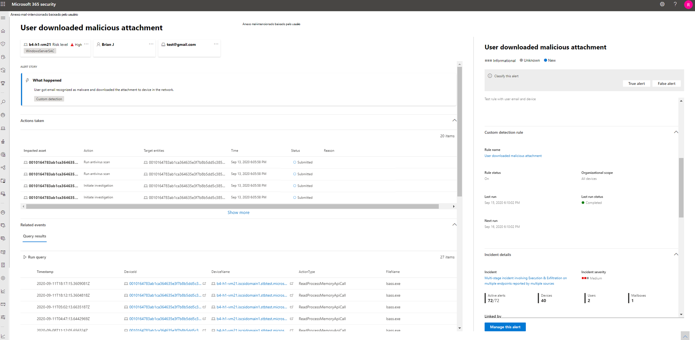

# <a name="migrate-advanced-hunting-queries-from-microsoft-defender-for-endpoint"></a><span data-ttu-id="7732d-104">Migrar consultas de busca avançadas do Microsoft Defender para o Ponto de Extremidade</span><span class="sxs-lookup"><span data-stu-id="7732d-104">Migrate advanced hunting queries from Microsoft Defender for Endpoint</span></span>

[!INCLUDE [Microsoft 365 Defender rebranding](../includes/microsoft-defender.md)]

<span data-ttu-id="7732d-105">**Aplica-se a:**</span><span class="sxs-lookup"><span data-stu-id="7732d-105">**Applies to:**</span></span>
- <span data-ttu-id="7732d-106">Microsoft 365 Defender</span><span class="sxs-lookup"><span data-stu-id="7732d-106">Microsoft 365 Defender</span></span>

<span data-ttu-id="7732d-107">Mova seus fluxos de trabalho de busca avançados do Microsoft Defender para o Ponto de Extremidade para procurar proativamente ameaças usando um conjunto mais amplo de dados.</span><span class="sxs-lookup"><span data-stu-id="7732d-107">Move your advanced hunting workflows from Microsoft Defender for Endpoint to proactively hunt for threats using a broader set of data.</span></span> <span data-ttu-id="7732d-108">No Microsoft 365 Defender, você tem acesso a dados de outras soluções de segurança do Microsoft 365, incluindo:</span><span class="sxs-lookup"><span data-stu-id="7732d-108">In Microsoft 365 Defender, you get access to data from other Microsoft 365 security solutions, including:</span></span>

- <span data-ttu-id="7732d-109">Microsoft Defender para Ponto de Extremidade</span><span class="sxs-lookup"><span data-stu-id="7732d-109">Microsoft Defender for Endpoint</span></span>
- <span data-ttu-id="7732d-110">Obter o Microsoft Defender para Office 365</span><span class="sxs-lookup"><span data-stu-id="7732d-110">Microsoft Defender for Office 365</span></span>
- <span data-ttu-id="7732d-111">Segurança no aplicativo na nuvem da Microsoft</span><span class="sxs-lookup"><span data-stu-id="7732d-111">Microsoft Cloud App Security</span></span>
- <span data-ttu-id="7732d-112">O que é o Microsoft Defender para Identidade?</span><span class="sxs-lookup"><span data-stu-id="7732d-112">Microsoft Defender for Identity</span></span>

>[!NOTE]
><span data-ttu-id="7732d-113">A maioria dos clientes do Microsoft Defender para Ponto de Extremidade [pode usar o Microsoft 365 Defender sem licenças adicionais.](prerequisites.md#licensing-requirements)</span><span class="sxs-lookup"><span data-stu-id="7732d-113">Most Microsoft Defender for Endpoint customers can [use Microsoft 365 Defender without additional licenses](prerequisites.md#licensing-requirements).</span></span> <span data-ttu-id="7732d-114">Para começar a fazer a transição dos fluxos de trabalho de busca avançados do Defender para o Ponto de Extremidade, [a ligue o Microsoft 365 Defender](mtp-enable.md).</span><span class="sxs-lookup"><span data-stu-id="7732d-114">To start transitioning your advanced hunting workflows from Defender for Endpoint, [turn on Microsoft 365 Defender](mtp-enable.md).</span></span>

<span data-ttu-id="7732d-115">Você pode fazer a transição sem afetar seus fluxos de trabalho existentes do Defender para Pontos de Extremidade.</span><span class="sxs-lookup"><span data-stu-id="7732d-115">You can transition without affecting your existing Defender for Endpoint workflows.</span></span> <span data-ttu-id="7732d-116">As consultas salvas permanecem intactas e as regras de detecção personalizadas continuam a ser executados e geram alertas.</span><span class="sxs-lookup"><span data-stu-id="7732d-116">Saved queries remain intact, and custom detection rules continue to run and generate alerts.</span></span> <span data-ttu-id="7732d-117">No entanto, eles estarão visíveis no Microsoft 365 Defender.</span><span class="sxs-lookup"><span data-stu-id="7732d-117">They will, however, be visible in Microsoft 365 Defender.</span></span> 

## <a name="schema-tables-in-microsoft-365-defender-only"></a><span data-ttu-id="7732d-118">Tabelas de esquema no Microsoft 365 Defender somente</span><span class="sxs-lookup"><span data-stu-id="7732d-118">Schema tables in Microsoft 365 Defender only</span></span>
<span data-ttu-id="7732d-119">O esquema de busca avançada do [Microsoft 365 Defender](advanced-hunting-schema-tables.md) fornece tabelas adicionais contendo dados de várias soluções de segurança do Microsoft 365.</span><span class="sxs-lookup"><span data-stu-id="7732d-119">The [Microsoft 365 Defender advanced hunting schema](advanced-hunting-schema-tables.md) provides additional tables containing data from various Microsoft 365 security solutions.</span></span> <span data-ttu-id="7732d-120">As tabelas a seguir estão disponíveis apenas no Microsoft 365 Defender:</span><span class="sxs-lookup"><span data-stu-id="7732d-120">The following tables are available only in Microsoft 365 Defender:</span></span>

| <span data-ttu-id="7732d-121">Nome da tabela</span><span class="sxs-lookup"><span data-stu-id="7732d-121">Table name</span></span> | <span data-ttu-id="7732d-122">Descrição</span><span class="sxs-lookup"><span data-stu-id="7732d-122">Description</span></span> |
|------------|-------------|
| [<span data-ttu-id="7732d-123">AlertEvidence</span><span class="sxs-lookup"><span data-stu-id="7732d-123">AlertEvidence</span></span>](advanced-hunting-alertevidence-table.md) | <span data-ttu-id="7732d-124">Arquivos, endereços IP, URLs, usuários ou dispositivos associados a alertas</span><span class="sxs-lookup"><span data-stu-id="7732d-124">Files, IP addresses, URLs, users, or devices associated with alerts</span></span> |
| [<span data-ttu-id="7732d-125">AlertInfo</span><span class="sxs-lookup"><span data-stu-id="7732d-125">AlertInfo</span></span>](advanced-hunting-alertinfo-table.md) | <span data-ttu-id="7732d-126">Alertas do Microsoft Defender para Ponto de Extremidade, Microsoft Defender para Office 365, Microsoft Cloud App Security e Microsoft Defender para Identidade, incluindo informações de gravidade e categorias de ameaças</span><span class="sxs-lookup"><span data-stu-id="7732d-126">Alerts from Microsoft Defender for Endpoint, Microsoft Defender for Office 365, Microsoft Cloud App Security, and Microsoft Defender for Identity, including severity information and threat categories</span></span>  |
| [<span data-ttu-id="7732d-127">AppFileEvents</span><span class="sxs-lookup"><span data-stu-id="7732d-127">AppFileEvents</span></span>](advanced-hunting-appfileevents-table.md) | <span data-ttu-id="7732d-128">Atividades relacionadas a arquivos em aplicativos e serviços na nuvem</span><span class="sxs-lookup"><span data-stu-id="7732d-128">File-related activities in cloud apps and services</span></span> |
| [<span data-ttu-id="7732d-129">EmailAttachmentInfo</span><span class="sxs-lookup"><span data-stu-id="7732d-129">EmailAttachmentInfo</span></span>](advanced-hunting-emailattachmentinfo-table.md) | <span data-ttu-id="7732d-130">Informações sobre arquivos anexados a emails</span><span class="sxs-lookup"><span data-stu-id="7732d-130">Information about files attached to emails</span></span> |
| [<span data-ttu-id="7732d-131">EmailEvents</span><span class="sxs-lookup"><span data-stu-id="7732d-131">EmailEvents</span></span>](advanced-hunting-emailevents-table.md) | <span data-ttu-id="7732d-132">Eventos de email do Microsoft 365, incluindo eventos de entrega de email e bloqueio</span><span class="sxs-lookup"><span data-stu-id="7732d-132">Microsoft 365 email events, including email delivery and blocking events</span></span> |
| [<span data-ttu-id="7732d-133">EmailPostDeliveryEvents</span><span class="sxs-lookup"><span data-stu-id="7732d-133">EmailPostDeliveryEvents</span></span>](advanced-hunting-emailpostdeliveryevents-table.md) | <span data-ttu-id="7732d-134">Eventos de segurança que ocorrem após a entrega, após o Microsoft 365 ter entregue os emails à caixa de correio do destinatário</span><span class="sxs-lookup"><span data-stu-id="7732d-134">Security events that occur post-delivery, after Microsoft 365 has delivered the emails to the recipient mailbox</span></span> |
| [<span data-ttu-id="7732d-135">EmailUrlInfo</span><span class="sxs-lookup"><span data-stu-id="7732d-135">EmailUrlInfo</span></span>](advanced-hunting-emailurlinfo-table.md) | <span data-ttu-id="7732d-136">Informações sobre URLs em emails</span><span class="sxs-lookup"><span data-stu-id="7732d-136">Information about URLs on emails</span></span> |
| [<span data-ttu-id="7732d-137">IdentityDirectoryEvents</span><span class="sxs-lookup"><span data-stu-id="7732d-137">IdentityDirectoryEvents</span></span>](advanced-hunting-identitydirectoryevents-table.md) | <span data-ttu-id="7732d-138">Eventos envolvendo um controlador de domínio local executando o Active Directory (AD).</span><span class="sxs-lookup"><span data-stu-id="7732d-138">Events involving an on-premises domain controller running Active Directory (AD).</span></span> <span data-ttu-id="7732d-139">Esta tabela abrange um intervalo de eventos relacionados à identidade e eventos do sistema no controlador de domínio.</span><span class="sxs-lookup"><span data-stu-id="7732d-139">This table covers a range of identity-related events and system events on the domain controller.</span></span> |
| [<span data-ttu-id="7732d-140">IdentityInfo</span><span class="sxs-lookup"><span data-stu-id="7732d-140">IdentityInfo</span></span>](advanced-hunting-identityinfo-table.md) | <span data-ttu-id="7732d-141">Informações da conta de várias fontes, incluindo o Azure Active Directory</span><span class="sxs-lookup"><span data-stu-id="7732d-141">Account information from various sources, including Azure Active Directory</span></span> |
| [<span data-ttu-id="7732d-142">IdentityLogonEvents</span><span class="sxs-lookup"><span data-stu-id="7732d-142">IdentityLogonEvents</span></span>](advanced-hunting-identitylogonevents-table.md) | <span data-ttu-id="7732d-143">Eventos de autenticação no Active Directory e serviços online da Microsoft</span><span class="sxs-lookup"><span data-stu-id="7732d-143">Authentication events on Active Directory and Microsoft online services</span></span> |
| [<span data-ttu-id="7732d-144">IdentityQueryEvents</span><span class="sxs-lookup"><span data-stu-id="7732d-144">IdentityQueryEvents</span></span>](advanced-hunting-identityqueryevents-table.md) | <span data-ttu-id="7732d-145">Consultas para objetos do Active Directory, como usuários, grupos, dispositivos e domínios</span><span class="sxs-lookup"><span data-stu-id="7732d-145">Queries for Active Directory objects, such as users, groups, devices, and domains</span></span> |

>[!IMPORTANT]
> <span data-ttu-id="7732d-146">Consultas e detecções personalizadas que usam tabelas de esquema disponíveis apenas no Microsoft 365 Defender só podem ser exibidas no Microsoft 365 Defender.</span><span class="sxs-lookup"><span data-stu-id="7732d-146">Queries and custom detections which use schema tables that are only available in Microsoft 365 Defender can only be viewed in Microsoft 365 Defender.</span></span>

## <a name="map-devicealertevents-table"></a><span data-ttu-id="7732d-147">Tabela Mapear DeviceAlertEvents</span><span class="sxs-lookup"><span data-stu-id="7732d-147">Map DeviceAlertEvents table</span></span>
<span data-ttu-id="7732d-148">As `AlertInfo` `AlertEvidence` tabelas e substituem `DeviceAlertEvents` a tabela no esquema do Microsoft Defender para Ponto de Extremidade.</span><span class="sxs-lookup"><span data-stu-id="7732d-148">The `AlertInfo` and `AlertEvidence` tables replace the `DeviceAlertEvents` table in the Microsoft Defender for Endpoint schema.</span></span> <span data-ttu-id="7732d-149">Além dos dados sobre alertas de dispositivo, essas duas tabelas incluem dados sobre alertas para identidades, aplicativos e emails.</span><span class="sxs-lookup"><span data-stu-id="7732d-149">In addition to data about device alerts, these two tables include data about alerts for identities, apps, and emails.</span></span>

<span data-ttu-id="7732d-150">Use a tabela a seguir para verificar como `DeviceAlertEvents` as colunas são mapeadas para colunas `AlertInfo` nas `AlertEvidence` tabelas e.</span><span class="sxs-lookup"><span data-stu-id="7732d-150">Use the following table to check how `DeviceAlertEvents` columns map to columns in the `AlertInfo` and `AlertEvidence` tables.</span></span>

>[!TIP]
><span data-ttu-id="7732d-151">Além das colunas da tabela a seguir, a tabela inclui muitas outras colunas que fornecem uma imagem mais holística de `AlertEvidence` alertas de várias fontes.</span><span class="sxs-lookup"><span data-stu-id="7732d-151">In addition to the columns the following table, the `AlertEvidence` table includes many other columns that provide a more holistic picture of alerts from various sources.</span></span> [<span data-ttu-id="7732d-152">Consulte todas as colunas AlertEvidence</span><span class="sxs-lookup"><span data-stu-id="7732d-152">See all AlertEvidence columns</span></span>](advanced-hunting-alertevidence-table.md) 

| <span data-ttu-id="7732d-153">Coluna DeviceAlertEvents</span><span class="sxs-lookup"><span data-stu-id="7732d-153">DeviceAlertEvents column</span></span> | <span data-ttu-id="7732d-154">Onde encontrar os mesmos dados no Microsoft 365 Defender</span><span class="sxs-lookup"><span data-stu-id="7732d-154">Where to find the same data in Microsoft 365 Defender</span></span> |
|-------------|-----------|-------------|-------------|
| `AlertId` | <span data-ttu-id="7732d-155">`AlertInfo` e  `AlertEvidence` tabelas</span><span class="sxs-lookup"><span data-stu-id="7732d-155">`AlertInfo` and  `AlertEvidence` tables</span></span> |
| `Timestamp` | <span data-ttu-id="7732d-156">`AlertInfo` e  `AlertEvidence` tabelas</span><span class="sxs-lookup"><span data-stu-id="7732d-156">`AlertInfo` and  `AlertEvidence` tables</span></span> |
| `DeviceId` | <span data-ttu-id="7732d-157">`AlertEvidence` table</span><span class="sxs-lookup"><span data-stu-id="7732d-157">`AlertEvidence` table</span></span> |
| `DeviceName` | <span data-ttu-id="7732d-158">`AlertEvidence` table</span><span class="sxs-lookup"><span data-stu-id="7732d-158">`AlertEvidence` table</span></span> |
| `Severity` | <span data-ttu-id="7732d-159">`AlertInfo` table</span><span class="sxs-lookup"><span data-stu-id="7732d-159">`AlertInfo` table</span></span> |
| `Category` | <span data-ttu-id="7732d-160">`AlertInfo` table</span><span class="sxs-lookup"><span data-stu-id="7732d-160">`AlertInfo` table</span></span> |
| `Title` | <span data-ttu-id="7732d-161">`AlertInfo` table</span><span class="sxs-lookup"><span data-stu-id="7732d-161">`AlertInfo` table</span></span> |
| `FileName` | <span data-ttu-id="7732d-162">`AlertEvidence` table</span><span class="sxs-lookup"><span data-stu-id="7732d-162">`AlertEvidence` table</span></span> |
| `SHA1` | <span data-ttu-id="7732d-163">`AlertEvidence` table</span><span class="sxs-lookup"><span data-stu-id="7732d-163">`AlertEvidence` table</span></span> |
| `RemoteUrl` | <span data-ttu-id="7732d-164">`AlertEvidence` table</span><span class="sxs-lookup"><span data-stu-id="7732d-164">`AlertEvidence` table</span></span> |
| `RemoteIP` | <span data-ttu-id="7732d-165">`AlertEvidence` table</span><span class="sxs-lookup"><span data-stu-id="7732d-165">`AlertEvidence` table</span></span> |
| `AttackTechniques` | <span data-ttu-id="7732d-166">`AlertInfo` table</span><span class="sxs-lookup"><span data-stu-id="7732d-166">`AlertInfo` table</span></span> |
| `ReportId` | <span data-ttu-id="7732d-167">Esta coluna normalmente é usada no Microsoft Defender para Endpoint para localizar registros relacionados em outras tabelas.</span><span class="sxs-lookup"><span data-stu-id="7732d-167">This column is typically used in Microsoft Defender for Endpoint to locate related records in other tables.</span></span> <span data-ttu-id="7732d-168">No Microsoft 365 Defender, você pode obter dados relacionados diretamente da `AlertEvidence` tabela.</span><span class="sxs-lookup"><span data-stu-id="7732d-168">In Microsoft 365 Defender, you can get related data directly from the `AlertEvidence` table.</span></span> |
| `Table` | <span data-ttu-id="7732d-169">Esta coluna geralmente é usada no Microsoft Defender para Endpoint para obter informações adicionais de eventos em outras tabelas.</span><span class="sxs-lookup"><span data-stu-id="7732d-169">This column is typically used in Microsoft Defender for Endpoint for additional event information in other tables.</span></span> <span data-ttu-id="7732d-170">No Microsoft 365 Defender, você pode obter dados relacionados diretamente da `AlertEvidence` tabela.</span><span class="sxs-lookup"><span data-stu-id="7732d-170">In Microsoft 365 Defender, you can get related data directly from the `AlertEvidence` table.</span></span> |

## <a name="adjust-existing-microsoft-defender-for-endpoint-queries"></a><span data-ttu-id="7732d-171">Ajustar consultas existentes do Microsoft Defender para Pontos de Extremidade</span><span class="sxs-lookup"><span data-stu-id="7732d-171">Adjust existing Microsoft Defender for Endpoint queries</span></span>
<span data-ttu-id="7732d-172">As consultas do Microsoft Defender para Ponto de Extremidade funcionarão como estão, a menos que faça referência à `DeviceAlertEvents` tabela.</span><span class="sxs-lookup"><span data-stu-id="7732d-172">Microsoft Defender for Endpoint queries will work as-is unless they reference the `DeviceAlertEvents` table.</span></span> <span data-ttu-id="7732d-173">Para usar essas consultas no Microsoft 365 Defender, aplique estas alterações:</span><span class="sxs-lookup"><span data-stu-id="7732d-173">To use these queries in Microsoft 365 Defender, apply these changes:</span></span>

- <span data-ttu-id="7732d-174">Substitua `DeviceAlertEvents` por `AlertInfo` .</span><span class="sxs-lookup"><span data-stu-id="7732d-174">Replace `DeviceAlertEvents` with `AlertInfo`.</span></span>
- <span data-ttu-id="7732d-175">Participe e `AlertInfo` as `AlertEvidence` tabelas em `AlertId` para obter dados equivalentes.</span><span class="sxs-lookup"><span data-stu-id="7732d-175">Join the `AlertInfo` and the `AlertEvidence` tables on `AlertId` to get equivalent data.</span></span>

### <a name="original-query"></a><span data-ttu-id="7732d-176">Consulta original</span><span class="sxs-lookup"><span data-stu-id="7732d-176">Original query</span></span>
<span data-ttu-id="7732d-177">A consulta a seguir usa o Microsoft Defender para Ponto de Extremidade para `DeviceAlertEvents` obter os alertas que envolvem _powershell.exe_:</span><span class="sxs-lookup"><span data-stu-id="7732d-177">The following query uses `DeviceAlertEvents` in Microsoft Defender for Endpoint to get the alerts that involve _powershell.exe_:</span></span>

```kusto
DeviceAlertEvents
| where Timestamp > ago(7d) 
| where AttackTechniques has "PowerShell (T1086)" and FileName == "powershell.exe"
```
### <a name="modified-query"></a><span data-ttu-id="7732d-178">Consulta modificada</span><span class="sxs-lookup"><span data-stu-id="7732d-178">Modified query</span></span>
<span data-ttu-id="7732d-179">A consulta a seguir foi ajustada para uso no Microsoft 365 Defender.</span><span class="sxs-lookup"><span data-stu-id="7732d-179">The following query has been adjusted for use in Microsoft 365 Defender.</span></span> <span data-ttu-id="7732d-180">Em vez de verificar o nome do arquivo diretamente de , ele junta e verifica o nome do arquivo `DeviceAlertEvents` `AlertEvidence` nessa tabela.</span><span class="sxs-lookup"><span data-stu-id="7732d-180">Instead of checking the file name directly from `DeviceAlertEvents`, it joins `AlertEvidence` and checks for the file name in that table.</span></span>

```kusto
AlertInfo 
| where Timestamp > ago(7d) 
| where AttackTechniques has "PowerShell (T1086)" 
| join AlertEvidence on AlertId
| where FileName == "powershell.exe"
```

## <a name="migrate-custom-detection-rules"></a><span data-ttu-id="7732d-181">Migrar regras de detecção personalizadas</span><span class="sxs-lookup"><span data-stu-id="7732d-181">Migrate custom detection rules</span></span>

<span data-ttu-id="7732d-182">Quando as regras do Microsoft Defender para Ponto de Extremidade são editadas no Microsoft 365 Defender, elas continuam a funcionar como antes se a consulta resultante olhar apenas para tabelas de dispositivo.</span><span class="sxs-lookup"><span data-stu-id="7732d-182">When Microsoft Defender for Endpoint rules are edited on Microsoft 365 Defender, they continue to function as before if the resulting query looks at device tables only.</span></span> 

<span data-ttu-id="7732d-183">Por exemplo, alertas gerados por regras de detecção personalizadas que consultam apenas tabelas de dispositivo continuarão a ser entregues ao SIEM e gerarão notificações de email, dependendo de como você configurou isso no Microsoft Defender para Ponto de Extremidade.</span><span class="sxs-lookup"><span data-stu-id="7732d-183">For example, alerts generated by custom detection rules that query only device tables will continue to be delivered to your SIEM and generate email notifications, depending on how you’ve configured these in Microsoft Defender for Endpoint.</span></span> <span data-ttu-id="7732d-184">Quaisquer regras de supressão existentes no Defender para Ponto de Extremidade também continuarão a ser aplicadas.</span><span class="sxs-lookup"><span data-stu-id="7732d-184">Any existing suppression rules in Defender for Endpoint will also continue to apply.</span></span>

<span data-ttu-id="7732d-185">Depois de editar uma regra do Defender para Ponto de Extremidade para que ela consulte as tabelas de identidade e email, que estão disponíveis apenas no Microsoft 365 Defender, a regra é movida automaticamente para o Microsoft 365 Defender.</span><span class="sxs-lookup"><span data-stu-id="7732d-185">Once you edit a Defender for Endpoint rule so that it queries identity and email tables, which are only available in Microsoft 365 Defender, the rule is automatically moved to Microsoft 365 Defender.</span></span> 

<span data-ttu-id="7732d-186">Alertas gerados pela regra migrada:</span><span class="sxs-lookup"><span data-stu-id="7732d-186">Alerts generated by the migrated rule:</span></span>

- <span data-ttu-id="7732d-187">Não estão mais visíveis no portal do Defender para Ponto de Extremidade (Centro de Segurança do Microsoft Defender)</span><span class="sxs-lookup"><span data-stu-id="7732d-187">Are no longer visible in the Defender for Endpoint portal (Microsoft Defender Security Center)</span></span>
- <span data-ttu-id="7732d-188">Pare de ser entregue ao SIEM ou gere notificações por email.</span><span class="sxs-lookup"><span data-stu-id="7732d-188">Stop being delivered to your SIEM or generate email notifications.</span></span> <span data-ttu-id="7732d-189">Para resolver essa alteração, configure as notificações por meio do Microsoft 365 Defender para obter os alertas.</span><span class="sxs-lookup"><span data-stu-id="7732d-189">To work around this change, configure notifications through Microsoft 365 Defender to get the alerts.</span></span> <span data-ttu-id="7732d-190">Você pode usar a API do [Microsoft 365 Defender](api-incident.md) para receber notificações para alertas de detecção do cliente ou incidentes relacionados.</span><span class="sxs-lookup"><span data-stu-id="7732d-190">You can use the [Microsoft 365 Defender API](api-incident.md) to receive notifications for customer detection alerts or related incidents.</span></span>
- <span data-ttu-id="7732d-191">Não será suprimido pelo Microsoft Defender para regras de supressão de ponto de extremidade.</span><span class="sxs-lookup"><span data-stu-id="7732d-191">Won't be suppressed by Microsoft Defender for Endpoint suppression rules.</span></span> <span data-ttu-id="7732d-192">Para evitar que alertas são gerados para determinados usuários, dispositivos ou caixas de correio, modifique as consultas correspondentes para excluir essas entidades explicitamente.</span><span class="sxs-lookup"><span data-stu-id="7732d-192">To prevent alerts from being generated for certain users, devices, or mailboxes, modify the corresponding queries to exclude those entities explicitly.</span></span>

<span data-ttu-id="7732d-193">Se você editar uma regra dessa forma, será solicitado a confirmar antes que essas alterações sejam aplicadas.</span><span class="sxs-lookup"><span data-stu-id="7732d-193">If you edit a rule this way, you will be prompted for confirmation before such changes are applied.</span></span>

<span data-ttu-id="7732d-194">Novos alertas gerados por regras de detecção personalizadas no portal do Microsoft 365 Defender são exibidos em uma página de alerta que fornece as seguintes informações:</span><span class="sxs-lookup"><span data-stu-id="7732d-194">New alerts generated by custom detection rules in Microsoft 365 Defender portal are displayed in an alert page that provides the following information:</span></span>

- <span data-ttu-id="7732d-195">Título e descrição do alerta</span><span class="sxs-lookup"><span data-stu-id="7732d-195">Alert title and description</span></span> 
- <span data-ttu-id="7732d-196">Ativos afetados</span><span class="sxs-lookup"><span data-stu-id="7732d-196">Impacted assets</span></span>
- <span data-ttu-id="7732d-197">Ações tomadas em resposta ao alerta</span><span class="sxs-lookup"><span data-stu-id="7732d-197">Actions taken in response to the alert</span></span>
- <span data-ttu-id="7732d-198">Resultados da consulta que dispararam o alerta</span><span class="sxs-lookup"><span data-stu-id="7732d-198">Query results that triggered the alert</span></span> 
- <span data-ttu-id="7732d-199">Informações sobre a regra de detecção personalizada</span><span class="sxs-lookup"><span data-stu-id="7732d-199">Information on the custom detection rule</span></span> 
 


## <a name="write-queries-without-devicealertevents"></a><span data-ttu-id="7732d-201">Gravar consultas sem DeviceAlertEvents</span><span class="sxs-lookup"><span data-stu-id="7732d-201">Write queries without DeviceAlertEvents</span></span>

<span data-ttu-id="7732d-202">No esquema do Microsoft 365 Defender, as tabelas e são fornecidas para acomodar o conjunto diversificado de informações que acompanham `AlertInfo` `AlertEvidence` alertas de várias fontes.</span><span class="sxs-lookup"><span data-stu-id="7732d-202">In the Microsoft 365 Defender schema, the `AlertInfo` and `AlertEvidence` tables are provided to accommodate the diverse set of information that accompany alerts from various sources.</span></span> 

<span data-ttu-id="7732d-203">Para obter as mesmas informações de alerta que você usou para obter da tabela no esquema do Microsoft Defender para Ponto de Extremidade, filtre a tabela e, em seguida, participe de cada ID exclusiva com a tabela, que fornece informações detalhadas sobre eventos e `DeviceAlertEvents` `AlertInfo` `ServiceSource` `AlertEvidence` entidades.</span><span class="sxs-lookup"><span data-stu-id="7732d-203">To get the same alert information that you used to get from the `DeviceAlertEvents` table in the Microsoft Defender for Endpoint schema, filter the `AlertInfo` table by `ServiceSource` and then join each unique ID with the `AlertEvidence` table, which provides detailed event and entity information.</span></span> 

<span data-ttu-id="7732d-204">Consulte a consulta de exemplo abaixo:</span><span class="sxs-lookup"><span data-stu-id="7732d-204">See the sample query below:</span></span>

```kusto
AlertInfo
| where Timestamp > ago(7d)
| where ServiceSource == "Microsoft Defender for Endpoint"
| join AlertEvidence on AlertId
```

<span data-ttu-id="7732d-205">Essa consulta gera muito mais colunas do que `DeviceAlertEvents` no esquema do Microsoft Defender para Ponto de Extremidade.</span><span class="sxs-lookup"><span data-stu-id="7732d-205">This query yields many more columns than `DeviceAlertEvents` in the Microsoft Defender for Endpoint schema.</span></span> <span data-ttu-id="7732d-206">Para manter os resultados gerenciáveis, use para obter apenas as colunas em `project` que você está interessado.</span><span class="sxs-lookup"><span data-stu-id="7732d-206">To keep results manageable, use `project` to get only the columns you are interested in.</span></span> <span data-ttu-id="7732d-207">O exemplo abaixo projeta colunas em que você pode estar interessado quando a investigação detectou a atividade do PowerShell:</span><span class="sxs-lookup"><span data-stu-id="7732d-207">The example below projects columns you might be interested in when the investigation detected PowerShell activity:</span></span>

```kusto
AlertInfo
| where Timestamp > ago(7d)
| where ServiceSource == "Microsoft Defender for Endpoint"
    and AttackTechniques has "powershell"
| join AlertEvidence on AlertId
| project Timestamp, Title, AlertId, DeviceName, FileName, ProcessCommandLine 
```

<span data-ttu-id="7732d-208">Se quiser filtrar entidades específicas envolvidas nos alertas, especifique o tipo de entidade e o valor que você gostaria `EntityType` de filtrar.</span><span class="sxs-lookup"><span data-stu-id="7732d-208">If you'd like to filter for specific entities involved in the alerts, you can do so by specifying the entity type in `EntityType` and the value you would like to filter for.</span></span> <span data-ttu-id="7732d-209">O exemplo a seguir procura um endereço IP específico:</span><span class="sxs-lookup"><span data-stu-id="7732d-209">The following example looks for a specific IP address:</span></span>

```kusto
AlertInfo
| where Title == "Insert_your_alert_title"
| join AlertEvidence on AlertId 
| where EntityType == "Ip" and RemoteIP == "192.88.99.01" 
```

## <a name="see-also"></a><span data-ttu-id="7732d-210">Confira também</span><span class="sxs-lookup"><span data-stu-id="7732d-210">See also</span></span>
- [<span data-ttu-id="7732d-211">Ativar o Microsoft 365 Defender</span><span class="sxs-lookup"><span data-stu-id="7732d-211">Turn on Microsoft 365 Defender</span></span>](advanced-hunting-query-language.md)
- [<span data-ttu-id="7732d-212">Visão geral da busca avançada</span><span class="sxs-lookup"><span data-stu-id="7732d-212">Advanced hunting overview</span></span>](advanced-hunting-overview.md)
- [<span data-ttu-id="7732d-213">Compreender o esquema</span><span class="sxs-lookup"><span data-stu-id="7732d-213">Understand the schema</span></span>](advanced-hunting-schema-tables.md)
- [<span data-ttu-id="7732d-214">Busca avançada no Microsoft Defender para Ponto de Extremidade</span><span class="sxs-lookup"><span data-stu-id="7732d-214">Advanced hunting in Microsoft Defender for Endpoint</span></span>](https://docs.microsoft.com/windows/security/threat-protection/microsoft-defender-atp/advanced-hunting-overview)