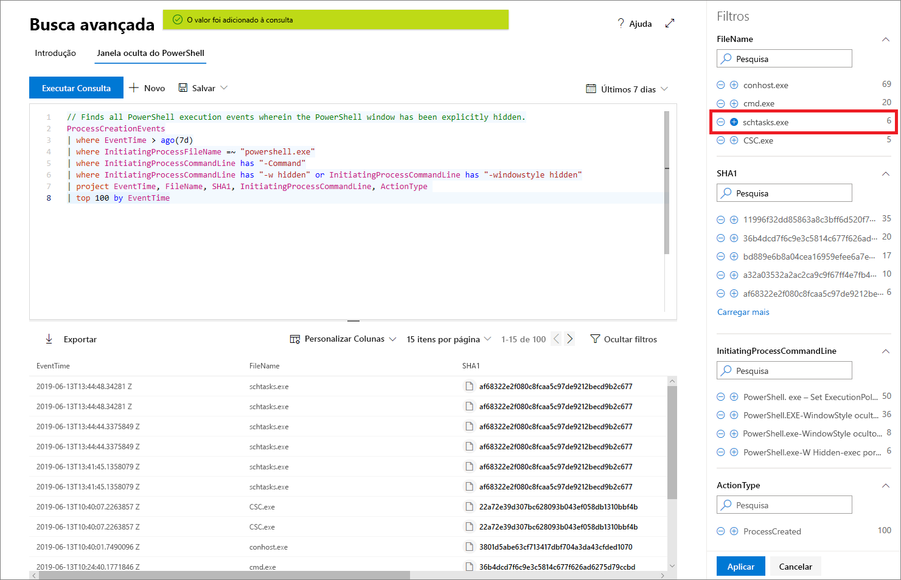

# Faça buscas proativas por ameaças com a busca avançada da Proteção contra Ameaças da Microsoft

**Aplica-se a:**
- Proteção contra Ameaças da Microsoft

[!include[Prerelease information](prerelease.md)]

A busca avançada é uma ferramenta de busca de ameaças baseada em consultas que permite explorar até 30 dias de dados brutos. Você pode inspecionar proativamente os eventos na sua rede para localizar indicadores e entidades interessantes. O acesso flexível aos dados facilita a busca irrestrita por ameaças potenciais e conhecidas.

No Centro de segurança do Microsoft 365, a busca avançada é compatível com consultas que examinam dados no Microsoft Defender ATP, abrangendo dados de dispositivos integrados e o Office 365 ATP, fornecendo dados de emails. Para usar a busca avançada, é necessário [habilitar a Proteção contra Ameaças da Microsoft](mtp-enable.md).

## Introdução à busca avançada

Recomendamos que você execute várias etapas para começar a trabalhar rapidamente com a busca avançada.

| Meta de aprendizagem | Descrição | Recurso |
|--|--|--|
| **Ver qual seria a linguagem** | A busca avançada se baseia na [linguagem de consulta Kusto](https://docs.microsoft.com/azure/kusto/query/), que oferece suporte à mesma sintaxe e operadores. Comece a aprender a linguagem de consulta executando a primeira consulta. | [Visão geral sobre a linguagem de consulta](advanced-hunting-query-language.md) |
| **Compreender o esquema** | Obtenha uma compreensão de alto nível das tabelas no esquema e em suas colunas. Isso ajuda a determinar onde procurar dados e como construir suas consultas. | [Referência de esquema](advanced-hunting-schema-tables.md) |
| **Usar consultas predefinidas** | Explore coleções de consultas predefinidas que abrangem diferentes cenários de exploração de ameaças. | [Usar consultas compartilhadas](advanced-hunting-shared-queries.md)
| **Otimizar consultas** | Saiba como criar consultas eficientes e que combinem dados de emails e dispositivos. | [Práticas recomendadas de consulta](advanced-hunting-shared-queries.md), [Busca em dispositivos e emails](advanced-hunting-best-practices.md)

## Obter ajuda durante a criação de consultas
Aproveite as funcionalidades a seguir para escrever rapidamente as consultas:
- **Sugestão automática** — conforme você faz a consulta, a busca avançada fornece sugestões. 
- **Referência de esquema** — inclui a lista de tabelas e suas colunas ao lado da área de trabalho. Para saber mais, passe o mouse sobre um item. Clique duas vezes em um item para inseri-lo no editor de consultas.

## Detalhamento dos resultados da consulta
Para ver em seus resultados de consulta mais informações sobre entidades, como máquinas, arquivos, usuários, endereços IP e URLs, simplesmente clique no identificador de entidade. Isso abre uma página de perfil detalhada para a entidade selecionada no Central de Segurança do Microsoft Defender.

## Ajustar consultas a partir dos resultados
Clique com o botão direito do mouse em um valor no conjunto de resultados para aprimorar rapidamente a consulta. Você pode usar as opções para:

- Procurar explicitamente pelo valor selecionado (`==`)
- Excluir o valor selecionado da consulta (`!=`)
- Obter operadores mais avançados para adicionar o valor à sua consulta, como `contains`, `starts with` e `ends with` 

## Filtrar os resultados da consulta
Os filtros exibidos à direita fornecem um resumo do conjunto de resultados. Cada coluna tem sua própria seção, que lista os valores distintos encontrados para essa coluna e o número de instâncias.

Refine a consulta selecionando os botões "+" ou "-" nos valores que você deseja incluir ou excluir e selecione **Executar consulta**.

Depois de aplicar o filtro para modificar e executar a consulta, os resultados serão atualizados de acordo.

## Tópicos relacionados
- [Aprender a linguagem de consulta](advanced-hunting-query-language.md)
- [Usar consultas compartilhadas](advanced-hunting-shared-queries.md)
- [Buscar por ameaças em dispositivos e emails](advanced-hunting-query-emails-devices.md)
- [Compreender o esquema](advanced-hunting-schema-tables.md)
- [Aplicar práticas recomendadas de consulta](advanced-hunting-best-practices.md)