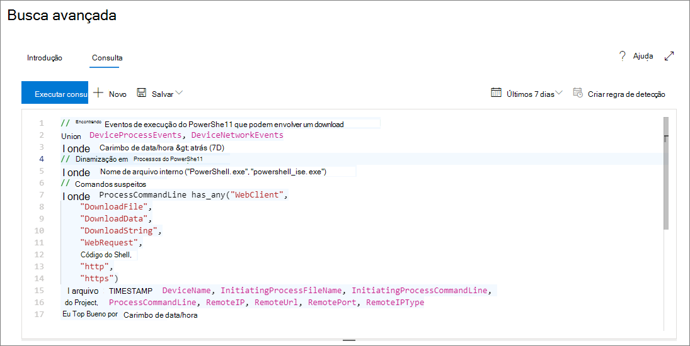
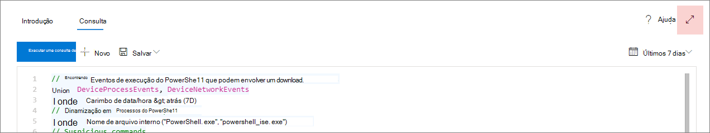

# <a name="learn-the-advanced-hunting-query-language"></a><span data-ttu-id="d7795-104">Conhecer a linguagem de consulta de busca avançada</span><span class="sxs-lookup"><span data-stu-id="d7795-104">Learn the advanced hunting query language</span></span>

[!INCLUDE [Microsoft 365 Defender rebranding](../includes/microsoft-defender.md)]


<span data-ttu-id="d7795-105">**Aplica-se a:**</span><span class="sxs-lookup"><span data-stu-id="d7795-105">**Applies to:**</span></span>
- <span data-ttu-id="d7795-106">Proteção contra Ameaças da Microsoft</span><span class="sxs-lookup"><span data-stu-id="d7795-106">Microsoft Threat Protection</span></span>

<span data-ttu-id="d7795-107">A caça avançada baseia-se na [linguagem de consulta Kusto](https://docs.microsoft.com/azure/kusto/query/).</span><span class="sxs-lookup"><span data-stu-id="d7795-107">Advanced hunting is based on the [Kusto query language](https://docs.microsoft.com/azure/kusto/query/).</span></span> <span data-ttu-id="d7795-108">Você pode usar a sintaxe e os operadores Kusto para construir consultas que localizem informações no [esquema](advanced-hunting-schema-tables.md) especificamente estruturadas para a pesquisa avançada.</span><span class="sxs-lookup"><span data-stu-id="d7795-108">You can use Kusto syntax and operators to construct queries that locate information in the [schema](advanced-hunting-schema-tables.md) specifically structured for advanced hunting.</span></span> <span data-ttu-id="d7795-109">Para entender melhor esses conceitos, execute a primeira consulta.</span><span class="sxs-lookup"><span data-stu-id="d7795-109">To understand these concepts better, run your first query.</span></span>

## <a name="try-your-first-query"></a><span data-ttu-id="d7795-110">Experimente a primeira consulta</span><span class="sxs-lookup"><span data-stu-id="d7795-110">Try your first query</span></span>

<span data-ttu-id="d7795-111">No centro de segurança do Microsoft 365, vá para a **busca** para executar a primeira consulta.</span><span class="sxs-lookup"><span data-stu-id="d7795-111">In Microsoft 365 security center, go to **Hunting** to run your first query.</span></span> <span data-ttu-id="d7795-112">Use o seguinte exemplo:</span><span class="sxs-lookup"><span data-stu-id="d7795-112">Use the following example:</span></span>

```kusto
// Finds PowerShell execution events that could involve a download
union DeviceProcessEvents, DeviceNetworkEvents
| where Timestamp > ago(7d)
// Pivoting on PowerShell processes
| where FileName in~ ("powershell.exe", "powershell_ise.exe")
// Suspicious commands
| where ProcessCommandLine has_any("WebClient",
 "DownloadFile",
 "DownloadData",
 "DownloadString",
"WebRequest",
"Shellcode",
"http",
"https")
| project Timestamp, DeviceName, InitiatingProcessFileName, InitiatingProcessCommandLine, 
FileName, ProcessCommandLine, RemoteIP, RemoteUrl, RemotePort, RemoteIPType
| top 100 by Timestamp
```

<span data-ttu-id="d7795-113">Esta é a aparência do aspecto da pesquisa avançada.</span><span class="sxs-lookup"><span data-stu-id="d7795-113">This is how it will look like in advanced hunting.</span></span>



### <a name="describe-the-query-and-specify-the-tables-to-search"></a><span data-ttu-id="d7795-115">Descrever a consulta e especificar as tabelas a serem pesquisadas</span><span class="sxs-lookup"><span data-stu-id="d7795-115">Describe the query and specify the tables to search</span></span>
<span data-ttu-id="d7795-116">Um breve comentário foi adicionado ao início da consulta para descrever o que ele é.</span><span class="sxs-lookup"><span data-stu-id="d7795-116">A short comment has been added to the beginning of the query to describe what it is for.</span></span> <span data-ttu-id="d7795-117">Isso ajudará se você decidir salvar a consulta mais tarde e compartilhá-la com outras pessoas em sua organização.</span><span class="sxs-lookup"><span data-stu-id="d7795-117">This helps if you later decide to save the query and share it with others in your organization.</span></span> 

```kusto
// Finds PowerShell execution events that could involve a download
```

<span data-ttu-id="d7795-118">A consulta em si geralmente começará com um nome de tabela seguido de uma série de elementos iniciados por um pipe (`|`).</span><span class="sxs-lookup"><span data-stu-id="d7795-118">The query itself will typically start with a table name followed by a series of elements started by a pipe (`|`).</span></span> <span data-ttu-id="d7795-119">Neste exemplo, começamos criando uma União de duas tabelas  `DeviceProcessEvents` e `DeviceNetworkEvents` , e adicionar elementos canalizados, conforme necessário.</span><span class="sxs-lookup"><span data-stu-id="d7795-119">In this example, we start by creating a union of two tables,  `DeviceProcessEvents` and `DeviceNetworkEvents`, and add piped elements as needed.</span></span>

```kusto
union DeviceProcessEvents, DeviceNetworkEvents
```
### <a name="set-the-time-range"></a><span data-ttu-id="d7795-120">Definir o intervalo de tempo</span><span class="sxs-lookup"><span data-stu-id="d7795-120">Set the time range</span></span>
<span data-ttu-id="d7795-121">O primeiro elemento canalizado é um filtro de tempo com escopo para os sete dias anteriores.</span><span class="sxs-lookup"><span data-stu-id="d7795-121">The first piped element is a time filter scoped to the previous seven days.</span></span> <span data-ttu-id="d7795-122">Manter o intervalo de tempo tão estreito quanto possível garante que as consultas sejam executadas, retornem resultados gerenciáveis e não o tempo limite.</span><span class="sxs-lookup"><span data-stu-id="d7795-122">Keeping the time range as narrow as possible ensures that queries perform well, return manageable results, and don't time out.</span></span>

```kusto
| where Timestamp > ago(7d)
```

### <a name="check-specific-processes"></a><span data-ttu-id="d7795-123">Verificar processos específicos</span><span class="sxs-lookup"><span data-stu-id="d7795-123">Check specific processes</span></span>
<span data-ttu-id="d7795-124">O intervalo de tempo é imediatamente seguido por uma pesquisa por nomes de arquivo de processo que representam o aplicativo PowerShell.</span><span class="sxs-lookup"><span data-stu-id="d7795-124">The time range is immediately followed by a search for process file names representing the PowerShell application.</span></span>

```kusto
// Pivoting on PowerShell processes
| where FileName in~ ("powershell.exe", "powershell_ise.exe")
```

### <a name="search-for-specific-command-strings"></a><span data-ttu-id="d7795-125">Procurar cadeias de caracteres de comando específicas</span><span class="sxs-lookup"><span data-stu-id="d7795-125">Search for specific command strings</span></span>
<span data-ttu-id="d7795-126">Posteriormente, a consulta procura por cadeias de caracteres em linhas de comando que normalmente são usadas para baixar arquivos usando o PowerShell.</span><span class="sxs-lookup"><span data-stu-id="d7795-126">Afterwards, the query looks for strings in command lines that are typically used to download files using PowerShell.</span></span>

```kusto
// Suspicious commands
| where ProcessCommandLine has_any("WebClient",
    "DownloadFile",
    "DownloadData",
    "DownloadString",
    "WebRequest",
    "Shellcode",
    "http",
    "https")
```

### <a name="customize-result-columns-and-length"></a><span data-ttu-id="d7795-127">Personalizar colunas e comprimento do resultado</span><span class="sxs-lookup"><span data-stu-id="d7795-127">Customize result columns and length</span></span> 
<span data-ttu-id="d7795-128">Agora que a consulta identifique claramente os dados que você deseja localizar, você pode adicionar elementos que definem a aparência dos resultados.</span><span class="sxs-lookup"><span data-stu-id="d7795-128">Now that your query clearly identifies the data you want to locate, you can add elements that define what the results look like.</span></span> <span data-ttu-id="d7795-129">`project` retorna colunas específicas e `top` limita o número de resultados.</span><span class="sxs-lookup"><span data-stu-id="d7795-129">`project` returns specific columns, and `top` limits the number of results.</span></span> <span data-ttu-id="d7795-130">Esses operadores ajudam a garantir que os resultados sejam bem formatados e razoavelmente grandes e fáceis de processar.</span><span class="sxs-lookup"><span data-stu-id="d7795-130">These operators help ensure the results are well-formatted and reasonably large and easy to process.</span></span>

```kusto
| project Timestamp, DeviceName, InitiatingProcessFileName, InitiatingProcessCommandLine, 
FileName, ProcessCommandLine, RemoteIP, RemoteUrl, RemotePort, RemoteIPType
| top 100 by Timestamp
```

<span data-ttu-id="d7795-131">Clique **executar consulta** para ver os resultados.</span><span class="sxs-lookup"><span data-stu-id="d7795-131">Click **Run query** to see the results.</span></span> <span data-ttu-id="d7795-132">Selecione o ícone de expansão no canto superior direito do editor de consulta para se concentrar na consulta de busca e nos resultados.</span><span class="sxs-lookup"><span data-stu-id="d7795-132">Select the expand icon at the top right of the query editor to focus on your hunting query and the results.</span></span> 



>[!TIP]
><span data-ttu-id="d7795-134">Você pode exibir os resultados da consulta como gráficos e ajustar rapidamente os filtros.</span><span class="sxs-lookup"><span data-stu-id="d7795-134">You can view query results as charts and quickly adjust filters.</span></span> <span data-ttu-id="d7795-135">Para obter orientação, [Leia sobre como trabalhar com os resultados da consulta](advanced-hunting-query-results.md)</span><span class="sxs-lookup"><span data-stu-id="d7795-135">For guidance, [read about working with query results](advanced-hunting-query-results.md)</span></span>

## <a name="learn-common-query-operators"></a><span data-ttu-id="d7795-136">Aprender operadores de consulta comuns</span><span class="sxs-lookup"><span data-stu-id="d7795-136">Learn common query operators</span></span>

<span data-ttu-id="d7795-137">Agora que você executou a primeira consulta e tem uma ideia geral dos seus componentes, chegou a hora de recapitular um pouco e aprender algumas noções básicas.</span><span class="sxs-lookup"><span data-stu-id="d7795-137">Now that you've run your first query and have a general idea of its components, it's time to backtrack a little bit and learn some basics.</span></span> <span data-ttu-id="d7795-138">A linguagem de consulta Kusto usada por caça avançada oferece suporte a vários operadores, incluindo os seguintes.</span><span class="sxs-lookup"><span data-stu-id="d7795-138">The Kusto query language used by advanced hunting supports a range of operators, including the following common ones.</span></span>

| <span data-ttu-id="d7795-139">Operador</span><span class="sxs-lookup"><span data-stu-id="d7795-139">Operator</span></span> | <span data-ttu-id="d7795-140">Descrição e uso</span><span class="sxs-lookup"><span data-stu-id="d7795-140">Description and usage</span></span> |
|--|--|
| `where` | <span data-ttu-id="d7795-141">Filtre uma tabela no subconjunto de linhas que atendem a um predicado.</span><span class="sxs-lookup"><span data-stu-id="d7795-141">Filter a table to the subset of rows that satisfy a predicate.</span></span> |
| `summarize` | <span data-ttu-id="d7795-142">Produza uma tabela que agrega o conteúdo da tabela de entrada.</span><span class="sxs-lookup"><span data-stu-id="d7795-142">Produce a table that aggregates the content of the input table.</span></span> |
| `join` | <span data-ttu-id="d7795-143">Mescle as linhas de duas tabelas para formar uma nova tabela, correspondendo valores das colunas especificadas de cada tabela.</span><span class="sxs-lookup"><span data-stu-id="d7795-143">Merge the rows of two tables to form a new table by matching values of the specified column(s) from each table.</span></span> |
| `count` | <span data-ttu-id="d7795-144">Retorne o número de registros no conjunto de registros de entrada.</span><span class="sxs-lookup"><span data-stu-id="d7795-144">Return the number of records in the input record set.</span></span> |
| `top` | <span data-ttu-id="d7795-145">Retorne os primeiros registros N classificados pelas colunas especificadas.</span><span class="sxs-lookup"><span data-stu-id="d7795-145">Return the first N records sorted by the specified columns.</span></span> |
| `limit` | <span data-ttu-id="d7795-146">Retornar para o número especificado de linhas.</span><span class="sxs-lookup"><span data-stu-id="d7795-146">Return up to the specified number of rows.</span></span> |
| `project` | <span data-ttu-id="d7795-147">Selecione as colunas a serem incluídas, renomear ou descartar e inserir novas colunas computadas.</span><span class="sxs-lookup"><span data-stu-id="d7795-147">Select the columns to include, rename or drop, and insert new computed columns.</span></span> |
| `extend` | <span data-ttu-id="d7795-148">Crie colunas calculadas e as acrescente ao conjunto de resultados.</span><span class="sxs-lookup"><span data-stu-id="d7795-148">Create calculated columns and append them to the result set.</span></span> |
| `makeset` |  <span data-ttu-id="d7795-149">Retornar uma matriz dinâmica (JSON) do conjunto de valores distintos que Expr assume no grupo.</span><span class="sxs-lookup"><span data-stu-id="d7795-149">Return a dynamic (JSON) array of the set of distinct values that Expr takes in the group.</span></span> |
| `find` | <span data-ttu-id="d7795-150">Localizar linhas que correspondam a um predicado em um conjunto de tabelas.</span><span class="sxs-lookup"><span data-stu-id="d7795-150">Find rows that match a predicate across a set of tables.</span></span> |

<span data-ttu-id="d7795-151">Para ver um exemplo instantâneo desses operadores, execute-os na seção **começar**, na caça avançada.</span><span class="sxs-lookup"><span data-stu-id="d7795-151">To see a live example of these operators, run them from the **Get started** section in advanced hunting.</span></span>

## <a name="understand-data-types"></a><span data-ttu-id="d7795-152">Entender tipos de dados</span><span class="sxs-lookup"><span data-stu-id="d7795-152">Understand data types</span></span>

<span data-ttu-id="d7795-153">Os dados em tabelas de caça avançada geralmente são classificados nos seguintes tipos de dados.</span><span class="sxs-lookup"><span data-stu-id="d7795-153">Data in advanced hunting tables are generally classified into the following data types.</span></span>

| <span data-ttu-id="d7795-154">Tipo de dados</span><span class="sxs-lookup"><span data-stu-id="d7795-154">Data type</span></span> | <span data-ttu-id="d7795-155">Implicações de descrição e de consulta</span><span class="sxs-lookup"><span data-stu-id="d7795-155">Description and query implications</span></span> |
|--|--|
| `datetime` | <span data-ttu-id="d7795-156">As informações de dados e hora geralmente representam os carimbos de data/hora</span><span class="sxs-lookup"><span data-stu-id="d7795-156">Data and time information typically representing event timestamps</span></span> |
| `string` | <span data-ttu-id="d7795-157">Conjunto de caracteres</span><span class="sxs-lookup"><span data-stu-id="d7795-157">Character string</span></span> |
| `bool` | <span data-ttu-id="d7795-158">Verdadeiro ou falso</span><span class="sxs-lookup"><span data-stu-id="d7795-158">True or false</span></span> |
| `int` | <span data-ttu-id="d7795-159">valor numérico de bits de 32</span><span class="sxs-lookup"><span data-stu-id="d7795-159">32-bit numeric value</span></span>  |
| `long` | <span data-ttu-id="d7795-160">valor numérico de bits de 64</span><span class="sxs-lookup"><span data-stu-id="d7795-160">64-bit numeric value</span></span> |

<span data-ttu-id="d7795-161">Para saber mais sobre esses tipos de dados e suas implicações, [Leia sobre os tipos de dados escalares Kusto](https://docs.microsoft.com/azure/data-explorer/kusto/query/scalar-data-types/).</span><span class="sxs-lookup"><span data-stu-id="d7795-161">To learn more about these data types and their implications, [read about Kusto scalar data types](https://docs.microsoft.com/azure/data-explorer/kusto/query/scalar-data-types/).</span></span>

## <a name="get-help-as-you-write-queries"></a><span data-ttu-id="d7795-162">Obter ajuda durante a criação de consultas</span><span class="sxs-lookup"><span data-stu-id="d7795-162">Get help as you write queries</span></span>
<span data-ttu-id="d7795-163">Aproveite as funcionalidades a seguir para escrever rapidamente as consultas:</span><span class="sxs-lookup"><span data-stu-id="d7795-163">Take advantage of the following functionality to write queries faster:</span></span>
- <span data-ttu-id="d7795-164">**Sugestão** automática — à medida que você escreve consultas, a busca avançada fornece sugestões do IntelliSense.</span><span class="sxs-lookup"><span data-stu-id="d7795-164">**Autosuggest** — as you write queries, advanced hunting provides suggestions from IntelliSense.</span></span> 
- <span data-ttu-id="d7795-165">**Árvore de esquema** — uma representação de esquema que inclui a lista de tabelas e suas colunas é fornecida ao lado da área de trabalho.</span><span class="sxs-lookup"><span data-stu-id="d7795-165">**Schema tree** — a schema representation that includes the list of tables and their columns is provided next to your working area.</span></span> <span data-ttu-id="d7795-166">Para saber mais, passe o mouse sobre um item.</span><span class="sxs-lookup"><span data-stu-id="d7795-166">For more information, hover over an item.</span></span> <span data-ttu-id="d7795-167">Clique duas vezes em um item para inseri-lo no editor de consultas.</span><span class="sxs-lookup"><span data-stu-id="d7795-167">Double-click an item to insert it to the query editor.</span></span>
- <span data-ttu-id="d7795-168">**[Referência de esquema](advanced-hunting-schema-tables.md#get-schema-information-in-the-security-center)** : referência no portal com descrições de tabela e coluna, bem como tipos de eventos suportados ( `ActionType` valores) e consultas de exemplo</span><span class="sxs-lookup"><span data-stu-id="d7795-168">**[Schema reference](advanced-hunting-schema-tables.md#get-schema-information-in-the-security-center)** — in-portal reference with table and column descriptions as well as supported event types (`ActionType` values) and sample queries</span></span>

## <a name="work-with-multiple-queries-in-the-editor"></a><span data-ttu-id="d7795-169">Trabalhar com várias consultas no editor</span><span class="sxs-lookup"><span data-stu-id="d7795-169">Work with multiple queries in the editor</span></span>
<span data-ttu-id="d7795-170">O editor de consultas pode servir como o bloco de rascunhos para testar várias consultas.</span><span class="sxs-lookup"><span data-stu-id="d7795-170">The query editor can serve as your scratch pad for experimenting with multiple queries.</span></span> <span data-ttu-id="d7795-171">Para usar várias consultas:</span><span class="sxs-lookup"><span data-stu-id="d7795-171">To use multiple queries:</span></span>

- <span data-ttu-id="d7795-172">Separe cada consulta com uma linha vazia.</span><span class="sxs-lookup"><span data-stu-id="d7795-172">Separate each query with an empty line.</span></span>
- <span data-ttu-id="d7795-173">Coloque o cursor em qualquer parte de uma consulta para selecionar a consulta antes de executá-la.</span><span class="sxs-lookup"><span data-stu-id="d7795-173">Place the cursor on any part of a query to select that query before running it.</span></span> <span data-ttu-id="d7795-174">A consulta selecionada será executada apenas.</span><span class="sxs-lookup"><span data-stu-id="d7795-174">This will run only the selected query.</span></span> <span data-ttu-id="d7795-175">Para executar outra consulta, mova o cursor de acordo e selecione **Executar consulta**.</span><span class="sxs-lookup"><span data-stu-id="d7795-175">To run another query, move the cursor accordingly and select **Run query**.</span></span>


## <a name="use-sample-queries"></a><span data-ttu-id="d7795-177">Use consultas de amostra</span><span class="sxs-lookup"><span data-stu-id="d7795-177">Use sample queries</span></span>

<span data-ttu-id="d7795-178">A seção **introdução** fornece algumas consultas simples usando operadores usados com frequência.</span><span class="sxs-lookup"><span data-stu-id="d7795-178">The **Get started** section provides a few simple queries using commonly used operators.</span></span> <span data-ttu-id="d7795-179">Tente executar essas consultas e faça pequenas modificações nelas.</span><span class="sxs-lookup"><span data-stu-id="d7795-179">Try running these queries and making small modifications to them.</span></span>


>[!NOTE]
><span data-ttu-id="d7795-181">Além das amostras básicas de consulta, você também pode acessar [consultas compartilhadas](advanced-hunting-shared-queries.md) para cenários específicos de busca de ameaças.</span><span class="sxs-lookup"><span data-stu-id="d7795-181">Apart from the basic query samples, you can also access [shared queries](advanced-hunting-shared-queries.md) for specific threat hunting scenarios.</span></span> <span data-ttu-id="d7795-182">Explore as consultas compartilhadas, no lado esquerdo da página ou no repositório de consultas do GitHub.</span><span class="sxs-lookup"><span data-stu-id="d7795-182">Explore the shared queries on the left side of the page or the GitHub query repository.</span></span>

## <a name="access-query-language-documentation"></a><span data-ttu-id="d7795-183">Documentação da linguagem de consulta do Access</span><span class="sxs-lookup"><span data-stu-id="d7795-183">Access query language documentation</span></span>

<span data-ttu-id="d7795-184">Para obter mais informações sobre a linguagem de consulta Kusto e os operadores com suporte, confira [documentação da linguagem de consulta do Kusto](https://docs.microsoft.com/azure/kusto/query/).</span><span class="sxs-lookup"><span data-stu-id="d7795-184">For more information on Kusto query language and supported operators, see [Kusto query language documentation](https://docs.microsoft.com/azure/kusto/query/).</span></span>

## <a name="related-topics"></a><span data-ttu-id="d7795-185">Tópicos relacionados</span><span class="sxs-lookup"><span data-stu-id="d7795-185">Related topics</span></span>
- [<span data-ttu-id="d7795-186">Visão geral da busca avançada</span><span class="sxs-lookup"><span data-stu-id="d7795-186">Advanced hunting overview</span></span>](advanced-hunting-overview.md)
- [<span data-ttu-id="d7795-187">Trabalhar com os resultados da consulta</span><span class="sxs-lookup"><span data-stu-id="d7795-187">Work with query results</span></span>](advanced-hunting-query-results.md)
- [<span data-ttu-id="d7795-188">Usar consultas compartilhadas</span><span class="sxs-lookup"><span data-stu-id="d7795-188">Use shared queries</span></span>](advanced-hunting-shared-queries.md)
- [<span data-ttu-id="d7795-189">Procure em dispositivos, e-mails, aplicativos e identidades</span><span class="sxs-lookup"><span data-stu-id="d7795-189">Hunt across devices, emails, apps, and identities</span></span>](advanced-hunting-query-emails-devices.md)
- [<span data-ttu-id="d7795-190">Compreender o esquema</span><span class="sxs-lookup"><span data-stu-id="d7795-190">Understand the schema</span></span>](advanced-hunting-schema-tables.md)
- [<span data-ttu-id="d7795-191">Aplicar práticas recomendadas de consulta</span><span class="sxs-lookup"><span data-stu-id="d7795-191">Apply query best practices</span></span>](advanced-hunting-best-practices.md)
