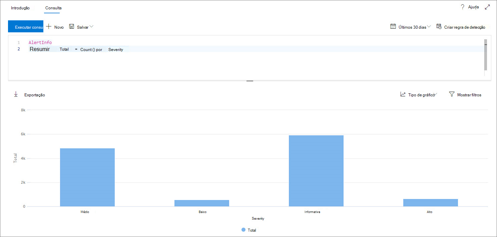
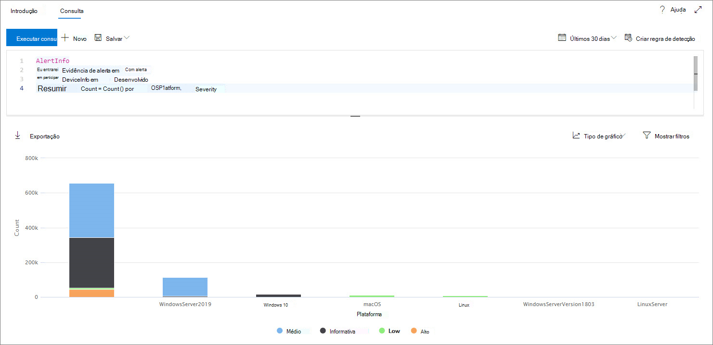
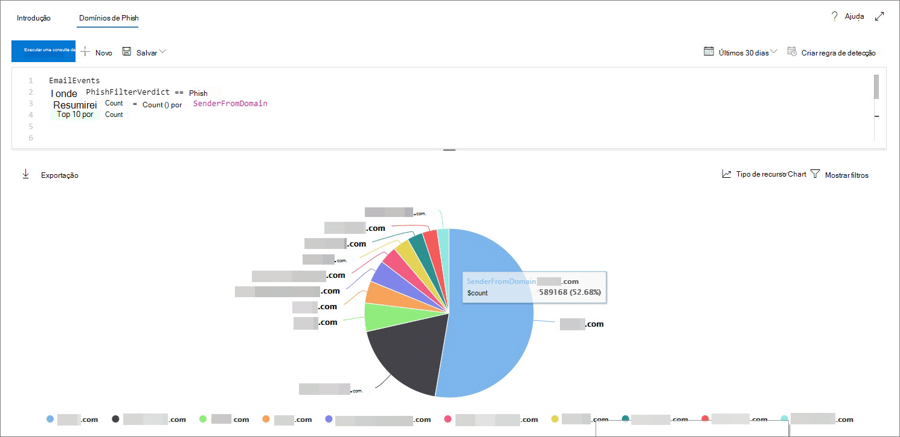
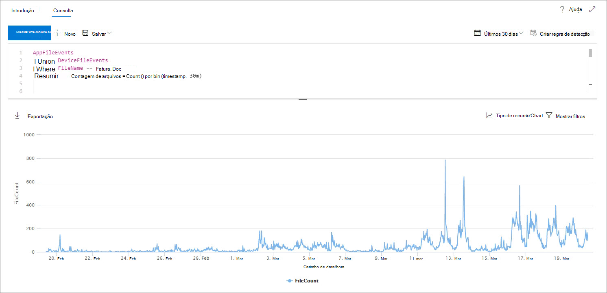

# <a name="work-with-advanced-hunting-query-results"></a><span data-ttu-id="56a45-104">Trabalhar com resultados de consulta de busca avançada</span><span class="sxs-lookup"><span data-stu-id="56a45-104">Work with advanced hunting query results</span></span>

[!INCLUDE [Microsoft 365 Defender rebranding](../includes/microsoft-defender.md)]


<span data-ttu-id="56a45-105">**Aplica-se a:**</span><span class="sxs-lookup"><span data-stu-id="56a45-105">**Applies to:**</span></span>
- <span data-ttu-id="56a45-106">Proteção contra Ameaças da Microsoft</span><span class="sxs-lookup"><span data-stu-id="56a45-106">Microsoft Threat Protection</span></span>

[!INCLUDE [Prerelease information](../includes/prerelease.md)]

<span data-ttu-id="56a45-107">Embora você possa construir suas consultas de [busca avançada](advanced-hunting-overview.md) para retornar informações muito precisas, você também pode trabalhar com os resultados da consulta para obter mais percepção e investigar atividades e indicadores específicos.</span><span class="sxs-lookup"><span data-stu-id="56a45-107">While you can construct your [advanced hunting](advanced-hunting-overview.md) queries to return very precise information, you can also work with the query results to gain further insight and investigate specific activities and indicators.</span></span> <span data-ttu-id="56a45-108">Você pode executar as seguintes ações nos resultados de consulta:</span><span class="sxs-lookup"><span data-stu-id="56a45-108">You can take the following actions on your query results:</span></span>

- <span data-ttu-id="56a45-109">Exibir resultados como uma tabela ou um gráfico</span><span class="sxs-lookup"><span data-stu-id="56a45-109">View results as a table or chart</span></span>
- <span data-ttu-id="56a45-110">Exportar tabelas e gráficos</span><span class="sxs-lookup"><span data-stu-id="56a45-110">Export tables and charts</span></span>
- <span data-ttu-id="56a45-111">Aprofundar nas informações detalhadas da entidade</span><span class="sxs-lookup"><span data-stu-id="56a45-111">Drill down to detailed entity information</span></span>
- <span data-ttu-id="56a45-112">Ajustar suas consultas diretamente dos resultados ou aplicar filtros</span><span class="sxs-lookup"><span data-stu-id="56a45-112">Tweak your queries directly from the results or apply filters</span></span>

## <a name="view-query-results-as-a-table-or-chart"></a><span data-ttu-id="56a45-113">Exibir resultados de consulta como uma tabela ou um gráfico</span><span class="sxs-lookup"><span data-stu-id="56a45-113">View query results as a table or chart</span></span>
<span data-ttu-id="56a45-114">Por padrão, a busca avançada exibe resultados de consulta como dados tabulares.</span><span class="sxs-lookup"><span data-stu-id="56a45-114">By default, advanced hunting displays query results as tabular data.</span></span> <span data-ttu-id="56a45-115">Você também pode exibir os mesmos dados de um gráfico.</span><span class="sxs-lookup"><span data-stu-id="56a45-115">You can also display the same data as a chart.</span></span> <span data-ttu-id="56a45-116">A busca avançada é compatível com os seguintes modos de exibição:</span><span class="sxs-lookup"><span data-stu-id="56a45-116">Advanced hunting supports the following views:</span></span>

| <span data-ttu-id="56a45-117">Tipo de modo de exibição</span><span class="sxs-lookup"><span data-stu-id="56a45-117">View type</span></span> | <span data-ttu-id="56a45-118">Descrição</span><span class="sxs-lookup"><span data-stu-id="56a45-118">Description</span></span> |
| -- | -- |
| <span data-ttu-id="56a45-119">**Table**</span><span class="sxs-lookup"><span data-stu-id="56a45-119">**Table**</span></span> | <span data-ttu-id="56a45-120">Exibe os resultados da consulta no formato de tabela</span><span class="sxs-lookup"><span data-stu-id="56a45-120">Displays the query results in tabular format</span></span> |
| <span data-ttu-id="56a45-121">**Gráfico de colunas**</span><span class="sxs-lookup"><span data-stu-id="56a45-121">**Column chart**</span></span> | <span data-ttu-id="56a45-122">Renderiza uma série de itens exclusivos no eixo x como barras verticais cujas alturas representam valores numéricos de outro campo</span><span class="sxs-lookup"><span data-stu-id="56a45-122">Renders a series of unique items on the x-axis as vertical bars whose heights represent numeric values from another field</span></span> |
| <span data-ttu-id="56a45-123">**Gráfico de colunas empilhadas**</span><span class="sxs-lookup"><span data-stu-id="56a45-123">**Stacked column chart**</span></span> | <span data-ttu-id="56a45-124">Renderiza uma série de itens exclusivos no eixo x como barras verticais empilhadas cujas alturas representam valores numéricos de um ou mais campos</span><span class="sxs-lookup"><span data-stu-id="56a45-124">Renders a series of unique items on the x-axis as stacked vertical bars whose heights represent numeric values from one or more other fields</span></span> |
| <span data-ttu-id="56a45-125">**Gráfico de pizza**</span><span class="sxs-lookup"><span data-stu-id="56a45-125">**Pie chart**</span></span> | <span data-ttu-id="56a45-126">Renderiza tortas de seção que representam itens exclusivos.</span><span class="sxs-lookup"><span data-stu-id="56a45-126">Renders sectional pies representing unique items.</span></span> <span data-ttu-id="56a45-127">O tamanho de cada pizza representa valores numéricos de outro campo.</span><span class="sxs-lookup"><span data-stu-id="56a45-127">The size of each pie represents numeric values from another field.</span></span> |
| <span data-ttu-id="56a45-128">**Gráfico de rosca**</span><span class="sxs-lookup"><span data-stu-id="56a45-128">**Donut chart**</span></span> | <span data-ttu-id="56a45-129">Renderiza arcos de seção que representam itens exclusivos.</span><span class="sxs-lookup"><span data-stu-id="56a45-129">Renders sectional arcs representing unique items.</span></span> <span data-ttu-id="56a45-130">O comprimento de cada arco representa valores numéricos de outro campo.</span><span class="sxs-lookup"><span data-stu-id="56a45-130">The length of each arc represents numeric values from another field.</span></span> |
| <span data-ttu-id="56a45-131">**Gráfico de linhas**</span><span class="sxs-lookup"><span data-stu-id="56a45-131">**Line chart**</span></span> | <span data-ttu-id="56a45-132">Plota valores numéricos para uma série de itens exclusivos e conecta os valores plotados</span><span class="sxs-lookup"><span data-stu-id="56a45-132">Plots numeric values for a series of unique items and connects the plotted values</span></span> |
| <span data-ttu-id="56a45-133">**Gráfico de dispersão**</span><span class="sxs-lookup"><span data-stu-id="56a45-133">**Scatter chart**</span></span> | <span data-ttu-id="56a45-134">Plota valores numéricos para uma série de itens exclusivos</span><span class="sxs-lookup"><span data-stu-id="56a45-134">Plots numeric values for a series of unique items</span></span> |
| <span data-ttu-id="56a45-135">**Gráfico de área**</span><span class="sxs-lookup"><span data-stu-id="56a45-135">**Area chart**</span></span> | <span data-ttu-id="56a45-136">Plota valores numéricos para uma série de itens exclusivos e preenche as seções abaixo dos valores plotados</span><span class="sxs-lookup"><span data-stu-id="56a45-136">Plots numeric values for a series of unique items and fills the sections below the plotted values</span></span> |

### <a name="construct-queries-for-effective-charts"></a><span data-ttu-id="56a45-137">Construir consultas para gráficos efetivos</span><span class="sxs-lookup"><span data-stu-id="56a45-137">Construct queries for effective charts</span></span>
<span data-ttu-id="56a45-138">Ao renderizar gráficos, a busca avançada identifica automaticamente as colunas de interesse e os valores numéricos a serem agregados.</span><span class="sxs-lookup"><span data-stu-id="56a45-138">When rendering charts, advanced hunting automatically identifies columns of interest and the numeric values to aggregate.</span></span> <span data-ttu-id="56a45-139">Para obter gráficos significativos, construa suas consultas para retornar os valores específicos que você deseja ver visualizados.</span><span class="sxs-lookup"><span data-stu-id="56a45-139">To get meaningful charts, construct your queries to return the specific values you want to see visualized.</span></span> <span data-ttu-id="56a45-140">Veja algumas consultas de exemplo e os gráficos resultantes.</span><span class="sxs-lookup"><span data-stu-id="56a45-140">Here are some sample queries and the resulting charts.</span></span>

#### <a name="alerts-by-severity"></a><span data-ttu-id="56a45-141">Alertas por severidade</span><span class="sxs-lookup"><span data-stu-id="56a45-141">Alerts by severity</span></span>
<span data-ttu-id="56a45-142">Use o `summarize` operador para obter uma contagem numérica dos valores que você deseja para o gráfico.</span><span class="sxs-lookup"><span data-stu-id="56a45-142">Use the `summarize` operator to obtain a numeric count of the values you want to chart.</span></span> <span data-ttu-id="56a45-143">A consulta abaixo usa o `summarize` operador para obter o número de alertas por severidade.</span><span class="sxs-lookup"><span data-stu-id="56a45-143">The query below uses the `summarize` operator to get the number of alerts by severity.</span></span>

```kusto
AlertInfo
| summarize Total = count() by Severity
```
<span data-ttu-id="56a45-144">Ao renderizar os resultados, um gráfico de colunas exibe cada valor de severidade como uma coluna separada:</span><span class="sxs-lookup"><span data-stu-id="56a45-144">When rendering the results, a column chart displays each severity value as a separate column:</span></span>

<span data-ttu-id="56a45-145">
 *resultados de consulta para alertas por severidade exibido como gráfico de colunas*</span><span class="sxs-lookup"><span data-stu-id="56a45-145">
*Query results for alerts by severity displayed as a column chart*</span></span>

#### <a name="alert-severity-by-operating-system"></a><span data-ttu-id="56a45-146">Severidade de alerta por sistema operacional</span><span class="sxs-lookup"><span data-stu-id="56a45-146">Alert severity by operating system</span></span>
<span data-ttu-id="56a45-147">Você também pode usar o `summarize` operador para preparar resultados para valores de gráfico de vários campos.</span><span class="sxs-lookup"><span data-stu-id="56a45-147">You could also use the `summarize` operator to prepare results for charting values from multiple fields.</span></span> <span data-ttu-id="56a45-148">Por exemplo, talvez você queira entender como as severidades de alerta são distribuídas entre OS sistemas operacionais (SO).</span><span class="sxs-lookup"><span data-stu-id="56a45-148">For example, you might want to understand how alert severities are distributed across operating systems (OS).</span></span> 

<span data-ttu-id="56a45-149">A consulta a seguir usa um `join` operador para extrair informações de so da `DeviceInfo` tabela e, em seguida, usa `summarize` para contar valores em ambas as `OSPlatform` `Severity` colunas:</span><span class="sxs-lookup"><span data-stu-id="56a45-149">The query below uses a `join` operator to pull in OS information from the `DeviceInfo` table, and then uses `summarize` to count values in both the `OSPlatform` and `Severity` columns:</span></span>

```kusto
AlertInfo
| join AlertEvidence on AlertId
| join DeviceInfo on DeviceId
| summarize Count = count() by OSPlatform, Severity 
```
<span data-ttu-id="56a45-150">Esses resultados são mais visualizados usando um gráfico de colunas empilhadas:</span><span class="sxs-lookup"><span data-stu-id="56a45-150">These results are best visualized using a stacked column chart:</span></span>

<span data-ttu-id="56a45-151">
 *resultados de consulta para alertas por sistema operacional e severidade exibidos como um gráfico empilhado*</span><span class="sxs-lookup"><span data-stu-id="56a45-151">
*Query results for alerts by OS and severity displayed as a stacked chart*</span></span>

#### <a name="phishing-emails-across-top-ten-sender-domains"></a><span data-ttu-id="56a45-152">Emails de phishing nos dez principais domínios de remetente</span><span class="sxs-lookup"><span data-stu-id="56a45-152">Phishing emails across top ten sender domains</span></span>
<span data-ttu-id="56a45-153">Se você estiver lidando com uma lista de valores que não é finito, você pode usar o `Top` operador para apenas o gráfico os valores com a maioria das instâncias.</span><span class="sxs-lookup"><span data-stu-id="56a45-153">If you're dealing with a list of values that isn’t finite, you can use the `Top` operator to chart only the values with the most instances.</span></span> <span data-ttu-id="56a45-154">Por exemplo, para obter os dez principais domínios de remetente com a maioria dos emails de phishing, use a consulta abaixo:</span><span class="sxs-lookup"><span data-stu-id="56a45-154">For example, to get the top ten sender domains with the most phishing emails, use the query below:</span></span>

```kusto
EmailEvents
| where PhishFilterVerdict == "Phish"
| summarize Count = count() by SenderFromDomain
| top 10 by Count
```
<span data-ttu-id="56a45-155">Use o modo de exibição gráfico de pizza para mostrar efetivamente a distribuição nos principais domínios:</span><span class="sxs-lookup"><span data-stu-id="56a45-155">Use the pie chart view to effectively show distribution across the top domains:</span></span>

<span data-ttu-id="56a45-156">
 *mostrando distribuição de emails de phishing nos principais domínios de remetente*</span><span class="sxs-lookup"><span data-stu-id="56a45-156">
*Pie chart showing distribution of phishing emails across top sender domains*</span></span>

#### <a name="file-activities-over-time"></a><span data-ttu-id="56a45-157">Atividades de arquivo ao longo do tempo</span><span class="sxs-lookup"><span data-stu-id="56a45-157">File activities over time</span></span>
<span data-ttu-id="56a45-158">Usando o `summarize` operador com a `bin()` função, você pode verificar se há eventos que envolvem um indicador específico ao longo do tempo.</span><span class="sxs-lookup"><span data-stu-id="56a45-158">Using the `summarize` operator with the `bin()` function, you can check for events involving a particular indicator over time.</span></span> <span data-ttu-id="56a45-159">A consulta abaixo conta os eventos que envolvem o arquivo `invoice.doc` em intervalos de 30 minutos para mostrar picos de atividade relacionadas a esse arquivo:</span><span class="sxs-lookup"><span data-stu-id="56a45-159">The query below counts events involving the file `invoice.doc` at 30 minute intervals to show spikes in activity related to that file:</span></span>

```kusto
AppFileEvents
| union DeviceFileEvents
| where FileName == "invoice.doc"
| summarize FileCount = count() by bin(Timestamp, 30m)
```
<span data-ttu-id="56a45-160">O gráfico de linhas abaixo realça claramente os períodos de tempo com mais atividade envolvendo `invoice.doc` :</span><span class="sxs-lookup"><span data-stu-id="56a45-160">The line chart below clearly highlights time periods with more activity involving `invoice.doc`:</span></span> 

<span data-ttu-id="56a45-161">
 *mostrando o número de eventos que envolvem um arquivo ao longo do tempo*</span><span class="sxs-lookup"><span data-stu-id="56a45-161">
*Line chart showing the number of events involving a file over time*</span></span>


## <a name="export-tables-and-charts"></a><span data-ttu-id="56a45-162">Exportar tabelas e gráficos</span><span class="sxs-lookup"><span data-stu-id="56a45-162">Export tables and charts</span></span>
<span data-ttu-id="56a45-163">Após executar uma consulta, selecione **Exportar** para salvar os resultados no arquivo local.</span><span class="sxs-lookup"><span data-stu-id="56a45-163">After running a query, select **Export** to save the results to local file.</span></span> <span data-ttu-id="56a45-164">O modo de exibição escolhido determina como os resultados são exportados:</span><span class="sxs-lookup"><span data-stu-id="56a45-164">Your chosen view determines how the results are exported:</span></span>

- <span data-ttu-id="56a45-165">**Modo de exibição de tabela** : os resultados da consulta são exportados no formato tabular como uma pasta de trabalho do Microsoft Excel</span><span class="sxs-lookup"><span data-stu-id="56a45-165">**Table view** — the query results are exported in tabular form as a Microsoft Excel workbook</span></span>
- <span data-ttu-id="56a45-166">**Qualquer gráfico** — os resultados da consulta são exportados como uma imagem JPEG do gráfico renderizado</span><span class="sxs-lookup"><span data-stu-id="56a45-166">**Any chart** — the query results are exported as a JPEG image of the rendered chart</span></span>

## <a name="drill-down-from-query-results"></a><span data-ttu-id="56a45-167">Aprofundar a partir de resultados de consulta</span><span class="sxs-lookup"><span data-stu-id="56a45-167">Drill down from query results</span></span>
<span data-ttu-id="56a45-168">Para inspecionar rapidamente um registro em seus resultados de consulta, selecione a linha correspondente para abrir o painel **inspecionar registro** .</span><span class="sxs-lookup"><span data-stu-id="56a45-168">To quickly inspect a record in your query results, select the corresponding row to open the **Inspect record** panel.</span></span> <span data-ttu-id="56a45-169">O painel fornece as seguintes informações com base no registro selecionado:</span><span class="sxs-lookup"><span data-stu-id="56a45-169">The panel provides the following information based on the selected record:</span></span>

- <span data-ttu-id="56a45-170">**Ativos** : exibição resumida dos principais ativos (caixas de correio, dispositivos e usuários) encontrados no registro, aprimoradas com informações disponíveis, como níveis de risco e exposição</span><span class="sxs-lookup"><span data-stu-id="56a45-170">**Assets** — summarized view of the main assets (mailboxes, devices, and users) found in the record, enriched with available information, such as risk and exposure levels</span></span>
- <span data-ttu-id="56a45-171">**Árvore de processo** — gerada para registros com informações de processo e aprimoradas usando informações contextuais disponíveis; em geral, as consultas que retornam mais colunas podem resultar em árvores de processo mais ricas.</span><span class="sxs-lookup"><span data-stu-id="56a45-171">**Process tree** — generated for records with process information and enriched using available contextual information; in general, queries that return more columns can result in richer process trees.</span></span>
- <span data-ttu-id="56a45-172">**Todos os detalhes** — todos os valores das colunas no registro</span><span class="sxs-lookup"><span data-stu-id="56a45-172">**All details** — all the values from the columns in the record</span></span>  


<span data-ttu-id="56a45-174">Para exibir mais informações sobre uma entidade específica em seus resultados de consulta, como um computador, arquivo, usuário, endereço IP ou URL, selecione o identificador de entidade para abrir uma página de perfil detalhada para essa entidade.</span><span class="sxs-lookup"><span data-stu-id="56a45-174">To view more information about a specific entity in your query results, such as a machine, file, user, IP address, or URL, select the entity identifier to open a detailed profile page for that entity.</span></span>

## <a name="tweak-your-queries-from-the-results"></a><span data-ttu-id="56a45-175">Ajustar consultas a partir dos resultados</span><span class="sxs-lookup"><span data-stu-id="56a45-175">Tweak your queries from the results</span></span>
<span data-ttu-id="56a45-176">Clique com o botão direito do mouse em um valor no conjunto de resultados para aprimorar rapidamente a consulta.</span><span class="sxs-lookup"><span data-stu-id="56a45-176">Right-click a value in the result set to quickly enhance your query.</span></span> <span data-ttu-id="56a45-177">Você pode usar as opções para:</span><span class="sxs-lookup"><span data-stu-id="56a45-177">You can use the options to:</span></span>

- <span data-ttu-id="56a45-178">Procurar explicitamente pelo valor selecionado (`==`)</span><span class="sxs-lookup"><span data-stu-id="56a45-178">Explicitly look for the selected value (`==`)</span></span>
- <span data-ttu-id="56a45-179">Excluir o valor selecionado da consulta (`!=`)</span><span class="sxs-lookup"><span data-stu-id="56a45-179">Exclude the selected value from the query (`!=`)</span></span>
- <span data-ttu-id="56a45-180">Obter operadores mais avançados para adicionar o valor à sua consulta, como `contains`, `starts with` e `ends with`</span><span class="sxs-lookup"><span data-stu-id="56a45-180">Get more advanced operators for adding the value to your query, such as `contains`, `starts with` and `ends with`</span></span> 


## <a name="filter-the-query-results"></a><span data-ttu-id="56a45-182">Filtrar os resultados da consulta</span><span class="sxs-lookup"><span data-stu-id="56a45-182">Filter the query results</span></span>
<span data-ttu-id="56a45-183">Os filtros exibidos à direita fornecem um resumo do conjunto de resultados.</span><span class="sxs-lookup"><span data-stu-id="56a45-183">The filters displayed to the right provide a summary of the result set.</span></span> <span data-ttu-id="56a45-184">Cada coluna tem sua própria seção, que lista os valores distintos encontrados para essa coluna e o número de instâncias.</span><span class="sxs-lookup"><span data-stu-id="56a45-184">Each column has its own section that lists the distinct values found for that column and the number of instances.</span></span>

<span data-ttu-id="56a45-185">Refine sua consulta selecionando os `+` `-` botões ou nos valores que você deseja incluir ou excluir e selecionar **Executar consulta**.</span><span class="sxs-lookup"><span data-stu-id="56a45-185">Refine your query by selecting the `+` or `-` buttons on the values that you want to include or exclude and then selecting **Run query**.</span></span>


<span data-ttu-id="56a45-187">Depois de aplicar o filtro para modificar e executar a consulta, os resultados serão atualizados de acordo.</span><span class="sxs-lookup"><span data-stu-id="56a45-187">Once you apply the filter to modify the query and then run the query, the results are updated accordingly.</span></span>

## <a name="related-topics"></a><span data-ttu-id="56a45-188">Tópicos relacionados</span><span class="sxs-lookup"><span data-stu-id="56a45-188">Related topics</span></span>
- [<span data-ttu-id="56a45-189">Visão geral da busca avançada</span><span class="sxs-lookup"><span data-stu-id="56a45-189">Advanced hunting overview</span></span>](advanced-hunting-overview.md)
- [<span data-ttu-id="56a45-190">Aprender a linguagem de consulta</span><span class="sxs-lookup"><span data-stu-id="56a45-190">Learn the query language</span></span>](advanced-hunting-query-language.md)
- [<span data-ttu-id="56a45-191">Usar consultas compartilhadas</span><span class="sxs-lookup"><span data-stu-id="56a45-191">Use shared queries</span></span>](advanced-hunting-shared-queries.md)
- [<span data-ttu-id="56a45-192">Procure em dispositivos, e-mails, aplicativos e identidades</span><span class="sxs-lookup"><span data-stu-id="56a45-192">Hunt across devices, emails, apps, and identities</span></span>](advanced-hunting-query-emails-devices.md)
- [<span data-ttu-id="56a45-193">Compreender o esquema</span><span class="sxs-lookup"><span data-stu-id="56a45-193">Understand the schema</span></span>](advanced-hunting-schema-tables.md)
- [<span data-ttu-id="56a45-194">Aplicar práticas recomendadas de consulta</span><span class="sxs-lookup"><span data-stu-id="56a45-194">Apply query best practices</span></span>](advanced-hunting-best-practices.md)
- [<span data-ttu-id="56a45-195">Visão geral de detecções personalizadas</span><span class="sxs-lookup"><span data-stu-id="56a45-195">Custom detections overview</span></span>](custom-detections-overview.md)
