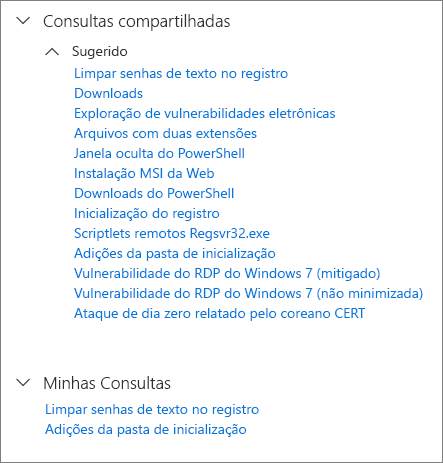
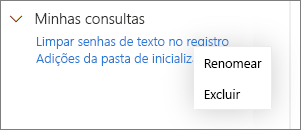

# Usar consultas compartilhadas na busca avançada

**Aplica-se a:**
- Proteção contra Ameaças da Microsoft

[!INCLUDE [Prerelease information](../includes/prerelease.md)]

[Buscas avançadas](advanced-hunting-overview.md) consultas podem ser compartilhadas entre usuários na mesma organização. Você também pode encontrar consultas compartilhadas publicamente no GitHub. Essas consultas permitem que você pesquise rapidamente cenários de busca específica de ameaças sem ter que escrever consultas do zero.

## Salvar, modificar e compartilhar uma consulta
Você pode salvar uma consulta nova ou existente para que ela possa ser acessada ou apenas por você ou então compartilhada com outros usuários em sua organização. 

1. Criar ou modificar uma consulta. 

2. Clique no botão suspenso **Salvar consulta** e selecione **Salvar como**.
    
3. Digite um nome para a consulta. 

   

4. Selecione a pasta em que você deseja salvar a consulta.
    - **Consultas compartilhadas** — compartilhadas com todos os usuários da organização
    - **Minhas consultas** — acessíveis somente para você
    
5. Selecione **Salvar**. 

## Excluir ou renomear uma consulta
1. Clique com o botão direito do mouse em uma consulta que você deseja renomear ou excluir.

    

2. Selecione **Exclua** e confirme a exclusão. Ou selecione **Renomear** e forneça um novo nome para a consulta.

## Acessar consultas no repositório do GitHub  
Os pesquisadores de segurança da Microsoft compartilham regularmente consultas avançadas em um [repositório público designado no GitHub](https://github.com/microsoft/MTP-AHQ). Esse repositório está aberto para a contribuições. Para contribuir, acesse [integrar o GitHub gratuitamente](https://github.com/).

>[!tip]
>Os pesquisadores de segurança da Microsoft também oferecem consultas avançadas para que você possa localizar atividades e indicadores associados a ameaças emergentes. Essas consultas são fornecidas como parte dos relatórios de [análise de ameaças](https://docs.microsoft.com/windows/security/threat-protection/microsoft-defender-atp/threat-analytics) da Central de Segurança do Microsoft Defender.

## Tópicos relacionados
- [Buscar proativamente por ameaças](advanced-hunting-overview.md)
- [Aprender a linguagem de consulta](advanced-hunting-query-language.md)
- [Buscar por ameaças em dispositivos e emails](advanced-hunting-query-emails-devices.md)
- [Compreender o esquema](advanced-hunting-schema-tables.md)
- [Aplicar práticas recomendadas de consulta](advanced-hunting-best-practices.md)