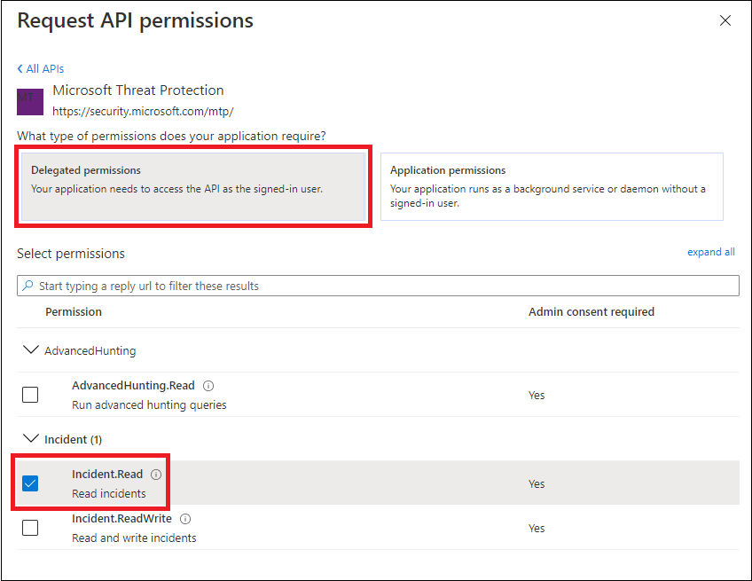

# <a name="access-microsoft-threat-protection-apis-on-behalf-of-user"></a><span data-ttu-id="41ebc-104">Acessar as APIs de proteção contra ameaças da Microsoft em nome do usuário</span><span class="sxs-lookup"><span data-stu-id="41ebc-104">Access Microsoft Threat Protection APIs on behalf of user</span></span>

<span data-ttu-id="41ebc-105">**Aplica-se a:**</span><span class="sxs-lookup"><span data-stu-id="41ebc-105">**Applies to:**</span></span>
- <span data-ttu-id="41ebc-106">Proteção contra Ameaças da Microsoft</span><span class="sxs-lookup"><span data-stu-id="41ebc-106">Microsoft Threat Protection</span></span>

>[!IMPORTANT] 
><span data-ttu-id="41ebc-107">Algumas informações estão relacionadas ao produto já publicado que pode ser modificado substancialmente antes de ser lançado comercialmente.</span><span class="sxs-lookup"><span data-stu-id="41ebc-107">Some information relates to prereleased product which may be substantially modified before it's commercially released.</span></span> <span data-ttu-id="41ebc-108">Microsoft makes no warranties, express or implied, with respect to the information provided here.</span><span class="sxs-lookup"><span data-stu-id="41ebc-108">Microsoft makes no warranties, express or implied, with respect to the information provided here.</span></span>


<span data-ttu-id="41ebc-109">Esta página descreve como criar um aplicativo para obter acesso programático à proteção contra ameaças da Microsoft em nome de um usuário.</span><span class="sxs-lookup"><span data-stu-id="41ebc-109">This page describes how to create an application to get programmatic access to Microsoft Threat Protection on behalf of a user.</span></span>

<span data-ttu-id="41ebc-110">Se você precisar de acesso programático à proteção contra ameaças da Microsoft sem um usuário, consulte [criar um aplicativo para acessar a proteção contra ameaças da Microsoft sem um usuário](api-create-app-web.md).</span><span class="sxs-lookup"><span data-stu-id="41ebc-110">If you need programmatic access Microsoft Threat Protection without a user, refer to [Create an app to access Microsoft Threat Protection without a user](api-create-app-web.md).</span></span>

<span data-ttu-id="41ebc-111">Se você não tiver certeza de qual acesso você precisa, leia as [APIs de proteção contra ameaças da Microsoft](api-access.md).</span><span class="sxs-lookup"><span data-stu-id="41ebc-111">If you are not sure which access you need, read the [Access the Microsoft Threat Protection APIs](api-access.md).</span></span>

<span data-ttu-id="41ebc-112">A proteção contra ameaças da Microsoft expõe muito de seus dados e ações por meio de um conjunto de APIs de programação.</span><span class="sxs-lookup"><span data-stu-id="41ebc-112">Microsoft Threat Protection exposes much of its data and actions through a set of programmatic APIs.</span></span> <span data-ttu-id="41ebc-113">Essas APIs permitirão que você automatize fluxos de trabalho e inovações com base nos recursos de proteção contra ameaças da Microsoft.</span><span class="sxs-lookup"><span data-stu-id="41ebc-113">Those APIs will enable you to automate work flows and innovate based on Microsoft Threat Protection capabilities.</span></span> <span data-ttu-id="41ebc-114">O acesso à API requer autenticação do OAuth 2.0.</span><span class="sxs-lookup"><span data-stu-id="41ebc-114">The API access requires OAuth2.0 authentication.</span></span> <span data-ttu-id="41ebc-115">Para obter mais informações, consulte [fluxo de código de autorização do OAuth 2,0](https://docs.microsoft.com/azure/active-directory/develop/active-directory-v2-protocols-oauth-code).</span><span class="sxs-lookup"><span data-stu-id="41ebc-115">For more information, see [OAuth 2.0 Authorization Code Flow](https://docs.microsoft.com/azure/active-directory/develop/active-directory-v2-protocols-oauth-code).</span></span>

<span data-ttu-id="41ebc-116">Em geral, você precisará executar as seguintes etapas para usar as APIs:</span><span class="sxs-lookup"><span data-stu-id="41ebc-116">In general, you’ll need to take the following steps to use the APIs:</span></span>
- <span data-ttu-id="41ebc-117">Criar um aplicativo AAD</span><span class="sxs-lookup"><span data-stu-id="41ebc-117">Create an AAD application</span></span>
- <span data-ttu-id="41ebc-118">Obter um token de acesso usando este aplicativo</span><span class="sxs-lookup"><span data-stu-id="41ebc-118">Get an access token using this application</span></span>
- <span data-ttu-id="41ebc-119">Usar o token para acessar a API de proteção contra ameaças da Microsoft</span><span class="sxs-lookup"><span data-stu-id="41ebc-119">Use the token to access Microsoft Threat Protection API</span></span>

<span data-ttu-id="41ebc-120">Esta página explica como criar um aplicativo AAD, obter um token de acesso para a proteção contra ameaças da Microsoft e validar o token.</span><span class="sxs-lookup"><span data-stu-id="41ebc-120">This page explains how to create an AAD application, get an access token to Microsoft Threat Protection and validate the token.</span></span>

>[!NOTE]
> <span data-ttu-id="41ebc-121">Ao acessar a API de proteção contra ameaças da Microsoft em nome de um usuário, você precisará da permissão de aplicativo e da permissão de usuário corretas.</span><span class="sxs-lookup"><span data-stu-id="41ebc-121">When accessing Microsoft Threat Protection API on behalf of a user, you will need the correct Application permission and user permission.</span></span>


>[!TIP]
> <span data-ttu-id="41ebc-122">Se você tem a permissão para executar uma ação no portal, você tem a permissão para executar a ação na API.</span><span class="sxs-lookup"><span data-stu-id="41ebc-122">If you have the permission to perform an action in the portal, you have the permission to perform the action in the API.</span></span>

## <a name="create-an-app"></a><span data-ttu-id="41ebc-123">Criar um aplicativo</span><span class="sxs-lookup"><span data-stu-id="41ebc-123">Create an app</span></span>

1. <span data-ttu-id="41ebc-124">Faça logon no [Azure](https://portal.azure.com) com um usuário com função de **administrador global** .</span><span class="sxs-lookup"><span data-stu-id="41ebc-124">Log on to [Azure](https://portal.azure.com) with user that has **Global Administrator** role.</span></span>

2. <span data-ttu-id="41ebc-125">Navegue até registro de aplicativo **do Azure Active Directory**  >  **App registrations**  >  **novo registro**.</span><span class="sxs-lookup"><span data-stu-id="41ebc-125">Navigate to **Azure Active Directory** > **App registrations** > **New registration**.</span></span> 

   

3. <span data-ttu-id="41ebc-127">No registro de, digite as informações a seguir e clique em **registrar**.</span><span class="sxs-lookup"><span data-stu-id="41ebc-127">In the registration from, enter the following information then click **Register**.</span></span>

   

   - <span data-ttu-id="41ebc-129">**Nome:** O nome do aplicativo</span><span class="sxs-lookup"><span data-stu-id="41ebc-129">**Name:** Your application name</span></span>
   - <span data-ttu-id="41ebc-130">**Tipo de aplicativo:** Cliente público</span><span class="sxs-lookup"><span data-stu-id="41ebc-130">**Application type:** Public client</span></span>
   - <span data-ttu-id="41ebc-131">**URI de redirecionamento:**https://portal.azure.com</span><span class="sxs-lookup"><span data-stu-id="41ebc-131">**Redirect URI:** https://portal.azure.com</span></span>

4. <span data-ttu-id="41ebc-132">Para permitir que seu aplicativo acesse a proteção contra ameaças da Microsoft e atribuir permissões de ti, na página do aplicativo, selecione **permissões de API**  >  **Adicionar APIs de permissão**  >  **minha organização usa** >, digite **proteção contra ameaças da Microsoft**e selecione **proteção contra ameaças da Microsoft**.</span><span class="sxs-lookup"><span data-stu-id="41ebc-132">To enable your app to access Microsoft Threat Protection and assign it permissions, on your application page, select **API Permissions** > **Add permission** > **APIs my organization uses** >, type **Microsoft Threat Protection**, and then select **Microsoft Threat Protection**.</span></span>

    >[!NOTE]
    > <span data-ttu-id="41ebc-133">A proteção contra ameaças da Microsoft não aparece na lista original.</span><span class="sxs-lookup"><span data-stu-id="41ebc-133">Microsoft Threat Protection does not appear in the original list.</span></span> <span data-ttu-id="41ebc-134">Você precisa começar a escrever seu nome na caixa de texto para vê-lo aparece.</span><span class="sxs-lookup"><span data-stu-id="41ebc-134">You need to start writing its name in the text box to see it appear.</span></span>

      

    - <span data-ttu-id="41ebc-136">Escolha **permissões delegadas** > escolha as permissões relevantes para o seu cenário, por exemplo, **Incident. Read**e, em seguida, selecione **adicionar permissões**.</span><span class="sxs-lookup"><span data-stu-id="41ebc-136">Choose **Delegated permissions** > Choose the relevant permissions for your scenario, e.g. **Incident.Read**, and then select **Add permissions**.</span></span>

      

     >[!IMPORTANT]
     ><span data-ttu-id="41ebc-138">Você precisa selecionar as permissões relevantes.</span><span class="sxs-lookup"><span data-stu-id="41ebc-138">You need to select the relevant permissions.</span></span> 

    -  <span data-ttu-id="41ebc-139">Para determinar qual permissão você precisa, consulte a seção **permissões** na API que você está interessado em chamar.</span><span class="sxs-lookup"><span data-stu-id="41ebc-139">To determine which permission you need, please look at the **Permissions** section in the API you are interested to call.</span></span>

    - <span data-ttu-id="41ebc-140">Clique em **conceder consentimento**</span><span class="sxs-lookup"><span data-stu-id="41ebc-140">Click **Grant consent**</span></span>

      >[!NOTE]
      ><span data-ttu-id="41ebc-141">Toda vez que você adicionar permissão, deverá clicar em **conceder consentimento** para que a nova permissão entre em vigor.</span><span class="sxs-lookup"><span data-stu-id="41ebc-141">Every time you add permission you must click on **Grant consent** for the new permission to take effect.</span></span>

      

6. <span data-ttu-id="41ebc-143">Anote a ID do aplicativo e a ID do locatário:</span><span class="sxs-lookup"><span data-stu-id="41ebc-143">Write down your application ID and your tenant ID:</span></span>

   - <span data-ttu-id="41ebc-144">Na página do aplicativo, vá para **visão geral** e copie o seguinte:</span><span class="sxs-lookup"><span data-stu-id="41ebc-144">On your application page, go to **Overview** and copy the following:</span></span>

   


## <a name="get-an-access-token-using-powershell"></a><span data-ttu-id="41ebc-146">Obter um token de acesso usando o PowerShell</span><span class="sxs-lookup"><span data-stu-id="41ebc-146">Get an access token using PowerShell</span></span>

```
#Install the ADAL.PS package if it's not installed.
if(!(Get-Package adal.ps)) { Install-Package -Name adal.ps }

$authority = "https://login.windows.net/{tenant-id}" # replace {tenant-id} with your tenant ID.

$clientId = "{application-id}" #replace {application-id} with your application ID.

$redirectUri = "{redirect-uri}" # replace {redirect-uri} with your application redirect URI.

$resourceUrl = "https://api.security.microsoft.com"

$response = Get-ADALToken -Resource $resourceUrl -ClientId $clientId -RedirectUri $redirectUri -Authority $authority -PromptBehavior:Always
$response.AccessToken | clip
$response.AccessToken
```

## <a name="related-topics"></a><span data-ttu-id="41ebc-147">Tópicos relacionados</span><span class="sxs-lookup"><span data-stu-id="41ebc-147">Related topics</span></span>
- [<span data-ttu-id="41ebc-148">Acessar as APIs de proteção contra ameaças da Microsoft</span><span class="sxs-lookup"><span data-stu-id="41ebc-148">Access the Microsoft Threat Protection APIs</span></span>](api-access.md)
- [<span data-ttu-id="41ebc-149">Acesso à proteção contra ameaças da Microsoft com contexto de aplicativo</span><span class="sxs-lookup"><span data-stu-id="41ebc-149">Access  Microsoft Threat Protection with application context</span></span>](api-create-app-web.md)
