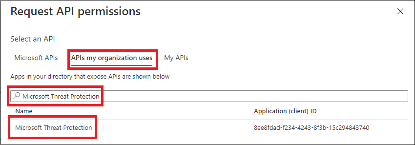
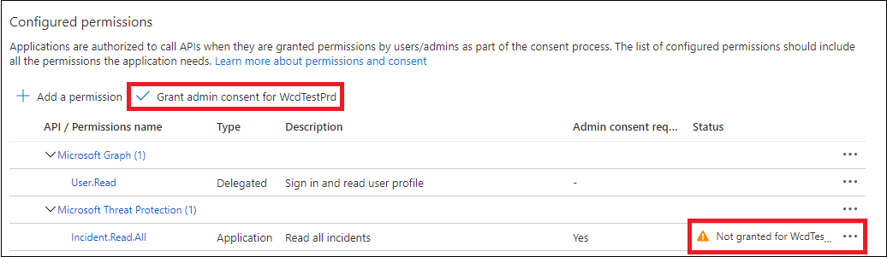

# <a name="create-an-app-to-access-microsoft-365-defender-without-a-user"></a>Criar um aplicativo para acessar o Microsoft 365 Defender sem um usuário

[!INCLUDE [Microsoft 365 Defender rebranding](../includes/microsoft-defender.md)]

**Aplica-se a:**

- Microsoft 365 Defender

> [!IMPORTANT]
> Algumas informações estão relacionadas a produtos de pré-lançamento que podem ser substancialmente modificados antes de serem lançadas comercialmente. Microsoft makes no warranties, express or implied, with respect to the information provided here.

Esta página descreve como criar um aplicativo para obter acesso programático ao Microsoft 365 Defender sem um usuário definido— por exemplo, se você estiver criando um daemon ou serviço em segundo plano.

Se você precisar de acesso programático ao Microsoft 365 Defender em nome de um ou mais usuários, confira Criar um aplicativo para acessar as APIs do [Microsoft 365 Defender](api-create-app-user-context.md) em nome de um usuário e criar um aplicativo com acesso de parceiro às APIs do Microsoft [365 Defender.](api-partner-access.md) Se você não tiver certeza de que tipo de acesso precisa, confira [Começar.](api-access.md)

O Microsoft 365 Defender expõe grande parte de seus dados e ações por meio de um conjunto de APIs programáticas. Essas APIs ajudam a automatizar fluxos de trabalho e usar os recursos do Microsoft 365 Defender. Esse acesso à API requer autenticação OAuth2.0. Para obter mais informações, consulte [OAuth 2.0 Authorization Code Flow](https://docs.microsoft.com/azure/active-directory/develop/active-directory-v2-protocols-oauth-code).

Em geral, você precisará seguir as seguintes etapas para usar essas APIs:

- Crie um aplicativo do Azure Active Directory (Azure AD).
- Obter um token de acesso usando este aplicativo.
- Use o token para acessar a API do Microsoft 365 Defender.

Este artigo explica como:

- Criar um aplicativo do Azure AD
- Obter um token de acesso para o Microsoft 365 Defender
- Valide o token.

## <a name="create-an-app"></a>Criar um aplicativo

1. Entre no [Azure como um](https://portal.azure.com) usuário com a função de Administrador **Global.**

2. Navegue até registros de aplicativo **do Azure Active Directory** Novo  >    >  **registro.**

   

3. In the form, choose a name for your application, then select **Register**.

4. Na página do seu aplicativo, selecione **Permissões** de API Adicionar APIs de permissão que minha organização usa >, digite Proteção contra Ameaças da Microsoft e selecione  >    >   Proteção **contra Ameaças da Microsoft.**  Seu aplicativo agora pode acessar o Microsoft 365 Defender.

   > [!TIP]
   > *A Proteção contra* Ameaças da Microsoft é um nome antigo do Microsoft 365 Defender e não aparecerá na lista original. Você precisa começar a escrever seu nome na caixa de texto para vê-lo aparecer.

   

5. Selecione **permissões de aplicativo.** Escolha as permissões relevantes para seu cenário (por exemplo, **Incident.Read.All**) e, em seguida, **selecione Adicionar permissões**.

   

    > [!NOTE]
    > Você precisa selecionar as permissões relevantes para seu cenário. *Ler todos os incidentes* é apenas um exemplo. Para determinar de que permissão você precisa, consulte a seção **Permissões** na API que você deseja chamar.
    >
    > Por exemplo, para [executar consultas avançadas,](api-advanced-hunting.md)selecione a permissão "Executar consultas avançadas"; para [isolar um dispositivo,](https://docs.microsoft.com/windows/security/threat-protection/microsoft-defender-atp/isolate-machine)selecione a permissão "Isolar máquina".

6. Selecione **Conceder consentimento de administrador.** Sempre que adicionar uma permissão, você deve selecionar Conceder **consentimento de administrador** para que ela entre em vigor.

    

7. Para adicionar um segredo ao aplicativo, selecione **Certificados & segredos,** adicione uma descrição ao segredo e selecione **Adicionar**.

    > [!TIP]
    > Depois de selecionar **Adicionar,** selecione **copiar o valor secreto gerado.** Você não poderá recuperar o valor secreto depois de sair.

    

8. Grave sua ID de aplicativo e sua ID de locatário em algum lugar seguro. Eles estão listados em **Visão Geral** na página do aplicativo.

   

9. Somente para parceiros do Microsoft [](https://docs.microsoft.com/microsoft-365/security/mtp/api-partner-access) **365 Defender:** siga estas instruções para acesso de parceiros por meio das APIs do Microsoft 365 Defender, de definir seu aplicativo como multi-locatário, para que ele possa estar disponível em todos os locatários depois que você receber o consentimento do administrador. O acesso de parceiros **é necessário** para aplicativos de terceiros— por exemplo, se você criar um aplicativo que se destina a ser executado em locatários de vários clientes. Não será **necessário se** você criar um serviço que deseja executar somente em seu locatário, como um aplicativo para seu próprio uso que só interagirá com seus próprios dados. Para definir seu aplicativo como multi-locatário:

    - Vá para **Autenticação** e adicione https://portal.azure.com como o **URI de redirecionamento.**

    - Na parte inferior da página, em Tipos  de conta com **suporte,** selecione as Contas em qualquer consentimento do aplicativo de diretório organizacional para seu aplicativo multi-locatário.

    Como seu aplicativo interage com o Microsoft 365 Defender em nome de seus usuários, ele precisa ser aprovado para todos os locatários em que você pretende usá-lo.

    O administrador global do Active Directory para cada locatário precisa selecionar o link de consentimento e aprovar seu aplicativo.

    O link de consentimento tem a seguinte estrutura:

    ```http
    https://login.microsoftonline.com/common/oauth2/authorize?prompt=consent&client_id=<00000000-0000-0000-0000-000000000000>&response_type=code&sso_reload=true
    ```

    Os dígitos `00000000-0000-0000-0000-000000000000` devem ser substituídos pela ID do aplicativo.  

**Pronto!** Você registrou com êxito um aplicativo! Veja os exemplos abaixo para aquisição e validação de token.

## <a name="get-an-access-token"></a>Obter um token de acesso

Para saber mais sobre tokens do Azure Active Directory, confira o [tutorial do Azure AD.](https://docs.microsoft.com/azure/active-directory/develop/active-directory-v2-protocols-oauth-client-creds)

> [!IMPORTANT]
> Embora os exemplos nesta seção incentivem você a colar valores  secretos para fins de teste, você nunca deve codificar segredos em um aplicativo em execução na produção. Terceiros podem usar seu segredo para acessar recursos. Você pode ajudar a manter os segredos do seu aplicativo seguros usando o [Azure Key Vault.](https://docs.microsoft.com/azure/key-vault/general/about-keys-secrets-certificates) Para um exemplo prático de como você pode proteger seu aplicativo, confira Gerenciar segredos em seus aplicativos de servidor com o [Azure Key Vault.](https://docs.microsoft.com/learn/modules/manage-secrets-with-azure-key-vault/)

### <a name="get-an-access-token-using-powershell"></a>Obter um token de acesso usando o PowerShell

```PowerShell
# This code gets the application context token and saves it to a file named "Latest-token.txt" under the current directory.

$tenantId = '' # Paste your directory (tenant) ID here
$clientId = '' # Paste your application (client) ID here
$appSecret = '' # Paste your own app secret here to test, then store it in a safe place, such as the Azure Key Vault!

$resourceAppIdUri = 'https://api.security.microsoft.com'
$oAuthUri = "https://login.windows.net/$tenantId/oauth2/token"

$authBody = [Ordered] @{
    resource = $resourceAppIdUri
    client_id = $clientId
    client_secret = $appSecret
    grant_type = 'client_credentials'
}

$authResponse = Invoke-RestMethod -Method Post -Uri $oAuthUri -Body $authBody -ErrorAction Stop
$token = $authResponse.access_token

Out-File -FilePath "./Latest-token.txt" -InputObject $token

return $token
```

### <a name="get-an-access-token-using-c"></a>Obter um token de acesso usando C\#

> [!NOTE]
> O código a seguir foi testado com Nuget Microsoft.IdentityModel.Clients.ActiveDirectory 3.19.8.

1. Crie um novo aplicativo de console.

1. Instale o NuGet [Microsoft.IdentityModel.Clients.ActiveDirectory.](https://www.nuget.org/packages/Microsoft.IdentityModel.Clients.ActiveDirectory/)

1. Adicione a seguinte linha:

    ```C#
    using Microsoft.IdentityModel.Clients.ActiveDirectory;
    ```

1. Copie e colar o seguinte código em seu aplicativo (não se esqueça de atualizar as três variáveis: `tenantId` , `clientId` `appSecret` ):

    ```C#
    string tenantId = ""; // Paste your directory (tenant) ID here
    string clientId = ""; // Paste your application (client) ID here
    string appSecret = ""; // Paste your own app secret here to test, then store it in a safe place, such as the Azure Key Vault!

    const string authority = "https://login.windows.net";
    const string wdatpResourceId = "https://api.security.microsoft.com";

    AuthenticationContext auth = new AuthenticationContext($"{authority}/{tenantId}/");
    ClientCredential clientCredential = new ClientCredential(clientId, appSecret);
    AuthenticationResult authenticationResult = auth.AcquireTokenAsync(wdatpResourceId, clientCredential).GetAwaiter().GetResult();
    string token = authenticationResult.AccessToken;
    ```

### <a name="get-an-access-token-using-python"></a>Obter um token de acesso usando o Python

```Python
import json
import urllib.request
import urllib.parse

tenantId = '' # Paste your directory (tenant) ID here
clientId = '' # Paste your application (client) ID here
appSecret = '' # Paste your own app secret here to test, then store it in a safe place, such as the Azure Key Vault!

url = "https://login.windows.net/%s/oauth2/token" % (tenantId)

resourceAppIdUri = 'https://api.securitycenter.windows.com'

body = {
    'resource' : resourceAppIdUri,
    'client_id' : clientId,
    'client_secret' : appSecret,
    'grant_type' : 'client_credentials'
}

data = urllib.parse.urlencode(body).encode("utf-8")

req = urllib.request.Request(url, data)
response = urllib.request.urlopen(req)
jsonResponse = json.loads(response.read())
aadToken = jsonResponse["access_token"]
```

### <a name="get-an-access-token-using-curl"></a>Obter um token de acesso usando o token de acesso

> [!NOTE]
> O Windows 10, versões 1803 e posteriores, foi pré-instalado. Para outras versões do Windows, baixe e instale a ferramenta diretamente do [site oficial do website.](https://curl.haxx.se/windows/)

1. Abra um prompt de comando e de definida CLIENT_ID sua ID de aplicativo do Azure.

1. De CLIENT_SECRET seu segredo do aplicativo Azure.

1. De TENANT_ID a ID de locatário do Azure do cliente que deseja usar seu aplicativo para acessar o Microsoft 365 Defender.

1. Execute o seguinte comando:

   ```bash
   curl -i -X POST -H "Content-Type:application/x-www-form-urlencoded" -d "grant_type=client_credentials" -d "client_id=%CLIENT_ID%" -d "scope=https://securitycenter.onmicrosoft.com/windowsatpservice/.default" -d "client_secret=%CLIENT_SECRET%" "https://login.microsoftonline.com/%TENANT_ID%/oauth2/v2.0/token" -k
   ```

   Uma resposta bem-sucedida terá esta aparência:

   ```bash
   {"token_type":"Bearer","expires_in":3599,"ext_expires_in":0,"access_token":"eyJ0eXAiOiJKV1QiLCJhbGciOiJSUzI1NiIsIn <truncated> aWReH7P0s0tjTBX8wGWqJUdDA"}
   ```

## <a name="validate-the-token"></a>Validar o token

1. Copie e colar o token no site do validador de [token Web JSON, JWT,](https://jwt.ms) para decodificá-lo.

1. Certifique-se de *que a* declaração de funções dentro do token decodificado contém as permissões desejadas.

   Na imagem a seguir, você pode ver um token decodificado adquirido de um aplicativo, com `Incidents.Read.All` `Incidents.ReadWrite.All` , e `AdvancedHunting.Read.All` permissões:

   

## <a name="use-the-token-to-access-the-microsoft-365-defender-api"></a>Usar o token para acessar a API do Microsoft 365 Defender

1. Escolha a API que você deseja usar (incidentes ou busca avançada). Para saber mais, confira [AS APIs do Microsoft 365 Defender](api-supported.md)com suporte.

2. Na solicitação http que você está prestes a enviar, de definir o cabeçalho de autorização como , portador sendo o esquema de autorização e token sendo `"Bearer" <token>` seu token  validado. 

3. O token expirará dentro de uma hora. Você pode enviar mais de uma solicitação durante esse período com o mesmo token.

O exemplo a seguir mostra como enviar uma solicitação para obter uma lista de incidentes **usando C#**.

```C#
    var httpClient = new HttpClient();
    var request = new HttpRequestMessage(HttpMethod.Get, "https://api.security.microsoft.com/api/incidents");

    request.Headers.Authorization = new AuthenticationHeaderValue("Bearer", token);

    var response = httpClient.SendAsync(request).GetAwaiter().GetResult();
```

## <a name="related-articles"></a>Artigos relacionados

- [Visão geral das APIs do Microsoft 365 Defender](api-overview.md)
- [Acessar as APIs do Microsoft 365 Defender](api-access.md)
- [Criar um aplicativo "Hello world"](api-hello-world.md)
- [Criar um aplicativo para acessar as APIs do Microsoft 365 Defender em nome de um usuário](api-create-app-user-context.md)
- [Criar um aplicativo com acesso de parceiro multi-locatário às APIs do Microsoft 365 Defender](api-partner-access.md)
- [Saiba mais sobre limites e licenciamento de API](api-terms.md)
- [Noções sobre códigos de erro](api-error-codes.md)
- [Gerenciar segredos em seus aplicativos de servidor com o Azure Key Vault](https://docs.microsoft.com/learn/modules/manage-secrets-with-azure-key-vault/)
- [Autorização do OAuth 2.0 para entrada do usuário e acesso à API](https://docs.microsoft.com/azure/active-directory/develop/active-directory-v2-protocols-oauth-code)
