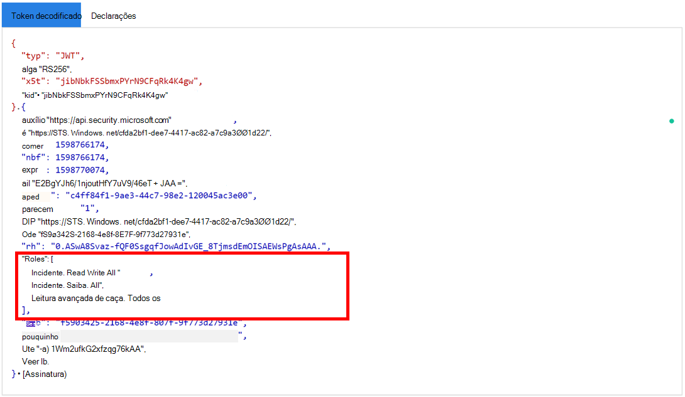

# <a name="hello-world-for-microsoft-365-defender-rest-api"></a>Hello World para a API REST do Microsoft 365 Defender

[!INCLUDE [Microsoft 365 Defender rebranding](../includes/microsoft-defender.md)]

**Aplica-se a:**

- Microsoft 365 Defender

> [!IMPORTANT]
> Algumas informações se relacionam ao produto pré-lançamento, que pode ser substancialmente modificado antes de ser lançado comercialmente. Microsoft makes no warranties, express or implied, with respect to the information provided here.

## <a name="get-incidents-using-a-simple-powershell-script"></a>Obter incidentes usando um script simples do PowerShell

Deve levar de 5 a 10 minutos para concluir esse projeto. Essa estimativa de tempo inclui o registro do aplicativo e a aplicação do código do script de exemplo do PowerShell.

### <a name="register-an-app-in-azure-active-directory"></a>Registrar um aplicativo no Azure Active Directory

1. Entre no [Azure](https://portal.azure.com) como um usuário com a **função de administrador** global.

2. Navegue **até registros do Aplicativo do Azure Active Directory** Novo  >    >  **registro**.

   

3. No formulário de registro, escolha um nome para seu aplicativo e selecione **Registrar**. Selecionar um URI de redirecionamento é opcional. Você não precisará de um para concluir este exemplo.

4. Em sua página de aplicativo, selecione **Permissões** de API Adicionar  >    >  **APIs** de permissão que minha organização usa >, digite Proteção contra Ameaças da Microsoft e selecione Proteção contra Ameaças da Microsoft . Seu aplicativo agora pode acessar o Microsoft 365 Defender.

   > [!TIP]
   > *A Proteção contra Ameaças* da Microsoft é um nome antigo do Microsoft 365 Defender e não aparecerá na lista original. Você precisa começar a escrever seu nome na caixa de texto para vê-lo aparecer.
   

   - Escolha **Permissões de aplicativo**  >  **Incident.Read.All** e selecione Adicionar **permissões**.

   

5. Selecione **Conceder consentimento de administrador**. Sempre que você adicionar uma permissão, você deve selecionar **Conceder consentimento de administrador** para que ela entre em vigor.

    

6. Adicione um segredo ao aplicativo. Selecione **Certificados & segredos,** adicione uma descrição ao segredo e selecione **Adicionar**.

    > [!TIP]
    > Depois de selecionar **Adicionar**, selecione **copiar o valor secreto gerado.** Você não poderá recuperar o valor secreto depois de sair.

    

7. Grave sua ID de aplicativo e sua ID de locatário em algum lugar seguro. Eles estão listados em **Visão Geral** na página do aplicativo.

   

### <a name="get-a-token-using-the-app-and-use-the-token-to-access-the-api"></a>Obter um token usando o aplicativo e usar o token para acessar a API

Para obter mais informações sobre tokens do Azure Active Directory, consulte o tutorial do [Azure AD](/azure/active-directory/develop/active-directory-v2-protocols-oauth-client-creds).

> [!IMPORTANT]
> Embora o exemplo neste aplicativo de demonstração incentive você a colar  seu valor secreto para fins de teste, você nunca deve codificar segredos em um aplicativo em execução em produção. Um terceiro pode usar seu segredo para acessar recursos. Você pode ajudar a manter os segredos do seu aplicativo seguros usando o [Azure Key Vault.](/azure/key-vault/general/about-keys-secrets-certificates) Para ver um exemplo prático de como proteger seu aplicativo, consulte Gerenciar segredos em seus aplicativos de servidor com o [Azure Key Vault](/learn/modules/manage-secrets-with-azure-key-vault/).

1. Copie o script abaixo e o colar no editor de texto favorito. Salve como **Get-Token.ps1**. Você também pode executar o código como está no ISE do PowerShell, mas você deve salvá-lo, pois precisamos executar novamente quando usarmos o script de busca de incidentes na próxima seção.

    Esse script gerará um token e o salvará na pasta de trabalho sob o nome, *Latest-token.txt*.

    ```PowerShell
    # This script gets the app context token and saves it to a file named "Latest-token.txt" under the current directory.
    # Paste in your tenant ID, client ID and app secret (App key).

    $tenantId = '' # Paste your directory (tenant) ID here
    $clientId = '' # Paste your application (client) ID here
    $appSecret = '' # # Paste your own app secret here to test, then store it in a safe place!

    $resourceAppIdUri = 'https://api.security.microsoft.com'
    $oAuthUri = "https://login.windows.net/$tenantId/oauth2/token"
    $authBody = [Ordered] @{
      resource = $resourceAppIdUri
      client_id = $clientId
      client_secret = $appSecret
      grant_type = 'client_credentials'
    }
    $authResponse = Invoke-RestMethod -Method Post -Uri $oAuthUri -Body $authBody -ErrorAction Stop
    $token = $authResponse.access_token
    Out-File -FilePath "./Latest-token.txt" -InputObject $token
    return $token
    ```

#### <a name="validate-the-token"></a>Validar o token

1. Copie e colar o token recebido em [JWT](https://jwt.ms) para decodificá-lo.
1. *JWT* significa *JSON Web Token*. O token decodificado conterá um número de itens ou declarações formatados por JSON. Certifique-se de que *as funções* de declaração dentro do token decodificado contenham as permissões desejadas.

    Na imagem a seguir, você pode ver um token decodificado adquirido de um aplicativo, com ```Incidents.Read.All``` ```Incidents.ReadWrite.All``` , e ```AdvancedHunting.Read.All``` permissões:

    

### <a name="get-a-list-of-recent-incidents"></a>Obter uma lista de incidentes recentes

O script a seguir **usará** Get-Token.ps1acessar a API. Em seguida, recupera uma lista de incidentes que foram atualizados pela última vez nas últimas 48 horas e salva a lista como um arquivo JSON.

> [!IMPORTANT]
> Salve esse script na mesma pasta que você salvou **Get-Token.ps1**.

```PowerShell
# This script returns incidents last updated within the past 48 hours.

$token = ./Get-Token.ps1

# Get incidents from the past 48 hours.
# The script may appear to fail if you don't have any incidents in that time frame.
$dateTime = (Get-Date).ToUniversalTime().AddHours(-48).ToString("o")

# This URL contains the type of query and the time filter we created above.
# Note that `$filter` does not refer to a local variable in our script --
# it's actually an OData operator and part of the API's syntax.
$url = "https://api.security.microsoft.com/api/incidents?$filter=lastUpdateTime+ge+$dateTime"

# Set the webrequest headers
$headers = @{
    'Content-Type' = 'application/json'
    'Accept' = 'application/json'
    'Authorization' = "Bearer $token"
}

# Send the request and get the results.
$response = Invoke-WebRequest -Method Get -Uri $url -Headers $headers -ErrorAction Stop

# Extract the incidents from the results.
$incidents =  ($response | ConvertFrom-Json).value | ConvertTo-Json -Depth 99

# Get a string containing the execution time. We concatenate that string to the name 
# of the output file to avoid overwriting the file on consecutive runs of the script.
$dateTimeForFileName = Get-Date -Format o | foreach {$_ -replace ":", "."}

# Save the result as json
$outputJsonPath = "./Latest Incidents $dateTimeForFileName.json"

Out-File -FilePath $outputJsonPath -InputObject $incidents
```

Você terminou! Você conseguiu:

- Criado e registrado um aplicativo.
- Permissão concedida para que o aplicativo leia alertas.
- Conectado à API.
- Usou um script do PowerShell para retornar incidentes atualizados nas últimas 48 horas.

## <a name="related-articles"></a>Artigos relacionados

- [Visão geral das APIs do Microsoft 365 Defender](api-overview.md)
- [Acessar as APIs do Microsoft 365 Defender](api-access.md)
- [Criar um aplicativo para acessar o Microsoft 365 Defender sem um usuário](api-create-app-web.md)
- [Criar um aplicativo para acessar APIs do Microsoft 365 Defender em nome de um usuário](api-create-app-user-context.md)
- [Criar um aplicativo com acesso de parceiro de vários locatários às APIs do Microsoft 365 Defender](api-partner-access.md)
- [Gerenciar segredos em seus aplicativos de servidor com o Azure Key Vault](/learn/modules/manage-secrets-with-azure-key-vault/)
- [Autorização OAuth 2.0 para entrada do usuário e acesso à API](/azure/active-directory/develop/active-directory-v2-protocols-oauth-code)