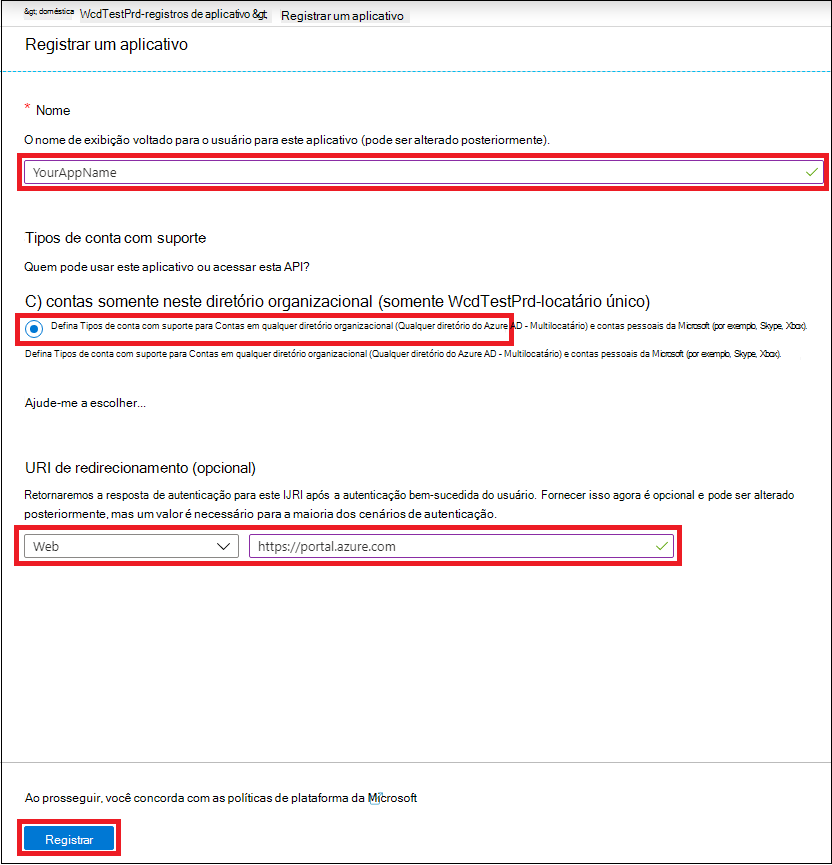
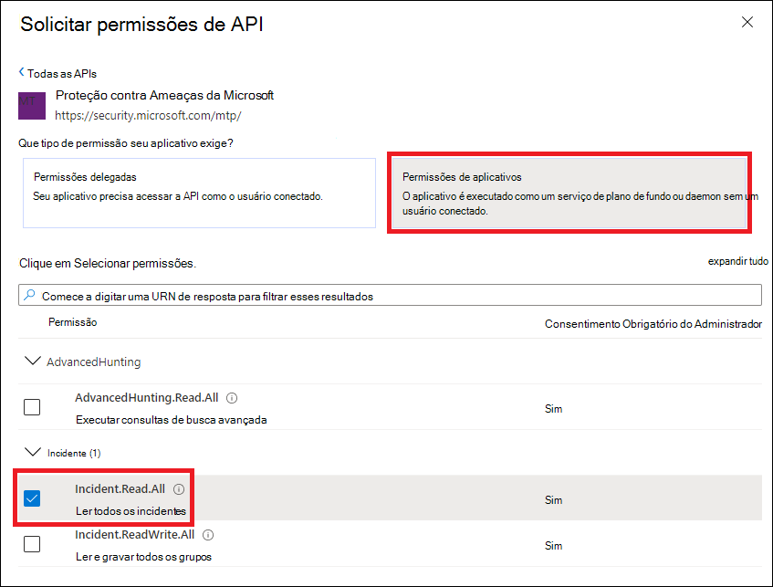
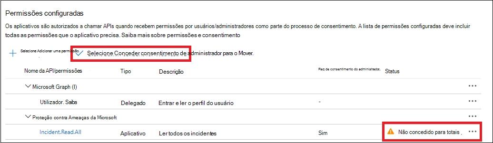
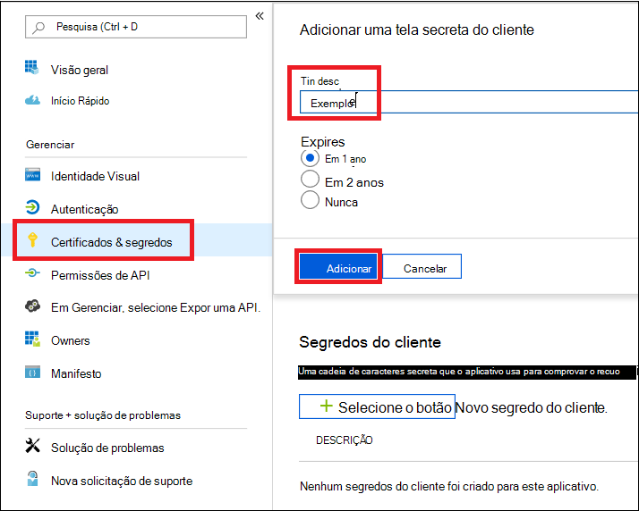
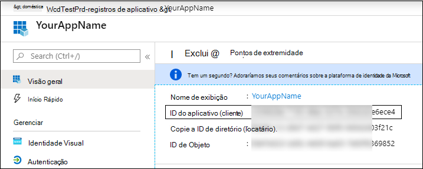
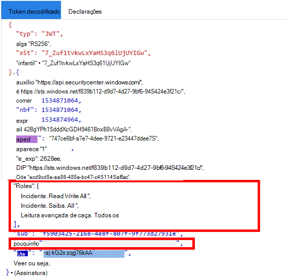

# <a name="partner-access-through-microsoft-365-defender-apis"></a>Acesso de parceiros por meio das APIs do Microsoft 365 defender

[!INCLUDE [Microsoft 365 Defender rebranding](../includes/microsoft-defender.md)]


**Aplica-se a:**
- Microsoft 365 defender

>[!IMPORTANT] 
>Algumas informações estão relacionadas ao produto já publicado que pode ser modificado substancialmente antes de ser lançado comercialmente. Microsoft makes no warranties, express or implied, with respect to the information provided here.


Esta página descreve como criar um aplicativo AAD para obter acesso programático ao Microsoft 365 defender em nome de seus clientes.

O Microsoft 365 defender expõe grande parte de seus dados e ações por meio de um conjunto de APIs de programação. Essas APIs ajudarão você a automatizar fluxos de trabalho e inovar com base nos recursos do Microsoft 365 defender. O acesso à API requer autenticação do OAuth 2.0. Para obter mais informações, consulte [fluxo de código de autorização do OAuth 2,0](https://docs.microsoft.com/azure/active-directory/develop/active-directory-v2-protocols-oauth-code).

Em geral, você precisará executar as seguintes etapas para usar as APIs:
- Criar um aplicativo AAD **de vários locatários** .
- Obtenha autorização (consentimento) pelo administrador do cliente para seu aplicativo para acessar os recursos do Microsoft 365 defender de que ele precisa.
- Obtenha um token de acesso usando este aplicativo.
- Use o token para acessar a API do Microsoft 365 defender.

As etapas a seguir orientam como criar um aplicativo AAD, obter um token de acesso para o Microsoft 365 defender e validar o token.

## <a name="create-the-multi-tenant-app"></a>Criar o aplicativo multilocatário

1. Faça logon em seu [locatário do Azure](https://portal.azure.com) com um usuário com função de **administrador global** .

2. Navegue até registro de aplicativo **do Azure Active Directory**  >  **App registrations**  >  **novo registro**. 

   

3. No formulário de registro:

    - Escolha um nome para o aplicativo.

    - Tipos de conta com suporte – contas em qualquer diretório organizacional.

    - Redirecionar URI-tipo: Web, URI: https://portal.azure.com

    


4. Permita que seu aplicativo acesse o Microsoft 365 defender e atribua-o com o conjunto mínimo de permissões necessárias para a conclusão da integração.

   - Na página do aplicativo, clique em **permissões de API**  >  **Adicionar** APIs de permissão  >  **minha organização usa** > digite **Microsoft 365 defender** e clique em **Microsoft 365 defender**.

   >[!NOTE]
   >O Microsoft 365 defender não aparece na lista original. Você precisa começar a escrever seu nome na caixa de texto para vê-lo aparece.

   
   
   ### <a name="request-api-permissions"></a>Solicitar permissões de API

   Para determinar qual permissão você precisa, consulte a seção **permissões** na API que você está interessado em chamar. 

   No exemplo a seguir, usaremos a permissão **"ler todos os incidentes"** :

   Escolha **aplicativos permissões**  >  **incidentes. Read. All** > clique em **adicionar permissões**

   


5. Clique em **conceder consentimento**

    >[!NOTE]
    >Toda vez que você adicionar permissão, deverá clicar em **conceder consentimento** para que a nova permissão entre em vigor.

    

6. Adicione um segredo ao aplicativo.

    - Clique em **certificados & segredos** , adicione descrição ao segredo e clique em **Adicionar**.

    >[!IMPORTANT]
    > Depois de selecionar **Adicionar** , **Copie o valor de segredo gerado**. Você não poderá recuperar após sair!

    

7. Anote sua ID de aplicativo:

   - Na página do aplicativo, vá para **visão geral** e copie o seguinte:

   

8. Adicione o aplicativo ao locatário do cliente.

    Você precisa que seu aplicativo seja aprovado em cada locatário do cliente onde você pretende usá-lo. Isso se deve ao fato de o aplicativo interagir com o aplicativo Microsoft 365 defender em nome de seu cliente.

    Um usuário com **administrador global** do locatário do cliente precisa clicar no link de consentimento e aprovar o aplicativo.

    O link de consentimento tem o formato:

    ```
    https://login.microsoftonline.com/common/oauth2/authorize?prompt=consent&client_id=00000000-0000-0000-0000-000000000000&response_type=code&sso_reload=true
    ```

    Onde 00000000-0000-0000-0000-000000000000 deve ser substituído por sua ID de aplicativo

    Após clicar no link de consentimento, faça logon com o administrador global do locatário do cliente e concorde com o aplicativo.

    

    Além disso, você precisará solicitar sua ID de locatário ao cliente e salvá-lo para uso futuro ao adquirir o token.

- **Terminado!** Você registrou com êxito um aplicativo! 
- Confira os exemplos abaixo para obter uma aquisição de token e validação.

## <a name="get-an-access-token-examples"></a>Obtenha exemplos de token de acesso:

>[!NOTE]
> Para obter o token de acesso em nome de seu cliente, use a ID de locatário do cliente nas aquisições de token a seguir.

<br>Para obter mais detalhes sobre o token do AAD, consulte [tutorial do AAD](https://docs.microsoft.com/azure/active-directory/develop/active-directory-v2-protocols-oauth-client-creds)

### <a name="using-powershell"></a>Usando o PowerShell

```
# That code gets the App Context Token and save it to a file named "Latest-token.txt" under the current directory
# Paste below your Tenant ID, App ID and App Secret (App key).

$tenantId = '' ### Paste your tenant ID here
$appId = '' ### Paste your Application ID here
$appSecret = '' ### Paste your Application key here

$resourceAppIdUri = 'https://api.security.microsoft.com'
$oAuthUri = "https://login.windows.net/$TenantId/oauth2/token"
$authBody = [Ordered] @{
    resource = "$resourceAppIdUri"
    client_id = "$appId"
    client_secret = "$appSecret"
    grant_type = 'client_credentials'
}
$authResponse = Invoke-RestMethod -Method Post -Uri $oAuthUri -Body $authBody -ErrorAction Stop
$token = $authResponse.access_token
Out-File -FilePath "./Latest-token.txt" -InputObject $token
return $token
```

### <a name="using-c"></a>Usando C#:

>O código a seguir foi testado com o NuGet Microsoft. IdentityModel. clients. ActiveDirectory

- Criar um novo aplicativo de console
- Instalar [o NuGet Microsoft. IdentityModel. clients. ActiveDirectory](https://www.nuget.org/packages/Microsoft.IdentityModel.Clients.ActiveDirectory/)
- Adicione o seguinte usando

    ```
    using Microsoft.IdentityModel.Clients.ActiveDirectory;
    ```

- Copie/cole o código abaixo em seu aplicativo (não se esqueça de atualizar as 3 variáveis: ```tenantId, appId, appSecret``` )

    ```
    string tenantId = "00000000-0000-0000-0000-000000000000"; // Paste your own tenant ID here
    string appId = "11111111-1111-1111-1111-111111111111"; // Paste your own app ID here
    string appSecret = "22222222-2222-2222-2222-222222222222"; // Paste your own app secret here for a test, and then store it in a safe place! 

    const string authority = "https://login.windows.net";
    const string mtpResourceId = "https://api.security.microsoft.com";

    AuthenticationContext auth = new AuthenticationContext($"{authority}/{tenantId}/");
    ClientCredential clientCredential = new ClientCredential(appId, appSecret);
    AuthenticationResult authenticationResult = auth.AcquireTokenAsync(mtpResourceId, clientCredential).GetAwaiter().GetResult();
    string token = authenticationResult.AccessToken;
    ```


### <a name="using-curl"></a>Usando a ondulação

> [!NOTE]
> O procedimento a seguir deve ser enrolado para o Windows já está instalado no computador

- Abrir uma janela de comando
- Definir CLIENT_ID para sua ID de aplicativo do Azure
- Definir CLIENT_SECRET como seu segredo de aplicativo do Azure
- Defina TENANT_ID para a ID do locatário do Azure do cliente que deseja usar seu aplicativo para acessar o aplicativo Microsoft 365 defender
- Execute o comando abaixo:

```
curl -i -X POST -H "Content-Type:application/x-www-form-urlencoded" -d "grant_type=client_credentials" -d "client_id=%CLIENT_ID%" -d "scope=https://api.security.microsoft.com.default" -d "client_secret=%CLIENT_SECRET%" "https://login.microsoftonline.com/%TENANT_ID%/oauth2/v2.0/token" -k
```

Você receberá uma resposta da forma:

```
{"token_type":"Bearer","expires_in":3599,"ext_expires_in":0,"access_token":"eyJ0eXAiOiJKV1QiLCJhbGciOiJSUzI1NiIsIn <truncated> aWReH7P0s0tjTBX8wGWqJUdDA"}
```

## <a name="validate-the-token"></a>Validar o token

Verificação de sanidade para garantir que você recebeu um token correto:

- Copiar/colar no [JWT](https://jwt.ms) o token obtido na etapa anterior para decodificá-lo
- Validar você obtém uma declaração "Roles" com as permissões desejadas
- Na captura de tela abaixo, você pode ver um token decodificado adquirido de um aplicativo com várias permissões para o Microsoft 365 defender:
- A declaração "tid" é a ID do locatário à qual o token pertence.



## <a name="use-the-token-to-access-microsoft-365-defender-api"></a>Usar o token para acessar a API do Microsoft 365 defender

- Escolha a API que você deseja usar, para obter mais informações, consulte [supported Microsoft 365 defender APIs](api-supported.md)
- Definir o cabeçalho de autorização na solicitação HTTP que você envia para "portador {token}" (o portador é o esquema de autorização)
- O tempo de expiração do token é de 1 hora (você pode enviar mais de uma solicitação com o mesmo token)

- Exemplo de envio de uma solicitação para obter uma lista de incidentes **usando C#** 
    ```
    var httpClient = new HttpClient();

    var request = new HttpRequestMessage(HttpMethod.Get, "https://api.security.microsoft.com/api/incidents");

    request.Headers.Authorization = new AuthenticationHeaderValue("Bearer", token);

    var response = httpClient.SendAsync(request).GetAwaiter().GetResult();

    // Do something useful with the response
    ```

## <a name="related-topics"></a>Tópicos relacionados 

- [Acessar as APIs do Microsoft 365 defender](api-access.md)
- [Acessar o Microsoft 365 defender com contexto de aplicativo](api-create-app-web.md)
- [Acessar o Microsoft 365 defender com contexto de usuário](api-create-app-user-context.md)
