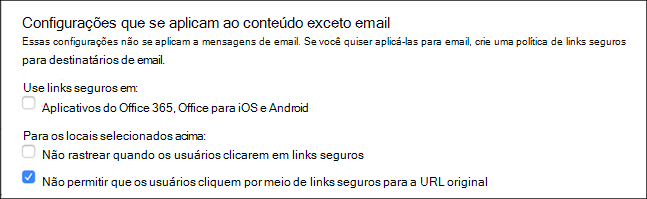

# Configurar os pilares de proteção contra ameaças da Microsoft para seu ambiente de laboratório de avaliaçãoConfigure Microsoft Threat Protection pillars for your trial lab environment

**Aplica-se a:****Applies to:**
- Proteção contra Ameaças da MicrosoftMicrosoft Threat Protection

Criar um ambiente de laboratório de avaliação de proteção contra ameaças da Microsoft e implantá-lo é um processo de três fases:Creating a Microsoft Threat Protection trial lab environment and deploying it is a three-phase process:

 
<table border="0" width="100%" align="center">
  <tr style="text-align:center;">
    <td align="center" style="width:25%; border:0;" >
      <a href= "https://docs.microsoft.com/microsoft-365/security/mtp/prepare-mtpeval?view=o365-worldwide"> 
        
       Fase 1: preparar</a>Phase 1: Prepare </a> 
    </td>
     <td align="center">
      <a href="https://docs.microsoft.com/microsoft-365/security/mtp/setup-mtpeval?view=o365-worldwide">
        
       Fase 2: configuração</a>Phase 2: Setup </a> 
    </td>
    <td align="center" bgcolor="#d5f5e3">
      <a href="https://docs.microsoft.com/microsoft-365/security/mtp/config-mtpeval?view=o365-worldwide">
        
       Fase 3: configurar o & integrado</a>Phase 3: Configure & Onboard </a> 
</td>

  </tr>
</table>

No momento, você está na fase de configuração.You are currently in the configuration phase.

A preparação é fundamental para qualquer implantação bem-sucedida.Preparation is key to any successful deployment. Neste artigo, você será orientado nos pontos que precisará considerar ao se preparar para implantar o Microsoft defender ATP.In this article, you'll be guided on the points you'll need to consider as you prepare to deploy Microsoft Defender ATP.

## Pilares de proteção contra ameaças da MicrosoftMicrosoft Threat Protection pillars
A proteção contra ameaças da Microsoft consiste em quatro pilares.Microsoft Threat Protection consists of four pillars. Embora um pilar já possa fornecer um valor para a segurança da sua organização de rede, a habilitação dos quatro pilares de proteção contra ameaças da Microsoft dará à sua organização o mais valor.Although one pillar can already provide value to your network organization's security, enabling the four Microsoft Threat Protection pillars will give your organization the most value.

  

Esta seção orientará você a configurar:This section will guide you to configure:
-   Proteção Avançada contra Ameaças do Office 365Office 365 Advanced Threat Protection
-   Proteção Avançada contra Ameaças do AzureAzure Advanced Threat Protection 
-   Microsoft Cloud App SecurityMicrosoft Cloud App Security
-   Proteção avançada contra ameaças do Microsoft DefenderMicrosoft Defender Advanced Threat Protection

## Configurar a proteção avançada contra ameaças do Office 365Configure Office 365 Advanced Threat Protection
>[!NOTE]
>Pule esta etapa se já tiver habilitado a proteção avançada contra ameaças do Office 365.Skip this step if you have already enabled Office 365 Advanced Threat Protection. 

Há um módulo do PowerShell chamado *Office 365 Advanced Threat Protection Configuration Analyzer (orca)* que ajuda a determinar algumas dessas configurações.There is a PowerShell Module called the *Office 365 Advanced Threat Protection Recommended Configuration Analyzer (ORCA)* that helps determine some of these settings. Ao executar como um administrador em seu locatário, o Get-ORCAReport ajudará a gerar uma avaliação das configurações de higiene de antispam, anti-phishing e outras mensagens.When run as an administrator in your tenant, get-ORCAReport will help generate an assessment of the anti-spam, anti-phish, and other message hygiene settings. Você pode baixar este módulo no https://www.powershellgallery.com/packages/ORCA/.You can download this module from https://www.powershellgallery.com/packages/ORCA/. 

1. Navegue até a**política**de**Gerenciamento** > de ameaças do centro > de [conformidade & segurança do Office 365](https://protection.office.com/homepage).Navigate to [Office 365 Security & Compliance Center](https://protection.office.com/homepage) > **Threat management** > **Policy**.
  
 
2. Clique em **anti-phishing ATP**, selecione **criar** e preencha o nome e a descrição da política.Click **ATP anti-phishing**, select **Create** and fill in the policy name and description. Clique em **Avançar**.Click **Next**.
  

>[!NOTE]
>Edite a política de anti-phishing avançada da ATP.Edit your Advanced ATP anti-phishing policy. Altere o **limite de phishing avançado** para **2-agressivo**.Change **Advanced Phishing Threshold** to **2 - Aggressive**.
 

3. Clique no menu suspenso **Adicionar uma condição** e selecione seu (s) domínio (s) como domínio do destinatário.Click the **Add a condition** drop-down menu and select your domain(s) as recipient domain. Clique em **Avançar**.Click **Next**.
  
 
4. Revise suas configurações.Review your settings. Clique em **criar esta política** para confirmar.Click **Create this policy** to confirm. 
  
 
5. Selecione **anexos seguros de ATP** e selecione a opção **Ativar ATP para SharePoint, onedrive e Microsoft Teams** .Select **ATP Safe attachments** and select the **Turn on ATP for SharePoint, OneDrive, and Microsoft Teams** option.  
  

6. Clique no ícone + para criar uma nova política de anexo seguro, aplique-a como domínio de destinatário aos seus domínios.Click the + icon to create a new safe attachment policy, apply it as recipient domain to your domains. Clique em **Salvar**.Click **Save**.
  
 
7. Em seguida, selecione a política de **links seguros de ATP** e clique no ícone de lápis para editar a política padrão.Next, select the **ATP Safe Links** policy, then click the pencil icon to edit the default policy.

8. Certifique-se de que a opção **não rastrear quando os usuários clicarem em links seguros** não esteja selecionada, enquanto o restante das opções estiver selecionado.Make sure that the **Do not track when users click safe links** option is not selected, while the rest of the options are selected. Confira [configurações de links seguros](https://docs.microsoft.com/microsoft-365/security/office-365-security/recommended-settings-for-eop-and-office365-atp?view=o365-worldwide) para obter detalhes.See [Safe Links settings](https://docs.microsoft.com/microsoft-365/security/office-365-security/recommended-settings-for-eop-and-office365-atp?view=o365-worldwide) for details. Clique em **Salvar**.Click **Save**. 
  

9. Em seguida, selecione a política **anti-malware** , selecione o padrão e escolha o ícone de lápis.Next select the **Anti-malware** policy, select the default, and choose the pencil icon.

10. Clique em **configurações** e selecione **Sim e use o texto de notificação padrão** para habilitar a **resposta de detecção de malware**.Click **Settings** and select **Yes and use the default notification text** to enable **Malware Detection Response**. Ativar o **filtro de tipos de anexo comuns** .Turn the **Common Attachment Types Filter** on. Clique em **Salvar**.Click **Save**.
   
  
11. Navegue até [Office 365 Security & centro](https://protection.office.com/homepage) > de conformidade**pesquisa** > **log de auditoria** pesquisa e ative a auditoria.Navigate to [Office 365 Security & Compliance Center](https://protection.office.com/homepage) > **Search** > **Audit log search** and turn Auditing on.  
  

12. Integrar o Office 365 ATP com o Microsoft defender ATP.Integrate Office 365 ATP with Microsoft Defender ATP. Navegue até [Office 365 Security & centro de conformidade](https://protection.office.com/homepage)de > **Gerenciamento** > **de** ameaças do centro de conformidade e selecione **configurações do WDATP** no canto superior direito da tela.Navigate to [Office 365 Security & Compliance Center](https://protection.office.com/homepage) > **Threat management** > **Explorer** and select **WDATP Settings** on the upper right corner of the screen. Na caixa de diálogo conexão ATP do Microsoft defender, ative **conectar ao Windows ATP**.In the Microsoft Defender ATP connection dialog box, turn on **Connect to Windows ATP**.
  

## Configurar a proteção avançada contra ameaças do AzureConfigure Azure Advanced Threat Protection
>[!NOTE]
>Pule esta etapa se você já tiver habilitado a proteção avançada contra ameaças do AzureSkip this step if you have already enabled Azure Advanced Threat Protection

1. Navegue até a [central de segurança do Microsoft 365](https://security.microsoft.com/info) > selecione **mais recursos** > **proteção avançada contra ameaças do Azure**.Navigate to [Microsoft 365 Security Center](https://security.microsoft.com/info) > select **More Resources** > **Azure Advanced Threat Protection**.
  

2. Clique em **criar** para iniciar o assistente de proteção avançada contra ameaças do Azure.Click **Create** to start the Azure Advanced Threat Protection wizard. 
   

3. Escolha **fornecer um nome de usuário e senha para se conectar à sua floresta do Active Directory**.Choose **Provide a username and password to connect to your Active Directory forest**.  
  

4. Insira suas credenciais locais do Active Directory.Enter your Active Directory on-premises credentials. Pode ser qualquer conta de usuário que tenha acesso de leitura ao Active Directory.This can be any user account that has read access to Active Directory.
  

5. Em seguida, escolha **baixar a configuração do sensor** e transferir o arquivo para o controlador de domínio.Next, choose **Download Sensor Setup** and transfer file to your domain controller. 
  

6. Execute a configuração do sensor ATP do Azure e comece seguindo o assistente.Execute the Azure ATP Sensor Setup and begin following the wizard.
   
 
7. Clique em **Avançar** no tipo de implantação do sensor.Click **Next** at the sensor deployment type.
   
 
8. Copie a chave de acesso, pois será necessário inseri-la em seguida no assistente.Copy the access key as you will need to enter it next in the Wizard.
  
 
9. Copie a chave de acesso no assistente e clique em **instalar**.Copy the access key into the Wizard and click **Install**. 
   

10. Parabéns, você configurou com êxito a proteção avançada contra ameaças do Azure no seu controlador de domínio.Congratulations, you have successfully configured Azure Advanced Threat Protection on your domain controller.
  
 
11. Na seção Configurações de [ATP do Azure Azure](https://go.microsoft.com/fwlink/?linkid=2040449) , selecione **Windows Defender ATP**e ative a opção de ativar.Under the [Azure Azure ATP](https://go.microsoft.com/fwlink/?linkid=2040449) settings section, select **Windows Defender ATP**, then turn the toggle on. Clique em **Salvar**.Click **Save**. 
  

>[!NOTE]
>O Windows Defender ATP foi remarcado como Microsoft defender ATP.Windows Defender ATP has been rebranded as Microsoft Defender ATP. As alterações de remarcação em todos os nossos portais estão sendo distribuídas para consistência.Rebranding changes across all of our portals are being rolled out the for consistency.

## Configurar o Microsoft Cloud app SecurityConfigure Microsoft Cloud App Security
>[!NOTE]
>Pule esta etapa se você já tiver habilitado o Microsoft Cloud app Security.Skip this step if you have already enabled Microsoft Cloud App Security. 

1. Navegue até [Microsoft 365 Security Center](https://security.microsoft.com/info) > **mais recursos** > **Microsoft Cloud app Security**.Navigate to [Microsoft 365 Security Center](https://security.microsoft.com/info) > **More Resources** > **Microsoft Cloud App Security**.
  

2. No prompt de informações para integrar o Azure ATP, selecione **habilitar a integração de dados ATP do Azure**.At the information prompt to integrate Azure ATP, select **Enable Azure ATP data integration**. 
   

>[!NOTE]
>Se você não vir esse prompt, pode significar que sua integração de dados ATP do Azure já foi habilitada.If you don’t see this prompt, it might mean that your Azure ATP data integration has already been enabled. No entanto, se você não tiver certeza, entre em contato com seu administrador de ti para confirmar.However, if you are not sure, contact your IT Administrator to confirm. 

3. Vá para **configurações**, ative a ativação da **integração do Azure ATP** e clique em **salvar**.Go to **Settings**, turn the **Azure ATP integration** toggle on, then click **Save**. 
  
>[!NOTE]
>Para novas instâncias ATP do Azure, esta integração alternada é automaticamente ativada.For new Azure ATP instances, this integration toggle is automatically turned on. Confirme se a sua integração do Azure ATP foi habilitada antes de prosseguir para a próxima etapa.Confirm that your Azure ATP integration has been enabled before you proceed to the next step.
 
4. Nas configurações de descoberta de nuvem, selecione **integração do Microsoft defender ATP**e habilite a integração.Under the Cloud discovery settings, select **Microsoft Defender ATP integration**, then enable the integration. Clique em **Salvar**.Click **Save**.
  

5. Em configurações de descoberta de nuvem, selecione o **enriquecimento do usuário**e habilite a integração com o Azure Active Directory.Under Cloud discovery settings, select **User enrichment**, then enable the integration with Azure Active Directory.
  

## Configurar a proteção avançada contra ameaças do Microsoft defenderConfigure Microsoft Defender Advanced Threat Protection
>[!NOTE]
>Pule esta etapa se você já tiver habilitado a proteção avançada contra ameaças do Microsoft defender.Skip this step if you have already enabled Microsoft Defender Advanced Threat Protection.

1. Navegue até a central de [segurança](https://security.microsoft.com/info) > da Microsoft 365**mais recursos** > **central de segurança do Microsoft defender**.Navigate to [Microsoft 365 Security Center](https://security.microsoft.com/info) > **More Resources** > **Microsoft Defender Security Center**. Clique em **Abrir**. Click **Open**.
   
 
2. Siga o assistente de proteção avançada contra ameaças do Microsoft defender.Follow the Microsoft Defender Advanced Threat Protection wizard. Clique em **Avançar**.Click **Next**. 
   

3. Escolha com base em seu local de armazenamento de dados preferido, política de retenção de dados, tamanho da organização e consentimento para recursos de visualização.Choose based on your preferred data storage location, data retention policy, organization size, and opt-in for preview features. 
   
>[!NOTE]
>Você não pode alterar algumas das configurações, como o local de armazenamento de dados, posteriormente.You cannot change some of the settings, like data storage location, afterwards. 
 

Clique em **Avançar**.Click **Next**. 

4. Clique em **continuar** e ele provisionrá o locatário do Microsoft defender ATP.Click **Continue** and it will provision your Microsoft Defender ATP tenant.
   

5. Integração dos pontos de extremidade por meio de políticas de grupo, Microsoft Endpoint Manager ou executando um script local para o Microsoft defender ATP.Onboard your endpoints through Group Policies, Microsoft Endpoint Manager or by running a local script to Microsoft Defender ATP. Para simplificar, este guia usa o script local.For simplicity, this guide uses the local script.

6. Clique em **baixar pacote** e copie o script de integração para seus pontos de extremidade.Click **Download package** and copy the onboarding script to your endpoint(s).  
   

7. No ponto de extremidade, execute o script de integração como administrador e escolha Y.On your endpoint, run the onboarding script as Administrator and choose Y.
   

8. Parabéns, você terá integrado seu primeiro ponto de extremidade.Congratulations, you have onboarded your first endpoint.  
   

9. Copie-cole o teste de detecção do assistente do Microsoft defender ATP.Copy-paste the detection test from the Microsoft Defender ATP wizard.
   

10. Copie o script do PowerShell para um prompt de comando com privilégios elevados e execute-o.Copy the PowerShell script to an elevated command prompt and run it. 
   

11. Selecione **começar a usar o Microsoft defender ATP** no assistente.Select **Start using Microsoft Defender ATP** from the Wizard.
   
 
12. Visite a [central de segurança do Microsoft defender](https://securitycenter.windows.com/).Visit the [Microsoft Defender Security Center](https://securitycenter.windows.com/). Vá até **configurações** e selecione **recursos avançados**.Go to **Settings** and then select **Advanced features**. 
   

13. Ative a integração com a **proteção avançada contra ameaças do Azure**.Turn on the integration with **Azure Advanced Threat Protection**.  
   

14. Ative a integração com a **inteligência contra ameaças do Office 365**.Turn on the integration with **Office 365 Threat Intelligence**.
   

15. Ative a integração com **o Microsoft Cloud app Security**.Turn on integration with **Microsoft Cloud App Security**.
   

16. Role para baixo e clique em **salvar preferências** para confirmar as novas integrações.Scroll down and click **Save preferences** to confirm the new integrations.
   

## Próximas etapasNext steps
[Ative a proteção contra ameaças da Microsoft](https://docs.microsoft.com/microsoft-365/security/mtp/mtp-enable?view=o365-worldwide#start-using-the-service) e [gere um alerta de teste](generate-test-alert.md).[Turn on Microsoft Threat Protection](https://docs.microsoft.com/microsoft-365/security/mtp/mtp-enable?view=o365-worldwide#start-using-the-service) and then [generate a test alert](generate-test-alert.md).
