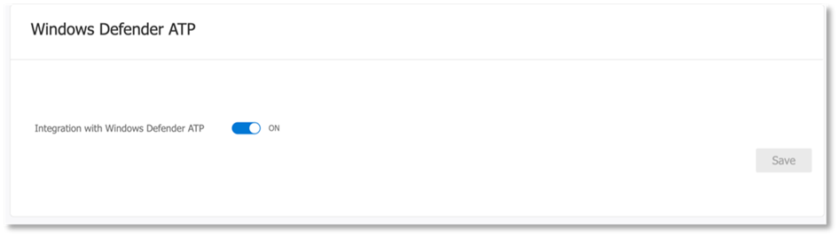

# Configurar os pilares de proteção contra ameaças da Microsoft para seu laboratório de avaliação ou ambiente piloto

[!INCLUDE [Microsoft 365 Defender rebranding](../includes/microsoft-defender.md)]

**Aplica-se a:**
- Proteção contra Ameaças da Microsoft

A criação de um laboratório de avaliação de proteção contra ameaças da Microsoft ou ambiente piloto e sua implantação é um processo de três fases:

 
<table border="0" width="100%" align="center">
  <tr style="text-align:center;">
    <td align="center" style="width:25%; border:0;" >
      <a href= "https://docs.microsoft.com/microsoft-365/security/mtp/prepare-mtpeval?view=o365-worldwide"> 
        
       Fase 1: preparar </a> 
    </td>
     <td align="center">
      <a href="https://docs.microsoft.com/microsoft-365/security/mtp/setup-mtpeval?view=o365-worldwide">
        
       Fase 2: configuração </a> 
    </td>
    <td align="center" bgcolor="#d5f5e3">
      <a href="https://docs.microsoft.com/microsoft-365/security/mtp/config-mtpeval?view=o365-worldwide">
        
       Fase 3: configurar o & integrado </a> 
</td>
  </tr>
</table>

Você está atualmente na fase de configuração.

A preparação é fundamental para qualquer implantação bem-sucedida. Neste artigo, você será orientado nos pontos que precisará considerar ao se preparar para implantar o Microsoft defender ATP.

## Pilares de proteção contra ameaças da Microsoft
A proteção contra ameaças da Microsoft consiste em quatro pilares. Embora um pilar já possa fornecer um valor para a segurança da sua organização de rede, a habilitação dos quatro pilares de proteção contra ameaças da Microsoft dará à sua organização o mais valor.

Esta seção orientará você a configurar:
-   Proteção Avançada contra Ameaças do Office 365
-   Proteção Avançada contra Ameaças do Azure 
-   Segurança no aplicativo na nuvem da Microsoft
-   Proteção avançada contra ameaças do Microsoft Defender

## Configurar a proteção avançada contra ameaças do Office 365

>[!NOTE]
>Pule esta etapa se já tiver habilitado a proteção avançada contra ameaças do Office 365. 

Há um módulo do PowerShell chamado *Office 365 Advanced Threat Protection Configuration Analyzer (orca)* que ajuda a determinar algumas dessas configurações. Ao executar como um administrador em seu locatário, o Get-ORCAReport ajudará a gerar uma avaliação das configurações de higiene de antispam, anti-phishing e outras mensagens. Você pode baixar este módulo no https://www.powershellgallery.com/packages/ORCA/ . 

1. Navegue até a política de gerenciamento de ameaças [do centro de conformidade & segurança do Office 365](https://protection.office.com/homepage)  >  **Threat management**  >  **Policy**.

   
 
2. Clique em **anti-phishing ATP**, selecione **criar** e preencha o nome e a descrição da política. Clique em **Avançar**.

   

   > [!NOTE]
   > Edite a política de anti-phishing avançada da ATP. Altere o **limite de phishing avançado** para **2-agressivo**.

3. Clique no menu suspenso **Adicionar uma condição** e selecione seu (s) domínio (s) como domínio do destinatário. Clique em **Avançar**.

   
 
4. Revise suas configurações. Clique em **criar esta política** para confirmar. 

   
 
5. Selecione **anexos seguros de ATP** e selecione a opção **Ativar ATP para SharePoint, onedrive e Microsoft Teams** .

   

6. Clique no ícone + para criar uma nova política de anexo seguro, aplique-a como domínio de destinatário aos seus domínios. Clique em **Salvar**.

   
 
7. Em seguida, selecione a política de **links seguros de ATP** e clique no ícone de lápis para editar a política padrão.

8. Certifique-se de que a opção **não rastrear quando os usuários clicarem em links seguros** não esteja selecionada, enquanto o restante das opções estiver selecionado. Confira [configurações de links seguros](https://docs.microsoft.com/microsoft-365/security/office-365-security/recommended-settings-for-eop-and-office365-atp) para obter detalhes. Clique em **Salvar**. 

   

9. Em seguida, selecione a política **anti-malware** , selecione o padrão e escolha o ícone de lápis.

10. Clique em **configurações** e selecione **Sim e use o texto de notificação padrão** para habilitar a **resposta de detecção de malware**. Ativar o **filtro de tipos de anexo comuns** . Clique em **Salvar**.

    
  
11. Navegue até [Office 365 Security & centro de conformidade](https://protection.office.com/homepage)  >  **pesquisa**  >  **log de auditoria** pesquisa e ative a auditoria.

    

12. Integrar o Office 365 ATP com o Microsoft defender ATP. Navegue até [Office 365 Security & centro de conformidade](https://protection.office.com/homepage)de  >  **Gerenciamento de ameaças**do centro  >  **Explorer** de conformidade e selecione **configurações do WDATP** no canto superior direito da tela. Na caixa de diálogo conexão ATP do Microsoft defender, ative **conectar ao Windows ATP**.

    

## Configurar a proteção avançada contra ameaças do Azure

>[!NOTE]
>Pule esta etapa se já tiver habilitado a proteção avançada contra ameaças do Azure

1. Navegue até a [central de segurança do Microsoft 365](https://security.microsoft.com/info) > selecione **mais recursos**  >  **proteção avançada contra ameaças do Azure**.

   

2. Clique em **criar** para iniciar o assistente de proteção avançada contra ameaças do Azure. 

   

3. Escolha **fornecer um nome de usuário e senha para se conectar à sua floresta do Active Directory**.  

   

4. Insira suas credenciais locais do Active Directory. Pode ser qualquer conta de usuário que tenha acesso de leitura ao Active Directory.

   

5. Em seguida, escolha **baixar a configuração do sensor** e transferir o arquivo para o controlador de domínio.

   

6. Execute a configuração do sensor ATP do Azure e comece seguindo o assistente.

   
 
7. Clique em **Avançar** no tipo de implantação do sensor.

   
 
8. Copie a chave de acesso porque você precisa inseri-la próxima no assistente.

   
 
9. Copie a chave de acesso no assistente e clique em **instalar**. 

   

10. Parabéns, você configurou com êxito a proteção avançada contra ameaças do Azure no seu controlador de domínio.

    
 
11. Na seção Configurações de [ATP do Azure Azure](https://go.microsoft.com/fwlink/?linkid=2040449) , selecione **Windows Defender ATP**e ative o botão de alternância. Clique em **Salvar**. 

    

>[!NOTE]
>O Windows Defender ATP foi remarcado como Microsoft defender ATP. As alterações de remarcação em todos os nossos portais estão sendo distribuídas para consistência.

## Configurar o Microsoft Cloud app Security

>[!NOTE]
>Pule esta etapa se você já tiver habilitado o Microsoft Cloud app Security. 

1. Navegue até [Microsoft 365 Security Center](https://security.microsoft.com/info)  >  **mais recursos**  >  **Microsoft Cloud app Security**.

   

2. No prompt de informações para integrar o Azure ATP, selecione **habilitar a integração de dados ATP do Azure**.
  
   

   > [!NOTE]
   > Se você não vir esse prompt, pode significar que sua integração de dados ATP do Azure já foi habilitada. No entanto, se você não tiver certeza, entre em contato com seu administrador de ti para confirmar. 

3. Vá para **configurações**, ative a opção de ativação da **integração do Azure ATP** e clique em **salvar**. 

   
   
   > [!NOTE]
   > Para novas instâncias ATP do Azure, esta integração alternada é automaticamente ativada. Confirme se a sua integração do Azure ATP foi habilitada antes de prosseguir para a próxima etapa.
 
4. Nas configurações de descoberta de nuvem, selecione **integração do Microsoft defender ATP**e habilite a integração. Clique em **Salvar**.

   

5. Em configurações de descoberta de nuvem, selecione o **enriquecimento do usuário**e habilite a integração com o Azure Active Directory.

   

## Configurar a proteção avançada contra ameaças do Microsoft defender

>[!NOTE]
>Pule esta etapa se você já tiver habilitado a proteção avançada contra ameaças do Microsoft defender.

1. Navegue até a central de [segurança da Microsoft 365](https://security.microsoft.com/info)  >  **mais recursos**  >  **central de segurança do Microsoft defender**. Clique em **Abrir**. 

   
 
2. Siga o assistente de proteção avançada contra ameaças do Microsoft defender. Clique em **Avançar**. 

   

3. Escolha com base em seu local de armazenamento de dados preferido, política de retenção de dados, tamanho da organização e consentimento para recursos de visualização.

   
   
   > [!NOTE]
   > Você não pode alterar algumas das configurações, como o local de armazenamento de dados, posteriormente. 

   Clique em **Avançar**. 

4. Clique em **continuar** e ele provisionrá o locatário do Microsoft defender ATP.

   

5. Integração dos pontos de extremidade por meio de políticas de grupo, Microsoft Endpoint Manager ou executando um script local para o Microsoft defender ATP. Para simplificar, este guia usa o script local.

6. Clique em **baixar pacote** e copie o script de integração para seus pontos de extremidade.

   

7. No ponto de extremidade, execute o script de integração como administrador e escolha Y. 

   

8. Parabéns, você entrou no primeiro ponto de extremidade.

   

9. Copie-cole o teste de detecção do assistente do Microsoft defender ATP.

   

10. Copie o script do PowerShell para um prompt de comando com privilégios elevados e execute-o. 

    

11. Selecione **começar a usar o Microsoft defender ATP** no assistente.

    
 
12. Visite a [central de segurança do Microsoft defender](https://securitycenter.windows.com/). Vá até **configurações** e selecione **recursos avançados**. 

    

13. Ative a integração com a **proteção avançada contra ameaças do Azure**.  

    

14. Ative a integração com a **inteligência contra ameaças do Office 365**.

    

15. Ative a integração com **o Microsoft Cloud app Security**.

    

16. Role para baixo e clique em **salvar preferências** para confirmar as novas integrações.

    

## Iniciar o serviço da Proteção contra Ameaças da Microsoft

>[!NOTE]
>A partir de 1º de junho de 2020, a Microsoft habilita automaticamente os recursos de proteção contra ameaças da Microsoft para todos os locatários qualificados. Confira este [artigo da comunidade técnica da Microsoft sobre a qualificação de licença](https://techcommunity.microsoft.com/t5/security-privacy-and-compliance/microsoft-threat-protection-will-automatically-turn-on-for/ba-p/1345426) para obter detalhes. 

Vá para a [central de segurança do Microsoft 365](https://security.microsoft.com/homepage). Navegue até **configurações** e selecione **proteção contra ameaças da Microsoft**.

  

Para obter uma orientação mais abrangente, consulte [ativar a proteção contra ameaças da Microsoft](mtp-enable.md). 

Parabéns! Você acabou de criar o laboratório de avaliação de proteção contra ameaças da Microsoft ou o ambiente piloto! Agora você pode se familiarizar com a interface de usuário da proteção contra ameaças da Microsoft! Veja o que você pode aprender no seguinte guia interativo de proteção contra ameaças da Microsoft e saiba como usar cada painel para suas tarefas de operação de segurança diárias.

>[!VIDEO https://aka.ms/MTP-Interactive-Guide]

Em seguida, você pode simular um ataque e ver como os recursos de produtos cruzam detectar, criar alertas e responder automaticamente a um ataque sem arquivo em um ponto de extremidade.

## Próxima etapa
|  [Fase de simulação de ataque](mtp-pilot-simulate.md) | Execute a simulação de ataque para seu ambiente piloto de proteção contra ameaças da Microsoft.
|:-------|:-----|
