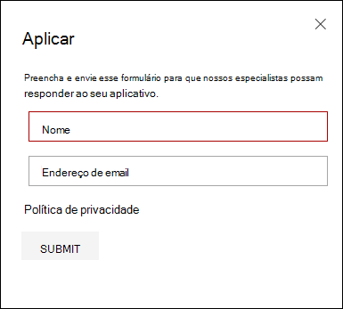
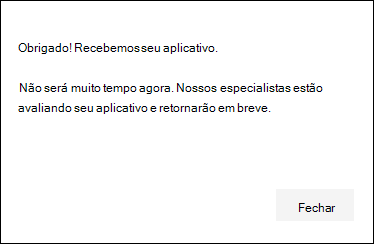
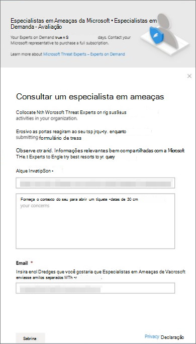

# Configurar e gerenciar recursos Especialistas em Ameaças da Microsoft por meio do Microsoft 365 DefenderConfigure and manage Microsoft Threat Experts capabilities through Microsoft 365 Defender

[!INCLUDE [Microsoft 365 Defender rebranding](../includes/microsoft-defender.md)]

**Aplica-se a:****Applies to:**

- [Microsoft 365 DefenderMicrosoft 365 Defender](https://go.microsoft.com/fwlink/?linkid=2118804)
- [Microsoft Defender para Ponto de ExtremidadeMicrosoft Defender for Endpoint](https://go.microsoft.com/fwlink/p/?linkid=2154037)

[!INCLUDE [Prerelease](../includes/prerelease.md)]

## Antes de começarBefore you begin

> [!IMPORTANT]
> Antes de aplicar, certifique-se de discutir os requisitos de qualificação para o serviço de busca de ameaças gerenciadas Especialistas em Ameaças da Microsoft – Notificações de Ataque Direcionadas com seu provedor de Serviços Técnicos da Microsoft e sua equipe de conta.Before you apply, make sure to discuss the eligibility requirements for the Microsoft Threat Experts – Targeted Attack Notifications managed threat hunting service with your Microsoft Technical Service provider and account team.

Para receber notificações de ataque direcionadas, você precisará ter o Defender Microsoft 365 implantado com dispositivos inscritos.To receive targeted attack notifications, you'll need to have Microsoft 365 Defender deployed with devices enrolled. Em seguida, envie um aplicativo por meio do portal M365 para Especialistas em Ameaças da Microsoft - Notificações de Ataque Direcionado.Then, submit an application through the M365 portal for Microsoft Threat Experts - Targeted Attack Notifications.

Entre em contato com sua equipe de conta ou representante da Microsoft para assinar Especialistas em Ameaças da Microsoft - Especialistas sob Demanda.Contact your account team or Microsoft representative to subscribe to Microsoft Threat Experts - Experts on Demand. Os especialistas sob demanda permitem que você consulte nossos especialistas em ameaças sobre como proteger sua organização contra detecções e adversários relevantes.Experts on Demand lets you consult with our threat experts on how to protect your organization from relevant detections and adversaries.

## Aplicar para Especialistas em Ameaças da Microsoft - Serviço de Notificações de Ataque DirecionadoApply for Microsoft Threat Experts - Targeted Attack Notifications service

Se você já tiver o Microsoft Defender para o Ponto de Extremidade e o Microsoft 365 Defender, você poderá solicitar Especialistas em Ameaças da Microsoft – Notificações de Ataque Direcionadas por meio do portal Microsoft 365 Defender.If you already have Microsoft Defender for Endpoint and Microsoft 365 Defender, you can apply for Microsoft Threat Experts – Targeted Attack Notifications through their Microsoft 365 Defender portal.  As notificações de ataque direcionadas concedem informações e análises especiais para ajudar a identificar as ameaças mais críticas à sua organização, para que você possa responder a elas rapidamente.Targeted attack notifications grant you special insight and analysis to help identify the most critical threats to your organization, so you can respond to them quickly.

1. No painel de navegação, vá para Configurações > **Endpoints > recursos**> recursos avançados > Especialistas em Ameaças da Microsoft - Notificações de Ataque Direcionado.From the navigation pane, go to **Settings > Endpoints > General > Advanced features > Microsoft Threat Experts - Targeted Attack Notifications**.

2. Selecione **Aplicar**.Select **Apply**.

    

3. Insira seu nome e endereço de email para que a Microsoft possa entrar em contato com você sobre seu aplicativo.Enter your name and email address so that Microsoft can contact you about your application.

    

4. Leia a [instrução de](https://privacy.microsoft.com/en-us/privacystatement)privacidade e selecione **Enviar** quando terminar.Read the [privacy statement](https://privacy.microsoft.com/en-us/privacystatement), then select **Submit** when you're done. Você receberá um email de boas-vindas depois que seu aplicativo for aprovado.You'll receive a welcome email once your application is approved.

    

5. Depois de receber seu email de boas-vindas, você começará automaticamente a receber notificações de ataque direcionadas.After you receive your welcome email, you'll automatically start receiving targeted attack notifications.

6. Você pode verificar seu status visitando Configurações > pontos de **extremidade > recursos > avançados.**You can verify your status by visiting **Settings > Endpoints > General > Advanced features**. Depois de aprovado, a Especialistas em Ameaças da Microsoft **- Alternância** de Notificação de Ataque Direcionada ficará visível e **comutado**.Once approved, the **Microsoft Threat Experts - Targeted Attack Notification** toggle will be visible and switched **On**.

## Onde você verá as notificações de ataque direcionadas de Especialistas em Ameaças da MicrosoftWhere you'll see the targeted attack notifications from Microsoft Threat Experts

Você pode receber uma notificação de ataque direcionada Especialistas em Ameaças da Microsoft pelos seguintes meios:You can receive targeted attack notification from Microsoft Threat Experts through the following mediums:

- A Microsoft 365 **incidentes** do portal do DefenderThe Microsoft 365 Defender portal's **Incidents** page
- O Microsoft 365 painel **Alertas do** portal do DefenderThe Microsoft 365 Defender portal's **Alerts** dashboard
- API de alerta OData [e API](/windows/security/threat-protection/microsoft-defender-atp/get-alerts) [REST](/windows/security/threat-protection/microsoft-defender-atp/pull-alerts-using-rest-api)OData alerting [API](/windows/security/threat-protection/microsoft-defender-atp/get-alerts) and [REST API](/windows/security/threat-protection/microsoft-defender-atp/pull-alerts-using-rest-api)
- [Tabela DeviceAlertEvents](/windows/security/threat-protection/microsoft-defender-atp/advanced-hunting-devicealertevents-table) em Busca Avançada[DeviceAlertEvents](/windows/security/threat-protection/microsoft-defender-atp/advanced-hunting-devicealertevents-table) table in Advanced hunting
- Sua caixa de entrada, se você optar por ter notificações de ataque direcionadas enviadas por email.Your inbox, if you choose to have targeted attack notifications sent to you via email. Consulte [Criar uma regra de notificação de email](#create-an-email-notification-rule) abaixo.See [Create an email notification rule](#create-an-email-notification-rule) below.

### Criar uma regra de notificação de emailCreate an email notification rule

Você pode criar regras para enviar notificações por email para destinatários de notificação.You can create rules to send email notifications for notification recipients. Para obter detalhes  [completos,](/windows/security/threat-protection/microsoft-defender-atp/configure-email-notifications) consulte Configure alert notifications to create, edit, delete, or troubleshoot email notification.For full details, see  [Configure alert notifications](/windows/security/threat-protection/microsoft-defender-atp/configure-email-notifications) to create, edit, delete, or troubleshoot email notification.

## Exibir notificações de ataque direcionadasView targeted attack notifications

Você começará a receber uma notificação de ataque direcionada Especialistas em Ameaças da Microsoft seu email depois de configurar seu sistema para receber a notificação por email.You'll start receiving targeted attack notification from Microsoft Threat Experts in your email after you have configured your system to receive email notification.

1. Selecione o link no email para ir para o contexto de alerta correspondente no painel marcado com **especialistas em ameaças.**Select the link in the email to go to the corresponding alert context in the dashboard tagged with **Threat experts**.

2. Na página **Alertas,** selecione o mesmo tópico de alerta que você recebeu no email, para exibir mais detalhes.From the **Alerts** page, select the same alert topic as the one you received in the email, to view further details.

## Inscrever-Especialistas em Ameaças da Microsoft - Especialistas sob DemandaSubscribe to Microsoft Threat Experts - Experts on Demand

Se você já for um cliente do Microsoft Defender para Ponto de Extremidade, entre em contato com seu representante da Microsoft para assinar o Especialistas em Ameaças da Microsoft - Especialistas sob Demanda.If you're already a Microsoft Defender for Endpoint customer, you can contact your Microsoft representative to subscribe to Microsoft Threat Experts - Experts on Demand.

## Consulte um especialista em ameaças da Microsoft sobre atividades suspeitas de segurança cibernética em sua organizaçãoConsult a Microsoft threat expert about suspicious cybersecurity activities in your organization

Você pode entrar em Especialistas em Ameaças da Microsoft de dentro do portal Microsoft 365 Defender.You can contact Microsoft Threat Experts from inside the Microsoft 365 Defender portal. Os especialistas podem ajudá-lo a entender ameaças complexas e notificações de ataque direcionadas.Experts can help you understand complex threats and targeted attack notifications. Partner with experts for further details about alerts and incidents, or advice on handling compromise.Partner with experts for further details about alerts and incidents, or advice on handling compromise. Obtenha informações sobre o contexto de inteligência de ameaças descrito pelo painel do portal.Gain insight into the threat intelligence context described by your portal dashboard.

> [!NOTE]
>
> - As consultas de alerta relacionadas aos dados de inteligência de ameaças personalizadas da sua organização não são suportadas no momento.Alert inquiries related to your organization's customized threat intelligence data are not currently supported. Consulte suas operações de segurança ou equipe de resposta a incidentes para obter detalhes.Consult with your security operations or incident response team for details.
> - Você precisa ter a permissão **Gerenciar** configurações de segurança no Centro de Segurança no portal Microsoft 365 Defender para enviar uma consulta por meio do formulário Consultar um especialista **em** ameaças.You need to have the **Manage security settings in Security Center** permission in the Microsoft 365 Defender portal to submit an inquiry through the **Consult a threat expert** form.

1. Navegue até a página do portal relacionada às informações que você gostaria de investigar: por exemplo, **Device**, **Alert** ou **Incident**.Navigate to the portal page related to the information that you'd like to investigate: for example, **Device**, **Alert**, or **Incident**. Certifique-se de que a página do portal relacionada à sua investigação está em exibição antes de enviar uma solicitação de investigação.Make sure that the portal page related to your inquiry is in view before you send an investigation request.

2. No menu superior, selecione **? Consulte um especialista em ameaças.**From the top menu, select **? Consult a threat expert**.

    

    Uma tela de sobrevoo será aberta.A flyout screen will open.

    O header indicará se você está em uma assinatura de avaliação ou uma assinatura completa Especialistas em Ameaças da Microsoft - Especialistas sob Demanda.The header will indicate if you are on a trial subscription, or a full Microsoft Threat Experts - Experts on-Demand subscription.

    

    O **campo tópico** Investigação já será preenchido com o link para a página relevante para sua solicitação.The **Investigation topic** field will already be populated with the link to the relevant page for your request.

3. No próximo campo, forneça informações suficientes para fornecer à Especialistas em Ameaças da Microsoft contexto suficiente para iniciar a investigação.In the next field, provide enough information to give the Microsoft Threat Experts enough context to start the investigation.

4. Insira o endereço de email que você gostaria de usar para corresponder Especialistas em Ameaças da Microsoft.Enter the email address that you'd like to use to correspond with Microsoft Threat Experts.

> [!NOTE]
> Se você quiser acompanhar o status de seus casos de Especialistas sob Demanda por meio do Microsoft Services Hub, entre em contato com seu gerente de conta técnica.If you would like to track the status of your Experts on Demand cases through Microsoft Services Hub, reach out to your technical account manager.

Assista a este vídeo para uma visão geral rápida do Microsoft Services Hub.Watch this video for a quick overview of the Microsoft Services Hub.

> [!VIDEO https://www.microsoft.com/videoplayer/embed/RE4pk9f]

## Tópicos de investigação de exemploSample investigation topics

### Informações de alertaAlert information

- Vimos um novo tipo de alerta para um binário de vida fora da terra.We saw a new type of alert for a living-off-the-land binary. Podemos fornecer a ID do alerta.We can provide the alert ID. Você pode nos contar mais sobre esse alerta e como podemos investigar isso ainda mais?Can you tell us more about this alert and how we can investigate it further?
- Observamos dois ataques semelhantes, que tentam executar scripts mal-intencionados do PowerShell, mas geram alertas diferentes.We've observed two similar attacks, which both try to execute malicious PowerShell scripts but generate different alerts. Uma é "Linha de comando suspeita do PowerShell" e a outra é "Um arquivo mal-intencionado foi detectado com base na indicação fornecida pelo O365".One is "Suspicious PowerShell command line" and the other is "A malicious file was detected based on indication provided by O365". Qual é a diferença?What is the difference?
- Recebemos um alerta ímpar hoje sobre um número anormal de logins com falha do dispositivo de um usuário de alto perfil.We received an odd alert today about an abnormal number of failed logins from a high profile user’s device. Não é possível encontrar mais evidências para essas tentativas.We can't find any further evidence for these attempts. Como o Microsoft 365 Defender pode ver essas tentativas?How can Microsoft 365 Defender see these attempts? Que tipo de logon está sendo monitorado?What type of logins are being monitored?
- Você pode dar mais contexto ou visão sobre o alerta, "Comportamento suspeito por um utilitário do sistema foi observado"?Can you give more context or insight about the alert, "Suspicious behavior by a system utility was observed"?
- Eu observava um alerta intitulado "Criação de regra de encaminhamento/redirecionamento".I observed an alert titled "Creation of forwarding/redirect rule". Acredito que a atividade seja benigna.I believe the activity is benign. Pode me dizer por que recebi um alerta?Can you tell me why I received an alert?

### Possível comprometimento do computadorPossible machine compromise

- Você pode ajudar a explicar por que vemos uma mensagem ou um alerta para "Processo desconhecido observado" em muitos dispositivos em nossa organização?Can you help explain why we see a message or alert for "Unknown process observed" on many devices in our organization? Agradecemos qualquer entrada para esclarecer se essa mensagem ou alerta está relacionado a atividades mal-intencionadas.We appreciate any input to clarify whether this message or alert is related to malicious activity.
- Você pode ajudar a validar um possível comprometimento no sistema a seguir, datado da semana passada?Can you help validate a possible compromise on the following system, dating from last week? Ele está se comportando da mesma forma que uma detecção de malware anterior no mesmo sistema há seis meses.It's behaving similarly as a previous malware detection on the same system six months ago.

### Detalhes da inteligência contra ameaçasThreat intelligence details

- Detectamos um email de phishing que entregava um documento mal-intencionado do Word a um usuário.We detected a phishing email that delivered a malicious Word document to a user. O documento causou uma série de eventos suspeitos, que dispararam vários alertas para uma família de malware específica.The document caused a series of suspicious events, which triggered multiple alerts for a particular malware family. Você tem alguma informação sobre esse malware?Do you have any information on this malware? Se sim, você pode nos enviar um link?If yes, can you send us a link?
- Recentemente, vimos uma postagem de blog sobre uma ameaça que está direcionando nosso setor.We recently saw a blog post about a threat that is targeting our industry. Você pode nos ajudar a entender que proteção o Defender Microsoft 365 oferece contra esse ator de ameaças?Can you help us understand what protection Microsoft 365 Defender provides against this threat actor?
- Recentemente, observamos uma campanha de phishing conduzida contra nossa organização.We recently observed a phishing campaign conducted against our organization. Você pode nos dizer se isso foi direcionado especificamente para nossa empresa ou vertical?Can you tell us if this was targeted specifically to our company or vertical?

### Especialistas em Ameaças da Microsoft de alertaMicrosoft Threat Experts’ alert communications

- Sua equipe de resposta a incidentes pode nos ajudar a lidar com a notificação de ataque direcionada que temos?Can your incident response team help us address the targeted attack notification that we got?
- Recebemos essa notificação de ataque direcionada Especialistas em Ameaças da Microsoft.We received this targeted attack notification from Microsoft Threat Experts. Não temos nossa própria equipe de resposta a incidentes.We don’t have our own incident response team. O que podemos fazer agora e como podemos conter o incidente?What can we do now, and how can we contain the incident?
- Recebemos uma notificação de ataque direcionada de Especialistas em Ameaças da Microsoft.We received a targeted attack notification from Microsoft Threat Experts. Quais dados você pode fornecer para nós que podemos passar para nossa equipe de resposta a incidentes?What data can you provide to us that we can pass on to our incident response team?

> [!NOTE]
> Especialistas em Ameaças da Microsoft é um serviço gerenciado de busca de ameaças e não um serviço de resposta a incidentes.Microsoft Threat Experts is a managed threat hunting service and not an incident response service. No entanto, os especialistas podem fazer a transição perfeita da investigação para os serviços de Equipe de Detecção e Resposta do Grupo de Soluções de Segurança Cibernética (CSG), quando necessário.However, the experts can seamlessly transition the investigation to Microsoft Cybersecurity Solutions Group (CSG)'s Detection and Response Team (DART) services, when necessary. Você também pode optar por se envolver com sua própria equipe de resposta a incidentes para resolver problemas que exigem uma resposta a incidentes.You can also opt to engage with your own incident response team to address issues that requires an incident response.

## CenárioScenario

### Receber um relatório de progresso sobre sua investigação de busca gerenciadaReceive a progress report about your managed hunting inquiry

A resposta do Especialistas em Ameaças da Microsoft irá variar de acordo com sua investigação.The response from Microsoft Threat Experts will vary according to your inquiry. Geralmente, você receberá uma das seguintes respostas:You'll generally receive one of the following responses:

- Mais informações são necessárias para continuar com a investigaçãoMore information is needed to continue with the investigation
- Um arquivo ou vários exemplos de arquivo são necessários para determinar o contexto técnicoA file or several file samples are needed to determine the technical context
- A investigação requer mais tempoInvestigation requires more time
- As informações iniciais foram suficientes para concluir a investigaçãoInitial information was enough to conclude the investigation

Se um especialista solicitar mais informações ou amostras de arquivo, é fundamental responder rapidamente para manter a investigação em andamento.If an expert requests more information or file samples, it's crucial to respond quickly to keep the investigation moving.

## Confira tambémSee also

- [Visão geral dos Especialistas em Ameaças da MicrosoftMicrosoft Threat Experts overview](microsoft-threat-experts.md)
