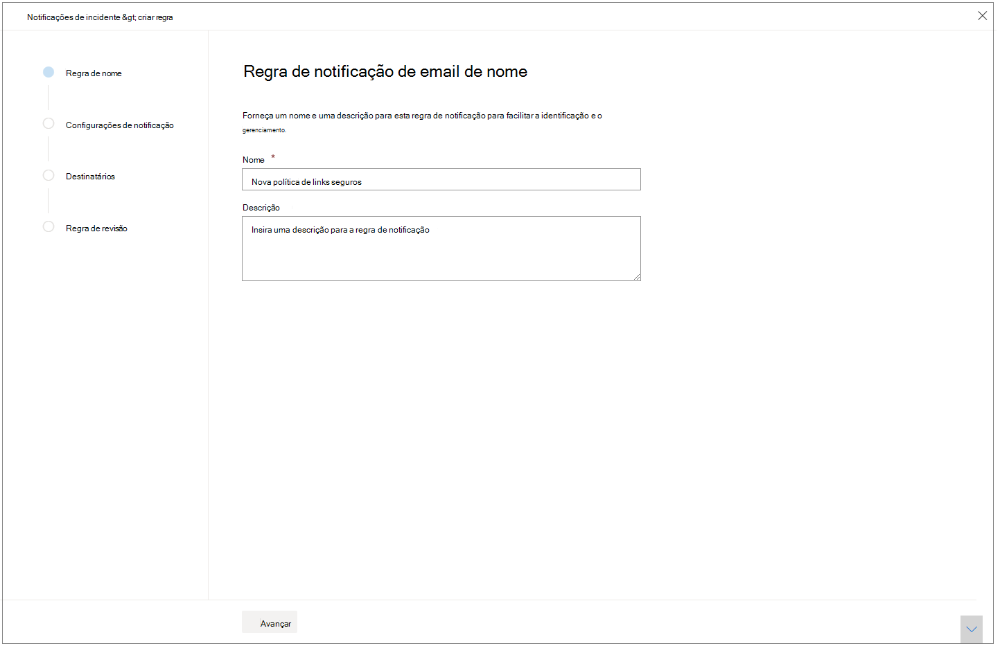
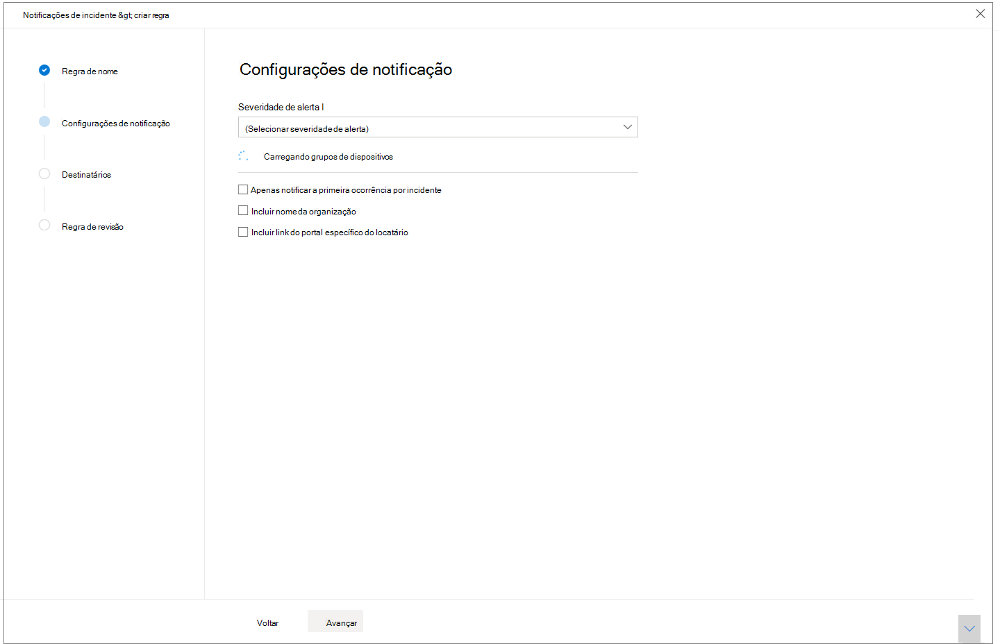
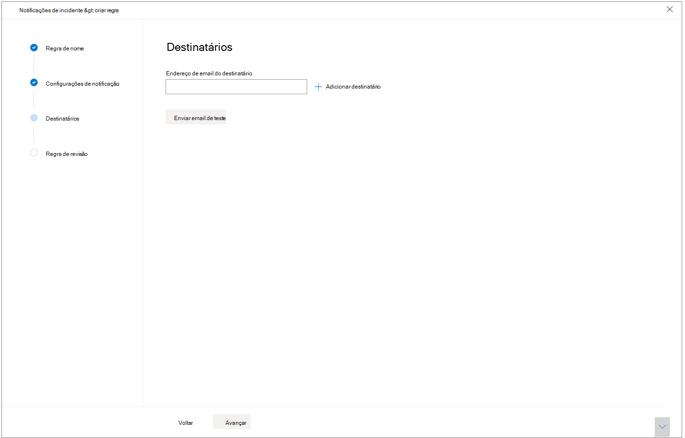

# Obter notificações de incidentes por email

[!INCLUDE [Microsoft 365 Defender rebranding](../includes/microsoft-defender.md)]

>[!IMPORTANT]
> O recurso notificações por email para incidentes está atualmente em visualização pública. Algumas informações sobre esse recurso podem ser alteradas antes da disponibilidade comercial. Microsoft makes no warranties, express or implied, with respect to the information provided here.

**Aplica-se a:**
- Microsoft 365 Defender

Você pode configurar o Microsoft 365 defender para notificá-lo por email sempre que houver novos incidentes ou novas atualizações nos incidentes existentes. 

Você pode optar por obter notificações com base na severidade de incidentes ou no grupo de dispositivos. Você também pode optar por obter uma notificação somente na primeira atualização por incidente.

Você pode adicionar ou remover destinatários nas notificações por email. Destinatários adicionados recentemente são notificados sobre incidentes depois de adicionados. 

A notificação por email contém detalhes importantes sobre o incidente como o nome do incidente, severidade e categorias, entre outros. Você também pode ir diretamente para incidentes, para que possa começar sua investigação imediatamente. Para saber mais sobre incidentes de investigação, consulte [investigar incidentes no Microsoft 365 defender](https://docs.microsoft.com/microsoft-365/security/mtp/investigate-incidents).

>[!NOTE]
>Você precisa de ' Gerenciar configurações de segurança ' para definir as configurações de notificação por email. Se você optou por usar o gerenciamento de permissões básicas, os usuários com funções de administrador de segurança ou administrador global poderão configurar notificações por email para você.    
Da mesma forma, se sua organização estiver usando o controle de acesso baseado em função (RBAC), você só poderá criar, editar, excluir e receber notificações com base nos grupos de dispositivos que você tem permissão para gerenciar.

## Criar regras para notificações de incidentes

Para configurar sua primeira notificação de email para incidentes, crie uma nova regra e personalize as configurações de notificação de email.

1. No painel de navegação, selecione **configurações**  >  **notificações de email de incidente**.
2. Selecione **Adicionar item**.
3. Dê um nome à regra em **nome** e forneça uma **Descrição**.

     
4. Selecione **Avançar** para ir para **configurações de notificação**. Aqui você pode especificar:
    - **Severidade do alerta** -escolha a severidade do alerta que iniciará uma notificação de incidente. Por exemplo, se você deseja ser informado apenas sobre incidentes de alta gravidade, selecione alto.
    - **Escopo do grupo de dispositivos** -essa lista suspensa exibe todos os grupos de dispositivos que o usuário pode acessar. Selecione para quais grupos de dispositivos você está criando as regras de notificação de incidente.
    - **Somente notificar a primeira ocorrência por incidente** -a seleção dessa opção enviará uma notificação por email somente no primeiro alerta que corresponda às outras seleções. Atualizações ou alertas posteriores relacionados ao incidente não acionarão uma notificação.
    - **Incluir nome da organização** : indica se o nome do cliente aparece na notificação por email ou não.
    - **Incluir link do portal específico do locatário** – adiciona um link com a ID do locatário para permitir o acesso a um locatário específico.
    
    
5. Selecione **Avançar** para ir para a seção **destinatários** . Aqui você pode especificar endereços de email que receberão as notificações por email de incidentes. Selecione **Adicionar um destinatário** depois de digitar todos os endereços de email.

     

6. Por fim, selecione **Avançar** para ir para a **regra de revisão** , para que você possa ver todas as configurações associadas à nova regra. Os destinatários começarão a receber notificações de incidentes por email com base nas configurações.

## Também consulte
- [Visão geral de incidentes no Microsoft 365 defender](https://docs.microsoft.com/microsoft-365/security/mtp/incidents-overview)
- [Priorizar incidentes no Microsoft 365 defender](https://docs.microsoft.com/microsoft-365/security/mtp/incident-queue)
- [Investigue incidentes no Microsoft 365 defender](https://docs.microsoft.com/microsoft-365/security/mtp/investigate-incidents)

