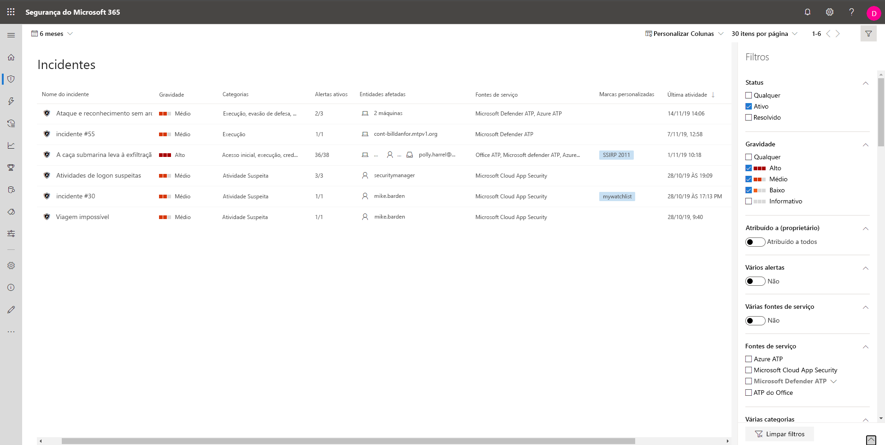

# Priorizar Incidentes na Proteção contra Ameaças da MicrosoftPrioritize incidents in Microsoft Threat Protection

**Aplica-se a:****Applies to:**
- Proteção contra Ameaças da MicrosoftMicrosoft Threat Protection

[!include[Prerelease information](prerelease.md)]

A Proteção contra Ameaças da Microsoft aplica a análise de correlação e agrega todas as investigações e alertas relacionados de diferentes produtos em um incidente.Microsoft Threat Protection applies correlation analytics and aggregates all related alerts and investigations from different products into one incident. A Proteção contra Ameaças da Microsoft também disparará alertas exclusivos em atividades que só podem ser identificadas como mal-intencionadas, tendo em conta a visibilidade de ponta a ponta que a Proteção contra Ameaças da Microsoft tem em todo o estado e pacote de produtos.Microsoft Threat Protection also triggers unique alerts on activities that can only be identified as malicious given the end-to-end visibility that Microsoft Threat Protection has across the entire estate and suite of products. Ao fazer isso, a Proteção contra Ameaças da Microsoft conta a história mais completa do ataque, permitindo que um analista de operações de segurança entenda e lide com ameaças complexas em toda a organização.By doing so, Microsoft Threat Protection narrates the broader attack story, allowing a security operations analyst to understand and deal with complex threats across the organization.

A **Fila de incidentes** exibe um conjunto de incidentes sinalizados de vários dispositivos, usuários e caixas de correio.The **Incidents queue** shows a collection of incidents that were flagged from across devices, users, and mailboxes. Isso ajuda a classificar incidentes e criar uma decisão de resposta de segurança cibernética embasada.It helps you sort through incidents to prioritize and create an informed cybersecurity response decision.

 

Por padrão, a fila no centro de segurança do Microsoft 365 exibe os incidentes vistos nos últimos 30 dias, com o incidente mais recente exibido na parte superior da lista, ajudando a visualizar os incidentes mais recentes primeiro.By default, the queue in the Microsoft 365 security center displays incidents seen in the last 30 days, with the most recent incident showing at the top of the list, helping you see the most recent incidents first.

A fila de incidentes expõe colunas personalizáveis que fornecem visibilidade de diferentes características do incidente ou das entidades contidas, ajudando a tomar uma decisão embasada sobre a priorização de incidentes a serem tratados.The incident queue exposes customizable columns that give you visibility into different characteristics of the incident or the contained entities, helping you make an informed decision regarding prioritization of incidents to handle. 

A fila de incidentes também expõe várias opções de filtragem que, quando aplicadas, permitem a escolha de executar uma visão geral de todos os incidentes existentes em seu ambiente ou de se concentrar em um cenário ou ameaça específica.The incident queue also exposes multiple filtering options, that when applied, enable you to choose to perform a broad sweep of all existing incidents in your environment, or decide to focus on a specific scenario or threat. A aplicação de filtros na fila de incidentes pode ajudar a determinar qual incidente exige atenção imediata.Applying filters on the incident queue can help determine which incident requires immediate attention. 

## Filtros disponíveisAvailable filters

### StatusStatus
Você pode optar por limitar a lista de incidentes exibidos com base em seu status para ver quais estão ativos ou resolvidos.You can choose to limit the list of incidents shown based on their status to see which ones are active or resolved.

### GravidadeSeverity
A gravidade de um incidente indica o impacto que pode ter em seus ativos.The severity of an incident is indicative of the impact it can have in your assets. Quanto maior a gravidade, maior o impacto e, normalmente, exige atenção imediata.The higher the severity the bigger the impact and typically requires the most immediate attention. 

### Atribuído a (proprietário)Assigned to (owner)
Você pode optar por filtrar a lista selecionando não atribuir a ninguém ou os que estão atribuídos a você.You can choose to filter the list by selecting assigned to anyone or ones that are assigned to you.

### Vários alertasMultiple alerts 
Filtre para ver somente os incidentes com mais de um alerta.Filter to see only incidents containing more than one alert. Isso pode ser uma indicação de um ataque que é mais complexo ou progredido no kill chain.This could be an indication for an attack that is more complex or progressed in the kill chain. 

### Várias fontes de serviçoMultiple service sources 
Filtrar para exibir somente incidentes com alertas de diferentes fontes (Microsoft Defender ATP, Microsoft Cloud App Security, Azure ATP, Office 365 ATP)Filter to only see incidents that contain alerts from different sources (Microsoft Defender ATP, Microsoft Cloud App Security, Azure ATP, Office 365 ATP)
### Fontes de serviçoService sources
Ao escolher uma fonte específica, é possível se concentrar em incidentes com pelo menos um alerta da fonte escolhida.By choosing a specific source, you can focus on incidents that contain at least one alert from that chosen source. 

### Várias categoriasMultiple categories are supported. 
Você pode optar por ver apenas os incidentes que estão mapeados em várias categorias do kill chain e que podem causar mais danos.You can choose to see only incidents that have mapped to multiple categories of the kill chain and can potentially cause more damage. 

### CategoriasCategories
Escolha categorias específicas para se concentrar em uma etapa específica no kill chainChoose specific categories to focus on a specific step in the kill chain

### Confidencialidade de dadosData sensitivity
Alguns ataques se concentram no direcionamento para exfiltrar dados confidenciais ou valiosos.Some attacks focus on targeting to exfiltrate sensitive or valuable data. Ao aplicar um filtro para ver se os dados confidenciais estão envolvidos no incidente, você pode determinar rapidamente se as informações confidenciais estão potencialmente comprometidas e priorizar o tratamento desses incidentes.By applying a filter to see if sensitive data is involved in the incident, you can quickly determine if sensitive information has potentially been compromised and prioritize addressing those incidents.

>[!NOTE]
>Só é aplicável se a Proteção de Informações da Microsoft estiver ativada.Only applicable if Microsoft Information Protection is turned on.

## Próximas etapasNext steps
Após determinar qual incidente requer a prioridade mais alta, você pode continuar a fazer um trabalho mais investigativo em um incidente.After you've determined which incident requires the highest priority, you can proceed to do further investigative work on an incident.
- [Investigar incidentesInvestigate incidents](investigate-incidents.md)

## Tópicos relacionadosRelated topics
- [Visão geral dos incidentesIncidents overview](incidents-overview.md)
- [Investigar incidentesInvestigate incidents](investigate-incidents.md)
- [Gerenciar incidentesManage incidents](manage-incidents.md)