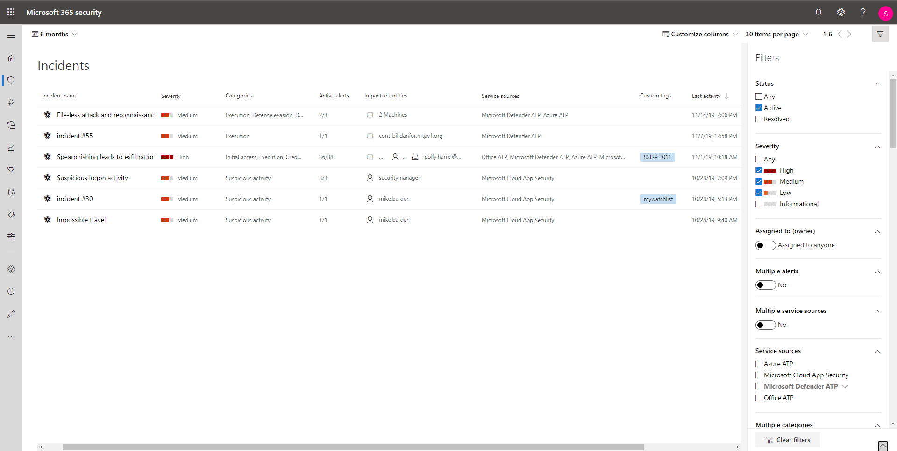

# Priorizar Incidentes na Proteção contra Ameaças da Microsoft

**Aplica-se a:**
- Proteção contra Ameaças da Microsoft

A Proteção contra Ameaças da Microsoft aplica a análise de correlação e agrega todas as investigações e alertas relacionados de diferentes produtos em um incidente. A Proteção contra Ameaças da Microsoft também disparará alertas exclusivos em atividades que só podem ser identificadas como mal-intencionadas, tendo em conta a visibilidade de ponta a ponta que a Proteção contra Ameaças da Microsoft tem em todo o estado e pacote de produtos. Ao fazer isso, a Proteção contra Ameaças da Microsoft conta a história mais completa do ataque, permitindo que um analista de operações de segurança entenda e lide com ameaças complexas em toda a organização.

A **Fila de incidentes** exibe um conjunto de incidentes sinalizados de vários dispositivos, usuários e caixas de correio. Isso ajuda a classificar incidentes e criar uma decisão de resposta de segurança cibernética embasada.

 

Por padrão, a fila no centro de segurança do Microsoft 365 exibe os incidentes vistos nos últimos 30 dias, com o incidente mais recente exibido na parte superior da lista, ajudando a visualizar os incidentes mais recentes primeiro.

A fila de incidentes expõe colunas personalizáveis que fornecem visibilidade de diferentes características do incidente ou das entidades contidas, ajudando a tomar uma decisão embasada sobre a priorização de incidentes a serem tratados. 

A fila de incidentes também expõe várias opções de filtragem que, quando aplicadas, permitem a escolha de executar uma visão geral de todos os incidentes existentes em seu ambiente ou de se concentrar em um cenário ou ameaça específica. A aplicação de filtros na fila de incidentes pode ajudar a determinar qual incidente exige atenção imediata. 

## Filtros disponíveis

### Status
Você pode optar por limitar a lista de incidentes exibidos com base em seu status para ver quais estão ativos ou resolvidos.

### Gravidade
A gravidade de um incidente indica o impacto que pode ter em seus ativos. Quanto maior a gravidade, maior o impacto e, normalmente, exige atenção imediata. 

### Atribuído a (proprietário)
Você pode optar por filtrar a lista selecionando não atribuir a ninguém ou os que estão atribuídos a você.

### Vários alertas 
Filtre para ver somente os incidentes com mais de um alerta. Isso pode ser uma indicação de um ataque que é mais complexo ou progredido no kill chain. 

### Várias fontes de serviço 
Filtrar para exibir somente incidentes com alertas de diferentes fontes (Microsoft Defender ATP, Microsoft Cloud App Security, Azure ATP, Office 365 ATP)
### Fontes de serviço
Ao escolher uma fonte específica, é possível se concentrar em incidentes com pelo menos um alerta da fonte escolhida. 

### Várias categorias 
Você pode optar por ver apenas os incidentes que estão mapeados em várias categorias do kill chain e que podem causar mais danos. 

### Categorias
Escolha categorias específicas para se concentrar em uma etapa específica no kill chain

### Confidencialidade de dados
Alguns ataques se concentram no direcionamento para exfiltrar dados confidenciais ou valiosos. Ao aplicar um filtro para ver se os dados confidenciais estão envolvidos no incidente, você pode determinar rapidamente se as informações confidenciais estão potencialmente comprometidas e priorizar o tratamento desses incidentes.

>[!NOTE]
>Só é aplicável se a Proteção de Informações da Microsoft estiver ativada.

## Próximas etapas
Após determinar qual incidente requer a prioridade mais alta, você pode continuar a fazer um trabalho mais investigativo em um incidente.
- [Investigar incidentes](investigate-incidents.md)

## Tópicos relacionados
- [Visão geral dos incidentes](incidents-overview.md)
- [Investigar incidentes](investigate-incidents.md)
- [Gerenciar incidentes](manage-incidents.md)
