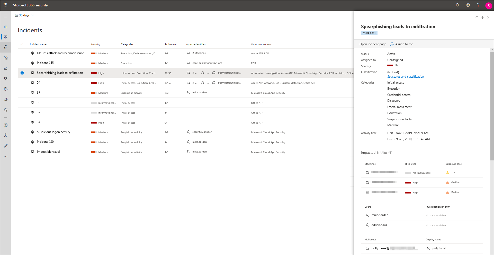
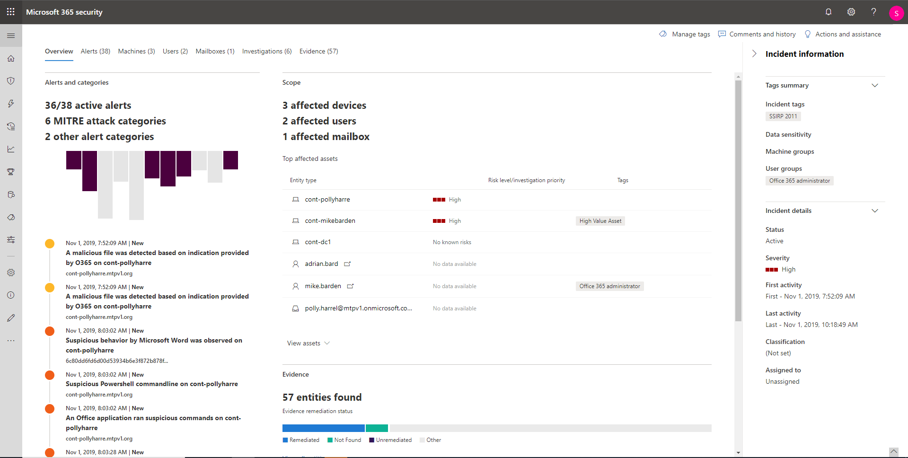

# Investigar incidentes na Proteção contra Ameaças da Microsoft

**Aplica-se a:**
- Proteção contra Ameaças da Microsoft

A proteção contra ameaças da Microsoft agrega todos os alertas, ativos, investigações e evidências relacionados a todos os seus dispositivos, usuários e caixas de correio para fornecer uma visão abrangente de toda a amplitude de um ataque. 

Investigue os alertas que afetam a sua rede, entenda o que cada um significa e agrupe as evidências associadas aos incidentes para planejar uma correção eficaz. 

## Investigar um incidente

1. Selecionar um incidente na fila de incidentes.   Isso abre um painel lateral e fornece uma visualização de informações importantes como status, gravidade, categorias e entidades afetadas.

    

2. Selecione **Abrir página do incidente**.   Isso abre a página Incidente, com mais informações detalhadas do incidente, comentários e ações, guias (visão geral, alertas, dispositivos, usuários, investigações, evidências).

3. Examine os alertas, dispositivos, usuários e outras entidades envolvidas no incidente.

## Visão geral do incidente 
A página da visão geral oferece uma imagem instantânea das principais coisas a serem observadas sobre o incidente.

As categorias de ataque oferecem uma visualização numérica e visual do quão avançado o ataque progrediu em relação ao kill chain. Assim como ocorre com outros produtos de segurança da Microsoft, a Proteção contra Ameaças da Microsoft está alinhada à estrutura [MITRE ATT&CK&trade;](https://attack.mitre.org/). 

A seção escopo fornece uma lista dos principais ativos afetados que fazem parte desse incidente. Se houver informações específicas sobre esse ativo, como nível de risco, prioridade de investigação, além de qualquer marcação nos ativos, também virão à tona nesta seção.

A linha do tempo de alerta apresenta uma amostra da ordem cronológica da ocorrência dos alertas, bem como os motivos pelos quais esses alertas estão vinculados a esse incidente.

Em seguida, a seção de evidências apresenta um resumo de quantos artefatos diferentes foram incluídos no incidente e o status da sua correção, para saber imediatamente se você precisa executar alguma ação. 

Essa visão geral pode ajudar na triagem inicial do incidente, fornecendo ideias para as principais características do incidente que você deve conhecer. 

## Alertas 
Você pode ver todos os alertas relacionados ao incidente e outras informações sobre eles, como gravidade, entidades envolvidas no alerta, a origem dos alertas (Azure ATP, Microsoft Defender ATP, Office 365 ATP) e o motivo pelo qual eles foram vinculados. 

Por padrão, os alertas são classificados em ordem cronológica, para exibir primeiro como o ataque se desenvolveu. Clicar em cada alerta o redirecionará à página de alerta relevante, para realizar uma investigação detalhada desse alerta. 

## Dispositivos 
A guia Dispositivos lista todos os dispositivos onde os alertas relacionados ao incidente são exibidos. 

Ao clicar no nome do computador onde ocorreu o ataque, você será direcionado para a página do computador, onde poderá ver os alertas disparados e os eventos relacionados para facilitar a investigação. 

Selecionar a guia Linha do tempo permite percorrer a linha do tempo do computador e exibir todos os eventos e comportamentos observados no computador em ordem cronológica, intercalados com os alertas gerados. 

## Usuários 
Veja os usuários identificados como parte ou relacionados a um determinado incidente. 

Ao clicar no nome do usuário, você será direcionado para a página do Cloud App Security, onde poderá ser realizada uma investigação mais detalhada.

## Caixas de correio
Investigue os usuários identificados como parte ou relacionados a um determinado incidente. Para uma investigação com mais detalhes, clicar no alerta relacionado ao email abrirá a Proteção Avançada contra Ameaças do Office 365, onde será possível executar ações de correção.

## Investigações
Clique em **Investigações** para ver todas as investigações automatizadas geradas por alertas neste incidente. As investigações irão executar ações de correção ou aguardar a aprovação de ações do analista, dependendo da configuração das investigações automatizadas a serem executadas no Microsoft Defender ATP e na Proteção Avançada contra Ameaças do Office 365.

Clique em uma investigação para navegar até a página Detalhes da investigação e obter informações completas sobre o status da investigação e da correção. Caso haja ações pendentes para aprovação como parte da investigação, elas aparecerão na guia Ações pendentes. Execute uma ação como parte da correção de incidentes.

## Evidências
A Proteção contra Ameaças da Microsoft investiga automaticamente todos os eventos e entidades suspeitas com suporte dos incidentes nos alertas, fornecendo a você respostas automáticas e informações sobre arquivos, processos, serviços, emails e muito mais. Isso ajuda a detectar e bloquear rapidamente ameaças potenciais no incidente. 

Cada entidade analisada será marcada com um veredicto (mal-intencionada, suspeita, limpa), bem como um status de correção. Isso ajuda a entender o status da correção de todo o incidente e quais são as próximas etapas que podem ser seguidas para continuar a correção.

## Tópicos relacionados
- [Visão geral dos incidentes](incidents-overview.md)
- [Priorizar incidentes](incident-queue.md)
- [Gerenciar incidentes](manage-incidents.md)
