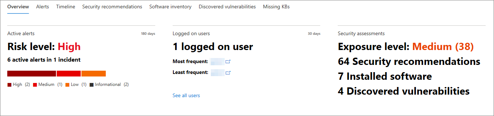
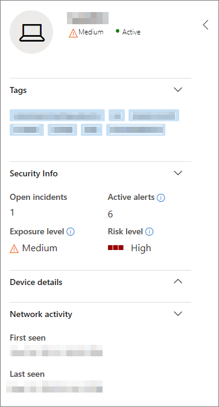

# Página de perfil de máquinaMachine profile page

O portal de segurança do Microsoft 365 fornece páginas de perfil de máquina para que você possa avaliar a integridade e o status dos dispositivos na sua rede.The Microsoft 365 security portal provides you with Machine profile pages, so you can assess the health and status of devices on your network. Cada página de perfil de máquina contém uma infinidade de informações sobre o dispositivo.Each Machine profile page contains a wealth of information about the device.

Você pode revisar informações detalhadas sobre qual software é executado, os eventos de segurança e os alertas de segurança passados e apresentar e encontrar links para patches de software relevantes.You can review in-depth information about what software it is running, any past and present security events or alerts, and find links to relevant software patches.

Você também pode usar o perfil de máquina para executar tarefas comuns relacionadas à segurança e rapidamente examinar detalhes básicos sobre o dispositivo.You can also use the Machine profile to perform common security-related tasks, and quickly review basic details about the device.

## Navegando na página de perfil de máquinaNavigating the Machine profile page

A página de perfil de máquina pode ser acessada selecionando diretamente um nome de dispositivo na lista de computadores ou escolhendo **abrir computador** no submenu de lista de máquinas.The Machine profile page can be accessed by directly selecting a device name on the Machines list or by choosing **Open Machine page** on the Machines list flyout.

Depois de abrir a página, você descobrirá que ela é dividida em três seções.Once you have the page open, you'll find that it is broken up into three sections.

A área de conteúdo principal (1) contém sete guias que podem ser alternadas para exibir diferentes tipos de informações sobre a máquina.The main content area (1) contains seven tabs that you can toggle through to view different kinds of information about the machine.

A barra lateral (2) lista detalhes básicos sobre o computador.The sidebar (2) lists basic details about the machine.

Há também ações de resposta disponíveis em um cabeçalho (3) antes da barra lateral e das seções de conteúdo principal.There are also response actions available in a header (3) before the sidebar and main content sections. Você pode usar as ações neste cabeçalho para executar tarefas comuns relacionadas à segurança.You can use the actions in this header to perform common security-related tasks.

## Seção TabsTabs section

As guias de perfil de máquina permitem que você alterne uma visão geral dos detalhes de segurança sobre a máquina e tabelas que contenham uma lista de alertas, uma linha do tempo, uma lista de recomendações de segurança, um inventário de software, uma lista de vulnerabilidades descobertas e faltam KBs (atualizações de segurança).The Machine profile tabs allow you to toggle through an overview of security details about the machine, and tables containing a list of alerts, a timeline, a list of security recommendations, a software inventory, a list of discovered vulnerabilities, and missing KBs (security updates).

### Guia Visão geralOverview tab

A guia padrão é **visão geral**.The default tab is **Overview**. Ele fornece uma visão rápida do fato de segurança mais importante sobre o dispositivo.It provides a quick look at the most important security fact about the device.

Aqui, você pode encontrar um gráfico do nível de risco e dos alertas ativos do dispositivo, qualquer usuário conectado no momento, uma breve lista de usuários mais e menos frequentes e avaliações de segurança que detalham o nível de exposição do dispositivo, recomendações de segurança, softwares afetados e vulnerabilidades descobertas.Here, you can find a chart of the device's risk level and active alerts, any currently logged on users, a brief list of most and least frequent users, and security assessments that detail the device's exposure level, security recommendations, affected software, and discovered vulnerabilities.

### Guia alertasAlerts tab

A guia **alertas** contém uma lista de alertas que foram relatados no dispositivo.The **Alerts** tab contains a list of alerts that have been reported on the device.

Você pode personalizar o número de itens exibidos, bem como quais colunas são exibidas para cada item.You can customize the number of items displayed, as well as which columns are displayed for each item. O comportamento padrão é listar 30 itens por página e ter 11 colunas alternadas para exibir.The default behavior is to list 30 items per page, and have 11 columns toggled on to display.

As colunas nesta guia incluem informações sobre a gravidade da ameaça que disparou o alerta, bem como o status, o estado de investigação e quem se o alerta foi atribuído.The columns in this tab include information on the severity of the threat that triggered the alert, as well as status, investigation state, and who if anyone the alert has been assigned to.

A coluna de *entidades impactadas* se refere à máquina (entidade) cujo perfil você está exibindo atualmente, além de qualquer outra máquina em sua rede afetada.The *impacted entities* column refers to the machine (entity) whose profile you are currently viewing, plus any other machines in your network that are affected.

Selecionar um item da lista abrirá um link para o alerta selecionado.Selecting an item from this list will open a link to the selected alert.

Essa lista pode ser filtrada por severidade, status ou destinatário.This list can be filtered by severity, status, or assignee.

### Guia linha do tempoTimeline tab

A guia **linha do tempo** inclui um gráfico de eventos interativo e cronológico gerado no dispositivo.The **Timeline** tab includes a interactive, chronological chart of events raised on the device. Ao mover a área realçada do gráfico, você pode exibir eventos por diferentes intervalos de tempo.By moving the highlighted area of the chart, you can view events over different ranges of time. Você também pode digitar um intervalo de datas personalizado.You can also type in a custom range of dates.

Abaixo do gráfico há uma lista de eventos para o intervalo de datas selecionado.Below the chart is a list of events for the selected range of dates.

O número de itens exibidos e as colunas na lista podem ser personalizados.The number of items displayed and the columns on the list can both be customized. As colunas padrão listam a hora do evento, o usuário ativo, o tipo de ação, as entidades (processos) e informações adicionais sobre o evento.The default columns list the event time, active user, action type, entities (processes), and additional information about the event.

Selecionar um item da lista abrirá um submenu que exibe um gráfico de entidades de evento, mostrando os processos pai e filho que acionaram o evento.Selecting an item from the list will open a flyout displaying an Event entities graph, showing the parent and child processes that triggered the event.

Essa lista pode ser filtrada pelo tipo específico de evento; por exemplo, eventos do registro ou eventos de tela inteligente.This list can be filtered by the specific kind of event; for example, Registry events or Smart Screen Events.

### Guia recomendações de segurançaSecurity recommendations tab

A guia **recomendações de segurança** lista as ações que você pode tomar para proteger o dispositivo.The **Security recommendations** tab lists actions you can take to protect the device. Selecionar um item nessa lista abrirá um submenu onde você pode obter instruções sobre como aplicar a recomendação.Selecting an item on this list will open a flyout where you can get instructions on how to apply the recommendation.

Como com as guias anteriores, o número de itens exibidos por página e quais colunas estão visíveis podem ser personalizados.As with the previous tabs, the number of items displayed per page and which columns are visible can be customized.

O modo de exibição padrão inclui colunas que detalham as desvantagens de segurança abordadas, a ameaça associada, o componente relacionado ou o software afetado pela ameaça e muito mais.The default view includes columns that detail the security weaknesses addressed, the associated threat, the related component or software affected by the threat, and more. Os itens podem ser filtrados pelo status da recomendação.Items can be filtered by the recommendation's status.

### Inventário de softwareSoftware inventory

A guia **inventário de software** lista o software instalado no dispositivo.The **Software inventory** tab lists software installed on the device.

O modo de exibição padrão exibe o fornecedor do software, o número da versão instalada, o número de deficiências de software conhecidas, informações sobre ameaças, código do produto e marcas.The default view displays the software vendor, installed version number, number of known software weaknesses, threat insights, product code, and tags. O número de itens exibidos e quais colunas são exibidas podem ser personalizados.The number of items displayed and which columns are displayed can both be customized.

Selecionar um item dessa lista abre um submenu contendo mais detalhes sobre o software selecionado, bem como o caminho e o carimbo de data/hora da última vez que o software foi encontrado.Selecting an item from this list opens a flyout containing more details about the selected software, as well as the path and timestamp for the last time the software was found.

Essa lista pode ser filtrada pelo código do produto.This list can be filtered by product code.

### Guia vulnerabilidades descobertasDiscovered vulnerabilities tab

A guia **vulnerabilidades descobertas** lista as vulnerabilidades e explorações comuns (CVEs) que podem afetar o dispositivo.The **Discovered vulnerabilities** tab lists any Common Vulnerabilities and Exploits (CVEs) that may affect the device.

O modo de exibição padrão lista a gravidade do CVE, a pontuação de vulnerabilidade comum (CVS), o software relacionado ao CVE, quando o CVE foi publicado, quando o CVE foi atualizado pela última vez e ameaças associadas ao CVE.The default view lists the severity of the CVE, the Common Vulnerability Score (CVS), the software related to the CVE, when the CVE was published, when the CVE was last updated, and threats associated with the CVE.

Assim como as guias anteriores, o número de itens exibidos e as colunas visíveis podem ser personalizados.As with the previous tabs, the number of items displayed and which columns are visible can be customized.

Selecionar um item da lista abrirá um submenu que descreve o CVE.Selecting an item from this list will open a flyout that describes the CVE.

### KB ausentesMissing KBs

A guia **KB ausentes** lista as atualizações da Microsoft que ainda devem ser aplicadas ao computador.The **Missing KBs** tab lists any Microsoft Updates that have yet to be applied to the machine. Os "KBs" em questão são [artigos da base de conhecimento](https://support.microsoft.com/help/242450/how-to-query-the-microsoft-knowledge-base-by-using-keywords-and-query) que descrevem essas atualizações; por exemplo, [KB4551762](https://support.microsoft.com/help/4551762/windows-10-update-kb4551762).The "KBs" in question are [Knowledge Base articles](https://support.microsoft.com/help/242450/how-to-query-the-microsoft-knowledge-base-by-using-keywords-and-query) which describe these updates; for example, [KB4551762](https://support.microsoft.com/help/4551762/windows-10-update-kb4551762).

O modo de exibição padrão lista o boletim que contém as atualizações, a versão do sistema operacional, os produtos afetados, os CVEs tratados, o número do KB e as marcas.The default view lists the bulletin containing the updates, OS version, products affected, CVEs addressed, the KB number, and tags.

O número de itens exibidos por página e quais colunas são exibidas podem ser personalizados.The number of items displayed per page and which columns are displayed can be customized.

Selecionar um item abrirá um submenu que vincule à atualização.Selecting an item will open a flyout that links to the update.

## CepçõesSidebar

Ao lado da área de conteúdo principal da página de perfil de máquina é a barra lateral.Beside the main content area of the Machine profile page is the sidebar.

A barra lateral fornece algumas informações básicas importantes em subseções pequenas que podem ser ativadas ou abertas ou fechadas:The sidebar provides some important basic information in small subsections which can be toggled open or closed:

* **Marcas** -qualquer marca associada ao dispositivo**Tags** - Any tags associated with the device
* **Informações de segurança** -incidentes de abertura, alertas ativos, nível de exposição e nível de risco**Security info** - Open incidents, active alerts, exposure level and risk level
* **Detalhes do dispositivo** -domínio, sistema operacional, grupo de ativos, estado de integridade, confidencialidade de dados e endereços IP**Device details** - Domain, OS, Asset group, health state, data sensitivity, and IP addresses
* **Atividade de rede** -carimbos de data/hora pela primeira vez e última vez em que o dispositivo foi visto na rede**Network activity** - Timestamps for the first time and last time the device was seen on the network

Esta seção também inclui o nível de nome e exposição do dispositivo e um ícone para indicar se ele está ativo na rede no momento.This section also includes the name and exposure level of the device, and an icon to indicate if it is currently active on the network.

## Ações de respostaResponse actions

As ações de resposta oferecem uma maneira rápida de se defender e analisar ameaças.Response actions offer a quick way to defend against and analyze threats.

As ações de resposta disponíveis aqui incluem:The response actions available to you here include:

* **Manage Tags** – atualiza as marcas personalizadas que você aplicou a este dispositivo.**Manage tags** - Updates custom tags you have applied to this device.
* **Isolar computador** -isola a máquina da rede da sua organização enquanto a mantém conectada à proteção avançada contra ameaças do Microsoft defender.**Isolate machine** - Isolates the machine from your organization's network while keeping it connected to Microsoft Defender Advanced Threat Protection. Você pode optar por permitir que o Outlook, o Teams e o Skype for Business sejam executados enquanto a máquina estiver isolada, para fins de comunicação.You can choose to allow Outlook, Teams, and Skype for Business to run while the machine is isolated, for communication purposes.
* **Restringir execução de aplicativo** -impede que aplicativos não assinados pela Microsoft sejam executados**Restrict app execution** - Prevents applications that are not signed by Microsoft from running
* **Execute verificação antivírus** – atualiza as definições do Windows Defender antivírus e executa imediatamente uma verificação antivírus.**Run antivirus scan** - Updates Windows Defender Antivirus definitions and immediately runs an antivirus scan. Escolha entre verificação rápida ou verificação completa.Choose between Quick scan or Full scan.
* **Coletar pacote de investigação** -coleta informações sobre o computador.**Collect investigation package** - Gathers information about the machine. Quando a investigação estiver concluída, você pode baixá-la.When the investigation is completed, you can download it.
* **Iniciar sessão de resposta ao vivo** – carrega um shell remoto no computador para [investigações de segurança aprofundadas](https://docs.microsoft.com/windows/security/threat-protection/microsoft-defender-atp/live-response).**Initiate Live Response session** - Loads a remote shell on the machine for [in-depth security investigations](https://docs.microsoft.com/windows/security/threat-protection/microsoft-defender-atp/live-response).
* **Iniciar investigação automatizada** - [investiga e corrige ameaças](https://docs.microsoft.com/microsoft-365/security/office-365-security/office-365-air)automaticamente.**Initiate automated investigation** - Automatically [investigates and remediates threats](https://docs.microsoft.com/microsoft-365/security/office-365-security/office-365-air). Embora seja possível disparar manualmente as investigações automatizadas para executar a partir desta página, [determinadas políticas de alerta](https://docs.microsoft.com/microsoft-365/compliance/alert-policies?view=o365-worldwide#default-alert-policies) disparam investigações automáticas por conta própria.Although you can manually trigger automated investigations to run from this page, [certain alert policies](https://docs.microsoft.com/microsoft-365/compliance/alert-policies?view=o365-worldwide#default-alert-policies) trigger automatic investigations on their own.
* **Central de ações** -exiba o status das ações enviadas.**Action center** - View the status of submitted actions. Disponível somente se outra ação já tiver sido selecionada.Only available if another action has already been selected.

## Tópicos relacionadosRelated topics

* [Visão geral da Proteção contra Ameaças da MicrosoftMicrosoft Threat Protection overview](microsoft-threat-protection.md)
* [Habilitar a Proteção contra Ameaças da MicrosoftTurn on Microsoft Threat Protection](mtp-enable.md)
* [Investigar entidades em máquinas usando resposta ao vivoInvestigate entities on machines using live response](https://docs.microsoft.com/windows/security/threat-protection/microsoft-defender-atp/live-response)
* [Investigação e resposta automatizadas (AIR) no Office 365Automated investigation and response (AIR) in Office 365](https://docs.microsoft.com/microsoft-365/security/office-365-security/office-365-air)
