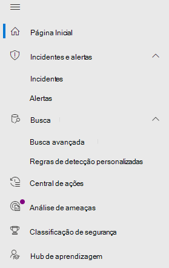
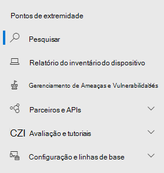
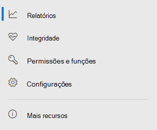

# Microsoft Defender para Ponto de Extremidade no centro de segurança do Microsoft 365

[!INCLUDE [Microsoft 365 Defender rebranding](../includes/microsoft-defender.md)]

[!INCLUDE [Prerelease](../includes/prerelease.md)]

**Aplica-se a:**

- [Microsoft 365 Defender](https://go.microsoft.com/fwlink/?linkid=2118804)
- [Microsoft Defender para Ponto de Extremidade](https://go.microsoft.com/fwlink/p/?linkid=2146631)
- [Obter o Microsoft Defender para Office 365](https://go.microsoft.com/fwlink/?linkid=2148715)

O centro de segurança aprimorado do [Microsoft 365](overview-security-center.md) combina recursos de segurança que protegem, detectam, investigam e respondem a ameaças de [https://security.microsoft.com](https://security.microsoft.com) email, colaboração, identidade e dispositivos. Esse centro de segurança reúne funcionalidades de portais de segurança da Microsoft existentes, incluindo o Centro de Segurança do Microsoft Defender e o Centro de Conformidade e Segurança & do Office 365.

Se você estiver familiarizado com o Centro de Segurança do Microsoft Defender, este artigo ajuda a descrever algumas das alterações e melhorias no centro de segurança aprimorado do Microsoft 365. No entanto, há alguns elementos novos e atualizados a serem conhecidos.

Historicamente, o [Centro de Segurança](https://docs.microsoft.com/windows/security/threat-protection/microsoft-defender-atp/portal-overview) do Microsoft Defender tem sido a casa do Microsoft Defender para o Ponto de Extremidade. As equipes de segurança corporativas o usaram para monitorar e ajudar a responder a alertas de possíveis atividades avançadas de ameaças persistentes ou violações de dados. Para ajudar a reduzir o número de portais, o Centro de segurança do Microsoft 365 será a casa para monitorar e gerenciar a segurança em suas identidades, dados, dispositivos, aplicativos e infraestrutura da Microsoft.

O Microsoft Defender for Endpoint no centro de segurança do Microsoft 365 dá suporte à concessão de acesso a [MSSPs (provedores](https://docs.microsoft.com/windows/security/threat-protection/microsoft-defender-atp/grant-mssp-access) de serviços de segurança gerenciados) da mesma forma que o acesso é concedido no centro de segurança do [Microsoft Defender.](mssp-access.md)

> [!IMPORTANT]
> O que você vê no centro de segurança do Microsoft 365 depende das assinaturas atuais. Por exemplo, se você não tiver uma licença para o Microsoft Defender para Office 365, a seção Email & Colaboração não será mostrada.

>[!Note]
>O novo portal unificado não está disponível para: Us Government Community Cloud (GCC) US Government Community Cloud High (GCC High) US Department of Defense All US government institutions with commercial licenses

Confira o centro de segurança do Microsoft 365 aprimorado: [https://security.microsoft.com](https://security.microsoft.com) .

Saiba mais sobre os benefícios: Visão geral do centro de segurança [do Microsoft 365](overview-security-center.md)

## O que mudou

Esta tabela é uma referência rápida das alterações entre o Centro de Segurança do Microsoft Defender e o Centro de segurança do Microsoft 365.

### Alertas e ações

|**Área**  |**Descrição da alteração**  |
|---------|---------|
| [Incidentes & alertas](incidents-overview.md)  | No Centro de segurança do Microsoft 365, você pode gerenciar incidentes e alertas em todos os pontos de extremidade, email e identidades. Convergimos a experiência para ajudá-lo a encontrar eventos relacionados com mais facilidade. Para obter mais informações, consulte [Visão geral de incidentes.](incidents-overview.md)   |
| [Hunting](advanced-hunting-overview.md)  |  Modificar regras de detecção personalizadas criadas no Microsoft Defender para Endpoint para incluir tabelas de identidade e email as move automaticamente para o Microsoft 365 Defender. Seus alertas correspondentes também aparecerão no Microsoft 365 Defender. Para obter mais detalhes sobre essas alterações, leia [Migrar regras de detecção personalizadas.](advanced-hunting-migrate-from-mdatp.md#migrate-custom-detection-rules) A `DeviceAlertEvents` tabela para busca avançada não está disponível no Microsoft 365 Defender. Para consultar informações de alerta específicas do dispositivo no Microsoft 365 Defender, você pode usar as tabelas e para acomodar ainda mais informações de um `AlertInfo` `AlertEvidence` conjunto diversificado de fontes. Crie sua próxima consulta relacionada ao dispositivo seguindo [as consultas Gravar sem DeviceAlertEvents](advanced-hunting-migrate-from-mdatp.md#write-queries-without-devicealertevents).|
|[Centro de ações](mtp-action-center.md)    | Lista ações pendentes e concluídas que foram realizadas após investigações automatizadas e ações de correção. Anteriormente, o Centro de Ações no Centro de Segurança do Microsoft Defender listava ações pendentes e concluídas para ações de correção realizadas apenas em dispositivos, enquanto investigações automatizadas listaram alertas e status. No centro de segurança do Microsoft 365 aprimorado, o Centro de Ações reúne ações de correção e investigações em emails, dispositivos e usuários— tudo em um único local.  |
| [Análise de ameaças](threat-analytics.md) |  Movido para a parte superior da barra de navegação para facilitar a descoberta e o uso. Agora inclui informações de ameaça para pontos de extremidade e email e colaboração.    |

### Pontos de extremidade

|**Área**  |**Descrição da alteração**  |
|---------|---------|
|Pesquisa   |  Em vez de estar no título, a barra de pesquisa do Microsoft Defender for Endpoint está se movendo sob a seção Pontos de Extremidade. Você pode continuar procurando dispositivos, arquivos, usuários, URLs, IPs, vulnerabilidades, software e recomendações.  |
|[Painel](https://docs.microsoft.com/windows/security/threat-protection/microsoft-defender-atp/security-operations-dashboard)   |  Este é o painel de operações de segurança. Consulte uma visão geral de quantos alertas ativos foram disparados, quais dispositivos estão em risco, quais usuários estão em risco e nível de gravidade para alertas, dispositivos e usuários. Você também pode ver se algum dispositivo tem problemas de sensor, sua saúde geral do serviço e como quaisquer alertas não resolvidos foram detectados. |
|Inventário de dispositivos | Sem alterações. |
|[Gerenciamento de Ameaças e Vulnerabilidades](https://docs.microsoft.com/windows/security/threat-protection/microsoft-defender-atp/next-gen-threat-and-vuln-mgt)    |    O nome foi reduzido para caber no painel de navegação. É o mesmo que a seção gerenciamento de ameaças e vulnerabilidades, com todas as páginas abaixo.     |
| Parceiros e APIs | Sem alterações. |
| Avaliações & tutoriais    |     Novos recursos de teste e aprendizado.     |
| Gerenciamento de configuração   |  Sem alterações.  |

> [!NOTE]
> **A investigação automática e a correção** agora fazem parte de incidentes. Você pode ver Eventos automatizados de investigação e correção na guia **Investigação > Incidentes.**

### Acesso e relatórios

|**Área**  |**Descrição da alteração**  |
|---------|---------|
| Relatórios  | Consulte relatórios sobre pontos de extremidade e & de email, incluindo proteção contra ameaças, conformidade e conformidade de dispositivos e dispositivos vulneráveis. |
| Integridade  |  Atualmente, links para a página "Saúde do serviço" no Centro de administração [do Microsoft 365](https://admin.microsoft.com/). |
| Configurações |  Gerencie suas configurações para o Centro de segurança do Microsoft 365, Microsoft 365 Defender, Pontos de Extremidade, Colaboração de email &, Identidades e Descoberta de Dispositivo.   |

## Recursos e navegação de segurança do Microsoft 365

A navegação à esquerda ou a barra de início rápido parecerão familiares. No entanto, há alguns elementos novos e atualizados neste centro de segurança.

### Incidentes e alertas

Reúne o gerenciamento de incidentes e alertas em seus emails, dispositivos e identidades. A página de alerta fornece contexto completo ao alerta combinando sinais de ataque para construir um artigo detalhado. Uma nova experiência unificada agora reúne uma exibição consistente de alertas entre cargas de trabalho. Você pode triagem rápida, investigar e tomar medidas efetivas.

- [Saiba mais sobre incidentes](incidents-overview.md)
- [Saiba mais sobre como gerenciar alertas](investigate-alerts.md)

### Hunting

Pesquise proativamente ameaças, malware e atividades mal-intencionadas em seus pontos de extremidade, caixas de correio do Office 365 e muito mais usando consultas [avançadas de busca.](advanced-hunting-overview.md) Essas consultas poderosas podem ser usadas para localizar e revisar indicadores de ameaça e entidades para ameaças conhecidas e possíveis.

[As regras de detecção personalizadas](custom-detection-rules.md) podem ser criadas a partir de consultas avançadas de busca para ajudá-lo a observar proativamente eventos que podem indicar a atividade de violação e dispositivos configurados incorretamente.

### Centro de ações

O Centro de Ações mostra as investigações criadas por recursos automatizados de investigação e resposta. Essa auto-recuperação automatizada no Microsoft 365 Defender pode ajudar as equipes de segurança respondendo automaticamente a eventos específicos.

[Saiba mais sobre a Central de Ações](mtp-action-center.md)

### Análise de Ameaças

Obter inteligência contra ameaças de pesquisadores de segurança especialistas da Microsoft. A Análise de Ameaças ajuda as equipes de segurança a serem mais eficientes ao enfrentar ameaças emergentes. A Análise de Ameaças inclui:

- Detecções e mitigações relacionadas a email do Microsoft Defender para Office 365. Isso além dos dados de ponto de extremidade já disponíveis no Microsoft Defender para Ponto de Extremidade.
- Exibição de incidentes relacionados às ameaças.
- Experiência aprimorada para identificar rapidamente e usar informações a actionable nos relatórios.

Você pode acessar a análise de ameaças da barra de navegação superior esquerda no centro de segurança do Microsoft 365 ou de um cartão de painel dedicado que mostra as principais ameaças para sua organização.

Saiba mais sobre como rastrear [e responder a ameaças emergentes](https://docs.microsoft.com/microsoft-365/security/mtp/threat-analytics) com análise de ameaças

### Seção Pontos de Extremidade

Exibir e gerenciar a segurança dos pontos de extremidade em sua organização. Se você tiver usado o Centro de Segurança do Microsoft Defender, ele será familiar.

### Acesso e relatórios

Exibir relatórios, alterar suas configurações e modificar funções de usuário.

### Conexões de API SIEM

Se você usar a [API SIEM](/windows/security/threat-protection/microsoft-defender-atp/enable-siem-integration.md)do Defender para Ponto de Extremidade, poderá continuar a fazê-lo. Adicionamos novos links à carga da API que apontam para a página de alerta ou para a página de incidentes no portal de segurança do Microsoft 365. Os novos campos de API incluem LinkToMTP e IncidentLinkToMTP. Para obter mais informações, consulte Redirecionando contas do Microsoft Defender para o Ponto de Extremidade para o centro de segurança [do Microsoft 365.](/microsoft-365/security/mtp/microsoft-365-security-mde-redirection.md)

### Alertas de email

Você pode continuar a usar alertas de email para o Defender para Ponto de Extremidade. Adicionamos novos links nos emails que apontam para a página de alerta ou a página de incidentes no Centro de segurança do Microsoft 365. Para obter mais informações, consulte Redirecionando contas do Microsoft Defender para o Ponto de Extremidade para o centro de segurança [do Microsoft 365.](/microsoft-365/security/mtp/microsoft-365-security-mde-redirection.md)

## Informações relacionadas

- [Centro de segurança do Microsoft 365](overview-security-center.md)
- [Microsoft Defender para Ponto de Extremidade no centro de segurança do Microsoft 365](microsoft-365-security-center-mde.md)
- [Redirecionando contas do Microsoft Defender para o Ponto de Extremidade para o centro de segurança do Microsoft 365](microsoft-365-security-mde-redirection.md)
