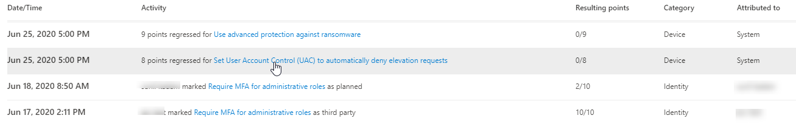
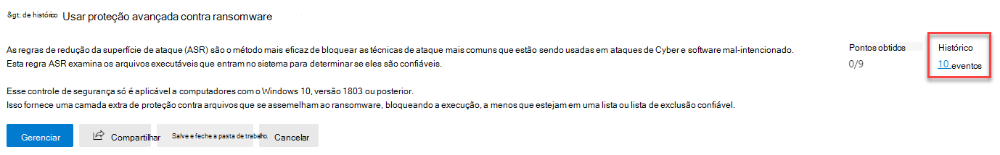
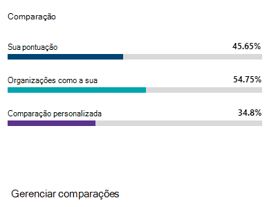
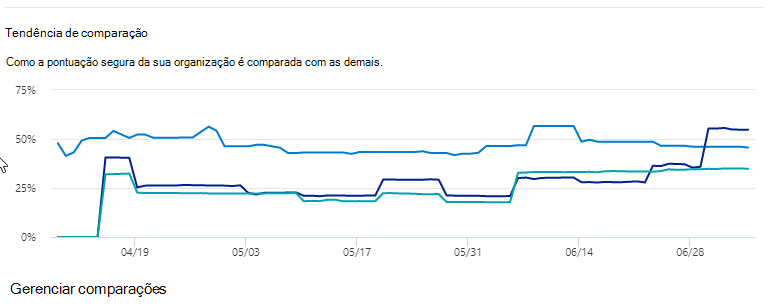

# Acompanhar o histórico do Microsoft Secure Score e cumprir as metas

[!INCLUDE [Microsoft 365 Defender rebranding](../includes/microsoft-defender.md)]

[O Microsoft Secure Score](microsoft-secure-score.md) é uma medição da postura de segurança de uma organização, com um número maior indicando mais ações de melhoria tomadas. Ele pode ser encontrado no https://security.microsoft.com/securescore centro de segurança do Microsoft [365.](overview-security-center.md)

## Obtenha informações sobre a atividade que afetou sua pontuação

Veja um gráfico da pontuação da sua organização ao longo do tempo **na** guia Histórico.

Abaixo do gráfico há uma lista de todas as ações realizadas no intervalo de tempo selecionado e seus atributos, como pontos resultantes e categoria. Você pode personalizar um intervalo de datas e filtrar por categoria.

Se você selecionar a ação de melhoria associada a uma atividade, o flyout de ação de melhoria completa será exibido.

Para exibir todo o histórico dessa ação de melhoria específica, selecione o link do histórico no flyout.

## Descobrir tendências e definir metas

Na guia **Métricas & tendências,** há vários gráficos e gráficos para dar mais visibilidade às tendências e definir metas. Você pode definir o intervalo de datas para toda a página de visualizações. As visualizações incluem:

* **Sua zona de Classificação de** Segurança - Personalizada com base nas metas e definições de intervalos de pontuações boas, boas e ruins da sua organização.
* **Tendência de regressão** - Uma linha do tempo de pontos que foram regressadas devido às alterações de configuração, usuário ou dispositivo.  
* **Tendência de comparação** - Como a Pontuação Segura da sua organização se compara com as outras pessoas ao longo do tempo. Esse modo de exibição pode incluir linhas que representam a média da pontuação de organizações com contagem de assentos semelhante e um modo de exibição de comparação personalizado que você pode definir.
* **Tendência de aceitação de risco** - Linha do tempo das ações de melhoria marcadas como "risco aceito".
* **Pontuação** muda - O número de pontos alcançados, pontos regressados e alterações para sua pontuação no intervalo de datas especificado.

### Compare sua pontuação com organizações como a sua

Há dois lugares para ver como sua pontuação se compara às organizações que são semelhantes a você. Em ambos os gráficos, você pode selecionar **Gerenciar comparações** para exibir e editar as informações da sua organização. Você também pode criar uma comparação personalizada com base no setor, tamanho da organização, licenças e regiões.

#### Gráfico de barras de comparação

O gráfico de barras de comparação é a **guia Visão** geral. Passe o mouse sobre o gráfico para exibir a oportunidade de pontuação e pontuação. Os dados de comparação são anônimos, portanto, não sabemos exatamente quais outros locatários estão na combinação.

- **Organizações como a sua:** uma pontuação média de outros locatários (desde que temos pelo menos cinco ou mais locatários para comparar) que se qualificam com os seguintes critérios:
    1. Mesmo setor
    2. Mesmo tamanho de organização
    3. Todas as regiões
    4. Os produtos usados pela Microsoft são 80% semelhantes
    5. Oportunidade (pontuação máxima que pode ser atingida pela licença atual) dentro de um intervalo de 20% do seu locatário

- **Comparação personalizada**: precisa ser configurada selecionando **Gerenciar** Comparação com base nos seguintes critérios:
    1. Setor(s) selecionado(s)
    2. Tamanho(s) da organização selecionado(s)
    3. Região selecionada
    4. Licença(s) selecionada(s)
    5. Os produtos usados pela Microsoft são 80% semelhantes
    6. Oportunidade (pontuação máxima que pode ser atingida pela licença atual) dentro de um intervalo de 20% do locatário

Se você tiver feito uma seleção personalizada, mas os resultados têm menos de cinco outros locatários que podemos comparar, você verá "Não disponível devido a dados limitados".

#### Tendência de comparação

Na guia **Métricas & tendências,** veja como a Pontuação Segura da sua organização se compara com as outras pessoas ao longo do tempo.

## Queremos ouvir de você

Se você tiver algum problema, deixe-nos saber postando na comunidade segurança, privacidade [& conformidade.](https://techcommunity.microsoft.com/t5/Security-Privacy-Compliance/bd-p/security_privacy) Estamos monitorando a comunidade e forneceremos ajuda.

## Recursos relacionados

- [Visão geral do Microsoft Secure Score](microsoft-secure-score.md)
- [Avaliar sua postura de segurança](microsoft-secure-score-improvement-actions.md)
- [O que estar por vir.](microsoft-secure-score-whats-coming.md)
- [Novidades](microsoft-secure-score-whats-new.md)
