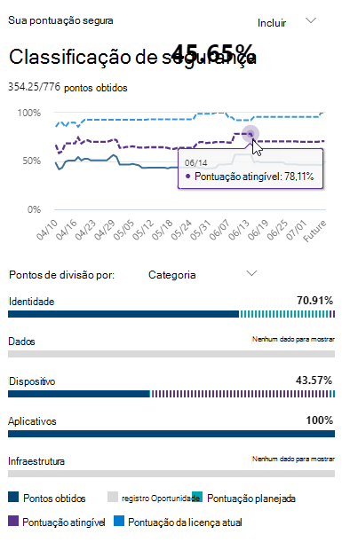

# Obter visibilidade de sua postura de segurança por meio da Pontuação segura da Microsoft

A pontuação segura da Microsoft é uma medida da postura de segurança de uma organização, com um número maior indicando ações mais aprimoradas. Ele pode ser encontrado no https://security.microsoft.com/securescore na [central de segurança do Microsoft 365](overview-security-center.md).

Para ajudá-lo a obter mais rapidamente as informações de que você precisa, as ações de melhoria da Microsoft são organizadas em grupos:

* Identidade (contas do Azure AD & funções)
* Dados (proteção de informações da Microsoft)
* Dispositivo (Microsoft defender ATP, conhecido como [Pontuação de configuração](https://docs.microsoft.com/windows/security/threat-protection/microsoft-defender-atp/configuration-score))
* Aplicativo (aplicativos de email e de nuvem, incluindo o Office 365 e o Microsoft Cloud app Security)
* Infraestrutura (sem ações de melhoria por enquanto)

>[!NOTE]
>Na versão recente da Pontuação de segurança da Microsoft, foi lançado um modelo de Pontuação aprimorado que tornou a pontuação segura da Microsoft temporariamente incompatível com a pontuação segura de identidade e a API do Graph. [Exibir detalhes](microsoft-secure-score.md#incompatibility-with-identity-secure-score-and-graph-api)

Na página de visão geral de Pontuação segura da Microsoft, você pode ver como os pontos são divididos entre esses grupos e que pontos estão disponíveis. A página de visão geral também é o local para obter uma visão completa da pontuação total, tendência histórica de sua pontuação segura com comparações de benchmark e ações de melhoria priorizadas que podem ser tomadas para melhorar sua pontuação.

## Verificar sua pontuação atual

Para verificar sua pontuação atual, vá para a página de visão geral de Pontuação segura da Microsoft e procure o bloco que diz **sua pontuação segura**. Sua pontuação será mostrada como uma porcentagem, juntamente com o número de pontos obtidos de um total de pontos possíveis.

Além disso, se você selecionar o botão **incluir** ao lado da sua pontuação, poderá escolher modos de exibição diferentes da sua pontuação. Esses modos de exibição de Pontuação diferentes serão exibidos no gráfico no bloco de pontos e no gráfico de divisão de pontos.

Veja a seguir as pontuações que você pode adicionar ao seu modo de exibição de sua pontuação geral para fornecer uma visão mais completa de sua pontuação geral:

- **Pontuação planejada**: mostrar a pontuação projetada quando as ações planejadas são concluídas
- **Pontuação da licença atual**: mostrar a pontuação que pode ser obtida com sua licença atual da Microsoft
- **Pontuação atingível**: mostrar a pontuação que pode ser obtida com suas licenças da Microsoft e a aceitação de riscos atual

Esta será a aparência se você tiver incluído todos os modos de exibição de Pontuação possíveis:

## Executar uma ação para melhorar sua pontuação

A guia **ações de melhoria** lista as recomendações de segurança que lidam com possíveis superfícies de ataque, juntamente com seu status (para endereços, planejados, riscos aceitos, resolvidos por terceiros, resolvidos por meio de atenuação alternativa e conclusão). Você pode pesquisar, filtrar e agrupar todas as ações de aperfeiçoamento.  

### Classificação

A classificação baseia-se no número de outros pontos restantes para atingir, dificuldade de implementação, impacto do usuário e complexidade. As ações mais altas de melhoria da classificação têm um grande número de pontos restantes com baixa dificuldade, impacto do usuário e complexidade.

### Exibir detalhes da ação de aprimoramento

Quando você seleciona uma ação de aprimoramento específica, um submenu de página inteira aparece.  

 *Figura 2: exemplo de submenu de ação de melhoria*

Para concluir a ação, você tem algumas opções:

* Selecione **gerenciar** para ir para a tela de configuração e fazer a alteração. Em seguida, você obterá os pontos que a ação vale a pena, visível no surgimento. Os pontos geralmente levam cerca de 24 horas para atualização.

* Selecione **compartilhar** para copiar o link direto para a ação de aprimoramento ou escolha a plataforma para compartilhar o link, como email, Microsoft Teams, Microsoft Planner ou ServiceNow. Selecionar o ServiceNow permitirá que você crie um tíquete de alteração que ficará visível no ServiceNow e na página inicial da central de segurança do Microsoft 365. Para saber mais, confira [centro de segurança do Microsoft 365 e integração com o ServiceNow](tickets-security-center.md).

### Escolher um status de ação de melhoria

Escolha qualquer status e registre as anotações específicas da ação de aprimoramento. O Statues que você pode selecionar são os seguintes:

* **Para endereço** — você reconhece que a ação de melhoria é necessária e planeja fazê-lo em algum momento no futuro. Esse estado também se aplica às ações detectadas como parcialmente, mas não completamente concluídas.
* **Planejado** — há planos concretos in-loco para concluir a ação de melhoria.
* **Risco aceito** — a segurança deve sempre ser balanceada com usabilidade e nem todas as recomendações funcionarão para o seu ambiente. Quando esse for o caso, você pode optar por aceitar o risco ou o risco restante, e não enact a ação de aperfeiçoamento. Você não receberá nenhum ponto, mas a ação não estará mais visível na lista de ações de aprimoramento. Você pode exibir essa ação no histórico ou desfazê-la a qualquer momento.
* **Resolvido** por terceiros e **resolvido por meio de mitigação alternativa** — a ação de melhoria já foi abordada por um aplicativo ou software de terceiros, ou por uma ferramenta interna. Você ganhará os pontos que a ação vale a pena, de forma que sua pontuação reflita melhor a postura geral de segurança. Se um terceiro ou uma ferramenta interna não mais cobrir o controle, você poderá escolher outro status. Tenha em mente que a Microsoft não terá nenhuma visibilidade da integridade da implementação se a ação de aprimoramento estiver marcada como um desses status.

#### Ações de melhoria de gerenciamento de vulnerabilidade & ameaça

Para ações de melhoria na categoria "dispositivo", você não poderá escolher status. Em vez disso, você será direcionado para a [recomendação de segurança TVM (gerenciamento de vulnerabilidades) associada à & ameaça](https://docs.microsoft.com/windows/security/threat-protection/microsoft-defender-atp/tvm-security-recommendation) no centro de segurança do [Microsoft defender](https://docs.microsoft.com/windows/security/threat-protection/microsoft-defender-atp/use) para executar a ação. A exceção escolhida e a justificação que você escreve serão específicas para esse portal e não estarão presentes no portal de Pontuação segura da Microsoft.

#### Ações de aperfeiçoamento concluídas

Ações de melhoria têm um status de "concluído" uma vez que todos os pontos possíveis para a ação de aprimoramento foram atingidos. Ações de melhoria concluídas são confirmadas por meio de dados da Microsoft, e você não poderá alterar o status.

### Avaliar informações e analisar o impacto do usuário

A seção de **visão geral** lhe informará a categoria, os ataques que ela pode proteger contra o e o produto.

O **impacto do usuário** mostra o que os usuários terão de enfrentar se a ação de aprimoramento for executada, e **os usuários afetados** mostrarão o que perceberão.

### Implementar a ação de melhoria

A seção **implementação** mostra todos os pré-requisitos, as próximas etapas passo a passo para concluir a ação de melhoria, o status da implementação atual da ação de aprimoramento e todos os mais links.

Os pré-requisitos serão quaisquer licenças que precisam ser obtidas ou ações que precisam ser concluídas antes de a ação de aprimoramento ser resolvida. Certifique-se de que você tem estações suficientes em sua licença para concluir a ação de melhoria e que essas licenças são aplicadas aos usuários necessários.  

## Queremos ouvir sua opinião

Se você tiver problemas, informe-nos por postagem na Comunidade de [segurança, privacidade & conformidade](https://techcommunity.microsoft.com/t5/Security-Privacy-Compliance/bd-p/security_privacy) . Estamos monitorando a Comunidade e forneceremos ajuda.

## Recursos relacionados

- [Visão geral da Pontuação segura da Microsoft](microsoft-secure-score.md)
- [Acompanhar o histórico de Pontuação segura da Microsoft e atingir as metas](microsoft-secure-score-history-metrics-trends.md)
- [O que estar por vir.](microsoft-secure-score-whats-coming.md)