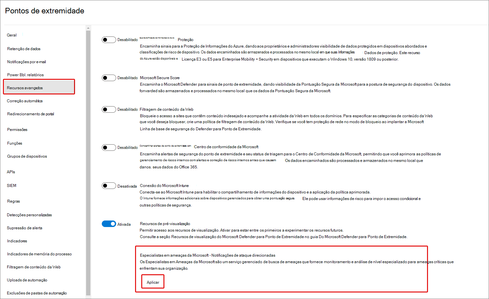
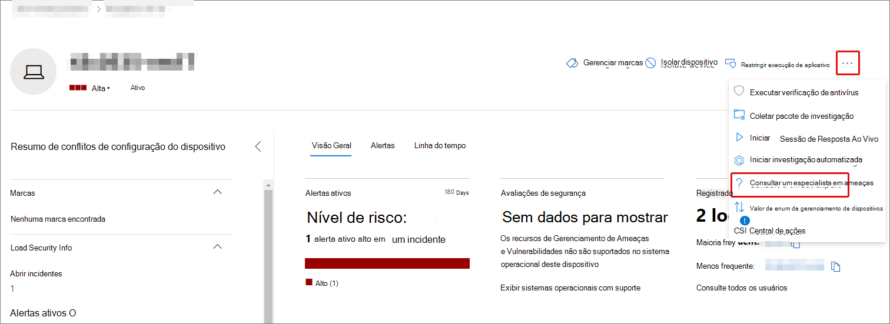
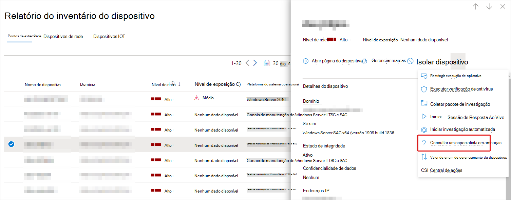
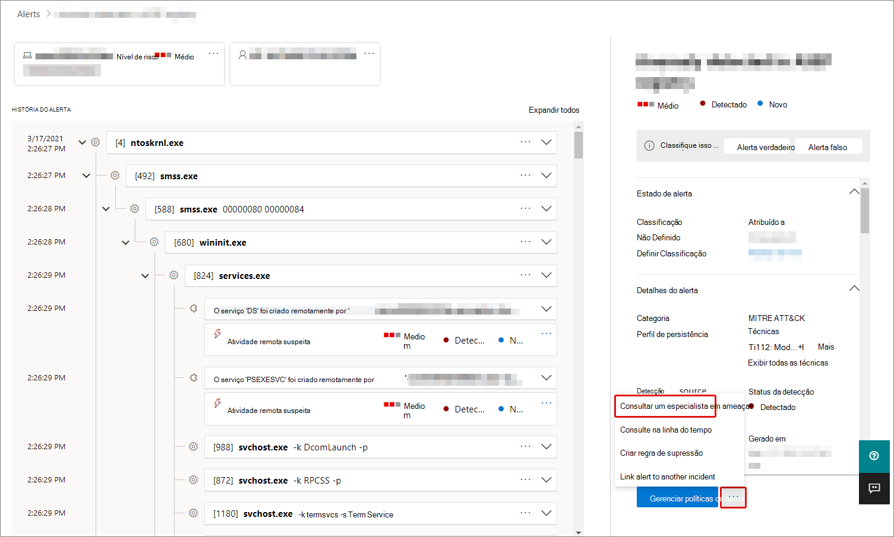
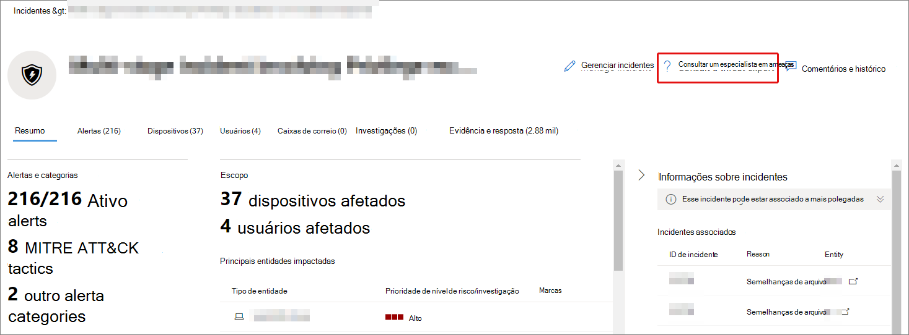

# Visão geral dos Especialistas em Ameaças da Microsoft no Microsoft 365Microsoft Threat Experts in Microsoft 365 overview

[!INCLUDE [Microsoft 365 Defender rebranding](../includes/microsoft-defender.md)]

**Aplica-se a:****Applies to:**

- [Microsoft 365 DefenderMicrosoft 365 Defender](https://go.microsoft.com/fwlink/?linkid=2118804)
- [Microsoft Defender para Ponto de ExtremidadeMicrosoft Defender for Endpoint](https://go.microsoft.com/fwlink/p/?linkid=2154037)

[!INCLUDE [Prerelease](../includes/prerelease.md)]

Especialistas em ameaças da Microsoft - Notificações de Ataque Direcionado é um serviço gerenciado de busca de ameaças.Microsoft Threat Experts - Targeted Attack Notifications is a managed threat hunting service. Depois de aplicar e ser aceito, você receberá notificações de ataque direcionadas de especialistas em ameaças da Microsoft, para que você não perca ameaças críticas ao seu ambiente.Once you apply and are accepted, you'll receive targeted attack notifications from Microsoft threat experts, so you won't miss critical threats to your environment. Essas notificações ajudarão você a proteger os pontos de extremidade, email e identidades da sua organização.These notifications will help you protect your organization's endpoints, email, and identities.
Especialistas em Ameaças da Microsoft – Especialistas sob Demanda permitem que você receba conselhos de especialistas sobre ameaças que sua organização está enfrentando.Microsoft Threat Experts – Experts on Demand lets you get expert advice about threats your organization is facing. Você pode pedir ajuda em ameaças que sua organização está enfrentando.You can reach out for help on threats your organization is facing. Ele está disponível como um serviço de assinatura.It's available as a subscription service.

## Aplicar para especialistas em ameaças da Microsoft – Notificações de ataque direcionadasApply for Microsoft Threat Experts – Targeted Attack Notifications

> [!IMPORTANT]
> Antes de aplicar, certifique-se de discutir os requisitos de qualificação para Especialistas em Ameaças da Microsoft – Notificações de Ataque Direcionadas com seu provedor de Serviços Técnicos da Microsoft e sua equipe de conta.Before you apply, make sure to discuss the eligibility requirements for Microsoft Threat Experts – Targeted Attack Notifications  with your Microsoft Technical Service provider and account team.

Se você já tiver o Microsoft Defender para o Ponto de Extremidade e o Microsoft 365 Defender, você pode solicitar especialistas em ameaças da Microsoft – Notificações de Ataque Direcionadas por meio do portal do Microsoft 365 Defender.If you already have Microsoft Defender for Endpoint and Microsoft 365 Defender, you can apply for Microsoft Threat Experts – Targeted Attack Notifications through their Microsoft 365 Defender portal. Vá **para Configurações > Pontos** de Extremidade > recursos > Recursos avançados > Especialistas em Ameaças da Microsoft – Notificações de Ataque Direcionados e selecione **Aplicar**.Go to **Settings > Endpoints > General > Advanced features > Microsoft Threat Experts – Targeted Attack Notifications**, and select **Apply**. Consulte [Configure Microsoft Threat Experts capabilities](./configure-microsoft-threat-experts.md) for a full description.See [Configure Microsoft Threat Experts capabilities](./configure-microsoft-threat-experts.md) for a full description.

Depois que seu aplicativo for aprovado, você começará a receber notificações de ataque direcionadas sempre que especialistas em ameaças detectarem uma ameaça ao seu ambiente.Once your application is approved, you'll start receiving targeted attack notifications whenever Threat Experts detect a threat to your environment.

## Inscrever-se em Especialistas em Ameaças da Microsoft - Especialistas sob DemandaSubscribe to Microsoft Threat Experts - Experts on Demand

Entre em contato com seu representante da Microsoft para se inscrever em Especialistas sob Demanda.Contact your Microsoft representative to subscribe to Experts on Demand.  Consulte [Configure Microsoft Threat Experts capabilities for](./configure-microsoft-threat-experts.md) full details.See [Configure Microsoft Threat Experts capabilities](./configure-microsoft-threat-experts.md) for full details.

## Receber notificação de ataque direcionadoReceive targeted attack notification

O recurso Especialistas em Ameaças da Microsoft – Recurso de Notificação de Ataque Direcionado fornece a busca proativa das ameaças mais importantes à sua rede.The Microsoft Threat Experts – Targeted Attack Notification capability provides proactive hunting for the most important threats to your network. Nossos especialistas em ameaças caçam invasões de adversários humanos, ataques hands-on-keyboard e ataques avançados, como cyberespionage.Our threat experts hunt for human adversary intrusions, hands-on-keyboard attacks, and advanced attacks, such as cyberespionage. Essas notificações aparecerão como um novo alerta.These notifications will show up as a new alert. O serviço de busca gerenciada inclui:The managed hunting service includes:

- Monitoramento e análise de ameaças, reduzindo o tempo de vida e o risco para sua empresaThreat monitoring and analysis, reducing dwell time and the risk to your business
- Inteligência artificial treinado pelo Caçador para descobrir e direcionar ataques conhecidos e ameaças emergentesHunter-trained artificial intelligence to discover and target both known attacks and emerging threats
- Identificação dos riscos mais pertinentes, ajudando os SOCs a maximizar sua eficáciaIdentification of the most pertinent risks, helping SOCs maximize their effectiveness
- Ajude a remediar comprometimentos e fornecer o máximo de contexto possível para permitir uma resposta rápida do SOC.Help scoping compromises and providing as much context as can be quickly delivered to enable a swift SOC response.

## Colaborar com especialistas sob demandaCollaborate with experts on demand

Você também pode entrar em contato com especialistas em ameaças da Microsoft diretamente no portal de segurança do Microsoft 365 para uma resposta rápida e precisa contra ameaças.You can also contact Microsoft threat experts from directly inside the Microsoft 365 security portal, for a swift and accurate threat response.  Os especialistas podem fornecer informações para entender melhor as ameaças complexas que sua organização pode enfrentar.Experts can provide insight to better understand the complex threats your organization may face.  Consulte um especialista para:Consult an expert to:

- Coletar informações adicionais sobre alertas e incidentes, incluindo causas raiz e escopoGather additional information on alerts and incidents, including root causes and scope
- Obtenha clareza em dispositivos, alertas ou incidentes suspeitos e obtenha as próximas etapas se enfrentar um invasor avançadoGain clarity into suspicious devices, alerts, or incidents and get next steps if faced with an advanced attacker
- Determinar riscos e proteções disponíveis relacionadas a atores de ameaças, campanhas ou técnicas de invasores emergentesDetermine risks and available protections related to threat actors, campaigns, or emerging attacker techniques

A opção de **consultar um especialista em ameaças** está disponível em vários lugares em todo o portal:The option to **Consult a threat expert** is available in several places throughout the portal:

- <i>**Menu ações da página do dispositivo**</i><i>**Device page actions menu**</i> 

- <i>**Menu de flyout da página de inventário de dispositivos**</i><i>**Device inventory page flyout menu**</i> 

- <i>**Menu de sobrevoo de página de alertas**</i><i>**Alerts page flyout menu**</i> 

- <i>**Menu ações da página incidentes**</i><i>**Incidents page actions menu**</i> 

- <i>**Página de inventário de incidentes**</i><i>**Incidents inventory page**</i> 

> [!NOTE]
> Se você tiver a assinatura do Suporte Premier mapeada para sua licença do Microsoft Defender para Office 365, poderá acompanhar o status dos casos especialistas em demanda por meio do Microsoft Services Hub.If you have Premier Support subscription mapped to your Microsoft Defender for Office 365 license, you can track the status of your Experts on Demand cases through Microsoft Services Hub.

Assista a este vídeo para uma visão geral rápida do Microsoft Services Hub.Watch this video for a quick overview of the Microsoft Services Hub.

> [!VIDEO https://www.microsoft.com/videoplayer/embed/RE4pk9f]

## Confira tambémSee also

- [Configurar recursos de Especialistas em Ameaças da MicrosoftConfigure Microsoft Threat Experts capabilities](./configure-microsoft-threat-experts.md)
