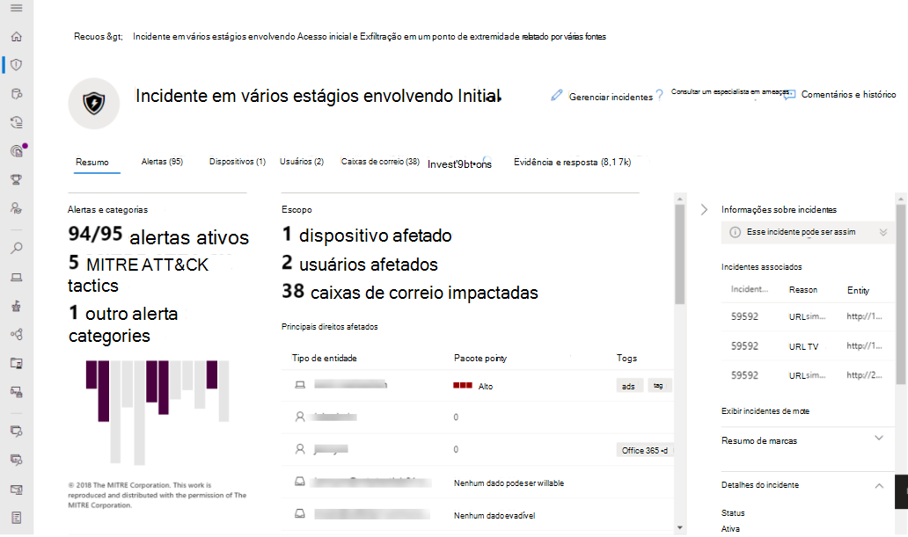

# Microsoft 365 DefenderMicrosoft 365 Defender

[!INCLUDE [Microsoft 365 Defender rebranding](../includes/microsoft-defender.md)]

**Aplica-se a:****Applies to:**
- Microsoft 365 DefenderMicrosoft 365 Defender

> Deseja experimentar o Microsoft 365 Defender?Want to experience Microsoft 365 Defender? Você pode [avaliá-lo em um ambiente de laboratório](./mtp-evaluation.md?ocid=cx-docs-MTPtriallab) ou executar seu projeto piloto em [produção](./mtp-pilot.md?ocid=cx-evalpilot).You can [evaluate it in a lab environment](./mtp-evaluation.md?ocid=cx-docs-MTPtriallab) or [run your pilot project in production](./mtp-pilot.md?ocid=cx-evalpilot).
>

O Microsoft 365 Defender é um pacote de defesa empresarial unificado pré e pós-violação que coordena de forma nativa a detecção, prevenção, investigação e resposta entre pontos de extremidade, identidades, email e aplicativos para fornecer proteção integrada contra ataques sofisticados.Microsoft 365 Defender is a unified pre- and post-breach enterprise defense suite that natively coordinates detection, prevention, investigation, and response across endpoints, identities, email, and applications to provide integrated protection against sophisticated attacks.

Com a solução integrada do Microsoft 365 Defender, os profissionais de segurança podem unir os sinais de ameaça que cada um desses produtos recebe e determinar o escopo completo e o impacto da ameaça; como ele entrou no ambiente, o que ele é afetado e como ele está afetando a organização no momento.With the integrated Microsoft 365 Defender solution, security professionals can stitch together the threat signals that each of these products receive and determine the full scope and impact of the threat; how it entered the environment, what it's affected, and how it's currently impacting the organization. O Microsoft 365 Defender toma medidas automáticas para impedir ou interromper o ataque e a auto-recuperação de caixas de correio afetadas, pontos de extremidade e identidades de usuário.Microsoft 365 Defender takes automatic action to prevent or stop the attack and self-heal affected mailboxes, endpoints, and user identities.  

<h2>Serviços do Microsoft 365 Defender
Microsoft 365 Defender services
</h2>
<table><tr><td>
<b><a href="https://docs.microsoft.com/windows/security/threat-protection/microsoft-defender-atp/microsoft-defender-advanced-threat-protection"><b>Microsoft Defender para Ponto de Extremidade</b>

<b><a href="https://docs.microsoft.com/windows/security/threat-protection/microsoft-defender-atp/microsoft-defender-advanced-threat-protection"><b>Microsoft Defender for Endpoint</b>
</a></td>
<td>
<b><a href="https://docs.microsoft.com/office365/securitycompliance/office-365-atp"><b>Microsoft Defender para Office 365</b>

<b><a href="https://docs.microsoft.com/office365/securitycompliance/office-365-atp"><b>Microsoft Defender for Office 365</b>
</a></td>
<td>
<b><a href="/azure-advanced-threat-protection/"><b>Microsoft Defender para Identidade</b></a>

<b><a href="/azure-advanced-threat-protection/"><b>Microsoft Defender for Identity</b></a>
</td>
<td>
<b><a href="/cloud-app-security/"><b>Microsoft Cloud App Security</b></a>

<b><a href="/cloud-app-security/"><b>Microsoft Cloud App Security</b></a>
</td>
</tr>
</table>
 

## Guia interativo do Microsoft 365 DefenderMicrosoft 365 Defender interactive guide

Neste guia interativo, você aprenderá a proteger sua organização com o Microsoft 365 Defender.In this interactive guide, you'll learn how to protect your organization with Microsoft 365 Defender. Você verá como o Microsoft 365 Defender pode ajudá-lo a detectar riscos de segurança, investigar ataques à sua organização e evitar atividades prejudiciais automaticamente.You'll see how Microsoft 365 Defender can help you detect security risks, investigate attacks to your organization, and prevent harmful activities automatically.

> [!VIDEO https://aka.ms/M365Defender-InteractiveGuide]

O pacote Microsoft 365 Defender protege:Microsoft 365 Defender suite protects: 
- **Pontos de extremidade com o Microsoft Defender para Ponto** de Extremidade – o Microsoft Defender for Endpoint é uma plataforma de ponto de extremidade unificada para proteção preventiva, detecção pós-violação, investigação automatizada e resposta.**Endpoints with Microsoft Defender for Endpoint** - Microsoft Defender for Endpoint is a unified endpoint platform for preventative protection, post-breach detection, automated investigation, and response. 
- Email e colaboração com o **Microsoft Defender para Office 365** - O Defender para Office 365 protege sua organização contra ameaças mal-intencionadas colocadas por mensagens de email, links (URLs) e ferramentas de colaboração.**Email and collaboration with Microsoft Defender for Office 365** - Defender for Office 365 safeguards your organization against malicious threats posed by email messages, links (URLs) and collaboration tools. 
- Identidades com o Microsoft Defender para Identidade e a Proteção de Identidade do **Azure AD** – o Microsoft Defender for Identity usa sinais do Active Directory para identificar, detectar e investigar ameaças avançadas, identidades comprometidas e ações internas mal-intencionadas direcionadas à sua organização.**Identities with Microsoft Defender for Identity and Azure AD Identity Protection** - Microsoft Defender for Identity uses Active Directory signals to identify, detect, and investigate advanced threats, compromised identities, and malicious insider actions directed at your organization. 
- **Aplicativos com segurança do Microsoft Cloud App** - A segurança do Microsoft Cloud App é uma solução abrangente entre SaaS, trazendo visibilidade profunda, controles de dados fortes e proteção aprimorada contra ameaças para seus aplicativos de nuvem.**Applications with Microsoft Cloud App security** - Microsoft Cloud App security is a comprehensive cross-SaaS solution bringing deep visibility, strong data controls, and enhanced threat protection to your cloud apps. 

>[!VIDEO https://www.microsoft.com/en-us/videoplayer/embed/RE4Bzww] 

A camada exclusiva entre produtos do Microsoft 365 Defender aumenta os componentes individuais do pacote para:Microsoft 365 Defender's unique cross-product layer augments the individual suite components to:
- Ajudar a proteger contra ataques e coordenar respostas defensivas em todo o pacote por meio de compartilhamento de sinais e ações automatizadasHelp protect against attacks and coordinate defensive responses across the suite through signal sharing and automated actions
- Narrar a história completa do ataque em alertas, comportamentos e contextos de produtos para equipes de segurança, juntando dados sobre alertas, eventos suspeitos e ativos afetados a "incidentes"Narrate the full story of the attack across product alerts, behaviors, and context for security teams by joining data on alerts, suspicious events and impacted assets to 'incidents'
- Automatizar a resposta ao comprometimento disparando a auto-recuperação para ativos afetados por meio de correção automatizadaAutomate response to compromise by triggering self-healing for impacted assets through automated remediation
- Permitir que as equipes de segurança executem a busca detalhada e eficaz de ameaças no ponto de extremidade e nos dados do OfficeEnable security teams to perform detailed and effective threat hunting across endpoint and Office data

  
Incidente entre produtos (Visão geral)Cross-product incident (Overview)

 
Todos os alertas relacionados em todos os produtos do pacote correlacionados em um único incidente (exibição de alertas)All related alerts across the suite products correlated together into a single incident (alerts view)

 
Busca baseada em consulta em cima de dados brutos de email e ponto de extremidadeQuery-based hunting on top of email and endpoint raw data

Os recursos entre produtos do Microsoft 365 Defender incluem:Microsoft 365 Defender cross-product features include: 
- **Painel único de** vidro entre produtos - Exibir central todas as informações para detecções, ativos afetados, ações automatizadas tomadas e evidências relacionadas em uma única fila e um único painel em [security.microsoft.com](https://security.microsoft.com).**Cross-product single pane of glass** - Central view all information for detections, impacted assets, automated actions taken, and related evidence in a single queue and a single pane in [security.microsoft.com](https://security.microsoft.com). 
- **Fila de incidentes combinados** - Para ajudar os profissionais de segurança a se concentrarem no que é crítico, garantindo o escopo de ataque completo, os ativos afetados e as ações de correção automatizadas são agrupados e lançados em tempo hábil.**Combined incidents queue** - To help security professionals focus on what is critical by ensuring the full attack scope, impacted assets and automated remediation actions are grouped together and surfaced in a timely manner. 
- **Resposta automática a ameaças** - As informações críticas sobre ameaças são compartilhadas em tempo real entre os produtos do Microsoft 365 Defender para ajudar a parar a progressão de um ataque.**Automatic response to threats** - Critical threat information is shared in real time between the Microsoft 365 Defender products to help stop the progression of an attack. Por exemplo, se um arquivo mal-intencionado for detectado em um ponto de extremidade protegido pelo Microsoft Defender para Ponto de Extremidade, ele instrui o Defender para o Office 365 a examinar e remover o arquivo de todas as mensagens de email.For example, if a malicious file is detected on an endpoint protected by Microsoft Defender for Endpoint, it will instruct Defender for Office 365 to scan and remove the file from all e-mail messages. O arquivo será bloqueado à vista por todo o pacote de segurança do Microsoft 365.The file will be blocked on sight by the entire Microsoft 365 security suite.
- **Auto-recuperação** para dispositivos comprometidos, identidades de usuário e caixas de correio - O Microsoft 365 Defender usa ações automáticas e playbooks com AI para remediar os ativos afetados de volta para um estado seguro.**Self-healing for compromised devices, user identities, and mailboxes** - Microsoft 365 Defender uses AI-powered automatic actions and playbooks to remediate impacted assets back to a secure state. O Microsoft 365 Defender aproveita os recursos automáticos de correção dos produtos do pacote para garantir que todos os ativos afetados relacionados a um incidente sejam automaticamente remediados quando possível.Microsoft 365 Defender leverages automatic remediation capabilities of the suite products to ensure all impacted assets related to an incident are automatically remediated where possible.
- **Busca de ameaças** entre produtos - As equipes de segurança podem aproveitar seu conhecimento organizacional exclusivo para buscar sinais de comprometimento criando suas próprias consultas personalizadas sobre os dados brutos coletados pelos vários produtos de proteção.**Cross-product threat hunting** - Security teams can leverage their unique organizational knowledge to hunt for signs of compromise by creating their own custom queries over the raw data collected by the various protection products. O Microsoft 365 Defender fornece acesso baseado em consulta a 30 dias de sinais brutos históricos e dados de alerta no ponto de extremidade e dados do Microsoft Defender para Office 365.Microsoft 365 Defender provides query-based access to 30 days of historic raw signals and alert data across endpoint and Microsoft Defender for Office 365 data. 

## IntroduçãoGet started
Os requisitos de licenciamento do Microsoft 365 Defender devem ser atendidos antes que você possa habilitar o serviço no centro de segurança do Microsoft 365 [em security.microsoft.com](https://security.microsoft.com).Microsoft 365 Defender licensing requirements must be met before you can enable the service in the Microsoft 365 security center at [security.microsoft.com](https://security.microsoft.com). Para obter mais informações, leia:For more information, read:
- [Requisitos de licenciamentoLicensing requirements](prerequisites.md#licensing-requirements)
- [Ativar o Microsoft 365 DefenderTurn on Microsoft 365 Defender](mtp-enable.md)