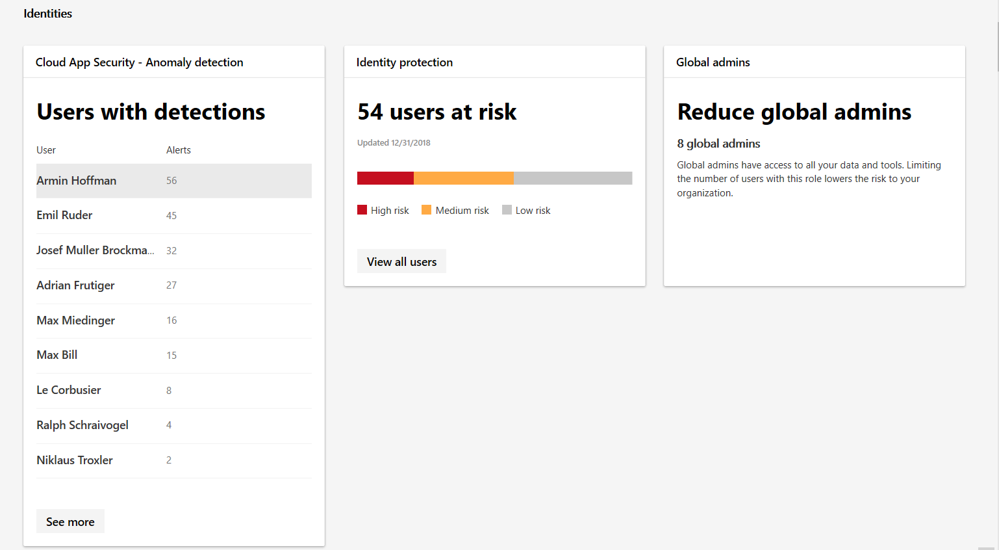

# Monitoramento e relatórios de identidade no centro de segurança do Microsoft 365

Você pode monitorar as identidades em sua organização e acompanhar os comportamentos suspeitos ou arriscados. Na categoria **identidades** de **relatórios**, você pode controlar:

* Os usuários com as anomalias mais detectadas
* Quantos usuários são relatados sob risco por políticas de acesso condicional
* O número de administradores globais em sua organização

Para usuários com detecções específicas, você pode explorar o alerta específico e investigar na central de segurança do Microsoft defender. As detecções incluem anomalias, como os usuários que entram em locais desconhecidos.

Para obter um conjunto completo de eventos de risco, confira [eventos de risco do Azure Active Directory](https://docs.microsoft.com/azure/active-directory/reports-monitoring/concept-risk-events).
