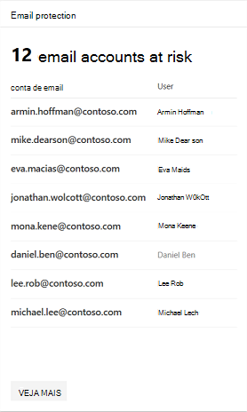
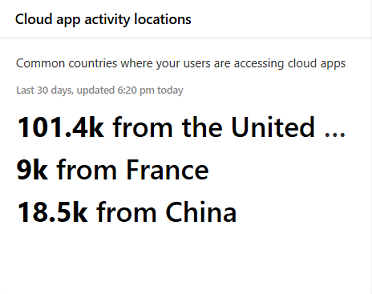

# Monitoramento e relatórios de aplicativos no centro de segurança do Microsoft 365App monitoring and reporting in the Microsoft 365 security center

[!INCLUDE [Microsoft 365 Defender rebranding](../includes/microsoft-defender.md)]

Esses relatórios fornecem mais informações sobre como os aplicativos de nuvem estão sendo usados em sua organização.These reports provide more insight into how cloud apps are being used in your organization. Inclui diferentes tipos de aplicativos, seu nível de risco e alertas.Includes different kinds of apps, their level of risk, and alerts.

## Monitorar contas de e-mail em riscoMonitor email accounts at risk

A **proteção de email** mostra as contas de email em risco.**Email protection** shows email accounts at risk. Você pode selecionar uma conta para investigar ainda mais a central de segurança do Microsoft defender.You can select an account to investigate further in Microsoft Defender Security Center.

## Monitorar permissões de aplicativo concedidas por usuáriosMonitor app permissions granted by users

**Cloud app Security-aplicativos OAuth** lista aplicativos descobertos pela Cloud app Security que receberam permissões pelos usuários.**Cloud App Security - OAuth apps** lists apps discovered by Cloud App Security that have been granted permissions by users. O catálogo de riscos do Cloud app Security inclui mais de 16.000 aplicativos que são avaliados usando mais de 70 fatores de risco.Cloud App Security's risk catalog includes over 16,000 apps that are assessed using over 70 risk factors.

Os fatores de risco são iniciados a partir de informações gerais, como o editor de aplicativos.The risk factors start from general information, such as the app publisher. Em seguida, ele passa para medidas de segurança e controles, como se o aplicativo dá suporte à criptografia em repouso ou fornece um log de auditoria da atividade do usuário.It then moves to security measures and controls, such as whether the app supports encryption at rest or provides an audit log of user activity.

## Monitorar contas de usuário do aplicativo na nuvemMonitor cloud app user accounts

**Contas de aplicativo em nuvem para análise** lista contas que podem exigir atenção.**Cloud app accounts for review** lists accounts that may require attention.

## Entender quais aplicativos de nuvem são usadosUnderstand which cloud apps are used

Os **aplicativos de nuvem descobertos (categorias)** mostram quais tipos de aplicativos estão sendo usados em sua organização.**Discovered cloud apps (categories)** show what kinds of apps are being used in your organization. Ele é vinculado ao painel de descoberta de nuvem no Cloud app Security.It links to the Cloud Discovery dashboard in Cloud App Security. Para obter mais informações, consulte [QuickStart: work with untected apps](https://docs.microsoft.com/cloud-app-security/discovered-apps).For more information, see [Quickstart: Work with discovered apps](https://docs.microsoft.com/cloud-app-security/discovered-apps).  

## Monitorar onde os usuários acessam os aplicativos de nuvemMonitor where users access cloud apps

**Locais de atividade do aplicativo na nuvem** mostram onde os usuários estão acessando aplicativos em nuvem.**Cloud app activity locations** show where users are accessing cloud apps.

## Monitorar a integridade das cargas de trabalho da infraestruturaMonitor health for infrastructure workloads

**Infrastructure Health** mostra alertas de status de integridade para cargas de trabalho de infraestrutura no Azure defender.**Infrastructure health** shows health status alerts for infrastructure workloads in Azure Defender.

O Azure defender fornece o gerenciamento de segurança unificado e o defender para Office 365 entre cargas de trabalho locais e em nuvem.Azure Defender provides unified security management and Defender for Office 365 across on-premises and cloud workloads. Você pode coletar, Pesquisar e analisar dados de segurança de fontes diferentes, incluindo firewalls e outras soluções de parceiros.You can collect, search, and analyze security data from different sources, including firewalls and other partner solutions.

Para obter mais informações, consulte a [documentação do Azure defender](https://docs.microsoft.com/azure/security-center/).For more information, see [Azure Defender Documentation](https://docs.microsoft.com/azure/security-center/).

