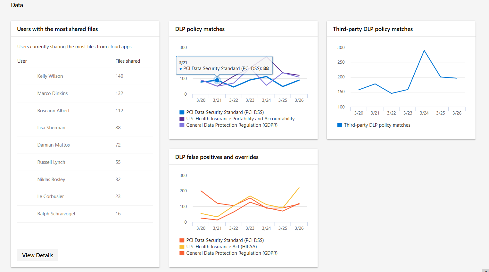

# Monitoramento e relatório de dados no centro de segurança do Microsoft 365

[!INCLUDE [Microsoft 365 Defender rebranding](../includes/microsoft-defender.md)]

A categoria **Dados** ajuda a acompanhar as atividades do usuário que podem levar à divulgação de dados não autorizados. Eles são o retrabalho de relatórios de política de DLP existentes, além de um relatório de política de DLP de terceiros.

Como você pode ver:

- Usuários que compartilham a maioria dos arquivos a partir de aplicativos na nuvem
- Quantas combinações de política de DLP ocorreram
- Quantas substituições ou falsos positivos de políticas PPD são relatados
- Quantas combinações de política DLP aconteceram em serviços de nuvem de terceiros por meio do Microsoft Cloud App Security

