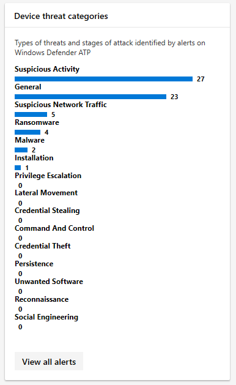
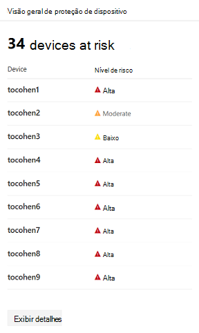
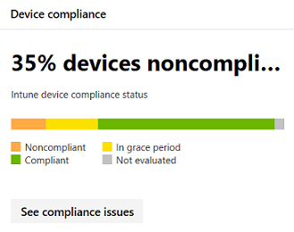

# <a name="device-monitoring-and-reporting-in-the-microsoft-365-security-center"></a><span data-ttu-id="1f71d-104">Monitoramento e relatórios de dispositivos no centro de segurança do Microsoft 365</span><span class="sxs-lookup"><span data-stu-id="1f71d-104">Device monitoring and reporting in the Microsoft 365 security center</span></span>

<span data-ttu-id="1f71d-105">Mantenha seus dispositivos seguros, atualizados e identifique as possíveis ameaças no centro de segurança do Microsoft 365.</span><span class="sxs-lookup"><span data-stu-id="1f71d-105">Keep your devices secure, up-to-date, and spot potential threats in the Microsoft 365 security center.</span></span>

## <a name="view-device-alerts"></a><span data-ttu-id="1f71d-106">Exibir alertas de dispositivo</span><span class="sxs-lookup"><span data-stu-id="1f71d-106">View device alerts</span></span>

<span data-ttu-id="1f71d-107">Obtenha alertas atualizados sobre a atividade de violação e outras ameaças em seus dispositivos do Microsoft defender ATP (disponível com uma licença E5).</span><span class="sxs-lookup"><span data-stu-id="1f71d-107">Get up-to-date alerts about breach activity and other threats on your devices from Microsoft Defender ATP (available with an E5 license).</span></span> <span data-ttu-id="1f71d-108">O Microsoft 365 Security Center monitora efetivamente esses alertas em um nível alto usando seu fluxo de trabalho preferido.</span><span class="sxs-lookup"><span data-stu-id="1f71d-108">Microsoft 365 security center effectively monitors these alerts at a high level using your preferred workflow.</span></span>

### <a name="monitor-high-impact-alerts"></a><span data-ttu-id="1f71d-109">Monitorar alertas de alto impacto</span><span class="sxs-lookup"><span data-stu-id="1f71d-109">Monitor high-impact alerts</span></span>

<span data-ttu-id="1f71d-110">Cada alerta ATP do Microsoft defender tem uma severidade correspondente (alta, média, baixa ou informativa) que indica seu impacto em potencial para a sua rede se não for deixado autônomo.</span><span class="sxs-lookup"><span data-stu-id="1f71d-110">Each Microsoft Defender ATP alert has a corresponding severity (high, medium, low, or informational) that indicates its potential impact to your network if left unattended.</span></span>  

<span data-ttu-id="1f71d-111">Use o cartão de **severidade de alerta de dispositivo** para se concentrar especificamente nos alertas que são mais graves e podem exigir resposta imediata.</span><span class="sxs-lookup"><span data-stu-id="1f71d-111">Use the **Device alert severity** card to focus specifically on alerts that are more severe and might require immediate response.</span></span> <span data-ttu-id="1f71d-112">Neste cartão, você pode exibir mais informações no portal da central de segurança do Microsoft defender.</span><span class="sxs-lookup"><span data-stu-id="1f71d-112">From this card, you can view more information on the Microsoft Defender Security Center portal.</span></span>


### <a name="understand-sources-of-alerts"></a><span data-ttu-id="1f71d-114">Entender fontes de alertas</span><span class="sxs-lookup"><span data-stu-id="1f71d-114">Understand sources of alerts</span></span>

<span data-ttu-id="1f71d-115">O Microsoft defender ATP aproveita dados de uma ampla variedade de sensores de segurança e fontes de inteligência para gerar alertas.</span><span class="sxs-lookup"><span data-stu-id="1f71d-115">Microsoft Defender ATP leverages data from a broad range of security sensors and intelligence sources to generate alerts.</span></span> <span data-ttu-id="1f71d-116">Por exemplo, ele pode usar informações de detecção do Windows Defender Antivirus e antimalware de terceiros, bem como sua própria inteligência de ameaças personalizada fornecida por meio da API do serviço Web.</span><span class="sxs-lookup"><span data-stu-id="1f71d-116">For example, it can use detection information from Windows Defender Antivirus and third-party antimalware, as well as your own custom threat intelligence provided through the web service API.</span></span>

<span data-ttu-id="1f71d-117">O cartão de fontes de **detecção de alerta de dispositivo** mostra a distribuição de alertas por fonte.</span><span class="sxs-lookup"><span data-stu-id="1f71d-117">The **Device alert detection** sources card shows the distribution of alerts by source.</span></span> <span data-ttu-id="1f71d-118">Este cartão pode ajudá-lo a controlar atividades relacionadas a determinadas fontes, particularmente suas fontes personalizadas.</span><span class="sxs-lookup"><span data-stu-id="1f71d-118">This card can help you track activity related to certain sources, particularly your custom sources.</span></span> <span data-ttu-id="1f71d-119">Você também pode usá-lo para se concentrar nos alertas provenientes de sensores que não estão configurados para bloquear automaticamente atividades ou componentes mal-intencionados.</span><span class="sxs-lookup"><span data-stu-id="1f71d-119">You can also use this to focus on alerts coming from sensors that are not configured to automatically block malicious activity or components.</span></span>


<span data-ttu-id="1f71d-121">Neste cartão, você pode exibir mais informações no portal da central de segurança do Microsoft defender.</span><span class="sxs-lookup"><span data-stu-id="1f71d-121">From this card, you can view more information on the Microsoft Defender Security Center portal.</span></span>

### <a name="understand-the-types-of-threats-that-trigger-alerts"></a><span data-ttu-id="1f71d-122">Compreender os tipos de ameaças que acionam alertas</span><span class="sxs-lookup"><span data-stu-id="1f71d-122">Understand the types of threats that trigger alerts</span></span>

<span data-ttu-id="1f71d-123">O Microsoft defender ATP classifica cada alerta em uma categoria que representa um determinado estágio na cadeia de ataque ou um tipo de componente de ameaça.</span><span class="sxs-lookup"><span data-stu-id="1f71d-123">Microsoft Defender ATP sorts each alert into a category representing a certain stage in the attack chain or a type of threat component.</span></span> <span data-ttu-id="1f71d-124">Por exemplo, uma atividade de ameaça detectada pode ser categorizada como "movimento lateral" para indicar que houve uma tentativa de acessar outros dispositivos na rede.</span><span class="sxs-lookup"><span data-stu-id="1f71d-124">For example, a detected threat activity might be categorized as "lateral movement" to indicate that there was an attempt to reach other devices on the network.</span></span> <span data-ttu-id="1f71d-125">A atividade também provavelmente ocorreu depois que os invasores obtiveram um destaque inicial.</span><span class="sxs-lookup"><span data-stu-id="1f71d-125">The activity has also likely occurred after attackers gained an initial foothold.</span></span> <span data-ttu-id="1f71d-126">Quando detectada, um componente de ameaça pode ser classificado amplamente como um malware ou mais especificamente como ransomware, roubo de credencial ou outros tipos de software mal-intencionado ou indesejado.</span><span class="sxs-lookup"><span data-stu-id="1f71d-126">When detected, a threat component might either be classified broadly as malware, or more specifically as ransomware, credential stealing, or other types of malicious or unwanted software.</span></span>

<span data-ttu-id="1f71d-127">O cartão de **categorias de ameaça de dispositivo** mostra a distribuição de alertas nessas categorias.</span><span class="sxs-lookup"><span data-stu-id="1f71d-127">The **Device threat categories** card shows the distribution of alerts into these categories.</span></span> <span data-ttu-id="1f71d-128">Você pode usar essas informações para identificar a atividade de ameaças, como tentativas de roubo de credenciais, que podem ter maior impacto em comparação às tentativas de engenharia social.</span><span class="sxs-lookup"><span data-stu-id="1f71d-128">You can use this information to identify threat activity, such as credential theft attempts, that can have higher impact compared to social engineering attempts.</span></span> <span data-ttu-id="1f71d-129">Você também pode usar essas informações para monitorar ameaças potencialmente destrutivas, como ransomware.</span><span class="sxs-lookup"><span data-stu-id="1f71d-129">You can also use this information to monitor for potentially destructive threats like ransomware.</span></span>



### <a name="monitor-active-alerts"></a><span data-ttu-id="1f71d-131">Monitorar alertas ativos</span><span class="sxs-lookup"><span data-stu-id="1f71d-131">Monitor active alerts</span></span>

<span data-ttu-id="1f71d-132">O cartão de **status de alerta de dispositivo** indica o número de alertas que não foram resolvidos e podem exigir atenção.</span><span class="sxs-lookup"><span data-stu-id="1f71d-132">The **Device alert status** card indicates the number of alerts that have not been resolved and might require attention.</span></span> <span data-ttu-id="1f71d-133">Neste cartão, você pode exibir mais informações no portal da central de segurança do Microsoft defender.</span><span class="sxs-lookup"><span data-stu-id="1f71d-133">From this card, you can view more information on the Microsoft Defender Security Center portal.</span></span>


### <a name="monitor-classification-of-resolved-alerts"></a><span data-ttu-id="1f71d-135">Monitorar a classificação de alertas resolvidos</span><span class="sxs-lookup"><span data-stu-id="1f71d-135">Monitor classification of resolved alerts</span></span>

<span data-ttu-id="1f71d-136">Ao resolver um alerta ATP do Microsoft defender, sua equipe de segurança pode especificar se um alerta foi verificado como:</span><span class="sxs-lookup"><span data-stu-id="1f71d-136">When resolving a Microsoft Defender ATP alert, your security staff can specify whether an alert has been verified as:</span></span>

* <span data-ttu-id="1f71d-137">Um alerta verdadeiro que identifica atividade de violação real ou componentes de ameaça</span><span class="sxs-lookup"><span data-stu-id="1f71d-137">A true alert that identifies actual breach activity or threat components</span></span>
* <span data-ttu-id="1f71d-138">Um alerta falso que foi detectado incorretamente uma atividade normal</span><span class="sxs-lookup"><span data-stu-id="1f71d-138">A false alert that has incorrectly detected normal activity</span></span>

<span data-ttu-id="1f71d-139">O cartão de **classificação de alerta de dispositivo** mostra se seus alertas resolvidos foram classificados como verdadeiros ou falsos alertas.</span><span class="sxs-lookup"><span data-stu-id="1f71d-139">The **Device alert classification** card shows whether your resolved alerts have been classified as true or false alerts.</span></span> <span data-ttu-id="1f71d-140">Neste cartão, você pode exibir mais informações no portal da central de segurança do Microsoft defender.</span><span class="sxs-lookup"><span data-stu-id="1f71d-140">From this card, you can view more information on the Microsoft Defender Security Center portal.</span></span>

<span data-ttu-id="1f71d-141">Observação: em alguns casos, as informações de classificação não estão disponíveis para determinados alertas.</span><span class="sxs-lookup"><span data-stu-id="1f71d-141">Note: In some cases, classification information is unavailable for certain alerts.</span></span>


### <a name="monitor-determination-of-resolved-alerts"></a><span data-ttu-id="1f71d-143">Monitorar a determinação dos alertas resolvidos</span><span class="sxs-lookup"><span data-stu-id="1f71d-143">Monitor determination of resolved alerts</span></span>

<span data-ttu-id="1f71d-144">Além de classificar se um alerta é verdadeiro ou falso durante a resolução, sua equipe de segurança pode fornecer uma determinação, indicando o tipo de atividade normal ou mal-intencionada encontrada durante a validação do alerta.</span><span class="sxs-lookup"><span data-stu-id="1f71d-144">In addition to classifying whether an alert is true or false during resolution, your security staff can provide a determination, indicating the type of normal or malicious activity that was found while validating the alert.</span></span>

<span data-ttu-id="1f71d-145">O cartão de **determinação de alerta de dispositivo** mostra a determinação fornecida para cada alerta.</span><span class="sxs-lookup"><span data-stu-id="1f71d-145">The **Device alert determination** card shows the determination provided for each alert.</span></span>

* <span data-ttu-id="1f71d-146">**Apt**: ameaça persistente avançada, indicando que a atividade detectada ou o componente de ameaça faz parte de uma violação sofisticada projetada para obter uma brecha na rede afetada</span><span class="sxs-lookup"><span data-stu-id="1f71d-146">**APT**: advanced persistent threat, indicating that the detected activity or threat component is part of a sophisticated breach designed to gain a foothold in the affected network</span></span>  
* <span data-ttu-id="1f71d-147">**Malware**: arquivo ou código mal-intencionado</span><span class="sxs-lookup"><span data-stu-id="1f71d-147">**Malware**: malicious file or code</span></span>
* <span data-ttu-id="1f71d-148">**Equipe de segurança**: atividade normal realizada pela equipe de segurança</span><span class="sxs-lookup"><span data-stu-id="1f71d-148">**Security personnel**: normal activity performed by security staff</span></span>
* <span data-ttu-id="1f71d-149">**Teste de segurança**: atividade ou componentes projetados para simular ameaças reais e que devem disparar sensores de segurança e gerar alertas</span><span class="sxs-lookup"><span data-stu-id="1f71d-149">**Security testing**: activity or components designed to simulate actual threats and expected to trigger security sensors and generate alerts</span></span>
* <span data-ttu-id="1f71d-150">**Software indesejado**: aplicativos e outros softwares que não são considerados mal-intencionados, mas que, de outra forma, violam os padrões de política ou de uso aceitáveis</span><span class="sxs-lookup"><span data-stu-id="1f71d-150">**Unwanted software**: apps and other software that are not considered malicious, but otherwise violate policy or acceptable use standards</span></span>
* <span data-ttu-id="1f71d-151">**Outros**: qualquer outra determinação que não esteja nos tipos fornecidos</span><span class="sxs-lookup"><span data-stu-id="1f71d-151">**Others**: any other determination that does not fall under the provided types</span></span>

<span data-ttu-id="1f71d-152">Neste cartão, você pode exibir mais informações na central de segurança do Microsoft defender.</span><span class="sxs-lookup"><span data-stu-id="1f71d-152">From this card, you can view more information in Microsoft Defender Security Center.</span></span>


### <a name="understand-which-devices-are-at-risk"></a><span data-ttu-id="1f71d-154">Entender quais dispositivos estão em risco</span><span class="sxs-lookup"><span data-stu-id="1f71d-154">Understand which devices are at risk</span></span>

<span data-ttu-id="1f71d-155">**Proteção de dispositivo** mostra o nível de risco para dispositivos.</span><span class="sxs-lookup"><span data-stu-id="1f71d-155">**Device protection** shows the risk level for devices.</span></span> <span data-ttu-id="1f71d-156">O nível de risco é baseado em fatores como o tipo e a gravidade de alertas no dispositivo.</span><span class="sxs-lookup"><span data-stu-id="1f71d-156">The risk level is based on factors such as the type and severity of alerts on the device.</span></span>



## <a name="monitor-and-report-status-of-intune-managed-devices"></a><span data-ttu-id="1f71d-158">Monitorar e relatar o status dos dispositivos gerenciados pelo Intune</span><span class="sxs-lookup"><span data-stu-id="1f71d-158">Monitor and report status of Intune-managed devices</span></span>

<span data-ttu-id="1f71d-159">Os relatórios a seguir contêm dados de dispositivos registrados no Intune.</span><span class="sxs-lookup"><span data-stu-id="1f71d-159">The following reports contain data from devices enrolled in Intune.</span></span> <span data-ttu-id="1f71d-160">Dados de dispositivos não registrados não estão incluídos.</span><span class="sxs-lookup"><span data-stu-id="1f71d-160">Data from unenrolled devices is not included.</span></span> <span data-ttu-id="1f71d-161">Somente os administradores globais podem exibir esses cartões.</span><span class="sxs-lookup"><span data-stu-id="1f71d-161">Only Global Administrators can view these cards.</span></span>

<span data-ttu-id="1f71d-162">Os dados do dispositivo registrados do Intune incluem:</span><span class="sxs-lookup"><span data-stu-id="1f71d-162">Intune enrolled device data includes:</span></span>

* <span data-ttu-id="1f71d-163">Conformidade do dispositivo</span><span class="sxs-lookup"><span data-stu-id="1f71d-163">Device compliance</span></span>
* <span data-ttu-id="1f71d-164">Dispositivos com malware ativo</span><span class="sxs-lookup"><span data-stu-id="1f71d-164">Devices with active malware</span></span>
* <span data-ttu-id="1f71d-165">Tipos de malware em dispositivos</span><span class="sxs-lookup"><span data-stu-id="1f71d-165">Types of malware on devices</span></span>
* <span data-ttu-id="1f71d-166">Malware em dispositivos</span><span class="sxs-lookup"><span data-stu-id="1f71d-166">Malware on devices</span></span>
* <span data-ttu-id="1f71d-167">Dispositivos com detecções de malware</span><span class="sxs-lookup"><span data-stu-id="1f71d-167">Devices with malware detections</span></span>
* <span data-ttu-id="1f71d-168">Usuários com detecções de malware</span><span class="sxs-lookup"><span data-stu-id="1f71d-168">Users with malware detections</span></span>

### <a name="monitor-device-compliance"></a><span data-ttu-id="1f71d-169">Monitorar a conformidade do dispositivo</span><span class="sxs-lookup"><span data-stu-id="1f71d-169">Monitor device compliance</span></span>

<span data-ttu-id="1f71d-170">A **conformidade do dispositivo** mostra quantos dispositivos estão registrados no Intune em conformidade com as políticas de configuração.</span><span class="sxs-lookup"><span data-stu-id="1f71d-170">**Device compliance** shows how many devices that are enrolled in Intune comply with configuration policies.</span></span>



### <a name="discover-devices-with-malware-detections"></a><span data-ttu-id="1f71d-172">Descobrir dispositivos com detecções de malware</span><span class="sxs-lookup"><span data-stu-id="1f71d-172">Discover devices with malware detections</span></span>

<span data-ttu-id="1f71d-173">As **detecções de malware de dispositivo** fornecem o número de dispositivos registrados pelo Intune com malware que não foram totalmente resolvidos.</span><span class="sxs-lookup"><span data-stu-id="1f71d-173">**Device malware detections** provide the number of Intune enrolled devices with malware that have not been fully resolved.</span></span> <span data-ttu-id="1f71d-174">Isso pode ser devido a ações pendentes, a reinicialização, a uma verificação completa, ações manuais do usuário ou se a ação de correção não for concluída com êxito.</span><span class="sxs-lookup"><span data-stu-id="1f71d-174">This can be due to pending actions, a restart, a full scan, manual user actions, or if the remediation action did not complete successfully.</span></span>


### <a name="understand-the-types-of-malware-detected"></a><span data-ttu-id="1f71d-176">Compreender os tipos de malware detectados</span><span class="sxs-lookup"><span data-stu-id="1f71d-176">Understand the types of malware detected</span></span>

<span data-ttu-id="1f71d-177">Os **tipos de malware nos dispositivos** mostram diferentes tipos de malware detectados em dispositivos registrados no Intune.</span><span class="sxs-lookup"><span data-stu-id="1f71d-177">**Types of malware on devices** show different kinds of malware that have been detected on devices enrolled in Intune.</span></span> <span data-ttu-id="1f71d-178">Você pode investigar cada tipo na central de segurança do Microsoft 365.</span><span class="sxs-lookup"><span data-stu-id="1f71d-178">You can investigate each type in the Microsoft 365 security center.</span></span>


### <a name="understand-the-specific-malware-detected-on-your-devices"></a><span data-ttu-id="1f71d-180">Entender o malware específico detectado em seus dispositivos</span><span class="sxs-lookup"><span data-stu-id="1f71d-180">Understand the specific malware detected on your devices</span></span>

<span data-ttu-id="1f71d-181">**Malware em dispositivos** fornecem uma lista de malware específico detectado em seus dispositivos.</span><span class="sxs-lookup"><span data-stu-id="1f71d-181">**Malware on devices** provide a list of the specific malware detected on your devices.</span></span>


### <a name="understand-which-devices-have-the-most-malware"></a><span data-ttu-id="1f71d-183">Entender quais dispositivos têm mais malware</span><span class="sxs-lookup"><span data-stu-id="1f71d-183">Understand which devices have the most malware</span></span>

<span data-ttu-id="1f71d-184">**Dispositivos com detecções de malware** mostram quais dispositivos têm a maior quantidade de detecções de malware.</span><span class="sxs-lookup"><span data-stu-id="1f71d-184">**Devices with malware detections** show which devices have the most malware detections.</span></span> <span data-ttu-id="1f71d-185">no centro de segurança do Microsoft 365, você pode investigar se o malware está ativo, quem usa o dispositivo e seu status de gerenciamento no Intune.</span><span class="sxs-lookup"><span data-stu-id="1f71d-185">in the Microsoft 365 security center, you can investigate whether malware is active, who uses the device, and its management status in Intune.</span></span>


### <a name="understand-which-users-have-devices-with-the-most-malware"></a><span data-ttu-id="1f71d-187">Entender quais usuários têm dispositivos com mais malware</span><span class="sxs-lookup"><span data-stu-id="1f71d-187">Understand which users have devices with the most malware</span></span>

<span data-ttu-id="1f71d-188">**Os usuários com detecções de malware** mostram usuários com dispositivos com mais detecções de malware.</span><span class="sxs-lookup"><span data-stu-id="1f71d-188">**Users with malware detections** show users with devices that had the most malware detections.</span></span> <span data-ttu-id="1f71d-189">Na central de segurança do Microsoft 365, você pode ver quantos dispositivos são atribuídos a cada usuário e mais informações sobre cada dispositivo e o tipo de malware.</span><span class="sxs-lookup"><span data-stu-id="1f71d-189">In the Microsoft 365 security center, you can see how many devices are assigned to each user and more information about each device and the type of malware.</span></span>


## <a name="monitor-and-manage-asr-rule-deployment-and-detections"></a><span data-ttu-id="1f71d-191">Monitorar e gerenciar a implantação e as detecções de regras ASR</span><span class="sxs-lookup"><span data-stu-id="1f71d-191">Monitor and manage ASR rule deployment and detections</span></span>

<span data-ttu-id="1f71d-192">[As regras de redução da superfície de ataque (ASR)](https://docs.microsoft.com/windows/security/threat-protection/microsoft-defender-atp/attack-surface-reduction) ajudam a evitar ações e aplicativos normalmente usados por malware de busca de exploração para infectar dispositivos.</span><span class="sxs-lookup"><span data-stu-id="1f71d-192">[Attack Surface Reduction (ASR) rules](https://docs.microsoft.com/windows/security/threat-protection/microsoft-defender-atp/attack-surface-reduction) help prevent actions and apps that are typically used by exploit-seeking malware to infect devices.</span></span> <span data-ttu-id="1f71d-193">Essas regras controlam quando e como os executáveis podem ser executados.</span><span class="sxs-lookup"><span data-stu-id="1f71d-193">These rules control when and how executables can run.</span></span> <span data-ttu-id="1f71d-194">Por exemplo, você pode impedir que o JavaScript ou o VBScript inicializem um item executável baixado, bloqueie chamadas de API do Win32 recebidas de macros do Office ou bloqueie processos executados em unidades USB.</span><span class="sxs-lookup"><span data-stu-id="1f71d-194">For example, you can prevent JavaScript or VBScript from launching a downloaded executable, block Win32 API calls from Office macros, or block processes that run from USB drives.</span></span>


<span data-ttu-id="1f71d-196">O cartão de **Regras de redução de superfície de ataque** fornece uma visão geral da implantação de regras nos seus dispositivos.</span><span class="sxs-lookup"><span data-stu-id="1f71d-196">The **Attack surface reduction rules** card provides an overview of the deployment of rules across your devices.</span></span>

<span data-ttu-id="1f71d-197">A barra superior do cartão mostra o número total de dispositivos que estão nos seguintes modos de implantação:</span><span class="sxs-lookup"><span data-stu-id="1f71d-197">The top bar on the card shows the total number of devices that are in the following deployment modes:</span></span>

* <span data-ttu-id="1f71d-198">**Modo de bloqueio**: dispositivos com pelo menos uma regra configurada para bloquear a atividade detectada</span><span class="sxs-lookup"><span data-stu-id="1f71d-198">**Block mode**: devices with at least one rule configured to block detected activity</span></span>
* <span data-ttu-id="1f71d-199">**Modo de auditoria**: dispositivos sem regras definidas para bloquear a atividade detectada, mas tem pelo menos um conjunto de regras para auditar a atividade detectada</span><span class="sxs-lookup"><span data-stu-id="1f71d-199">**Audit mode**: devices with no rules set to block detected activity, but has at least one rule set to audit detected activity</span></span>  
* <span data-ttu-id="1f71d-200">**Off**: dispositivos com todas as regras ASR desativados</span><span class="sxs-lookup"><span data-stu-id="1f71d-200">**Off**: devices with all ASR rules turned off</span></span>

<span data-ttu-id="1f71d-201">A parte inferior do cartão mostra as configurações da regra em todos os seus dispositivos.</span><span class="sxs-lookup"><span data-stu-id="1f71d-201">The lower part of this card shows settings by rule across your devices.</span></span> <span data-ttu-id="1f71d-202">Cada barra indica o número de dispositivos configurados para bloquear ou auditar a detecção ou que estão com a regra completamente desativada.</span><span class="sxs-lookup"><span data-stu-id="1f71d-202">Each bar indicates the number of devices that are set to block or audit detection or have the rule completely turned off.</span></span>

### <a name="view-asr-detections"></a><span data-ttu-id="1f71d-203">Exibir detecções ASR</span><span class="sxs-lookup"><span data-stu-id="1f71d-203">View ASR detections</span></span>

<span data-ttu-id="1f71d-204">Para exibir informações detalhadas sobre detecções de regra ASR em sua rede, selecione **Exibir detecções** no cartão de **regras de redução de superfície de ataque** .</span><span class="sxs-lookup"><span data-stu-id="1f71d-204">To view detailed information about ASR rule detections in your network, select **View detections** on the **Attack surface reduction rules** card.</span></span> <span data-ttu-id="1f71d-205">A guia **detecções** da página relatório detalhado será aberta.</span><span class="sxs-lookup"><span data-stu-id="1f71d-205">The **Detections** tab in the detailed report page will open.</span></span>


<span data-ttu-id="1f71d-207">O gráfico na parte superior da página mostra as detecções com as detecções de empilhamento de tempo que foram bloqueadas ou auditadas.</span><span class="sxs-lookup"><span data-stu-id="1f71d-207">The chart at the top of the page shows detections over time stacking detections that were either blocked or audited.</span></span> <span data-ttu-id="1f71d-208">A tabela na parte inferior lista as detecções mais recentes.</span><span class="sxs-lookup"><span data-stu-id="1f71d-208">The table at the bottom lists the most recent detections.</span></span> <span data-ttu-id="1f71d-209">Confira as seguintes informações na tabela para entender a natureza das detecções:</span><span class="sxs-lookup"><span data-stu-id="1f71d-209">Use the following information on the table to understand the nature of the detections:</span></span>

* <span data-ttu-id="1f71d-210">**Arquivo detectado**: o arquivo, geralmente um script ou um documento, cujo conteúdo disparou a atividade de ataque suspeito</span><span class="sxs-lookup"><span data-stu-id="1f71d-210">**Detected file**: the file, typically a script or a document, whose contents triggered the suspected attack activity</span></span>
* <span data-ttu-id="1f71d-211">**Regra**: nome que descreve as atividades de ataque que a regra foi projetada para capturar.</span><span class="sxs-lookup"><span data-stu-id="1f71d-211">**Rule**: name describing the attack activities the rule is designed to catch.</span></span> <span data-ttu-id="1f71d-212">Leia sobre regras de ASR existentes</span><span class="sxs-lookup"><span data-stu-id="1f71d-212">Read about existing ASR rules</span></span>
* <span data-ttu-id="1f71d-213">**Aplicativo de origem**: o aplicativo que carregou ou executou o conteúdo que está disparando a atividade de ataque suspeita.</span><span class="sxs-lookup"><span data-stu-id="1f71d-213">**Source app**: the application that loaded or executed content triggering the suspected attack activity.</span></span> <span data-ttu-id="1f71d-214">Pode ser um aplicativo legítimo, como navegador da Web, um aplicativo do Office ou uma ferramenta do sistema, como o PowerShell</span><span class="sxs-lookup"><span data-stu-id="1f71d-214">This could be a legitimate application, such as web browser, an Office application, or a system tool like PowerShell</span></span>
* <span data-ttu-id="1f71d-215">**Publisher**: o fornecedor que liberou o aplicativo de origem</span><span class="sxs-lookup"><span data-stu-id="1f71d-215">**Publisher**: the vendor that released the source app</span></span>

### <a name="review-device-asr-rule-settings"></a><span data-ttu-id="1f71d-216">Examinar as configurações de regra ASR do dispositivo</span><span class="sxs-lookup"><span data-stu-id="1f71d-216">Review device ASR rule settings</span></span>

<span data-ttu-id="1f71d-217">Na página relatório de **regras de redução da superfície de ataque** , vá para a guia **configuração** para analisar as configurações de regra para dispositivos individuais.</span><span class="sxs-lookup"><span data-stu-id="1f71d-217">In the **Attack surface reduction rules** report page, go to the **Configuration** tab to review rule settings for individual devices.</span></span> <span data-ttu-id="1f71d-218">Selecione um dispositivo para obter informações detalhadas sobre se cada regra está no modo de bloqueio, modo de auditoria ou desativada inteiramente.</span><span class="sxs-lookup"><span data-stu-id="1f71d-218">Select a device to get detailed information about whether each rule is in block mode, audit mode, or turned off entirely.</span></span>


<span data-ttu-id="1f71d-220">O Microsoft Intune fornece funcionalidade de gerenciamento para suas regras ASR.</span><span class="sxs-lookup"><span data-stu-id="1f71d-220">Microsoft Intune provides management functionality for your ASR rules.</span></span> <span data-ttu-id="1f71d-221">Se você quiser atualizar suas configurações, selecione **começar** em **configurar dispositivos** na guia para abrir o gerenciamento de dispositivos no Intune.</span><span class="sxs-lookup"><span data-stu-id="1f71d-221">If you want to update your settings, select **Get started** under **Configure devices** in the tab to open device management on Intune.</span></span>

### <a name="exclude-files-from-asr-rules"></a><span data-ttu-id="1f71d-222">Excluir arquivos de regras ASR</span><span class="sxs-lookup"><span data-stu-id="1f71d-222">Exclude files from ASR rules</span></span>

<span data-ttu-id="1f71d-223">A central de segurança do Microsoft 365 coleta os nomes dos [arquivos que você pode querer excluir](https://docs.microsoft.com/windows/security/threat-protection/microsoft-defender-atp/enable-attack-surface-reduction#exclude-files-and-folders-from-asr-rules) das detecções por regras de redução de superfície de ataque.</span><span class="sxs-lookup"><span data-stu-id="1f71d-223">Microsoft 365 security center collects the names of the [files you might want to exclude](https://docs.microsoft.com/windows/security/threat-protection/microsoft-defender-atp/enable-attack-surface-reduction#exclude-files-and-folders-from-asr-rules) from detections by attack surface reduction rules.</span></span> <span data-ttu-id="1f71d-224">Ao excluir arquivos, você pode reduzir as detecções de falsos positivos e implantar com segurança as regras de redução de superfície de ataque no modo de bloqueio.</span><span class="sxs-lookup"><span data-stu-id="1f71d-224">By excluding files, you can reduce false positive detections and more confidently deploy attack surface reduction rules in block mode.</span></span>

<span data-ttu-id="1f71d-225">As exclusões são gerenciadas no Microsoft Intune, mas o centro de segurança do Microsoft 365 oferece uma ferramenta de análise para ajudá-lo a entender os arquivos.</span><span class="sxs-lookup"><span data-stu-id="1f71d-225">The exclusions are managed on Microsoft Intune, but Microsoft 365 security center provides an analysis tool to help you understand the files.</span></span> <span data-ttu-id="1f71d-226">Para começar a coletar arquivos para exclusão, vá para a guia **adicionar exclusões** na página relatório de **regras de redução de superfície de ataque** .</span><span class="sxs-lookup"><span data-stu-id="1f71d-226">To start collecting files for exclusion, go to the **Add exclusions** tab in the **Attack surface reduction rules** report page.</span></span>

>[!NOTE]  
><span data-ttu-id="1f71d-227">A ferramenta analisa as detecções por todas as regras de redução da superfície de ataque, mas [apenas algumas regras dão suporte a exclusões](https://docs.microsoft.com/windows/security/threat-protection/microsoft-defender-atp/troubleshoot-asr).</span><span class="sxs-lookup"><span data-stu-id="1f71d-227">The tool analyzes detections by all attack surface reduction rules, but [only some rules support exclusions](https://docs.microsoft.com/windows/security/threat-protection/microsoft-defender-atp/troubleshoot-asr).</span></span>


<span data-ttu-id="1f71d-229">A tabela lista todos os nomes de arquivo detectados por suas regras de redução de superfície de ataque.</span><span class="sxs-lookup"><span data-stu-id="1f71d-229">The table lists all the file names detected by your attack surface reduction rules.</span></span> <span data-ttu-id="1f71d-230">Você pode selecionar arquivos para revisar o impacto da exclusão deles:</span><span class="sxs-lookup"><span data-stu-id="1f71d-230">You can select files to review the impact of excluding them:</span></span>

* <span data-ttu-id="1f71d-231">Quantas detecções menos</span><span class="sxs-lookup"><span data-stu-id="1f71d-231">How many fewer detections</span></span>
* <span data-ttu-id="1f71d-232">Quantos dispositivos menos relatam as detecções</span><span class="sxs-lookup"><span data-stu-id="1f71d-232">How many fewer devices report the detections</span></span>

<span data-ttu-id="1f71d-233">Para obter uma lista dos arquivos selecionados com seus caminhos completos para exclusão, selecione **obter caminhos de exclusão**.</span><span class="sxs-lookup"><span data-stu-id="1f71d-233">To get a list of the selected files with their full paths for exclusion, select **Get exclusion paths**.</span></span>

<span data-ttu-id="1f71d-234">Os logs para o bloqueio de credenciais de bloqueio de regra ASR **do subsistema de autoridade de segurança local (Lsass. exe) do Windows** capturam o aplicativo de origem **LSASS. exe**, um arquivo de sistema normal, como o arquivo detectado.</span><span class="sxs-lookup"><span data-stu-id="1f71d-234">Logs for the ASR rule **Block credential stealing from the Windows local security authority subsystem (lsass.exe)** capture the source app **lsass.exe**, a normal system file, as the detected file.</span></span> <span data-ttu-id="1f71d-235">Como resultado, a lista gerada de caminhos de exclusão incluirá esse arquivo.</span><span class="sxs-lookup"><span data-stu-id="1f71d-235">As a result, the generated list of exclusion paths will include this file.</span></span> <span data-ttu-id="1f71d-236">Para excluir o arquivo que disparou essa regra em vez de **LSASS. exe**, use o caminho para o aplicativo de origem em vez do arquivo detectado.</span><span class="sxs-lookup"><span data-stu-id="1f71d-236">To exclude the file that triggered this rule instead of **lsass.exe**, use the path to the source app instead of the detected file.</span></span>

<span data-ttu-id="1f71d-237">Para localizar o aplicativo de origem, execute a seguinte [consulta de busca avançada](https://docs.microsoft.com/windows/security/threat-protection/microsoft-defender-atp/advanced-hunting) para esta regra específica (identificada por ID de regra 9e6c4e1f-7d60-472F-ba1a-a39ef669e4b2):</span><span class="sxs-lookup"><span data-stu-id="1f71d-237">To locate the source app, run the following [advanced hunting query](https://docs.microsoft.com/windows/security/threat-protection/microsoft-defender-atp/advanced-hunting) for this specific rule (identified by rule ID 9e6c4e1f-7d60-472f-ba1a-a39ef669e4b2):</span></span>

```kusto
DeviceEvents
| where Timestamp > ago(7d)
| where ActionType startswith "Asr"
| where AdditionalFields contains "9e6c4e1f-7d60-472f-ba1a-a39ef669e4b2"
| project InitiatingProcessFolderPath, InitiatingProcessFileName
```

#### <a name="check-files-for-exclusion"></a><span data-ttu-id="1f71d-238">Verificar arquivos para exclusão</span><span class="sxs-lookup"><span data-stu-id="1f71d-238">Check files for exclusion</span></span>

<span data-ttu-id="1f71d-239">Antes de excluir um arquivo do ASR, recomendamos inspecionar o arquivo para determinar se ele não é mal-intencionado.</span><span class="sxs-lookup"><span data-stu-id="1f71d-239">Before excluding a file from ASR, we recommend that you inspect the file to determine if it is indeed not malicious.</span></span>

<span data-ttu-id="1f71d-240">Para revisar um arquivo, use a [página informações do arquivo](https://docs.microsoft.com/windows/security/threat-protection/microsoft-defender-atp/investigate-files) no centro de segurança do Microsoft defender.</span><span class="sxs-lookup"><span data-stu-id="1f71d-240">To review a file, use the [file information page](https://docs.microsoft.com/windows/security/threat-protection/microsoft-defender-atp/investigate-files) on Microsoft Defender Security Center.</span></span> <span data-ttu-id="1f71d-241">A página fornece informações de prevalência, bem como a taxa de detecção de antivírus do VirusTotal.</span><span class="sxs-lookup"><span data-stu-id="1f71d-241">The page provides prevalence information as well as the VirusTotal antivirus detection ratio.</span></span> <span data-ttu-id="1f71d-242">Você também pode usar a página para enviar o arquivo para análise profunda.</span><span class="sxs-lookup"><span data-stu-id="1f71d-242">You can also use the page to submit the file for deep analysis.</span></span>

<span data-ttu-id="1f71d-243">Para localizar um arquivo detectado no centro de segurança do Microsoft defender, procure todas as detecções de ASR usando a seguinte consulta de busca avançada:</span><span class="sxs-lookup"><span data-stu-id="1f71d-243">To locate a detected file in Microsoft Defender Security Center, search for all ASR detections using the following advanced hunting query:</span></span>

```kusto
MiscEvents
| where EventTime > ago(7d)
| where ActionType startswith "Asr"
| project FolderPath, FileName, SHA1, InitiatingProcessFolderPath, InitiatingProcessFileName, InitiatingProcessSHA1
```

<span data-ttu-id="1f71d-244">Use o **SHA1** ou o **InitiatingProcessSHA1** nos resultados para pesquisar o arquivo usando a barra de pesquisa universal na central de segurança do Microsoft defender.</span><span class="sxs-lookup"><span data-stu-id="1f71d-244">Use the **SHA1** or the **InitiatingProcessSHA1** in the results to search for the file using the universal search bar in Microsoft Defender Security Center.</span></span>
