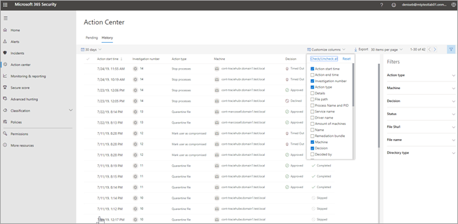

# A Central de AçõesThe Action center

**Aplica-se a:****Applies to:**
- Proteção contra Ameaças da MicrosoftMicrosoft Threat Protection

Use a Central de ações para ver os resultados de investigações atuais e anteriores nos dispositivos e caixas de correio da sua organização.Use the Action center to see the results of current and past investigations across your organization's devices and mailboxes. Dependendo do tipo de ameaça e veredicto resultante, as [ações de correção](https://docs.microsoft.com/microsoft-365/security/mtp/mtp-remediation-actions) ocorrerão automaticamente ou após a aprovação da equipe de operações de segurança da sua organização.Depending on the type of threat and resulting verdict, [remediation actions](https://docs.microsoft.com/microsoft-365/security/mtp/mtp-remediation-actions) occur automatically or upon approval by your organization's security operations team. Todas as ações de correção, se estão aguardando aprovação ou que já foram aprovadas, estão consolidadas na Central de ações.All remediation actions, whether they are pending approval or were already approved, are consolidated in the Action center. 

## Uma experiência de "painel único"A "single pane of glass" experience

A Central de ações fornece uma experiência de "painel único" para tarefas, como:The Action center provides a "single pane of glass" experience for tasks, such as:
- Aprovar ações de correção pendentes;Approving pending remediation actions;
- Exibir um log de auditoria de ações de correção já aprovadas; eViewing an audit log of already approved remediation actions; and
- Revendo as ações de correção concluídas.Reviewing completed remediation actions.

Sua equipe de operações de segurança pode operar de maneira mais eficaz e eficiente, pois a Central de ações fornece uma visão abrangente da Proteção contra Ameaças da Microsoft no trabalho.Your security operations team can operate more effectively and efficiently, because the Action center provides a comprehensive view of Microsoft Threat Protection at work.

## Ir para a Central de açõesGo to the Action center

1. Vá para [https://security.microsoft.com](https://security.microsoft.com) e entre.Go to [https://security.microsoft.com](https://security.microsoft.com) and sign in. 

2. No painel de navegação, escolha **Central de ações**.In the navigation pane, choose **Action center**. 

3. Na central de ações, você verá duas guias: **pendentes** e **histórico**.In the Action center, you'll see two tabs: **Pending** and **History**.

    - A guia **Pendente** lista as investigações que exigem revisão e aprovação de alguém na sua equipe de operações de segurança para continuar.The **Pending** tab lists investigations that require review and approval by someone in your security operations team to continue. Certifique-se de revisar e executar ações em itens pendentes que você vê aqui.Make sure to review and take action on pending items you see here.

    - A guia **Histórico** lista investigações anteriores e ações de correção que foram executadas automaticamente.The **History** tab lists past investigations and remediation actions that were taken automatically. Você pode exibir dados do dia, semana, mês ou seis meses anteriores.You can view data for the past day, week, month, or six months.

4. Para mostrar somente as colunas que você deseja ver, selecione **Personalizar colunas**.To show only the columns you want to see, select **Customize columns**. 

5. Selecione um item na lista para exibir mais detalhes sobre uma investigação.Select an item in the list to view more details about an investigation. A visualização de detalhes da investigação abrirá.The investigation details view opens. 

    - Se a investigação pertencer ao conteúdo de email (como a entidade é uma caixa de correio), detalhes de investigação abertos no centro de conformidade do & de segurança ( [https://protection.office.com/threatinvestigation](https://protection.office.com/threatinvestigation) ).If the investigation pertains to email content (such as, the entity is a mailbox), investigation details open in the Security & Compliance Center ([https://protection.office.com/threatinvestigation](https://protection.office.com/threatinvestigation)). 

    - Se a investigação envolve um dispositivo, detalhes de investigação abrirão na central de segurança ([https://security.microsoft.com](https://security.microsoft.com)).If the investigation involves a device, investigation details open in the security center ([https://security.microsoft.com](https://security.microsoft.com)). 

> [!TIP]
> Se você acha que algo foi perdido ou detectado incorretamente por recursos de investigação e resposta automatizados na proteção contra ameaças da Microsoft, vamos nos lembrar!If you think something was missed or wrongly detected by automated investigation and response features in Microsoft Threat Protection, let us know! Veja [como relatar falsos positivos/negativos em recursos de investigação e resposta automatizados (Air) no Microsoft Threat Protection](mtp-autoir-report-false-positives-negatives.md).See [How to report false positives/negatives in automated investigation and response (AIR) capabilities in Microsoft Threat Protection](mtp-autoir-report-false-positives-negatives.md).

## Ações disponíveisAvailable actions

Como as ações de correção são tomadas, elas são listadas na guia histórico na central de ações.As remediation actions are taken, they're listed on the History tab in the Action center. Essas ações incluem o seguinte:Such actions include the following:

- Coletar pacote de investigaçãoCollect investigation package 
- Isolar dispositivo (esta ação pode ser desfeita)Isolate device (this action can be undone) 
- Máquina externamenteOffboard machine 
- Versão de execução de códigoRelease code execution 
- Liberar da quarentenaRelease from quarantine 
- Exemplo de solicitaçãoRequest sample 
- Restringir a execução de código (essa ação pode ser desfeita)Restrict code execution (this action can be undone) 
- Executar verificação antivírusRun antivirus scan 
- Parar e colocar em quarentenaStop and quarantine 

## Permissões necessárias para tarefas da Central de açõesRequired permissions for Action center tasks

Para aprovar ou rejeitar ações pendentes na Central de ações, você deve ter permissões atribuídas conforme listado na tabela a seguir:To approve or reject pending actions in the Action center, you must have permissions assigned as listed in the following table:

|Ação de correçãoRemediation action |Funções e permissões necessáriasRequired roles and permissions |
|--|----|
|Correção do Microsoft Defender ATP (dispositivos)Microsoft Defender ATP remediation (devices) |Função Administrador de Segurança atribuída no Azure Active Directory ([https://portal.azure.com](https://portal.azure.com)) ou no centro de administração do Microsoft 365 ([https://admin.microsoft.com](https://admin.microsoft.com))Security Administrator role assigned in either Azure Active Directory ([https://portal.azure.com](https://portal.azure.com)) or the Microsoft 365 admin center ([https://admin.microsoft.com](https://admin.microsoft.com)) ---ou------ or --- Função de Ações de correção ativa atribuídas ao Microsoft defender ATPActive remediation actions role assigned in Microsoft Defender ATP     Para saber mais, confira os seguintes recursos:To learn more, see the following resources:  - [Permissões da função de administrador no Azure Active Directory](https://docs.microsoft.com/azure/active-directory/users-groups-roles/directory-assign-admin-roles)- [Administrator role permissions in Azure Active Directory](https://docs.microsoft.com/azure/active-directory/users-groups-roles/directory-assign-admin-roles) - [Criar e gerenciar funções para controle de acesso baseado em função (Microsoft Defender ATP)](https://docs.microsoft.com/windows/security/threat-protection/microsoft-defender-atp/user-roles)- [Create and manage roles for role-based access control (Microsoft Defender ATP)](https://docs.microsoft.com/windows/security/threat-protection/microsoft-defender-atp/user-roles)  |
|Correção do Office 365 ATP (conteúdo e email do Office)Office 365 ATP remediation (Office content and email)  |Função Administrador de Segurança atribuída no Azure Active Directory ([https://portal.azure.com](https://portal.azure.com)) ou no centro de administração do Microsoft 365 ([https://admin.microsoft.com](https://admin.microsoft.com))Security Administrator role assigned in either Azure Active Directory ([https://portal.azure.com](https://portal.azure.com)) or the Microsoft 365 admin center ([https://admin.microsoft.com](https://admin.microsoft.com)) ---e------ and ---  A função de pesquisa e limpeza atribuiu o centro de conformidade de & de segurança ( [https://protection.office.com](https://protection.office.com) )Search and Purge role assigned the Security & Compliance Center ([https://protection.office.com](https://protection.office.com))   **Importante**: se você tiver a função de administrador de segurança atribuída somente no centro de conformidade & segurança, não será possível acessar a central de ações ou os recursos de proteção contra ameaças da Microsoft.**IMPORTANT**: If you have the Security Administrator role assigned only in the Security & Compliance Center, you will not be able to access the Action center or Microsoft Threat Protection capabilities. Você deve ter a função Administrador de Segurança atribuída no Azure Active Directory ou no centro de administração do Microsoft 365.You must have the Security Administrator role assigned in Azure Active Directory or the Microsoft 365 admin center.   Para saber mais, confira os seguintes recursos:To learn more, see the following resources:  - [Permissões da função de administrador no Azure Active Directory](https://docs.microsoft.com/azure/active-directory/users-groups-roles/directory-assign-admin-roles)- [Administrator role permissions in Azure Active Directory](https://docs.microsoft.com/azure/active-directory/users-groups-roles/directory-assign-admin-roles) - [Permissões no centro de conformidade & segurança](https://docs.microsoft.com/microsoft-365/security/office-365-security/permissions-in-the-security-and-compliance-center)- [Permissions in the Security & Compliance Center](https://docs.microsoft.com/microsoft-365/security/office-365-security/permissions-in-the-security-and-compliance-center) |

> [!NOTE]
> Os usuários que têm a função Administrador Global atribuída no Azure Active Directory podem aprovar ou rejeitar qualquer ação pendente na Central de ações.Users who have the Global Administrator role assigned in Azure Active Directory can approve or reject any pending action in the Action center. No entanto, como uma prática recomendada, sua organização deve limitar o número de pessoas que têm a função de Administrador Global atribuída.However, as a best practice, your organization should limit the number of people who have the Global Administrator role assigned. É recomendável usar o Administrador de Segurança, Ações de correção ativa e as funções Pesquisar e Limpar, listadas acima, para permissões da Central de ações.We recommend using the Security Administrator, Active remediation actions, and Search and Purge roles listed above for Action center permissions.

## Próximas etapasNext steps 

- [Aprovar ou rejeitar ações pendentes após uma investigação automatizadaApprove or reject pending actions following an automated investigation](mtp-autoir-actions.md)
- [Exibir os resultados de uma investigação automatizadaView the results of an automated investigation](mtp-autoir-results.md)

