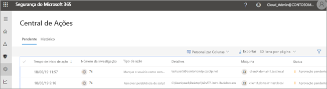
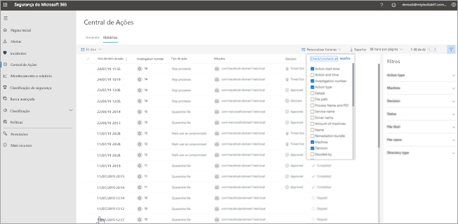
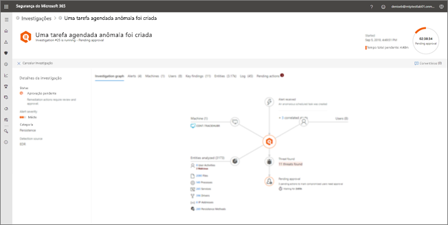

# Vá para a Central de ações para exibir as ações de correção

**Aplica-se a:**
- Proteção contra Ameaças da Microsoft

[!INCLUDE [Prerelease information](../includes/prerelease.md)]

## Uma experiência de "painel único"

Use a Central de ações para ver os resultados de investigações atuais e anteriores nos dispositivos e caixas de correio da sua organização. Dependendo do tipo de ameaça e [veredito resultante](mtp-autoir-results.md#remediation-actions-following-automated-investigation), as ações de correção ocorrem automaticamente ou mediante aprovação da equipe de operações de segurança da sua organização. Todas as ações de correção, se estão aguardando aprovação ou que já foram aprovadas, estão consolidadas na Central de ações. 

A Central de ações fornece uma experiência de "painel único" para tarefas, como:
- Aprovar ações de correção pendentes;
- Exibir um log de auditoria de ações de correção já aprovadas; e
- Revendo as ações de correção concluídas.

Sua equipe de operações de segurança pode operar de maneira mais eficaz e eficiente, pois a Central de ações fornece uma visão abrangente da Proteção contra Ameaças da Microsoft no trabalho.

## Ações de correção

A tabela a seguir lista as ações de correção com suporte no momento na Central de ações: 

|Ações de correção de pontos de extremidade  |Ações de correção de email  |
|---------|---------|
|Arquivo de quarentena Remover chave do registro Finalizar processo  Parar serviço  Remover chave do registro  Desabilitar o driver  Remover tarefa agendada      |Exclusão reversível de mensagens de emails ou clusters Bloquear URL (hora do clique) Desativar o encaminhamento de emails externo          |

## Ir para a Central de ações

1. Vá para [https://security.microsoft.com](https://security.microsoft.com) e entre. 

2. No painel de navegação, escolha **Central de ações**. 

3. Na Central de ações, você verá duas guias: **Pendente** e **Histórico**.

    - A guia **Pendente** lista as investigações que exigem revisão e aprovação de alguém na sua equipe de operações de segurança para continuar. Certifique-se de revisar e executar ações em itens pendentes que você vê aqui.

    - A guia **Histórico** lista investigações anteriores e ações de correção que foram executadas automaticamente. Você pode exibir dados do dia, semana, mês ou seis meses anteriores.

4. Para mostrar somente as colunas que você deseja ver, selecione **Personalizar colunas**. 

5. Selecione um item na lista para exibir mais detalhes sobre uma investigação. A visualização de detalhes da investigação abrirá. 

    - Se a investigação se refere a conteúdo de email (por exemplo, a entidade é uma caixa de correio), detalhes de investigação abrirão no Centro de Conformidade e Segurança do Office 365 ([https://protection.office.com/threatinvestigation](https://protection.office.com/threatinvestigation)). 

    - Se a investigação envolve um dispositivo, detalhes de investigação abrirão na central de segurança ([https://security.microsoft.com](https://security.microsoft.com)). 

> [!TIP]
> Se você acha que algo foi perdido ou detectado incorretamente por recursos de investigação e resposta automatizados na proteção contra ameaças da Microsoft, vamos nos lembrar! Veja [como relatar falsos positivos/negativos em recursos de investigação e resposta automatizados (Air) no Microsoft Threat Protection](mtp-autoir-report-false-positives-negatives.md).

## Permissões necessárias para tarefas da Central de ações

Para aprovar ou rejeitar ações pendentes na Central de ações, você deve ter permissões atribuídas conforme listado na tabela a seguir:

|Ação de correção |Funções e permissões necessárias |
|--|----|
|Correção do Microsoft Defender ATP (dispositivos) |Função **Administrador de Segurança** atribuída no Azure Active Directory ([https://portal.azure.com](https://portal.azure.com)) ou no centro de administração do Microsoft 365 ([https://admin.microsoft.com](https://admin.microsoft.com)) ---ou--- Função de **Ações de correção ativa** atribuídas ao Microsoft defender ATP     Para saber mais, confira os seguintes recursos:  - [Permissões da função de administrador no Azure Active Directory](https://docs.microsoft.com/azure/active-directory/users-groups-roles/directory-assign-admin-roles) - [Criar e gerenciar funções para controle de acesso baseado em função (Microsoft Defender ATP)](https://docs.microsoft.com/windows/security/threat-protection/microsoft-defender-atp/user-roles)  |
|Correção do Office 365 ATP (conteúdo e email do Office)  |Função **Administrador de Segurança** atribuída no Azure Active Directory ([https://portal.azure.com](https://portal.azure.com)) ou no centro de administração do Microsoft 365 ([https://admin.microsoft.com](https://admin.microsoft.com)) ---e---  Função **Pesquisar e Limpar** atribuída ao Centro de Conformidade e Segurança do Office 365 ([https://protection.office.com](https://protection.office.com))   **IMPORTANTE**: Se você tiver a função de Administrador de Segurança atribuída somente no Centro de Conformidade e Segurança do Office 365, não será possível acessar os recursos da Central de ações ou da Proteção contra Ameaças da Microsoft. Você deve ter a função Administrador de Segurança atribuída no Azure Active Directory ou no centro de administração do Microsoft 365.   Para saber mais, confira os seguintes recursos:  - [Permissões da função de administrador no Azure Active Directory](https://docs.microsoft.com/azure/active-directory/users-groups-roles/directory-assign-admin-roles) - [Permissões no Centro de Conformidade e Segurança do Office 365](https://docs.microsoft.com/microsoft-365/security/office-365-security/permissions-in-the-security-and-compliance-center) |

> [!NOTE]
> Os usuários que têm a função **Administrador Global** atribuída no Azure Active Directory podem aprovar ou rejeitar qualquer ação pendente na Central de ações. No entanto, como uma prática recomendada, sua organização deve limitar o número de pessoas que têm a função de Administrador Global atribuída. É recomendável usar o **Administrador de Segurança**, **Ações de correção ativa** e as funções **Pesquisar e Limpar**, listadas acima, para permissões da Central de ações.

## Próximas etapas 

- [Saiba mais sobre incidentes em Proteção contra Ameaças da Microsoft](incidents-overview.md)
- [Exibir os resultados de uma investigação automatizada](mtp-autoir-results.md)
- [Saiba mais sobre a caça na Proteção contra Ameaças da Microsoft](advanced-hunting-overview.md)

