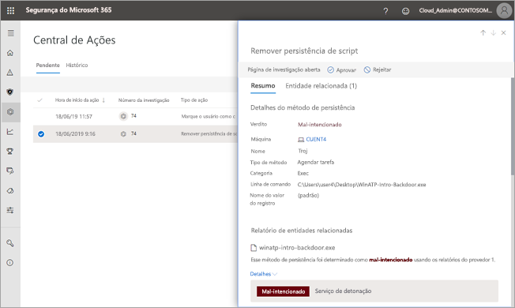

# Aprovar ou rejeitar ações pendentes após a investigações automáticas

**Aplica-se a:**
- Proteção contra Ameaças da Microsoft

[!INCLUDE [Prerelease information](../includes/prerelease.md)]

Quando uma investigação automatizada é executada, pode resultar em uma ou mais [ações de correção ](mtp-action-center.md#remediation-actions) que exigem aprovação para prosseguir. Por exemplo, um cluster de mensagens de email pode precisar ser excluído, ou talvez seja necessário remover um arquivo em quarentena. É importante aprovar (ou rejeitar) ações pendentes o mais rápido possível, para que suas investigações automatizadas possam prosseguir e ser concluídas a tempo. 

> [!TIP]
> Se você acha que algo foi perdido ou detectado incorretamente por recursos de investigação e resposta automatizados na proteção contra ameaças da Microsoft, vamos nos lembrar! Veja [como relatar falsos positivos/negativos em recursos de investigação e resposta automatizados (Air) no Microsoft Threat Protection](mtp-autoir-report-false-positives-negatives.md).

Ações pendentes podem ser revisadas e aprovadas usando um dos vários métodos abaixo:
- [Usando a Central de Ações](#review-a-pending-action-in-the-action-center)
- [Usando o modo de exibição detalhes da investigação](#review-a-pending-action-in-the-investigation-details-view)

> [!NOTE]
> Você deve ter [permissões apropriadas](mtp-action-center.md#required-permissions-for-action-center-tasks) para aprovar ou rejeitar ações de correção.

## Revisar uma ação pendente na Central de Ações

1. Vá para [https://security.microsoft.com](https://security.microsoft.com) e entre. 

2. No painel de navegação, escolha **Central de Ações**. 

3. Em Central de Ações, na guia **Pendente**, selecione um item na lista. 

    - Se você selecionar um item na coluna**número da investigação **, a página detalhes da investigação será aberta. Nessa página, você pode checar os resultados da investigação e aprovar ou rejeitar a ação recomendada.
 
    - Se você selecionar uma linha na lista, um submenu será aberto, onde serão mostradas informações sobre esse item.   Use os links para exibir um alerta ou uma investigação associada e aprovar ou rejeitar a ação.

## Revisar uma ação pendente na exibição dos detalhes da investigação

1. Na página [detalhes da investigação](mtp-autoir-results.md), selecione a guia **Ações pendentes** (ou **Ações**). Os itens pendentes estarão listados aqui.

2. Selecione um item na lista e, em seguida, escolha **Aprovar** ou **Rejeitar**.

## Próximas etapas

- [Saiba mais sobre a Central de Ações](mtp-action-center.md)
- [Saiba mais sobre incidentes](incidents-overview.md)
- [Saiba mais sobre a caça avançada](advanced-hunting-overview.md)
