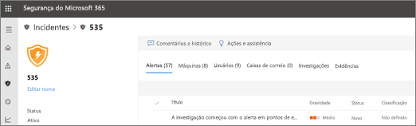

# Exibir os detalhes e resultados de uma investigação automatizadaView the details and results of an automated investigation

**Aplica-se a:****Applies to:**
- Proteção contra Ameaças da MicrosoftMicrosoft Threat Protection

[!INCLUDE [Prerelease information](../includes/prerelease.md)]

Quando uma investigação automatizada ocorrer na Proteção Contra Ameaças da Microsoft, os detalhes dessa investigação estarão disponíveis durante e após o processo de investigação automática.When an automated investigation occurs in Microsoft Threat Protection, details about that investigation are available during and after the automated investigation process. Se você tiver as [permissões necessárias](mtp-action-center.md#required-permissions-for-action-center-tasks), poderá exibir esses detalhes na exibição de detalhes da investigação.If you have the [necessary permissions](mtp-action-center.md#required-permissions-for-action-center-tasks), you can view those details in an investigation details view. A exibição de detalhes da investigação fornece o status atualizado e a capacidade de aprovar as ações pendentes.The investigation details view provides you with up-to-date status and the ability to approve any pending actions. 

## Abrir a exibição de detalhes da investigaçãoOpen the investigation details view

Você pode abrir a exibição de detalhes da investigação usando um destes métodos:You can open the investigation details view by using one of the following methods:
- [Selecionar um item na central de AçõesSelect an item in the Action center](#select-an-item-in-the-action-center)
- [Selecionar uma investigação em uma página de detalhes do incidenteSelect an investigation from an incident details page](#open-an-investigation-from-an-incident-details-page)

### Selecionar um item na central de AçõesSelect an item in the Action center

Use a central de ações para exibir as ações que estão pendentes (na guia **Pendente**) ou que já foram aprovadas (na guia **Histórico**).Use the Action center to view actions that are either pending approval (on the **Pending** tab) or were already approved (on the **History** tab). 

1. Vá para [https://security.microsoft.com](https://security.microsoft.com) e entre.Go to [https://security.microsoft.com](https://security.microsoft.com) and sign in. 

2. No painel de navegação, escolha **Central de ações**.In the navigation pane, choose **Action center**. 

3. Na guia **Pendente**ou **Histórico**, selecione um item.On either the **Pending** or **History** tab, select an item. Se você tiver as [permissões necessárias](mtp-action-center.md#required-permissions-for-action-center-tasks), poderá aprovar (ou rejeitar) ações pendentes.If you have the [necessary permissions](mtp-action-center.md#required-permissions-for-action-center-tasks), you can approve (or reject) pending actions.

### Abrir uma investigação em uma página de detalhes do incidenteOpen an investigation from an incident details page

Use uma página de detalhes do incidente para exibir informações detalhadas sobre um incidente, incluindo os alertas que foram disparados com informações sobre os dispositivos afetados, contas de usuários ou caixas de correio.Use an incident details page to view detailed information about an incident, including alerts that were triggered information about any affected devices, user accounts, or mailboxes.

1. Vá para [https://security.microsoft.com](https://security.microsoft.com) e entre.Go to [https://security.microsoft.com](https://security.microsoft.com) and sign in. 

2. No painel de navegação, escolha **Incidentes**.In the navigation pane, choose **Incidents**. 

3. Selecione um item na lista para abrir a exibição de detalhes do incidente.Select an item in the list to open the incident details view. 

4. Na guia **Investigações**, selecione uma investigação na lista.On the **Investigations** tab, select an investigation in the list.

## Detalhes da investigaçãoInvestigation details

Use o modo de exibição de detalhes da investigação para ver as atividades antigas, atuais e pendentes referentes a uma investigação.Use the investigation details view to see past, current, and pending activity pertaining to an investigation. A exibição de detalhes de investigação se parece com a seguinte imagem:The investigation details view resembles the following image:

Na exibição de detalhes da investigação, você pode ver as informações nas guias **Gráfico de Investigação**, **Alertas**, **Dispositivos**, **Identidades**, **Principais descobertas**, **Entidades**,**Log** e **Ações pendentes**, descritas na tabela a seguir.In the Investigation details view, you can see information on the **Investigation graph**, **Alerts**, **Devices**, **Identities**, **Key findings**, **Entities**, **Log**, and **Pending actions** tabs, described in the following table.

|GuiaTab    |DescriçãoDescription |
|--------|--------|
|Gráficos de investigaçãoInvestigation graph    |Oferece uma representação visual da investigação.Provides a visual representation of the investigation. Descreve entidades e lista as ameaças encontradas, juntamente com os alertas, e se as ações estão aguardando aprovação.Depicts entities and lists threats found, along with alerts and whether any actions are awaiting approval. Você pode clicar em um item no gráfico para exibir mais detalhes.You can click an item on the graph to view more details. Por exemplo, clicar no ícone **Ameaças encontradas** o levará para a guia **Principais conclusões**.For example, clicking the **Threats found** icon takes you to the **Key findings** tab. |
|AlertasAlerts |Lista os alertas associados à investigação.Lists alerts associated with the investigation. Os alertas podem ser de recursos de proteção contra ameaças no computador de um usuário, em aplicativos do Office, Cloud app Security e outros recursos de Proteção Contra Ameaças da Microsoft 365.Alerts can come from threat protection features on a user's machine, in Office apps, Cloud App Security, and other Microsoft 365 Threat Protection features.|
|DispositivosDevices|Lista os computadores incluídos na investigação, juntamente com o nível de correção.Lists machines included in the investigation along with remediation level.|
|Conclusões principaisKey findings   |Lista os resultados da investigação, juntamente com o status e as ações realizadas ou pendentes.Lists results from the investigation along with status and actions taken or pending. Você pode aprovar as ações pendentes para dispositivos e identidades na guia.You can approve pending actions for devices and identities in on this tab.|
|EntidadesEntities   |Lista as atividades do usuário, os arquivos, os processos, os serviços, os endereços IP, drivers, e os métodos de persistência associados à investigação, juntamente com o status e as ações realizadas.Lists user activities, files, processes, services, drivers, IP addresses, and persistence methods associated with the investigation, along with status and actions taken.|
|LogLog    |Fornece uma exibição detalhada de todas as etapas realizadas durante a investigação, juntamente com o status.Provides a detailed view of all steps taken during the investigation, along with status.|
|Ações pendentesPending actions    |Lista os itens que exigem aprovação para prosseguir.Lists items that require approval to proceed.|

## Ações de correção após a investigação automáticaRemediation actions following automated investigation

Quando uma investigação automatizada for concluída, um veredito será feito para cada evidência envolvida, e as ações de correção serão identificadas.When an automated investigation completes, a verdict is reached for every piece of evidence involved, and remediation actions are identified. Em alguns casos, as ações de correção são executadas automaticamente, em outros casos, as ações de correção aguardam aprovação.In some cases, remediation actions are taken automatically; in other cases, remediation actions await approval. A tabela a seguir lista os possíveis verditos e resultados:The following table lists possible verdicts and outcomes:

|VerditoVerdict    |ÁreaArea   |ResultadosOutcomes|
|------|------|------|
|Mal-intencionadoMalicious  |Dispositivos (pontos de extremidade)Devices (endpoints)    |As ações de correção são tomadas automaticamenteRemediation actions are taken automatically|
|Mal-intencionadoMalicious  |Conteúdo do email (URLs ou anexos)Email content (URLs or attachments) | As ações de correção recomendadas estão aguardando aprovaçãoRecommended remediation actions are pending approval|
|SuspeitoSuspicious |Conteúdo de dispositivos ou emailsDevices or email content |As ações de correção recomendadas estão aguardando aprovaçãoRecommended remediation actions are pending approval|
|LimparClean  |Conteúdo de dispositivos ou emailsDevices or email content   |Nenhuma ação de correção é necessáriaNo remediation actions are needed|

[Revisar uma ação pendente na Central de AçõesReview a pending action in the Action center](mtp-autoir-actions.md#review-a-pending-action-in-the-action-center)

> [!TIP]
> Se você acha que algo foi perdido ou detectado incorretamente por recursos de investigação e resposta automatizados na proteção contra ameaças da Microsoft, vamos nos lembrar!If you think something was missed or wrongly detected by automated investigation and response features in Microsoft Threat Protection, let us know! Veja [como relatar falsos positivos/negativos em recursos de investigação e resposta automatizados (Air) no Microsoft Threat Protection](mtp-autoir-report-false-positives-negatives.md).See [How to report false positives/negatives in automated investigation and response (AIR) capabilities in Microsoft Threat Protection](mtp-autoir-report-false-positives-negatives.md).

## Próximas etapasNext steps

- [Obter uma visão geral das permissões da central de AçõesGet an overview of Action center permissions](mtp-action-center.md#required-permissions-for-action-center-tasks)
- [Aprovar ou rejeitar ações relacionadas a investigações e respostas automatizadasApprove or reject actions related to automated investigation and response](mtp-autoir-actions.md)

