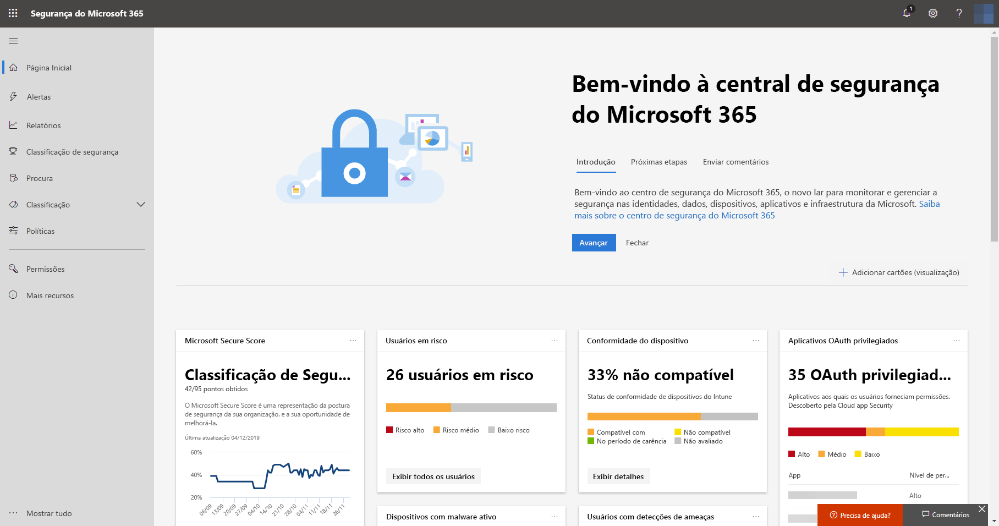
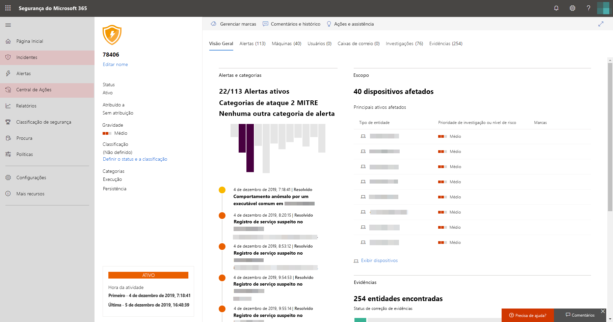

# Habilitar a Proteção contra Ameaças da Microsoft

**Aplica-se a:**
- Proteção contra Ameaças da Microsoft

[!INCLUDE [Prerelease information](../includes/prerelease.md)]

A Proteção contra Ameaças da Microsoft unifica o processo de resposta a incidentes, integrando os principais recursos da Proteção Avançada contra Ameaças da Microsoft (ATP), da ATP do Office 365, do Microsoft Cloud App Security e da ATP do Azure. Essa experiência unificada adiciona recursos avançados que podem acessados no centro de segurança do Microsoft 365.

## Verificar a qualificação de licenças e as permissões necessárias
Os clientes com uma licença do Microsoft 365 E5 ou equivalente podem usar a Proteção contra Ameaças da Microsoft. Para obter mais informações [leia os requisitos de licenciamento](prerequisites.md#licensing-requirements).

 Para poder ativar a proteção contra ameaças da Microsoft, você precisa ser um **administrador global** ou um **administrador de segurança** no [Azure Active Directory](https://docs.microsoft.com/azure/active-directory/users-groups-roles/directory-assign-admin-roles#available-roles).

## Começar a usar o serviço
A ativação do serviço de Proteção contra Ameaças da Microsoft agrega os dados de vários serviços integrados. Os dados serão processados e armazenados centralmente para identificar novas ideias e possibilitar fluxos de trabalho de resposta centralizados.

Antes de ativar o serviço, o centro de segurança do Microsoft 365 ([Security.Microsoft.com](https://security.microsoft.com)) não mostra os **incidentes** e as opções da **central de ações** no menu.

*Centro de segurança do Microsoft 365 com a Proteção contra Ameaças da Microsoft desativada*

Para ativar o serviço de Proteção contra Ameaças da Microsoft, vá para **Configurações** > ** Proteção contra Ameaças da Microsoft** > **Aceitar/Recusar** no centro de segurança do Microsoft 365.

Se o Microsoft Defender ATP tiver sido provisionado para sua organização, os dados serão armazenados e processados no mesmo local do data center que você selecionou para [os dados do Microsoft Defender ATP](https://docs.microsoft.com/windows/security/threat-protection/microsoft-defender-atp/data-storage-privacy). Caso não tenha o Microsoft Defender ATP, será solicitado que você escolha um novo local de data center especificamente para a Proteção contra Ameaças da Microsoft. Será necessário fornecer o consentimento antes que os dados sejam compartilhados entre serviços e agregados.

### Confirmar se o serviço está ativado
Depois que o serviço é provisionado, ele adiciona:

- [Gerenciamento de incidentes](incidents-overview.md)
- Uma central de ações para gerenciar [investigações e respostas automatizadas](mtp-autoir.md)
- Recursos de [Busca avançada](advanced-hunting-overview.md) para as páginas de **Busca** existentes

*Centro de segurança do Microsoft 365 com gerenciamento de incidentes e outros recursos de Proteção contra Ameaças da Microsoft*

### Obter dados da ATP do Azure
Para compartilhar dados da ATP do Azure com a Proteção contra Ameaças da Microsoft, verifique se a integração do Microsoft Cloud App Security e da ATP do Azure está ativada. [Saiba mais sobre esta integração](https://docs.microsoft.com/cloud-app-security/aatp-integration) 

## Desabilitar a Proteção contra Ameaças da Microsoft
Para parar de usar o serviço de Proteção contra Ameaças da Microsoft, vá para **Configurações** > ** Proteção contra Ameaças da Microsoft** > **Aceitar/Recusar** no centro de segurança do Microsoft 365. Desmarque a opção **Ativar a Proteção contra Ameaças da Microsoft** e salve as alterações.

Os dados serão excluídos permanentemente e os recursos correspondentes serão removidos da central de segurança do Microsoft 365.

## Obter assistência

A equipe da Microsoft pode ajudar a provisionar ou desprovisionar o serviço e os recursos relacionados ao seu locatário. Para obter ajuda, selecione **precisa de ajuda?** no centro de segurança do Microsoft 365. Ao descrever suas preocupações, mencione "proteção contra ameaças da Microsoft".

## Tópicos relacionados

- [Visão geral da Proteção contra Ameaças da Microsoft](microsoft-threat-protection.md)
- [Requisitos de licenciamento e outros pré-requisitos](prerequisites.md)
- [Visão geral do Microsoft Defender ATP](https://docs.microsoft.com/windows/security/threat-protection/microsoft-defender-atp/microsoft-defender-advanced-threat-protection)
- [Visão geral da ATP do Office 365](../office-365-security/office-365-atp.md)
- [Visão geral do Microsoft Cloud App Security](https://docs.microsoft.com/cloud-app-security/what-is-cloud-app-security)
- [Visão geral da ATP do Azure](https://docs.microsoft.com/azure-advanced-threat-protection/what-is-atp)
- [Armazenamento de dados da ATP do Microsoft Defender](https://docs.microsoft.com/windows/security/threat-protection/microsoft-defender-atp/data-storage-privacy)
