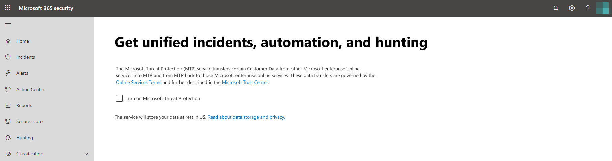
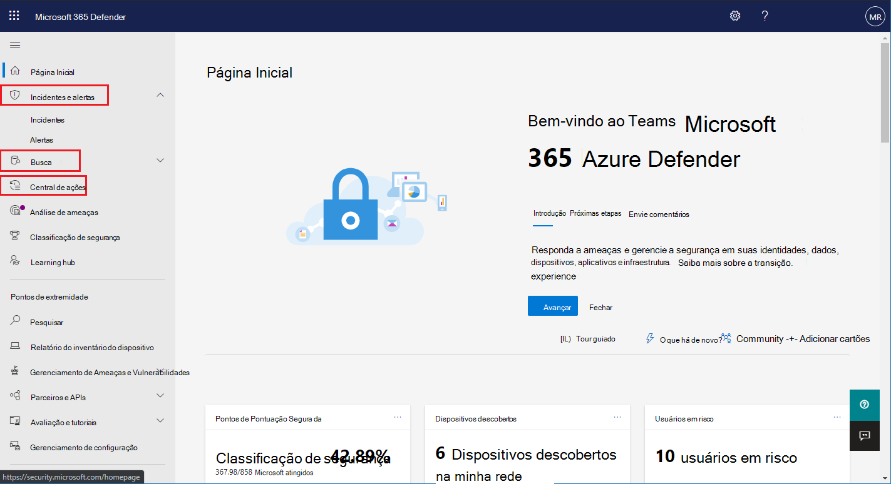

# Habilitar a Proteção contra Ameaças da MicrosoftTurn on Microsoft Threat Protection

**Aplica-se a:****Applies to:**
- Proteção contra Ameaças da MicrosoftMicrosoft Threat Protection

A [proteção contra ameaças da Microsoft](microsoft-threat-protection.md) unifica seu processo de resposta a incidentes por meio da integração de recursos principais à proteção avançada contra ameaças do Microsoft defender (ATP), Office 365 ATP, Microsoft Cloud app Security e Azure ATP.[Microsoft Threat Protection](microsoft-threat-protection.md) unifies your incident response process by integrating key capabilities across Microsoft Defender Advanced Threat Protection (ATP), Office 365 ATP, Microsoft Cloud App Security, and Azure ATP. Essa experiência unificada adiciona recursos avançados que podem acessados no centro de segurança do Microsoft 365.This unified experience adds powerful features you can access in the Microsoft 365 security center.

A proteção contra ameaças da Microsoft automaticamente é ativada quando os clientes qualificados com as permissões necessárias visitam a central de segurança do Microsoft 365.Microsoft Threat Protection automatically turns on when eligible customers with the required permissions visit Microsoft 365 security center. Leia este artigo para entender vários pré-requisitos e como a proteção contra ameaças da Microsoft é provisionada.Read this article to understand various prerequisites and how Microsoft Threat Protection is provisioned.

## Verificar a qualificação de licenças e as permissões necessáriasCheck license eligibility and required permissions
Uma licença para um produto de segurança do Microsoft 365 geralmente concede a você o uso da proteção contra ameaças da Microsoft no Microsoft 365, sem custo adicional de licenciamento.A license to a Microsoft 365 security product generally entitles you to use Microsoft Threat Protection in Microsoft 365 security center without additional licensing cost. Recomendamos obter uma licença de segurança do Microsoft 365 e5, E5 Security, a5 ou a5 ou uma combinação válida de licenças que forneçam acesso a todos os serviços com suporte.We do recommend getting a Microsoft 365 E5, E5 Security, A5, or A5 Security license or a valid combination of licenses that provides access to all supported services.

Para obter informações detalhadas sobre licenciamento, [Leia os requisitos de licenciamento](prerequisites.md#licensing-requirements).For detailed licensing information, [read the licensing requirements](prerequisites.md#licensing-requirements).

### Verificar sua funçãoCheck your role
Você deve ser um **administrador global** ou um **administrador de segurança** no Azure Active Directory para ativar a proteção contra ameaças da Microsoft.You must be a **global administrator** or a **security administrator** in Azure Active Directory to turn on Microsoft Threat Protection. [Exibir suas funções no Azure ADView your roles in Azure AD](https://docs.microsoft.com//azure/active-directory/users-groups-roles/directory-manage-roles-portal)

## Serviços com suporteSupported services
A proteção contra ameaças da Microsoft agrega dados dos vários serviços com suporte que você já tenha implantado.Microsoft Threat Protection aggregates data from the various supported services that you've already deployed. Ele processará e armazenará dados centralmente para identificar novas insights e tornar os fluxos de trabalho de resposta centralizados possíveis.It will process and store data centrally to identify new insights and make centralized response workflows possible. Ele faz isso sem afetar as implantações, as configurações ou os dados existentes associados aos serviços integrados.It does this without affecting existing deployments, settings, or data associated with the integrated services.

Para obter a melhor proteção e otimizar a proteção contra ameaças da Microsoft, recomendamos implantar todos os serviços compatíveis em sua rede.To get the best protection and optimize Microsoft Threat Protection, we recommend deploying all applicable supported services on your network. Para obter mais informações, [Leia sobre a implantação de serviços com suporte](deploy-supported-services.md).For more information, [read about deploying supported services](deploy-supported-services.md).

## Antes de iniciar o serviçoBefore starting the service
Antes de ativar o serviço, o centro de segurança do Microsoft 365 ([Security.Microsoft.com](https://security.microsoft.com)) mostra a página Configurações de proteção contra ameaças da Microsoft quando você seleciona **incidentes**, **central de ações**ou **busca** no painel de navegação.Before you turn on the service, the Microsoft 365 security center ([security.microsoft.com](https://security.microsoft.com)) shows the Microsoft Threat Protection settings page when you select **Incidents**, **Action center**, or **Hunting** from the navigation pane. Esses itens de navegação não são mostrados se você não estiver qualificado para usar a proteção contra ameaças da Microsoft.These navigation items are not shown if you are not eligible to use Microsoft Threat Protection.

 *configurações de proteção contra ameaças da Microsoft no centro de segurança do Microsoft 365*
*Microsoft Threat Protection settings in Microsoft 365 security center*

## Iniciar o serviçoStarting the service
Para ativar a proteção contra ameaças da Microsoft, basta selecionar **ativar a proteção contra ameaças da Microsoft** e aplicar a alteração.To turn on Microsoft Threat Protection, simply select **Turn on Microsoft Threat Protection** and apply the change. Você também pode acessar essa opção selecionando **configurações** ([Security.Microsoft.com/Settings](https://security.microsoft.com/settings)) no painel de navegação e, em seguida, selecionando **proteção contra ameaças da Microsoft**.You can also access this option by selecting **Settings** ([security.microsoft.com/settings](https://security.microsoft.com/settings)) in the navigation pane and then selecting **Microsoft Threat Protection**.

>[!NOTE]
>Se você não vir **as configurações** no painel de navegação ou não conseguir acessar a página, verifique suas permissões e licenças.If you don't see **Settings** in the navigation pane or couldn't access the page, check your permissions and licenses.

### Local do Data CenterData center location
A proteção contra ameaças da Microsoft armazenará e processará dados no [mesmo local usado pelo Microsoft defender ATP](https://docs.microsoft.com/windows/security/threat-protection/microsoft-defender-atp/data-storage-privacy).Microsoft Threat Protection will store and process data in the [same location used by Microsoft Defender ATP](https://docs.microsoft.com/windows/security/threat-protection/microsoft-defender-atp/data-storage-privacy). Se você não tiver o Microsoft defender ATP, um novo local de Data Center será selecionado automaticamente com base no local dos serviços de segurança do Microsoft 365 ativos.If you don't have Microsoft Defender ATP, a new data center location is automatically selected based on the location of active Microsoft 365 security services. O local do Data Center selecionado é mostrado na tela.The selected data center location is shown in the screen.

>[!NOTE]
>Selecione **precisa de ajuda?** no centro de segurança do Microsoft 365 para entrar em contato com o suporte da Microsoft sobre a provisão de proteção contra ameaças da Microsoft em um local diferente de data centerSelect **Need help?** in the Microsoft 365 security center to contact Microsoft support about provision Microsoft Threat Protection in a different data center location. 

### Confirmar se o serviço está ativadoConfirm that the service is on
Depois que o serviço é provisionado, ele adiciona:Once the service is provisioned, it adds:

- [Gerenciamento de incidentesIncidents management](incidents-overview.md)
- Uma central de ações para gerenciar [investigações e respostas automatizadas](mtp-autoir.md)An action center for managing [automated investigation and response](mtp-autoir.md)
- Recursos [avançados de busca](advanced-hunting-overview.md)[Advanced hunting](advanced-hunting-overview.md) capabilities

 *central de segurança da Microsoft 365 com gerenciamento de incidentes e outros recursos de proteção contra ameaças da Microsoft*
*Microsoft 365 security center with incidents management and other Microsoft Threat Protection capabilities*

### Obter dados da ATP do AzureGetting Azure ATP data
Para compartilhar dados da ATP do Azure com a Proteção contra Ameaças da Microsoft, verifique se a integração do Microsoft Cloud App Security e da ATP do Azure está ativada.To share Azure ATP data with Microsoft Threat Protection, ensure that Microsoft Cloud App Security and Azure ATP integration is turned on. [Saiba mais sobre esta integração](https://docs.microsoft.com/cloud-app-security/aatp-integration) [Learn more about this integration](https://docs.microsoft.com/cloud-app-security/aatp-integration)

## Desabilitar a Proteção contra Ameaças da MicrosoftTurn off Microsoft Threat Protection
Para parar de usar o serviço de Proteção contra Ameaças da Microsoft, vá para **Configurações** > \*\* Proteção contra Ameaças da Microsoft\*\* > **Aceitar/Recusar** no centro de segurança do Microsoft 365.To stop using Microsoft Threat Protection, go to **Settings** > **Microsoft Threat Protection** > **Opt-in / Opt-out** in the Microsoft 365 security center. Desmarque **ativar a proteção contra ameaças da Microsoft** e aplicar as alterações.Unselect **Turn on Microsoft Threat Protection** and apply the changes.

Os recursos correspondentes serão removidos da central de segurança do Microsoft 365.Corresponding features will be removed from the Microsoft 365 security center.

## Obter assistênciaGet assistance

Para obter respostas para as perguntas mais frequentes sobre como ativar a proteção contra ameaças [da Microsoft, leia as perguntas frequentes](mtp-enable-faq.md).To get answers to the most commonly asked questions about turning on Microsoft Threat Protection, [read the FAQ](mtp-enable-faq.md).

A equipe de suporte da Microsoft pode ajudar a provisionar ou desprovisionar o serviço e os recursos relacionados em seu locatário.Microsoft support staff can help provision or deprovision the service and related resources on your tenant. Para obter ajuda, selecione **precisa de ajuda?** no centro de segurança do Microsoft 365.For assistance, select **Need help?** in the Microsoft 365 security center. Ao entrar em contato com o suporte, mencione a proteção contra ameaças da Microsoft.When contacting support, mention Microsoft Threat Protection.

## Tópicos relacionadosRelated topics

- [Perguntas frequentesFrequently asked questions](mtp-enable-faq.md)
- [Requisitos de licenciamento e outros pré-requisitosLicensing requirements and other prerequisites](prerequisites.md)
- [Implantar serviços com suporteDeploy supported services](deploy-supported-services.md)
- [Visão geral da Proteção contra Ameaças da MicrosoftMicrosoft Threat Protection overview](microsoft-threat-protection.md)
- [Visão geral do Microsoft Defender ATPMicrosoft Defender ATP overview](https://docs.microsoft.com/windows/security/threat-protection/microsoft-defender-atp/microsoft-defender-advanced-threat-protection)
- [Visão geral da ATP do Office 365Office 365 ATP overview](../office-365-security/office-365-atp.md)
- [Visão geral do Microsoft Cloud App SecurityMicrosoft Cloud App Security overview](https://docs.microsoft.com/cloud-app-security/what-is-cloud-app-security)
- [Visão geral da ATP do AzureAzure ATP overview](https://docs.microsoft.com/azure-advanced-threat-protection/what-is-atp)
- [Armazenamento de dados da ATP do Microsoft DefenderMicrosoft Defender ATP data storage](https://docs.microsoft.com/windows/security/threat-protection/microsoft-defender-atp/data-storage-privacy)