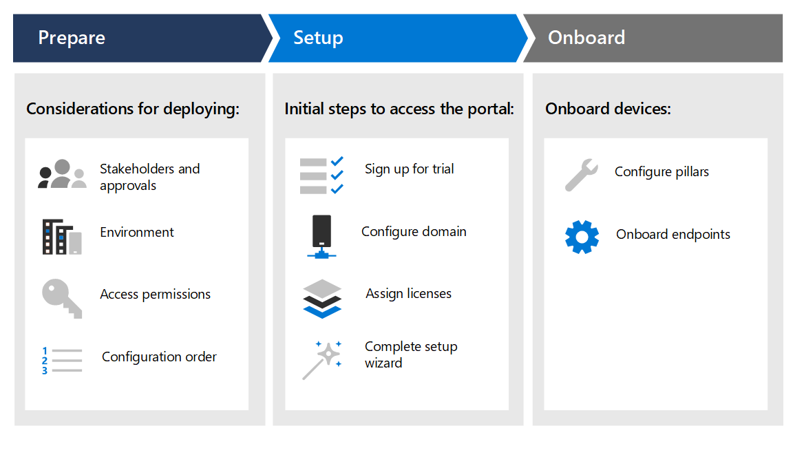

# Criar um laboratório de avaliação do Microsoft 365 defender ou um ambiente pilotoCreate a Microsoft 365 Defender trial lab or pilot environment 

[!INCLUDE [Microsoft 365 Defender rebranding](../includes/microsoft-defender.md)]

**Aplica-se a:****Applies to:**
- Microsoft 365 DefenderMicrosoft 365 Defender

Este guia ajuda você a trabalhar com a configuração de um ambiente de laboratório com usuários e grupos e, em seguida, orienta você pela configuração dos recursos no Microsoft 365 defender para que você possa imitar um ataque de ameaça e obter um resultado de avaliação significativo.This guide helps you work across setting up a lab environment with users and groups, then guides you through the configuration of the capabilities in Microsoft 365 Defender so that you can mimic a threat attack and obtain a meaningful trial result. 

O objetivo de criar este laboratório de avaliação ou ambiente piloto é ilustrar os recursos abrangentes e integrados do Microsoft 365 defender.The purpose of creating this trial lab or pilot environment is to illustrate the comprehensive and integrated Microsoft 365 Defender capabilities. Experimente como essa solução de segurança inteligente detecta, impede, investiga automaticamente e responde a ameaças avançadas de sua organização.Experience how this intelligent security solution detects, prevents, automatically investigates, and responds to advanced threats your organization. 

Você será orientado pelas etapas para iniciar sua avaliação do Microsoft 365 defender com base nos caminhos de implantação recomendados.You will be guided through the steps to start your Microsoft 365 Defender evaluation based on the recommended deployment paths. O objetivo é ajudá-lo a configurar a solução de segurança em um ambiente de laboratório com uma conta de avaliação ou em um ambiente piloto em produção com uma licença completa.The goal is to help you set up the security solution either in a lab environment with a trial account, or in a pilot environment in production with a full license. Preparar o laboratório de avaliação ou o ambiente piloto pode ajudá-lo a apresentar casos de uso da operação de segurança para tomadores de decisões em sua organização.Preparing your trial lab or pilot environment can help you present security operation use cases to decision makers in your organization. Quando você terminar de executar as simulações de ataque e estiver satisfeito com os resultados, você pode implantá-lo e operacionalá-lo completamente em sua organização com a ajuda dos profissionais de vendas ou especialistas da Microsoft em sua organização.When you’re done running your attack simulations and are satisfied with the results, you can fully deploy and operationalize it in your organization with the help of Microsoft Technical Sales Professionals or experts in your organization. 

Este guia ajudará você a:This guide will help you:
- Configurar seu servidor de laboratório e computadoresSet up your lab server and computers
- Configurar o Active Directory com usuários e gruposConfigure Active Directory with users and groups
- Configurar e configurar o Microsoft defender para identidade, Microsoft defender para Office 365, Microsoft defender para ponto de extremidade e Microsoft Cloud app SecuritySet up and configure Microsoft Defender for Identity, Microsoft Defender for Office 365, Microsoft Defender for Endpoint, and Microsoft Cloud App Security
- Configurar políticas locais para seu servidor e computadoresSet up local policies for your server and computers
- Imitar um ataque de ameaça para gerar um incidente de teste ou alerta no Microsoft 365 defenderMimic a threat attack to generate a test incident or alert in Microsoft 365 Defender

>[!IMPORTANT]
>Para obter resultados ideais, siga as instruções de configuração do laboratório o mais próximo possível.For optimum results, follow the lab setup instructions as closely as possible.

## Fases de implantaçãoDeployment phases

Há três fases na criação de um ambiente de laboratório de avaliação do Microsoft 365 defender.There are three phases in creating a Microsoft 365 Defender trial lab environment.

|FasePhase | DescriçãoDescription | 
|:-------|:-----|
|[Fase 1: prepararPhase 1: Prepare](prepare-mtpeval.md)| Saiba o que você precisa considerar ao implantar o Microsoft 365 defender em um laboratório de avaliação ou ambiente piloto:Learn what you need to consider when deploying Microsoft 365 Defender in a trial lab or pilot environment:   – Participantes e aprovação- Stakeholders and sign-off   -Considerações de ambiente- Environment considerations  – Acesso- Access  -Configuração do Azure Active Directory- Azure Active Directory setup   -Ordem de configuração- Configuration order
|[Fase 2: configuraçãoPhase 2: Setup](setup-mtpeval.md)|  Siga as etapas iniciais para acessar a central de segurança do Microsoft 365 para configurar o laboratório de avaliação do Microsoft 365 defender ou o ambiente piloto.Take the initial steps to access Microsoft 365 Security Center to set up your Microsoft 365 Defender trial lab or pilot environment. Você será orientado para:You'll be guided to:  -Inscrever-se no Microsoft 365 E5 Trial- Sign up for Microsoft 365 E5 Trial    -Configurar domínio- Configure domain -Atribuir licenças do Microsoft 365 e5- Assign Microsoft 365 E5 licenses – Concluir o assistente de configuração no portal- Complete the setup wizard in the portal|
|[Fase 3: configurar o & integradoPhase 3: Configure & Onboard](config-mtpeval.md) | Configure cada Microsoft 365 defender pilar e pontos de extremidade integrados.Configure each Microsoft 365 Defender pillar and onboard endpoints. Você será orientado para:You'll be guided to:  – Configurar o Microsoft defender para Office 365- Configure Microsoft Defender for Office 365 – Configurar o Microsoft Cloud app Security- Configure Microsoft Cloud App Security – Configurar o Microsoft defender para identidade- Configure Microsoft Defender for Identity – Configurar o Microsoft defender para ponto de extremidade- Configure Microsoft Defender for Endpoint

Depois de concluir este guia, você teria identificado os participantes envolvidos e as aprovações necessárias, têm as permissões de acesso corretas, se inscreveram para os domínios de avaliação, configurados e cada um dos pilares do Microsoft 365 defender, e seus pontos de extremidade serão integrados ao serviço.After you've completed this guide, you would have identified the stakeholders involved and the required approvals,  have the right access permissions, signed up for trial, configured domains and each of the Microsoft 365 Defender pillars, and your endpoints will be onboarded to the service.

## Principais recursosKey capabilities

Embora o Microsoft 365 defender forneça muitos recursos, o principal objetivo deste guia de implantação é começar a usar dispositivos de integração.While Microsoft 365 Defender provides many capabilities, the primary purpose of this deployment guide is to get you started by onboarding devices. Além da integração, esta orientação é iniciada com os seguintes recursos.In addition to onboarding, this guidance gets you started with the following capabilities.

FuncionalidadeCapability | DescriçãoDescription 
:---|:---
Obter o Microsoft Defender para Office 365Microsoft Defender for Office 365 | Ajuda a proteger todo o Office 365 ambiente das ameaças atuaisHelps protect your entire Office 365 envrionment from today's threats
O que é o Microsoft Defender para Identidade?Microsoft Defender for Identity | Identifica e detecta ameaças sobre identidades comprometidas e ações mal-intencionadas de insider.Identifies and detects  threats on compromised identities and malicious insider actions.
Microsoft Cloud App SecurityMicrosoft Cloud App Security | Fornece visibilidade avançada, controlar dados de viagem e detectar ciberataques nos serviços de nuvem.Provides rich visibility, control data travel, and detect cyberthreats across cloud services.
Microsoft Defender para Ponto de ExtremidadeMicrosoft Defender for Endpoint | Impede, detecta e fornece recursos de resposta a ameaças avançadas com segurança de ponto de extremidade abrangente.Prevents, detects, and provides response capabilities to advanced threats with comprehensive endpoint security.

## No escopoIn scope

As seguintes tarefas estão no escopo deste guia:The following tasks are in scope for this guide:
-   Configurar o Azure Active DirectorySet up Azure Active Directory
-   Configurar o Microsoft 365 defenderSet up Microsoft 365 Defender
    -   Inscreva-se no Microsoft 365 E5 Trial ou use sua licença completa se estiver executando um pilotoSign up for Microsoft 365 E5 Trial or use your full license if you're running a pilot
    -   Configurar domínioConfigure domain
    -   Atribuir licenças do Microsoft 365 e5Assign Microsoft 365 E5 licenses
    -   Concluindo o assistente de configuração no portalCompleting the setup wizard within the portal
-   Configurar todos os pilares do Microsoft 365 defender com base nas práticas recomendadasConfigure all Microsoft 365 Defender pillars based on best practices
    -   Obter o Microsoft Defender para Office 365Microsoft Defender for Office 365
    -   O que é o Microsoft Defender para Identidade?Microsoft Defender for Identity
    -   Microsoft Cloud App SecurityMicrosoft Cloud App Security
    -   Microsoft Defender para Ponto de ExtremidadeMicrosoft Defender for Endpoint

## Fora do escopoOut of scope

Os itens a seguir estão fora do escopo deste guia de implantação:The following are out of scope of this deployment guide:

-   Configuração de soluções de terceiros que podem ser integradas ao Microsoft 365 defenderConfiguration of third-party solutions that might integrate with Microsoft 365 Defender
-   Teste de penetração no ambiente de produçãoPenetration testing in production environment

## Próxima etapaNext step
[Fase 1: preparar](prepare-mtpeval.md) 
[Phase 1: Prepare](prepare-mtpeval.md) 
  Prepare seu laboratório de avaliação do Microsoft 365 defender ou o ambiente pilotoPrepare your Microsoft 365 Defender trial lab or pilot environment
