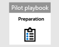

# Fechar e resumir seu piloto do Microsoft 365 defender  

[!INCLUDE [Microsoft 365 Defender rebranding](../includes/microsoft-defender.md)]

**Aplica-se a:**
- Microsoft 365 Defender

| [Planejamento](mtp-pilot-plan.md) | [Preparação](prepare-mtpeval.md) |  [Simular ameaças](mtp-pilot-simulate.md) |  Fechar e resumir|
|--|--|--|--|
|| | |*Você está aqui!*|

Você está atualmente na fase de fechamento e resumo.

Você acabou de executar uma simulação avançada de ataque somente de memória que executou o código remotamente em um controlador de domínio. Você viu como o Microsoft defender for Endpoint e o Microsoft defender para identidade detectam e criam alertas sobre atividades mal-intencionadas fraudulentas. Você também viu como os alertas de fontes diferentes são entregues junto com outras informações contextuais em um único incidente no portal da central de segurança do Microsoft 365. A integração desse tipo permite que analistas do SOC investiguem e tomem a ação necessária. Você também criou uma consulta de busca avançada que identificará emails de entrada onde o usuário abriu ou salvou o anexo e criou a detecção com base nessa consulta.

Você atingiu o final do processo após todos os testes terem concluído.

A saída final deve ser:

- Um scorecard concluído
- Um relatório detalhado das conclusões do piloto
- Uma decisão sobre como mover para frente

Apresente os relatórios de sua saída final para os participantes internos (identificados durante a fase de [preparação](https://docs.microsoft.com/microsoft-365/security/mtp/prepare-mtpeval) ) e contatos da Microsoft. Tal esforço garante que qualquer feedback possa ser usado para melhorar os produtos e a documentação.

Esperamos que você tenha aproveitado essa simulação. Comece a implementar o que você aprendeu em uma escala maior em sua organização para aproveitar ao máximo a solução de segurança integrada.

## Próxima etapa
Saiba mais sobre os pilares do Microsoft 365 defender por meio dos seguintes guias interativos:
- [Proteger sua organização com o Microsoft defender para Office 365](https://aka.ms/O365ATP-Interactive-Guide)
- [Detecção de atividades suspeitas e possíveis ataques com o Microsoft Defender para Identidade](https://aka.ms/AATP-Interactive-Guide)
- [Detectar ameaças e gerenciar alertas com o Microsoft Cloud app Security](https://aka.ms/DetectThreatsAndAlertsMCAS-InteractiveGuide)
- [Investigue e corrija ameaças com o Microsoft defender para ponto de extremidade](https://aka.ms/MDATP-IR-Interactive-Guide)
