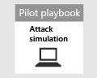

# Planejando seu projeto piloto do Microsoft 365 defenderPlanning your pilot Microsoft 365 Defender project 

[!INCLUDE [Microsoft 365 Defender rebranding](../includes/microsoft-defender.md)]

**Aplica-se a:****Applies to:**
- Microsoft 365 DefenderMicrosoft 365 Defender

| PlanejamentoPlanning| [PreparaçãoPreparation](prepare-mtpeval.md) |  [Simular ameaçasSimulate attack](mtp-pilot-simulate.md) |  [Fechar e resumirClose and summarize](mtp-pilot-close.md)|
|--|--|--|--|
|*Você está aqui!**You are here!*| | | |

Você está atualmente na fase de planejamento.You're currently in the planning phase.

Para garantir que seu projeto piloto seja um sucesso, é essencial planejar com detalhes e obter aprovações de seus participantes no início.To ensure that your pilot project is a success, it is essential to plan thoroughly with and get approvals from your stakeholders in the beginning. Os elementos de planejamento incluem o escopo de identificação, casos de uso, requisitos e critérios de sucesso.Elements of planning include identifying scope, use cases, requirements, and success criteria.

Este guia descreve como planejar o projeto piloto.This guide walks you through how to plan your pilot project. 

>[!IMPORTANT]
>Para obter resultados ideais, siga as instruções do piloto o mais próximo possível.For optimum results, follow the pilot instructions as closely as possible.

## EscopoScope

O escopo do piloto determinará como o teste será amplo, com base no seu ambiente e nos métodos de teste aceitáveis.The scope of the pilot will determine how broad the test will be, based on your environment and acceptable testing methods. Estes são alguns exemplos de escopos a serem considerados:Here are some example scopes to consider:
- Ambiente de desenvolvimento ou teste, que inclui pontos de extremidade, servidores, controladores de domínio.Development or test environment which includes endpoints, servers, domain controllers.
- Ambiente de produção com o Microsoft 365, Azure, serviços do Active Directory, pontos de extremidade e servidoresProduction environment with Microsoft 365, Azure, Active Directory services, endpoints, and servers

>[!NOTE]
>Se você ainda não tem as licenças completas, pode obter licenças de avaliação para [avaliar o Microsoft 365 defender](https://aka.ms/mtp-trial-lab) – planejar, preparar, configurar, configurar e executar o projeto piloto.If you don’t have the full licenses yet, you can get trial licenses to [evaluate Microsoft 365 Defender](https://aka.ms/mtp-trial-lab) – plan, prepare, setup, configure, and run your pilot project. Suas partes interessadas desempenharão uma grande função para ajudar a facilitar o processo de início ao fim.Your stakeholders will play a big role in helping facilitate the process from start to finish.

Os tipos de sistemas operacionais a serem avaliados também devem ser definidos com base na composição organizacional.The types of operating systems to be evaluated should also be defined based on the organizational makeup. Isso pode incluir o seguinte: [pontos de extremidade Mac](https://docs.microsoft.com/windows/security/threat-protection/microsoft-defender-atp/microsoft-defender-atp-mac#system-requirements), [servidores Linux](https://docs.microsoft.com/windows/security/threat-protection/microsoft-defender-atp/microsoft-defender-atp-linux#system-requirements), [pontos de extremidade do windows 10](https://docs.microsoft.com/windows/security/threat-protection/microsoft-defender-atp/minimum-requirements#supported-windows-versions), [Windows Server 2016](https://docs.microsoft.com/windows/security/threat-protection/microsoft-defender-atp/minimum-requirements#supported-windows-versions).This may include the following: [Mac endpoints](https://docs.microsoft.com/windows/security/threat-protection/microsoft-defender-atp/microsoft-defender-atp-mac#system-requirements), [Linux Servers](https://docs.microsoft.com/windows/security/threat-protection/microsoft-defender-atp/microsoft-defender-atp-linux#system-requirements), [Windows 10 endpoints](https://docs.microsoft.com/windows/security/threat-protection/microsoft-defender-atp/minimum-requirements#supported-windows-versions), [Windows Server 2016](https://docs.microsoft.com/windows/security/threat-protection/microsoft-defender-atp/minimum-requirements#supported-windows-versions).

## Casos de usoUse cases

Os casos de uso representam instruções sobre como a ferramenta que está sendo testada deve ser consumida por seus usuários pretendidos.Use cases represent statements of how the tool being tested is meant to be consumed by its intended users. Eles podem ser formulados como histórias de usuários do ponto de vista de uma pessoa específica, como um analista do SOC.These can be formulated as user stories from the point of view of a particular persona, such as a SOC analyst. Por exemplo:For example:
- Como analista da SOC, preciso exibir, correlacionar, avaliar e gerenciar alertas e eventos em dispositivos, usuários e caixas de correio em minha rede.As a SOC analyst, I need to view, correlate, assess and manage alerts and events across devices, users, and mailboxes in my network. [Gerenciamento de incidentes][Incident management]
- Como analista do SOC, eu preciso ter a ferramenta e o processo para investigar e responder automaticamente a eventos mal-intencionados em minha rede.As a SOC analyst, I must have the tool and process to automatically investigate and respond to malicious events in my network. [Infravermelho automático][Auto IR]
- Como analista do SOC, eu preciso pesquisar dados do meu ambiente para encontrar ameaças conhecidas e potenciais e atividades suspeitas.As a SOC analyst, I must search data from my environment to find known and potential threats, and suspicious activities. [Caça avançada][Advanced Hunting]

Tenha em mente que esses casos de uso devem ser criados dentro dos parâmetros do escopo definido.Keep in mind that these use cases should be created within the parameters of the defined scope. Se, por exemplo, o escopo de teste não incluir uma avaliação de ferramentas como o Microsoft Cloud app Security, os casos que dependem dele como uma fonte de dados não devem ser criados.If, for example, the scope of testing does not include an evaluation of tools such as Microsoft Cloud App Security, then use cases that rely on this as a data source should not be created.

## RequisitosRequirements

Na lista de casos de uso, você pode começar a criar requisitos.From the list of use cases, you can start to create requirements. Os requisitos incluem recursos que uma ferramenta deve ter para satisfazer os casos de uso.Requirements include features a tool must have to satisfy the use cases. Esses requisitos podem ser divididos em categorias como configuração e manutenção, suporte para integrações e requisitos específicos de recursos, como a capacidade de busca e a capacidade de criar alertas personalizados.These requirements can be broken down into categories such as configuration and maintenance, support for integrations, and feature-specific requirements like hunting ability and the ability to build custom alerts.

## Plano de testeTest plan

Dependendo dos requisitos, diferentes métodos de teste podem ser apropriados.Depending on the requirements, different methods of testing may be appropriate. Por exemplo, se o requisito é avaliar a eficácia da correção automatizada, o plano de teste precisa incluir etapas para gerar o (s) comportamento (es) que acionaria uma ação de correção automatizada no Microsoft 365 defender.For instance, if the requirement is to evaluate the efficacy of Automated Remediation, the test plan needs to include steps to generate the behavior(s) that would trigger an automated remediation action within Microsoft 365 Defender. Se o requisito for detectar um determinado comportamento ou ataque, o teste poderá envolver mais etapas.If the requirement is to detect a particular behavior or attack, then the test may involve more steps. O ponto é ter um plano para fazer um teste com precisão em relação aos seus requisitos.The point is to have a plan in place to accurately test against your requirements.

## Critérios de sucessoSuccess criteria

O critério de sucesso é, basicamente, a barra definida para medir o que você está testando.Success criteria is ultimately the bar set to measure against what you are testing. Se você estiver testando o Microsoft 365 defender (ou qualquer outra tecnologia para esse assunto) em relação a outras ferramentas ou por si só, deve haver alguns critérios quantificáveis para determinar o valor que a ferramenta fornece.Whether you are testing Microsoft 365 Defender (or any other technology for that matter) against other tools or by itself, there must be some quantifiable criteria to determine the value the tool provides. Com base no escopo, nos requisitos e no plano de testes, o critério de sucesso determinará como o teste será pontuado.Based on the scope, requirements, and testing plan, the success criteria will determine how to score the test. Isso deve ser inferior a uma passagem ou falhar e mais de uma pontuação ponderada com base nas suas necessidades.This should be less of a pass or fail and more of a weighted scoring based on your needs. Por exemplo, para ter êxito, uma ferramenta pode precisar de uma pontuação acima de 80% em determinadas áreas críticas que você identificar.For example, to be successful, a tool may need to score above 80% in certain critical areas you identify.

## ScorecardScorecard

Uma maneira de reunir todos os elementos de seu plano pode ser criar um scorecard.One way to bring all elements of your plan together can be to create a scorecard. Veja um exemplo de Scorecard abaixo:See a sample scorecard below:

| Caso de usoUse case | RequisitosRequirements | Requisitos de configuraçãoConfiguration requirements | Plano de testeTest plan | Resultado esperadoExpected outcome | Status do testeTest status | PontuaçãoScore | ObservaçõesNotes |
|:-------|:-------|:-------|:-------|:-------|:-------|:-------|:-------|
|Gerenciamento de incidentesIncident management|-Microsoft 365 defender-  Microsoft 365 Defender    – Microsoft defender para identidade- Microsoft Defender for Identity   – Microsoft defender para ponto de extremidade- Microsoft Defender for Endpoint   – Segurança do aplicativo do Microsoft Cloud (opcional)- Microsoft Cloud App Security (optional)|Consulte os [pré-requisitos](https://aka.ms/mtp-trial-lab) para preparação, configuração e configuração para obter detalhesSee the [prerequisites](https://aka.ms/mtp-trial-lab) for preparation, set-up, and configuration for details |[Simular ameaçasSimulate attack](mtp-pilot-simulate.md)   [Investigue o incidenteInvestigate the incident](https://docs.microsoft.com/microsoft-365/security/mtp/mtp-pilot-simulate#investigate-an-incident) |Os investigadores podem entender o escopo e o impacto do incidente e gerenciar o incidenteInvestigators can understand the scope and impact of the incident and manage the incident||||
|AutoIRAutoIR|-Microsoft 365 defender-   Microsoft 365 Defender   – Microsoft defender para identidade- Microsoft Defender for Identity   – Microsoft defender para ponto de extremidade- Microsoft Defender for Endpoint |Consulte os [pré-requisitos](https://aka.ms/mtp-trial-lab) para preparação, configuração e configuração para obter detalhesSee the [prerequisites](https://aka.ms/mtp-trial-lab) for preparation, set-up, and configuration for details  Habilitar AutoIREnable AutoIR  |[Simular ameaçasSimulate attack](mtp-pilot-simulate.md)   [Investigação automatizadaAutomated investigation](https://docs.microsoft.com/microsoft-365/security/mtp/mtp-pilot-simulate#automated-investigation-and-remediation) |Alertas e incidentes são corrigidos automaticamente pelo Microsoft 365 defenderAlerts and incidents are automatically remediated by Microsoft 365 Defender||||
|Busca avançadaAdvanced hunting|-Microsoft 365 defender- Microsoft 365 Defender   – Microsoft defender para ponto de extremidade- Microsoft Defender for Endpoint   – Microsoft defender para Office 365-Microsoft Defender for Office 365 |Consulte os [pré-requisitos](https://aka.ms/mtp-trial-lab) para preparação, configuração e configuração para obter detalhesSee the [prerequisites](https://aka.ms/mtp-trial-lab) for preparation, set-up, and configuration for details|[Cenário de busca avançadaAdvanced hunting scenario](https://docs.microsoft.com/microsoft-365/security/mtp/mtp-pilot-simulate#advanced-hunting-scenario) |Os investigadores podem localizar dados por meio de busca avançada, dinamização para entidades impactadas e criação de detecções personalizadasInvestigators can find data through advanced hunting, pivoting to impacted entities, and by creating custom detections||||

## Próxima etapaNext step
|  [Fase de preparaçãoPreparation phase](prepare-mtpeval.md) | Prepare seu ambiente piloto do Microsoft 365 defenderPrepare your Microsoft 365 Defender pilot environment
|:-------|:-----|
