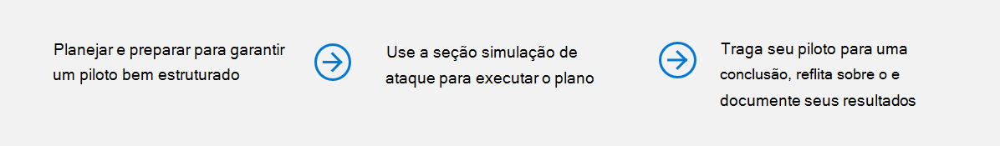
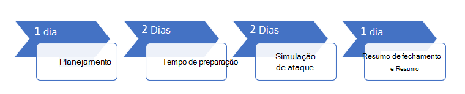

# Executar seu projeto piloto de proteção contra ameaças da MicrosoftRun your pilot Microsoft Threat Protection project 

[!INCLUDE [Microsoft 365 Defender rebranding](../includes/microsoft-defender.md)]

**Aplica-se a:****Applies to:**
- Proteção contra Ameaças da MicrosoftMicrosoft Threat Protection

Para determinar efetivamente o benefício e a adoção da MTP (proteção contra ameaças) da Microsoft, você pode executar um projeto piloto.To effectively determine the benefit and adoption of Microsoft Threat Protection (MTP), you can run a pilot project. Antes de habilitar a proteção contra ameaças da Microsoft em seu ambiente de produção e iniciar seus casos de uso, é melhor planejar determinar as tarefas a serem realizadas para o projeto piloto e definir os critérios de sucesso.Before enabling Microsoft Threat Protection in your production environment and starting your use cases, it's best to plan to determine the tasks to accomplish for your pilot project and set the success criteria. 

## Como usar este guia estratégico pilotoHow to use this pilot playbook

Este guia fornece uma visão geral da proteção contra ameaças da Microsoft e instruções passo a passo sobre como configurar seu projeto piloto.This guide provides an overview of Microsoft Threat Protection and step-by-step instructions on how to set up your pilot project. 

A linha do tempo de exemplo a seguir varia de acordo com os recursos corretos em seu ambiente.The following sample timeline varies depending on having the right resources in your environment. Algumas detecções e fluxos de trabalho podem precisar de mais tempo de aprendizagem do que os outros.Some detections and workflows might need more learning time than the others.

>[!IMPORTANT]
>Para obter resultados ideais, siga as instruções do piloto o mais próximo possível.For optimum results, follow the pilot instructions as closely as possible.

### Fases do manual do pilotoPilot playbook phases 

Há quatro fases na execução de um piloto de proteção contra ameaças da Microsoft:There are four phases in running a Microsoft Threat Protection pilot:

|FasePhase | DescriçãoDescription | 
|:-------|:-----|
|  [PlanejamentoPlanning](mtp-pilot-plan.md)| Saiba o que você precisa considerar antes de executar o projeto piloto de proteção contra ameaças da Microsoft:Learn what you need to consider before running your Microsoft Threat Protection pilot project:   -Escopo- Scope   – Casos de uso- Use cases  - Requisitos- Requirements  – Plano de teste- Test plan   -Critérios de êxito- Success criteria   -Scorecard- Scorecard 
|   [PreparaçãoPreparation](mtp-evaluation.md)|  Acesse o centro de segurança do Microsoft 365 para configurar seu ambiente piloto de proteção contra ameaças da Microsoft.Access Microsoft 365 Security Center to set up your Microsoft Threat Protection pilot  environment. Você será orientado para:You'll be guided to:  – Identificar os participantes e a aprovação de busca para o seu piloto- Identify stakeholders and seek sign-off for your pilot   -Considerações de ambiente- Environment considerations  – Acesso- Access  -Configuração do Azure Active Directory- Azure Active Directory setup   -Ordem de configuração- Configuration order   -Inscrever-se no Microsoft 365 E5 Trial- Sign up for Microsoft 365 E5 Trial   -Configurar domínio- Configure domain  -Atribuir licenças do Microsoft 365 e5- Assign Microsoft 365 E5 licenses   – Concluir o assistente de configuração no portal- Complete the setup wizard in the portal|
|   [Simulação de ataqueAttack simulation](mtp-pilot-simulate.md) | Para simular um ataque, você será orientado a:To simulate an attack, you'll be guided to:  – Verificar os requisitos do ambiente de teste- Verify the test environment requirements  – Executar a simulação-  Run the simulation  – Investigue um incidente- Investigate an incident  -resolver o incidente- resolve the incident 
|   [Fechamento e ResumoClosing and summary](mtp-pilot-close.md) | Quando você chegar ao final do processo, será orientado para:When you've reached the end of the process, you'll be guided to:  -Passar pela saída final- Go through your final output -Apresentar sua saída para seus participantes- Present your output to your stakeholders  – Fornecer comentários- Provide feedback  -Siga as próximas etapas- Take next steps 

## Próxima etapaNext step
|  [Fase de planejamentoPlanning phase](mtp-pilot-plan.md) | Planejar seu projeto piloto de proteção contra ameaças da MicrosoftPlan your Microsoft Threat Protection pilot project 
|:-------|:-----|
