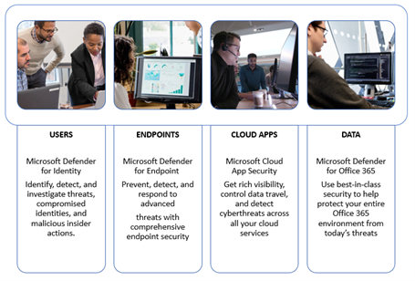

# Executar seu projeto piloto do Microsoft 365 Defender 

[!INCLUDE [Microsoft 365 Defender rebranding](../includes/microsoft-defender.md)]

**Aplica-se a:**
- Microsoft 365 Defender

Este guia ajuda você a executar um projeto piloto fornecendo ponteiros para garantir que você tenha um plano bem estruturado, orientando você pelo uso do recurso de simulação de ataque e, por fim, concluindo o piloto com as principais dicas para refletir e documentar os resultados.

Executar um piloto ajuda você a determinar efetivamente o benefício de adotar o Microsoft 365 Defender. Antes de ativar o Microsoft 365 Defender em seu ambiente de produção e iniciar seus casos de uso, é melhor planejar a determinação das tarefas a realizar para seu projeto piloto e definir os critérios de sucesso. 

## Como usar este manual piloto

Este guia fornece uma visão geral do Microsoft 365 Defender e instruções passo a passo sobre como configurar seu projeto piloto. 

O Microsoft 365 Defender é um pacote unificado de defesa empresarial pré e pós-violação que coordena na verdade a proteção, a detecção, a prevenção, a investigação e a resposta entre pontos de extremidade, identidades, email e aplicativos para fornecer proteção integrada contra ataques sofisticados. Ele faz isso combinando e orquestrando os seguintes recursos em uma única solução de segurança:
  - Microsoft Defender para Ponto de Extremidade, o novo nome da Proteção Avançada contra Ameaças do Microsoft Defender (pontos de extremidade)
  - Microsoft Defender para Office 365, o novo nome do Office 365 ATP (email) 
  - Microsoft Defender for Identity, o novo nome da ATP do Azure (identidade) 
  - Microsoft Cloud App Security (aplicativos)

Com a solução integrada do Microsoft 365 Defender, os profissionais de segurança podem unir os sinais de ameaça que o Microsoft Defender para Ponto de Extremidade, o Microsoft Defender para Office 365, o Microsoft Defender para Identidade e o Microsoft Cloud App Security recebem e determinar o escopo completo e o impacto da ameaça, como ela entrou no ambiente, o que é afetado e como ela está afetando a organização no momento. O Microsoft 365 Defender faz uma ação automática para impedir ou parar o ataque e auto-recuperar caixas de correio afetadas, pontos de extremidade e identidades de usuário. Consulte a [visão geral do Microsoft 365 Defender](https://docs.microsoft.com/microsoft-365/security/mtp/microsoft-threat-protection) para obter detalhes.

A linha do tempo de exemplo a seguir varia dependendo de ter os recursos certos em seu ambiente. Algumas detecções e fluxos de trabalho podem precisar de mais tempo de aprendizagem do que os outros.

>[!IMPORTANT]
>Para obter os melhores resultados, siga as instruções do piloto o mais próximo possível.

### Fases do manual piloto 

Há quatro fases na execução de um piloto do Microsoft 365 Defender:

|Fase | Descrição | 
|:-------|:-----|
| [Planejamento](mtp-pilot-plan.md)  ~ 1 dia| Saiba o que você precisa considerar antes de executar seu projeto piloto do Microsoft 365 Defender:   - Escopo   - Casos de uso  - Requisitos  - Plano de teste   - Critérios de sucesso   - Scorecard 
| [Preparação](mtp-evaluation.md)  ~2 dias|  Acesse a Central de Segurança do Microsoft 365 para configurar seu ambiente piloto do Microsoft 365 Defender. Você será orientado a:  - Identificar os participantes e buscar a aprovação para o seu piloto   - Considerações sobre o ambiente  - Acesso  - Configuração do Azure Active Directory   - Ordem de configuração   - Inscreva-se na avaliação do Microsoft 365 E5   - Configurar domínio  - Atribuir licenças do Microsoft 365 E5   – Conclua o assistente de configuração no portal|
| [Simulação de ataque](mtp-pilot-simulate.md)  ~2 dias| Para simular um ataque, você será orientado a:  - Verificar os requisitos do ambiente de teste  - Executar a simulação  - Investigar um incidente  - resolver o incidente 
| [Fechamento e resumo](mtp-pilot-close.md)  ~ 1 dia| Quando chegar ao final do processo, você será orientado a:  - Passar pela saída final - Apresente sua saída aos stakeholders  - Fornecer comentários  - Tomar as próximas etapas 

## Próxima etapa
|[Fase de planejamento](mtp-pilot-plan.md) | Planejar seu projeto piloto do Microsoft 365 Defender 
|:-------|:-----|
