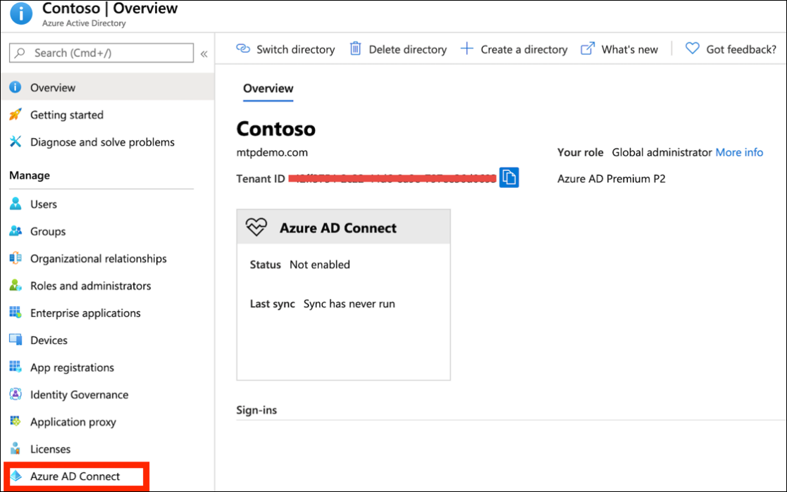

# Preparar seu laboratório de avaliação ou ambiente piloto do Microsoft 365 DefenderPrepare your Microsoft 365 Defender trial lab or pilot environment

[!INCLUDE [Microsoft 365 Defender rebranding](../includes/microsoft-defender.md)]

**Aplica-se a:****Applies to:**
- Microsoft 365 DefenderMicrosoft 365 Defender

Criar um laboratório de avaliação ou ambiente piloto do Microsoft 365 Defender e implantá-lo é um processo de três fases:Creating a Microsoft 365 Defender trial lab or pilot environment and deploying it is a three-phase process:

| Fase 1: PrepararPhase 1: Prepare | [Fase 2: ConfigurarPhase 2: Set up](setup-mtpeval.md) | [Fase 3: IntegraçãoPhase 3: Onboard](config-mtpeval.md) |  [Voltar ao manual pilotoBack to pilot playbook](mtp-pilot.md) |
|--|--|--|--|
|*Você está aqui!**You are here!* | || |

Você está atualmente na fase de preparação.You're currently in the preparation phase.

A preparação é fundamental para qualquer implantação bem-sucedida.Preparation is key to any successful deployment. Esta seção orientará você sobre o que você precisa considerar ao se preparar para criar um laboratório de avaliação ou ambiente piloto para sua implantação do Microsoft 365 Defender.This section will guide you through what you need to consider as you prepare to create a trial lab or pilot environment for your Microsoft 365 Defender deployment.

## Pré-requisitosPrerequisites
Saiba mais sobre os requisitos de licenciamento, hardware e software e outras configurações para provisionar e usar o Microsoft 365 Defender.Learn about the licensing, hardware and software requirements, and other configuration settings to provision and use Microsoft 365 Defender. Consulte os requisitos mínimos para [o Microsoft 365 Defender](https://docs.microsoft.com/microsoft-365/security/mtp/prerequisites), Microsoft Defender [para](https://docs.microsoft.com/windows/security/threat-protection/microsoft-defender-atp/minimum-requirements)Ponto de Extremidade, Microsoft Defender para [Office 365](https://docs.microsoft.com/office365/servicedescriptions/office-365-advanced-threat-protection-service-description), [Microsoft Defender para Identidade](https://docs.microsoft.com/azure-advanced-threat-protection/atp-prerequisites), Microsoft Cloud [App Security](https://docs.microsoft.com/azure-advanced-threat-protection/atp-prerequisites).See the minimum requirements for [Microsoft 365 Defender](https://docs.microsoft.com/microsoft-365/security/mtp/prerequisites), [Microsoft Defender for Endpoint](https://docs.microsoft.com/windows/security/threat-protection/microsoft-defender-atp/minimum-requirements), [Microsoft Defender for Office 365](https://docs.microsoft.com/office365/servicedescriptions/office-365-advanced-threat-protection-service-description), [Microsoft Defender for Identity](https://docs.microsoft.com/azure-advanced-threat-protection/atp-prerequisites), [Microsoft Cloud App Security](https://docs.microsoft.com/azure-advanced-threat-protection/atp-prerequisites).

## Stakeholders e sign-offStakeholders and sign-off
Identifique todos os participantes envolvidos no projeto e quem pode precisar se desa desemarcar, revisar ou manter-se informado, seja para avaliação ou execução de um projeto piloto.Identify all the stakeholders that are involved in the project and who may need to sign-off, review, or stay informed, whether for evaluation or running a pilot project.

>[!NOTE]
>Nem todas as organizações podem ter a maturidade da organização de segurança para ter essas funções.Not all organizations might have the security organization maturity to have such roles. Nesse caso, consulte sua equipe de liderança sobre responsabilidades de revisão e aprovação.In such case, consult with your leadership team on review and approval accountabilities.

Adicione participantes à tabela abaixo conforme apropriado para sua organização.Add stakeholders to the table below as appropriate for your organization.

-   SO = Aprovação neste projetoSO = Sign-off on this project

-   R = Revise este projeto e forneça entradaR = Review this project and provide input

-   I = Informado deste projetoI = Informed of this project

| NomeName                 | RoleRole                                                                                                                                                                                                          | ActionAction |
|----------------------|---------------------------------------------------------------------------------------------------------------------------------------------------------------------------------------------------------------|--------|
| Insira o nome e o emailEnter name and email | **Diretor de Segurança da Informação (CISO)** Um representante executivo que atua como patrocinador dentro da organização para a *implantação da nova tecnologia.***Chief Information Security Officer (CISO)** *An executive representative who serves as sponsor inside the organization for the new technology deployment.*                                                  | SOSO     |
| Insira o nome e o emailEnter name and email | Chefe do Centro de Operações de Defesa Cibernética **(CDOC)** Um representante da equipe do CDOC responsável por definir como essa alteração é alinhada com os processos da equipe de operações de segurança *dos clientes.***Head of Cyber Defense Operations Center (CDOC)** *A representative from the CDOC team in charge of defining how this change is aligned with the processes in the customers security operations team.*       | SOSO     |
| Insira o nome e o emailEnter name and email | **Arquiteto de** Segurança Um representante da equipe de Segurança responsável por definir como essa alteração está alinhada com a *arquitetura principal de Segurança na organização.***Security Architect** *A representative from the Security team in charge of defining how this change is aligned with the core Security architecture in the organization.*                         | RR      |
| Insira o nome e o emailEnter name and email | **Arquiteto de** Local de Trabalho Um representante da equipe de TI responsável por definir como essa mudança está alinhada com a arquitetura principal do local *de trabalho na organização.***Workplace Architect** *A representative from the IT team in charge of defining how this change is aligned with the core workplace architecture in the organization.*                             | RR      |
| Insira o nome e o emailEnter name and email | **Analista de** segurança Um representante da equipe do CDOC que pode fornecer comentários sobre os recursos de detecção, a experiência do usuário e a utilidade geral dessa alteração de uma perspectiva *de operações de segurança.***Security Analyst** *A representative from the CDOC team who can provide feedback on the detection capabilities, user experience, and overall usefulness of this change from a security operations perspective.* | II      |

## Preparar o Azure Active DirectoryPrepare your Azure Active Directory
Ignore esta etapa se você já habilitar a sincronização entre o Active Directory e o Azure Active Directory local.Skip this step if you have already enabled synchronization between Active Directory and Azure Active Directory on premises. Revise a documentação de práticas recomendadas existente do Azure Active Directory.Review existing best practices documentation from Azure Active Directory. As etapas a seguir são otimizadas para avaliar ou executar um projeto piloto do Microsoft 365 Defender.The following steps are optimized to evaluate or run a pilot Microsoft 365 Defender project.

1. Vá para o [portal do Azure Active Directory >](https://portal.azure.com/#blade/Microsoft_AAD_IAM/ActiveDirectoryMenuBlade) **Azure AD Connect.**Go to the [Azure Active Directory](https://portal.azure.com/#blade/Microsoft_AAD_IAM/ActiveDirectoryMenuBlade) portal > **Azure AD Connect**. 
   

2. Clique **em Baixar** do Microsoft **Azure Active Directory Connect e** transfira-o para o controlador de domínio.Click **Download** from **Microsoft Azure Active Directory Connect** and transfer it to your Domain Controller.
  

3. No controlador de domínio, siga o assistente do Azure Active Directory Connect.On the domain controller, follow the Azure Active Directory Connect wizard. Leia os termos de licença e o aviso de privacidade e marque a caixa de seleção se estiver de acordo.Read the license terms and privacy notice and select the checkbox if you agree. Clique em **Continuar**.Click **Continue**.
  

4. Navegue **até Configurações Expressas.**Navigate to **Express Settings**.
  

5. Insira suas credenciais de administrador global.Enter your global administrator credentials. Clique em **Avançar**.Click **Next**.
  

6. Insira suas credenciais de administrador corporativo dos Serviços de Domínio Active Directory.Enter your Active Directory Domain Services enterprise administrator credentials. Clique em **Avançar**.Click **Next**.
  

7. Clique **em Instalar** para confirmar a configuração.Click **Install** to confirm the configuration.
  

8. Parabéns, você configurou com êxito o Azure Active Directory Connect.Congratulations, you have successfully configured Azure Active Directory Connect.
  

Agora você pode [adicionar usuários e grupos ao Active Directory](https://docs.microsoft.com/azure-advanced-threat-protection/atp-playbook-setup-lab#bkmk_hydrate) e configurar uma política [SAM-R.](https://docs.microsoft.com/azure-advanced-threat-protection/atp-playbook-setup-lab#configure-sam-r-capabilities-from-contosodc)You can now [add users and groups to Active Directory](https://docs.microsoft.com/azure-advanced-threat-protection/atp-playbook-setup-lab#bkmk_hydrate) and [configure a SAM-R policy](https://docs.microsoft.com/azure-advanced-threat-protection/atp-playbook-setup-lab#configure-sam-r-capabilities-from-contosodc).  

## Ordem de configuraçãoConfiguration order
A tabela a seguir indica a ordem que a Microsoft recomenda para configurar os componentes do Microsoft 365 Defender para seu laboratório de avaliação ou implantação do ambiente piloto.The following table indicates the order Microsoft recommends for configuring the Microsoft 365 Defender components for your trial lab or pilot environment deployment.

| ComponenteComponent                               | DescriçãoDescription                                                                                                                                                                                                                                                                                                                                                                                                                                                                                                                                                                                                                                                                                              | Classificação da ordem de configuraçãoConfiguration order rank |
|-----------------------------------------|----------------------------------------------------------------------------------------------------------------------------------------------------------------------------------------------------------------------------------------------------------------------------------------------------------------------------------------------------------------------------------------------------------------------------------------------------------------------------------------------------------------------------------------------------------------------------------------------------------------------------------------------------------------------------------------------------------|---------------------|
|Obter o Microsoft Defender para Office 365Microsoft Defender for Office 365|O Microsoft Defender para Office 365 protege sua organização contra ameaças maliciosas representadas por mensagens de email, links (URLs) e ferramentas de colaboração.Microsoft Defender for Office 365 safeguards your organization against malicious threats posed by email messages, links (URLs), and collaboration tools.   [Saiba mais.Learn more.](https://docs.microsoft.com/microsoft-365/security/office-365-security/office-365-atp)                                                                                                                                                                                                                                             | 1 1                   |
|Microsoft Defender para Identidade?Microsoft Defender for Identity|O Microsoft Defender for Identity usa sinais do Active Directory para identificar, detectar e investigar ameaças avançadas, identidades comprometidas e ações internas mal-intencionadas direcionadas à sua organização.Microsoft Defender for Identity uses Active Directory signals to identify, detect, and investigate advanced threats, compromised identities, and malicious insider actions directed at your organization.   [Saiba mais](https://docs.microsoft.com/azure-advanced-threat-protection/).[Learn more](https://docs.microsoft.com/azure-advanced-threat-protection/).| 2 2 |
|Microsoft Cloud App SecurityMicrosoft Cloud App Security| O Microsoft Cloud App Security é um AGENTE de Segurança de Acesso à Nuvem (CASB) que opera em várias nuvens.Microsoft Cloud App Security is a Cloud Access Security Broker (CASB) that operates on multiple clouds. Ele fornece visibilidade avançada, controle sobre viagem de dados e análises sofisticadas para identificar e combater ameaças cibernéticas em todos os seus serviços de nuvem.It provides rich visibility, control over data travel, and sophisticated analytics to identify and combat cyberthreats across all your cloud services.   [Saiba mais](https://docs.microsoft.com/cloud-app-security/).[Learn more](https://docs.microsoft.com/cloud-app-security/).                                                                                                                                                                                                                                                                                                                                                                       |33                   |
|Microsoft Defender para Ponto de ExtremidadeMicrosoft Defender for Endpoint | Os recursos de detecção e resposta de ponto de extremidade do Microsoft Defender para ponto de extremidade fornecem detecções avançadas de ataque que são quase em tempo real e ativas.Microsoft Defender for Endpoint endpoint detection and response capabilities provide advanced attack detections that are near real-time and actionable. Os analistas de segurança podem priorizar alertas de maneira eficaz, obter visibilidade de todo o escopo de uma violação e executar ações de resposta para remediar ameaças.Security analysts can prioritize alerts effectively, gain visibility into the full scope of a breach, and take response actions to remediate threats.   [Saiba mais.Learn more.](https://docs.microsoft.com/windows/security/threat-protection/microsoft-defender-atp/microsoft-defender-advanced-threat-protection)                                     |4 4                   |                                                                                                                                                                                                                                    

## Próxima etapaNext step
|  [Fase 2: InstalaçãoPhase 2: Setup](setup-mtpeval.md) | Configurar seu laboratório de avaliação ou ambiente piloto do Microsoft 365 DefenderSet up your Microsoft 365 Defender trial lab or pilot environment
|:-------|:-----|

