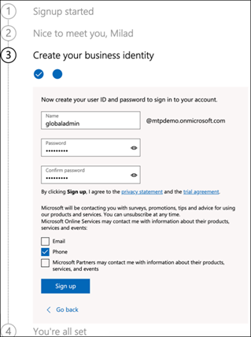

# Configurar seu ambiente de laboratório de avaliação de proteção contra ameaças da MicrosoftSet up your Microsoft Threat Protection trial lab environment 

**Aplica-se a:****Applies to:**
- Proteção contra Ameaças da MicrosoftMicrosoft Threat Protection 

Criar um ambiente de laboratório de avaliação de proteção contra ameaças da Microsoft e implantá-lo é um processo de três fases:Creating a Microsoft Threat Protection trial lab environment and deploying it is a three-phase process:

 
<table border="0" width="100%" align="center">
  <tr style="text-align:center;">
    <td align="center" style="width:25%; border:0;" >
      <a href= "https://docs.microsoft.com/microsoft-365/security/mtp/prepare-mtpeval?view=o365-worldwide"> 
        
       Fase 1: preparar </a>Phase 1: Prepare </a> 
    </td>
     <td align="center"bgcolor="#d5f5e3">
      <a href="https://docs.microsoft.com/microsoft-365/security/mtp/setup-mtpeval?view=o365-worldwide">
        
       Fase 2: configuração </a>Phase 2: Setup </a> 
    </td>
    <td align="center">
      <a href="https://docs.microsoft.com/microsoft-365/security/mtp/config-mtpeval?view=o365-worldwide">
        
       Fase 3: configurar o & integrado </a>Phase 3: Configure & Onboard </a> 
</td>

  </tr>
</table>

Você está atualmente na fase de configuração.You are currently in the set up phase. Execute as etapas iniciais para acessar o centro de segurança do Microsoft 365 e configure seu ambiente de laboratório de avaliação.Take the initial steps to access Microsoft 365 Security Center then setup your trial lab environment.

Inscreva-se para uma assinatura do Office 365 ou do Azure Active Directory para gerar um locatário *. onmicrosoft.com* que você pode usar para se inscrever na sua licença do Microsoft 365 e5.Sign up for an Office 365 or Azure Active Directory subscription to generate a *.onmicrosoft.com* tenant that you can use to sign up for your Microsoft 365 E5 license. 

>[!NOTE]
>Se você já tiver uma assinatura existente do Office 365 ou do Azure Active Directory, poderá ignorar as etapas de criação do locatário de avaliação do Office 365 e5.If you already have an existing Office 365 or Azure Active Directory subscription, you can skip the Office 365 E5 trial tenant creation steps.

Nesta fase, você será orientado a:In this phase, you'll be guided to:
- Criar um locatário de avaliação do Office 365 e5Create an Office 365 E5 trial tenant
- Habilitar a assinatura de avaliação do Microsoft 365Enable Microsoft 365 trial subscription

## Criar um locatário de avaliação do Office 365 e5Create an Office 365 E5 trial tenant
>[!NOTE]
>Se você já tiver uma assinatura existente do Office 365 ou do Azure Active Directory, poderá ignorar as etapas de criação do locatário de avaliação do Office 365 e5.If you already have an existing Office 365 or Azure Active Directory subscription, you can skip the Office 365 E5 trial tenant creation steps.

1. Vá para o [portal de produto do Office 365 E5](https://www.microsoft.com/microsoft-365/business/office-365-enterprise-e5-business-software?activetab=pivot%3aoverviewtab) e selecione **avaliação gratuita**.Go to the [Office 365 E5 product portal](https://www.microsoft.com/microsoft-365/business/office-365-enterprise-e5-business-software?activetab=pivot%3aoverviewtab) and select **Free trial**.
  
  
2. Conclua o registro de avaliação inserindo seu endereço de email (pessoal ou corporativo).Complete the trial registration by entering your email address (personal or corporate). Clique em **configurar conta**.Click **Set up account**.
   

3. Preencha seu nome, sobrenome, número de telefone comercial, nome da empresa, tamanho da empresa e país ou região.Fill in your first name, last name, business phone number, company name, company size and country or region.  
   
>[!NOTE]
>O país ou a região definida aqui determina a região do Data Center em que o Office 365 será hospedado.The country or region you set here determines the data center region your Office 365 will be hosted.
  
4. Escolha sua preferência de verificação: por meio de uma mensagem de texto ou chamada.Choose your verification preference: through a text message or call. Clique em **enviar código de verificação**.Click **Send Verification Code**. 
  

5. Defina o nome de domínio personalizado para o seu locatário e clique em **Avançar**.Set the custom domain name for your tenant, then click **Next**.
   
 
6. Configure a primeira identidade que será um administrador global do locatário.Set up the first identity which will be a Global Administrator for the tenant. Insira o **nome** e a **senha**.Fill in **Name** and **Password**. Clique em **inscrever-se**.Click **Sign up**.
  

7. Clique em **ir para configuração** para concluir o provisionamento do locatário de avaliação do Office 365 e5.Click **Go to Setup** to complete the Office 365 E5 trial tenant provisioning.
   

8. Conecte seu domínio corporativo ao locatário do Office 365.Connect your corporate domain to the Office 365 tenant. Opcion Escolha **conectar um domínio que você já possui** e digite o nome do seu domínio.[Optional] Choose **Connect a domain you already own** and type in your domain name. Clique em **Avançar**.Click **Next**.
   
 
9. Será necessário adicionar um registro TXT ou MX para validar a propriedade do domínio.You will need to add a TXT or MX record to validate the domain ownership. Depois de adicionar o registro TXT ou MX ao seu domínio, selecione **verificar**.Once you’ve added the TXT or MX record to your domain, select **Verify**.
   
 
10. Opcion Criar mais contas de usuário para o locatário.[Optional] Create more user accounts for your tenant. Você pode ignorar essa etapa clicando em **Avançar**.You can skip this step by clicking **Next**.
  
 
11. Opcion Baixar aplicativos do Office.[Optional] Download Office apps. Clique em **Avançar** para ignorar esta etapa.Click **Next** to skip this step. 
   

12. Opcion Migrar mensagens de email.[Optional] Migrate email messages. Novamente, você pode ignorar esta etapa.Again, you can skip this step.
   
 
13. Escolha serviços online.Choose online services. Selecione **Exchange** e clique em **Avançar**.Select **Exchange** and click **Next**. 
   

14. Adicione registros MX, CNAME e TXT ao seu domínio.Add MX, CNAME and TXT records to your domain. Quando concluído, selecione **verificar**.When completed, select **Verify**.
   
 
15. Parabéns, você concluiu o provisionamento do seu locatário do Office 365.Congratulations, you have completed the provisioning of your Office 365 tenant.
   

## Habilitar a assinatura de avaliação do Microsoft 365Enable Microsoft 365 trial subscription

>[!NOTE]
>Inscrever-se em uma avaliação oferece 25 licenças de usuário para usar por mês.Signing up for a trial gives you 25 user licenses to use for a month. Consulte [tentar ou comprar uma assinatura do M365](https://docs.microsoft.com/microsoft-365/commerce/try-or-buy-microsoft-365?view=o365-worldwide#try-or-buy-a-microsoft-365-subscription-1) para obter detalhes.See [Try or Buy an M365 subscription](https://docs.microsoft.com/microsoft-365/commerce/try-or-buy-microsoft-365?view=o365-worldwide#try-or-buy-a-microsoft-365-subscription-1) for details.

1. No [centro de administração do Microsoft 365](https://admin.microsoft.com/), clique em **cobrança** e navegue até **serviços de compra**.From [Microsoft 365 Admin Center](https://admin.microsoft.com/), click **Billing** and then navigate to **Purchase services**.

2. Selecione **Microsoft 365 E5** e clique em **Iniciar avaliação gratuita**.Select **Microsoft 365 E5** and click **Start free trial**. 
  

3. Escolha sua preferência de verificação: por meio de uma mensagem de texto ou chamada.Choose your verification preference: through a text message or call. Depois de decidir, insira o número de telefone, selecione o **texto me** ou **telefonar para mim** , dependendo da seleção.Once you have decided, enter the phone number, select **Text me** or **Call me** depending on your selection.
  
 
4. Insira o código de verificação e clique em **iniciar sua avaliação gratuita**.Enter the verification code and click **Start your free trial**. 
   

5. Clique em **tentar agora** para confirmar sua avaliação do Microsoft 365 e5.Click **Try now** to confirm your Microsoft 365 E5 trial.
   
 
6. Vá para o **centro de administração do Microsoft 365**  >  **usuários**  >  **ativos**.Go to the **Microsoft 365 Admin Center** > **Users** > **Active users**. Selecione sua conta de usuário, selecione **gerenciar licenças de produto**e troque a licença do Office 365 E5 para a **Microsoft 365 E5**.Select your user account, select **Manage product licenses**, then swap the license from Office 365 E5 to **Microsoft 365 E5**. Clique em **Salvar**.Click **Save**.
  
 
7. Selecione a conta de administrador global novamente e, em seguida, clique em **gerenciar nome de usuário**.Select the global administrator account again then click **Manage username**.
   

8. Opcion Altere o domínio de *onmicrosoft.com* para seu próprio domínio, dependendo do que você escolheu nas etapas anteriores.[Optional] Change the domain from *onmicrosoft.com* to your own domain—depending on what you chose on the previous steps. Clique em **Salvar alterações**.Click **Save changes**.
   

## Próxima etapaNext step
  [Fase 3: configurar o & integradoPhase 3: Configure & Onboard](config-mtpeval.md)  Configure cada pilar de proteção contra ameaças da Microsoft para o laboratório de avaliação de proteção contra ameaças da Microsoft e integração dos seus pontos de extremidade.Configure each Microsoft Threat Protection pillar for your Microsoft Threat Protection evaluation lab and onboard your endpoints.
